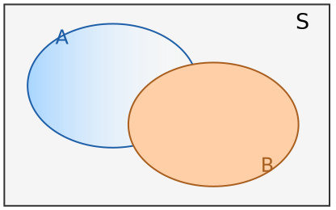
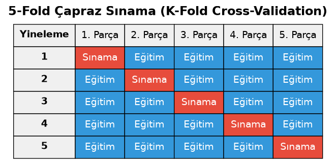

=======================
Klasik Doğal Dil İşleme
=======================

Klasik Doğal Dil İşlemeye Giriş
===============================

Biz önceki bölümlerde tüm doğal dil işleme sürecinde kullanılabilen temel önişlemleri gördük. Bu bölümde
klasik doğal dil işleme yöntemlerine ilişkin temel örnekler üzerinde duracağız. Kursumuzun ağırlık noktası
modern doğal dil işleme ve üretici ağlardır. Ancak o konulara geçmeden önce klasik doğal işleme konuları ve
yöntemleri üzerinde temel fikirleri vermek istiyoruz.

Klasik Doğal Dil İşleme Problemleri ve Yöntemleri
-------------------------------------------------

Sinir ağlarının yoğun kullanılmadığı klasik dönemde doğal işleme süreçleri istatistiksel ve olasılıksal
yöntemlerle ele alınıyordu. Klasik doğal dil işleminin uğraştığı temel problemler ve kullanılan temel
yöntemler şunlardır:

.. list-table:: Klasik Doğal Dil İşleme Problemleri
   :header-rows: 1
   :widths: 25 35 40

   * - İşlem
     - Açıklama
     - Yöntemler
   * - Sözcük türü etiketleme (POS)
     - Her atoma sözcük türünün atanması
     - Kural tabanlı yöntemler, HMM, CRF
   * - Varlık ismi tanıma (NER)
     - Kişi, yer, kurum gibi adların bulunması
     - Sözlük temelli yöntemler, kural tabanlı yöntemler, CRF
   * - Metin sınıflandırma
     - Metnin önceden belirlenmiş sınıflara atanması
     - Naive Bayes, lojistik regresyon, SVM, karar ağaçları
   * - Duygu analizi
     - Metindeki duygusal yönelimin belirlenmesi
     - Sözlük temelli yöntemler, Naive Bayes, lojistik regresyon, SVM
   * - Metin kümeleme
     - Metinlerin gözetimsiz biçimde gruplanması
     - K-Means, hiyerarşik kümeleme
   * - Konu modelleme
     - Metinlerdeki gizli konuların çıkarılması
     - LDA, LSA
   * - Benzerlik hesaplama
     - İki metin arasındaki yakınlığın ölçülmesi
     - Kosinüs benzerliği, Jaccard, Levenshtein uzaklığı
   * - Yazım düzeltme
     - Yanlış yazılmış sözcüklerin düzeltilmesi
     - Levenshtein uzaklığı, Norvig yöntemi, sözlük temelli yöntemler

Sözcük türü etiketlemesi (part-of-speech tagging) metin içerisindeki sözcüklerin türlerinin belirlenmesi
problemidir. Örneğin sözcüğün bir *eylem mi*, *nesne mi*, *özel isim mi* belirttiğinin tespit edilmesi.
Varlık ismi tanıma (named entity recognition) yazı içerisindeki kişi, kurum, yer gibi sözcüklerin tespit
edilmesine denilmektedir. Metin sınıflandırma (text classification) en klasik doğal dil işleme
problemlerinden biridir. Örneğin bir haber metninin *politika ile mi ilgili*, *ekonomi ile mi ilgili*,
*sağlık ile mi ilgili* olduğunun tespit edilmesi tipik bir metin sınıflandırma işlemidir. Duygu analizi
(sentiment analysis) en klasik doğal dil işleme problemlerinden biridir. Bir metnin olumlu mu (positive)
yoksa olumsuz mu (negative) yargı içerdiğinin tespit edilmesi sürecidir. Aslında duygu analizi bir çeşit
metin sınıflandırma işlemidir. Duygu analizinde *olumlu*, *olumsuz* sınıflarının dışında
*nötr (neutral)* sınıfı da kullanılabilmektedir. Örneğin IMDB'de filmler hakkında yazılan yorumların
bazıları olumlu bazıları olumsuz yargı içermektedir. Metin kümeleme (text clustering) metinleri
benzerliklerine göre gruplara ayırma işlemidir. Metin sınıflandırma denetimli (supervised) bir yöntemken
metin kümeleme denetimsiz (unsupervised) bir yöntemdir. Makine öğrenmesinde sınıflandırma ve kümeleme
kavramları farklı anlamalara gelmektedir. Sınıflandırmada sınıflar önceden belirlenmiştir. Eğitim
sonrasında yeni bir metnin bu sınıflardan birine sokulması istenmektedir. Kümelemede ise baştan sınıflar
belli değildir. Zaten onlar algoritma tarafından benzerliklerden ve farklılıklardan faydalanılarak
oluşturulmaktadır. Konu modelleme metin içerisindeki gizli konuların açığa çıkartılması sürecidir. Yazım
düzeltme yazı içerisindeki hataların düzeltilmesine ilişkin süreçleri belirtmektedir. Metin üretimi
(text generation) konusunda klasik doğal dil işleme yöntemleri genel olarak başarısız olmaktadır.

Yukarıdaki klasik doğal dil işleme problemlerinin hepsi sinir ağlarıyla oldukça etkin bir biçimde
çözülebilmektedir. Yani yukarıdaki problemler klasik doğal dil işlemeye özgü problemler değildir, klasik
doğal dil işlemenin üzerinde çalıştığı temel problemlerdir. Daha önceden de belirttiğimiz gibi her ne kadar
modern transformer tabanlı derin sinir ağları doğal dil işlemede bir çığır açmış olsa da klasik doğal dil
işleme yöntemleri geçerliliğini tümden kaybetmiş değildir. Bu yöntemler problemlerin bazılarında hala etkin
biçimde kullanılmaktadır. Sinir ağı yöntemleri önemli ölçüde bilgisayar kaynağı kullanmaktadır.

Makine Öğrenmesi Yöntem Grupları
--------------------------------

Makine öğrenmesinde yöntemler kabaca üç bölüme ayrılmaktadır:

1. Denetimli öğrenme yöntemleri (supervised learning)
2. Denetimsiz öğrenme yöntemleri (unsupervised learning)
3. Pekiştirmeli öğrenme modelleri (reinforcement learning)

Kullanılan yöntemde önce bir eğitim süreci varsa, eğitim sonra kestirimler yapılıyorsa bu grup yöntemlere
denetimli öğrenme yöntemleri denilmektedir. Makine öğrenmesindeki modellerin büyük çoğunluğu denetimli
öğrenme yöntemlerini kullanmaktadır. Denetimli öğrenmede önceden hazırlanmış ve etiketlenmiş verilerle
eğitimler yapılır. Makinenin (burada makine demekle bilgisayarı ve algoritmaları kastediyoruz) öğrenmesi
sağlanır. Sonra öğrenilmiş bilgiler kullanılarak kestirimler yapılır. Örneğin elimizde *elma*, *armut* ve
*kayısı* resimleri olsun. Biz makineye resimleri ve onun hangi meyve olduğunu verip onu eğitiyorsak ve
makinede de elmanın, armutun ve kayısının nasıl olduğunu öğreniyorsa bu denetimli bir yöntemdir. Bu eğitim
sonucunda biz bir resmi verdiğimizde makine bize onun elma mı, armut mu, kayısı mı olduğunu söyleyecektir.
Bugün kullanılan modern transformer tabanlı doğal işleme modelleri denetimli modellerdir. Bunlar
eğitilmişlerdir ve eğitimin sonucunda istediklerimizi bize vermektedir.

Kullanılan yöntemde bir eğitim süreci yoksa doğrudan kestirim yapılıyorsa bu tür yöntemlere denetimsiz
(unsupervised) yöntemler denilmektedir. Yukarıda da belirttiğimiz denetimsiz yöntemler denildiğinde akla
kümeleme (clustering) gelmektedir. Denetimsiz yöntemlerde etiketlenmiş verilerle eğitim uygulanmamaktadır.
Bu yöntemlerde biz makineye verileri veririz. Makine de onların arasındaki benzerlik ve farklılıklara
bakarak bizim için sonuçlar üretir. Bazı durumlarda denetimsiz yöntemlerin mecburen kullanılması
gerekebilmektedir. Örneğin biz içeriğini bilmediğimiz resimlerin benzerliklerine göre gruplandırılmasını
isteyebiliriz. Verilerin etiketlenmesi bazen çok zor olabilmektedir. Bu tür durumlarda denetimsiz öğrenme
yöntemleri kullanılmaktadır.

Pekiştirmeli öğrenme (reinforcement learning) psikolojideki *edimsel koşullanma (operant conditioning)*
temel alınarak geliştirilmiş bir yöntem grubudur. Pekiştirmeli öğrenmeden amaç *kendi kendine öğrenmenin*
sağlanmasıdır. Pekiştirmeli öğrenmede *etmen (agent)* dış dünyada eylemlerde bulunur. Bu eylemler olumlu
sonuçlar doğurursa bunlara ödül verilerek bu eylemlerin yinelenmesi sağlanır. Pekiştirmeli öğrenme insan
öğrenmesine en yakın öğrenme modelleridir.

Naive Bayes Yöntemine Giriş
---------------------------

Klasik doğal dil işleme yöntemlerinden biri *naive Bayes* denilen yöntemdir. Burada *naive* (İngilizce
*nai:v* biçiminde okunuyor) sözcüğü yöntemin basitliğinden dolayı verilmiştir. Bayes ünlü olasılık
kuramcısı Thomas Bayes'in *Bayes Teoremi* diye bilinen teoremine atıf yapmaktadır. Naive Bayes yöntemi
yalnızca doğal dil işlemede değil makine öğrenmesinin diğer alanlarında da kullanılmaktadır. Doğal dil
işlemede *naive Bayes* yöntemi şu problemlerde kullanılmaktadır:

- Spam filtreleme: Yöntemin en klasik ve tarihsel olarak en başarılı uygulamasıdır. Bir e-postanın spam
  olup olmadığının belirlenmesi problemi

- Duygu analizi (sentiment analysis): Bir metnin olumlu/olumsuz/nötr olarak sınıflandırılmasında.

- Konu/kategori sınıflandırması: Haber metinlerinin spor, ekonomi, siyaset gibi sınıflara ayrılması

- Dil belirleme (language identification): Bir metnin hangi dilde yazıldığının saptanması

- Yazar belirleme (authorship attribution): Bir metnin hangi yazara ait olduğunun kestirilmesinde
  kullanılmıştır.

Olasılık ve Koşullu Olasılığa Giriş
-----------------------------------

Naive Bayes yönteminin anlaşılabilmesi için temel olasılık ve koşullu olasılık konularının gözden
geçirilmesi gerekir. Biz de önce olasılığın temel kavramlarını gözden geçireceğiz. Sonra Bayes kuralını ve
koşullu olasılık konusunu açıklayacağız. Sonra da naive Bayes yöntemini inceleyeceğiz.

Temel Olasılık Kavramları
-------------------------

Sonucu önceden kestirilemeyen deneylere *rassal deney (random experiment)*, bir rassal deney sonucunda
oluşabilecek tüm durumların kümesine de *örnek uzayı (sample space)* denilmektedir. Örneğin zarın atılması
deneyinde örnek uzayı şu elemanlardan oluşmaktadır:

.. code-block:: text

    S = {1, 2, 3, 4, 5, 6}

Örnek uzayının her alt kümesine *olay (event)* denilmektedir. Örneğin zar atılma deneyinde {3, 5}, {1},
{1, 2, 3} birer olaydır. Örnek uzayının tek elemanlı alt kümelerine yani tek eleman içeren olaylara ise
*basit olaylar (simple events)* denilmektedir. Zar atılmasındaki basit olaylar şunlardır:

.. code-block:: text

    {1}
    {2}
    {3}
    {4}
    {5}
    {6}

Bir olayın olma olasılığı P(E) ile gösterilir. Burada E örnek uzayın bir alt kümesidir. P(E) olasılığının
aksiyomatik olarak n(E) / n(S) değerine eşit olduğu kabul edilmektedir. Yani olaya ilişkin alt kümenin
eleman sayısının örnek uzayın eleman sayısına bölümüdür. Bunun neden böyle olduğunun bir ispatı yoktur. Bu
bir aksiyomdur. Yani sezgisel olarak kabul edilen bir durumdur.

Olasılığın herkes tarafından kabul edilen bir tanımını yapmak zordur. Göreli sıklık (relative frequency)
tanımı sezgisel olarak herkesin kabul edebileceği bir tanımdır. Örneğin bir paranın Yazı gelme olasılığının
0.5 olduğunu hepimiz biliriz. Ancak para 10 kez atıldığında 5 defa yazı 5 defa tura geleceğinin bir
garantisi yoktur. Para milyarlarca kez atıldığında yazı gelme sayısının deney sayısına oranlandığında oran
gitgide 0.5'e yakınsayacaktır. O halde olasılık aslında bir limit durumudur.

Koşullu Olasılık, Bayes Kuralı ve Naive Bayes Yönteminin Matematiksel Temeli
============================================================================

Koşullu Olasılığa Giriş
-----------------------

Bir olayın gerçekleştiği durumda diğer bir olayın gerçekleşme olasılığına *koşullu olasılık* denilmektedir.
Örneğin zarın atılmasında 6 gelme olasılığı 1/6'dır. Ama zarın çift gelmiş olduğu kabul edilirse artık 6
gelme olasılığı 1/3'tür. Çünkü bir olayın gerçekleşmiş olduğu durumda örnek uzayı daraltılmaktadır. Bu
durumda A olayı gerçekleştiğinde B olayının gerçekleşme olasılığı yani P(B|A) = n(A ∩ B) / n(A) biçimindedir.
Bunu şekilsel olarak şöyle gösterebiliriz:

   S örnek uzayı içinde birbiriyle kesişen A ve B olayları.

Burada A olmuşken B'nin olasılığı şekilden de görüldüğü gibi n(A ∩ B) / n(A) biçimindedir. Burada pay ve
paydayı örnek uzayın eleman sayısına bölelim:

.. code-block:: text

    P(B|A) = (n(A ∩ B) / n(S)) / (n(A) / n(S))

Eşitlik şu hale gelir:

.. code-block:: text

    P(B|A) = P(A ∩ B) / P(A)

İki olayın birlikte gerçekleşme olasılığı genellikle P(A ∩ B) biçiminde ya da P(A, B) biçiminde
gösterilmektedir. Biz kursumuzda P(A, B) gösterimini tercih edeceğiz. Kesişim işleminin değişme özelliği
olduğuna göre P(A, B) ile P(B, A) aynı anlama gelmektedir.

Yukarıdaki eşitlikte P(A, B) şu hale gelmektedir:

.. code-block:: text

    P(A, B) = P(B|A) * P(A)

Bayes Kuralının Türetilmesi
---------------------------

P(B|A) olasılığını şöyle ifade etmiştik:

.. code-block:: text

    P(B|A) = P(A, B) / P(A)

Şimdi P(A|B) olasılığını yazalım:

.. code-block:: text

    P(A|B) = P(B, A) / P(B)

Birinci eşitlikten P(A, B)'yi çekelim:

.. code-block:: text

    P(A, B) = P(B|A) * P(A)

Bunu ikinci eşitlikte yerine koyalım:

.. code-block:: text

    P(A|B) = (P(B|A) * P(A)) / P(B)

Genellikle Bayes kuralı denildiğinde yukarıdaki formül kastedilmektedir. Aynı şeyi tersten yaparsak
aşağıdaki eşitliği elde ederiz:

.. code-block:: text

    P(B|A) = P(A|B) * P(B) / P(A)

Bu eşitliklere *Bayes Kuralı* denilmektedir.

Bayes kuralının aslında ispatı yoktur. Açıklama sezgiseldir dolayısıyla Bayes kuralı bir teoremden ziyade
bir aksiyomdur.

Koşullu Olasılıkla İlgili Örnek Problemler
------------------------------------------

Olasılık konusunda koşullu olasılıklara örnek oluşturan tipik sorular *bir koşul altında bir olasılığın
verilmesi ve bunun tersinin sorulması* biçimindedir. Örneğin:

*Bir şirket çalışanları arasında üniversite mezunu olan 46 personelin 6'sının, üniversite mezunu olmayan 54
personelin 22'sinin sigara içtiği biliniyor. Buna göre şirketteki sigara odasında sigara içtiği görülen bir
çalışanın üniversite mezunu olma olasılığı nedir?*

Bu soruda bize verilenler şunlardır:

.. code-block:: text

    P(sigara içiyor|üniversite mezunu) = 6 / 46
    P(sigara içiyor|üniversite mezunu değil) = 22 / 54

Bizden istenen de şudur:

.. code-block:: text

    P(üniversite mezunu|sigara içiyor)

Bayes formülünde bunları yerlerine koyalım:

.. code-block:: text

    P(üniversite mezunu|sigara içiyor) = P(sigara içiyor|üniversite mezunu) * P(üniversite mezunu) / P(sigara içiyor)

    P(üniversite mezunu|sigara içiyor) = ((6 / 46) * (46 / 100)) / (28 / 100)

Koşullu olasılıkla ilgili diğer bir soru çeşidi de *ayrık bütüne tamamlayan olaylarla* ilgilidir. Soruyu
soran kişi ayrık bütüne tamamlayan olayları belirtir. Sonra bunların bazılarının içinde bulunduğu bir
olayın olasılığını sorar. Örneğin bütüne tamamlayan olaylar A, B, C, D, E olsun. Burada bir X olayının söz
konusu olduğunu düşünelim.

.. code-block:: text

    P(X) = P(X|A) + P(X|B) + P(X|C) + P(X|D) + P(X|E)

Burada koşullu olasılıkları da aşağıdaki gibi tersten açabiliriz:

.. code-block:: text

    P(X) = (A|X) * P(X) / P(A) + P(B|X) * P(X) / P(B) + P(C|X) * P(X) / P(C)
           + P(D|X) * P(X) / P(D) + P(E|X) * P(X) / P(E)

Zincir Kuralı (Chain Rule)
--------------------------

İki olayın birlikte gerçekleşme olasılığını yukarıda verdik. P(A, B) = P(B|A) * P(A) ya da P(A|B) * P(B)
idi. Peki birden fazla olayın birlikte gerçekleşmesini koşullu olasılıkla nasıl ifade edebiliriz? Örneğin
P(A, B, C) olasılığını koşullu olasılıkla ifade etmek isteyelim:

.. code-block:: text

    P(A, B, C) = P(A ∣ B, C) * P(B, C)

P(B, C) olasılığını da açalım:

.. code-block:: text

    P(B, C) = P(B ∣ C) * P(C)

Şimdi birleştirelim:

.. code-block:: text

    P(A, B, C) = P(A ∣ B, C) * P(B ∣ C) * P(C)

Örneğin P(A, B, C, D) olasılığı şöyledir:

.. code-block:: text

    P(A, B, C, D) = P(A | B, C, D) * P(B | C, D) * P(C | D) * P(D)

Şimdi de P(A, B | C) olasılığının eşdeğerini yazalım:

.. code-block:: text

    P(A, B | C) = P(A, B, C) / P(C)
    = P(A | B, C) * P(B | C) * P(C) / P(C)
    = P(A | B, C) * P(B | C)

P(A, B, C | D) olasılığının eşdeğerini yazalım:

.. code-block:: text

    P(A, B, C | D) = P(A, B, C, D) / P(D)
    = P(A | B, C, D) * P(B | C, D) * P(C | D) * P(D) / P(D)
    = P(A | B, C, D) * P(B | C, D) * P(C | D)

Bu kurala zincir kuralı denilmektedir. Kuralı şöyle genelleştirebiliriz:

.. code-block:: text

    P(x₁, x₂, ..., xₙ | Y) = ∏ⁿᵢ₌₁ P(xᵢ | xᵢ₊₁, ..., xₙ, Y)

İstatistiksel Bağımsızlık ve Çarpım Kuralı
------------------------------------------

Bir olayın gerçekleşme olasılığının diğer bir olayın gerçekleşme olasılığı ile hiçbir ilişkisi yoksa bu iki
olaya *istatistiksel bağımsız olaylar* denilmektedir. Örneğin bir oyun kartından bir kart çekilmesi ve
sonra bir zar atılması olaylarını düşünelim. Bu iki olay istatistiksel bakımdan bağımsızdır. Çünkü çekilen
kart atılan zarı etkilememektedir. Başka bir deyişle bir olay olmuşsa da olmamışsa da diğer olayın oluşunu
etkilemiyorsa bu iki olay istatistiksel bakımdan bağımsızdır. P(A|B) koşullu olasılığında B'nin olması ile
A'nın olmasının hiçbir ilgisi yoksa bu olasılık P(A) ile de gösterilebilir. Yani B olsa da olmasa da A'nın
olasılığı değişmiyorsa P(A|B) = P(A)'dır. Böylece

P(A, B) = P(A|B) * P(B) olduğuna göre A ve B istatistiksel olarak bağımsızsa bu formül şu hale gelmektedir:

.. code-block:: text

    P(A, B) = P(A) * P(B)

Buna olasılıkta *bağımsız olasılıkların çarpım kuralı* denilmektedir. Örneğin bir oyun destesinden çekilen
kartın kupa ası olma olasılığı ve sonra atılan zarın 6 gelme olasılığı 1/52 * 1/6'dır.

Ancak doğada pek çok olay istatistiksel olarak bağımsız değildir. Çünkü birbirine etki etmektedir. Örneğin
bir kişinin kalp hastası olması ile sigara içmesi istatistiksel bakımdan bağımsız değildir. Sigara içmek
kalp hastalıklarına yatkınlığı artırmaktadır. Çok ince düşünüldüğünde doğada ve özellikle sosyal bilimlerde
birbirinden tamamen bağımsız olaylardan bahsetmek çok zor hale gelmektedir. Konunun *kaos teorisi*
bağlamında felsefi açılımları da vardır.

İkiden fazla istatistiksel olarak bağımsız olayın birlikte gerçekleşmesi de yine çarpım kuralı ile ifade
edilebilir. Örneğin:

.. code-block:: text

    P(A, B, C, D, E) = P(A) * P(B) * P(C) * P(D) * P(E)

Yukarıda P(A, B, C | D) olasılığının eşdeğerini zincir kuralına göre şöyle yazmıştık:

.. code-block:: text

    P(A, B, C | D) = P(A | B, C, D) * P(B | C, D) * P(C | D)

Eğer A, B ve C olayları istatistiksel bakımdan bağımsızsa formül şu hale gelmektedir:

.. code-block:: text

    P(A, B, C | D) = P(A|D) * P(B|D) * P(C|D)

Bunun ispatını şöyle yapabiliriz. Zincir kuralını işletelim:

.. code-block:: text

    P(A, B, C | D) = P(A | B, C, D) * P(B | C, D) * P(C | D)

Burada A, B, C istatistiksel bağımsız olduğuna göre:

.. code-block:: text

    P(A | B, C, D) = P(A | D)       A'yı bilmek için B ve C'ye gerek yok
    P(B | C, D) = P(B | D)          B'yi bilmek için C'ye gerek yok

Yerine koyarsak:

.. code-block:: text

    P(A, B, C | D) = P(A | D) * P(B | D) * P(C | D)

İşte bu formül naive Bayes denilen yöntemin özünü oluşturmaktadır. Biz birtakım olayları istatistiksel
bakımdan bağımsız kabul ettiğimizde formüller oldukça sadeleşmektedir.

Naive Bayes Yönteminin Matematiksel Temeli
------------------------------------------

Elimizde sözcüklerden (genel olarak atomlardan) oluşan dokümanlar olsun. Bu dokümanlar da önceden sınıflara
ayrılmış olsun. Biz bu sınıfları Yk ile temsil edelim. x1, x2, ..., xn yazıdaki sözcükler (genel olarak
atomlar) olmak üzere P(Yk|x1, x2, x3, ..., xn) olasılığı (yani doküman sözcüklerin x1, x2, x3, ..., xn iken
bunun k sınıfına ilişkin olma olasılığı) koşullu olasılık kurallarına göre şöyledir:

.. code-block:: text

    P(Yk|x1, x2, x3, ..., xn) = P(x1, x2, x3, ..., xn|Yk) * P(Yk) / P(x1, x2, x3, ..., xn)

Bu durumda biz x1, x2, x3, ..., xn sözcüklerinin geçtiği dokümanın hangi sınıfa ilişkin olduğunu koşullu
olasılığa dayalı olarak belirleyebiliriz. Zira m tane Y için tek tek P(Yk|x1, x2, x3, ..., xn) olasılıkları
hesaplanıp bunların hangisi yüksekse Yk sınıfı kestirim için seçilebilir. P(Yk|x1, x2, x3, ..., xn) koşullu
olasılığına yeniden dikkat ediniz:

.. code-block:: text

    P(Yk|x1, x2, x3, ..., xn) = P(x1, x2, x3, ..., xn|Yk) * P(Yk) / P(x1, x2, x3, ..., xn)

Zincir kuralına göre P(x1, x2, x3, ..., xn|Yk) olasılığı aşağıdaki gibi açılabilir:

.. code-block:: text

    P(x1, x2, x3, ..., xn|Yk) = P(x1|x2, x3, x4 ... xn) * P(x2|x3, x4, x5... xn) * ... P(xn-1 | xn)

Burada *naive bir varsayımla* x1, x2, x3, ..., xn sözcüklerinin istatistiksel bakımdan bağımsız olduğunu
varsayarsak aşağıdaki durumu elde ederiz (bu varsayımda bulunmazsak buradan faydalı bir sonuç
çıkmamaktadır):

.. code-block:: text

    P(Yk|x1, x2, x3, ..., xn) = (P(x1|Yk) * P(x2|Yk) * P(x3|Yk) * ... * P(xn|Yk) * P(Yk))
                                 / (P(x1) * P(x2) * P(x3) * ... * P(xn))

Burada Yk demekle Y'nin ayrı ayrı m tane kategorisini belirtiyoruz. Bu olasılıkların en büyüğü elde
edileceğine göre ve bu olasılıkların hepsinde paydadaki ifade olduğuna göre bu karşılaştırmada onları
boşuna hesaplamayız:

.. code-block:: text

    argmax(k = 1, ..., m) = P(x1|Yk) * P(x2|Yk) * P(x3|Yk) * ... * P(xn|Yk) * P(Yk)

Elimizde etiketlenmiş (yani sınıflandırılmış) dokümanların olduğunu varsaydığımızda yukarıdaki eşitliğin
sağ tarafı artık hesaplanabilir bir hale gelmiştir. Biz onların içerisinde en büyüğüne ilişkin sınıfı
seçersek dokümanı olasılığı en yüksek sınıfa atamış oluruz. Bu durumu biraz daha anlaşılır bir biçimde
açıklayalım. * karakterlerinin sözcükleri temsil ettiğini düşünelim ve problemin duygu analizi (sentiment
analysis) olduğunu varsayalım. Duygu analizinde dokümanlar iki sınıfa ayrılmaktadır: Pozitif ve negatif:

.. code-block:: text

    * * * * * * * * * * *                       ---> pozitif
    * * * * * * * * * * * * * *                 ---> negatif
    * * * * *                                   ---> pozitif
    * * * * * * * * * * * * *                   ---> pozitif
    * *                                         ---> negatif
    ...                                         ---> ...

Şimdi biz aşağıdaki gibi bir dokümanın sınıfını kestirmeye çalışalım:

.. code-block:: text

    x1 x2 x3 x4 x5  ---> pozitif mi negatif mi?

Burada x1, x2, x3, x4, x5 birer sözcük olsun. Biz aslında burada şöyle bir mantıkla düşünürüz: *Sözcükler
x1, x2, x3, x4, x5 olduğuna göre pozitif olma olasılığı mı daha yüksek, negatif olma olasılığı mı daha
yüksek?* Bunu yukarıda formülüze ettik:

.. code-block:: text

    Pozitif karşılaştırma değeri = P(x1|pozitif) * P(x2|pozitif) * P(x3|pozitif) * ... * P(xn|pozitif) * P(pozitif)
    Negatif karşılaştırma değeri = P(x1|negatif) * P(x2|negatif) * P(x3|negatif) * ... * P(xn|negatif) * P(negatif)

Etiketlenmiş olan (yani sınıflandırılmış olan) dokümanlardan yukarıdaki formüldeki tüm terimler elde
edilebilmektedir. Örneğin etiket pozitifken x1 sözcüğünün geçme olasılığını hesaplamak kolaydır. Örneğin x1
sözcüğü *kötü* sözcüğü olsun. Pozitif etiketliler arasındaki sözcüklerden *kötü* sözcüğünün olasılığını
şöyle hesaplayabiliriz: Pozitif etiketli dokümanların tüm sözcüklerinin sayısını elde ederiz. Sonra bunlar
arasında kaç tane *kötü* sözcüğünün geçtiğine bakarız. n("kötü") / n(pozitif) değeri bize pozitif
etiketlilerdeki *kötü* sözcüğünün görülme olasılığını verir. P(pozitif) ve P(negatif) olasılığının hesabı
da oldukça kolaydır. Örneğin P(pozitif) olasılığı pozitif etiketli dokümanların sayısının toplam
dokümanların sayısına oranıdır.

Burada formülün sadeleşmesinin nedeni sözcüklerin istatistiksel bakımdan bağımsız olduğunun
varsayılmasıdır. Bu varsayım yapılmazsa etiketlenmiş dokümanlardan bu yönde bir fayda sağlanamamaktadır.
Peki gerçekten bir doküman içerisindeki sözcüklerin görülme olasılığının birbirleriyle hiçbir ilgisi yok
mudur? Hayır aslında bu varsayım açıkça hatalıdır. Örneğin bir dokümanda *çok* ile *kötü* sözcüklerinin bir
arada bulunma olasılığı *çok* ile *karpuz* sözcüklerinin bir arada bulunma olasılığından fazladır. Bu naif
varsayım bir hata içermektedir. Dolayısıyla kestirimin gücünü azaltmaktadır. Ancak ne olursa olsun belli
koşullar sağlandığında *naive Bayes* yöntemi iş görür durumdadır.

Sayısal Kararlılık: Logaritma Kullanımı ve Underflow
----------------------------------------------------

Burada bir nokta üzerinde durmak istiyoruz. Biz naive Bayes yöntemini aşağıdaki formülle ifade ettik:

.. code-block:: text

    argmax(k = 1, ..., m) = P(x1|Yk) * P(x2|Yk) * P(x3|Yk) * ... * P(xn|Yk) * P(Yk)

Burada çarpımın terimleri çok fazla olabilir ve söz konusu olasılıklar da çok küçük olabilir. Çok küçük
sayıları birbirleriyle çarptıkça değer iyice küçülmektedir. Bu tür durumlarda değerler o kadar küçülebilir
ki artık işlemcilerin floating point birimleri tarafından işlem yapılamaz hale gelebilir. Buna teknik olarak
*underflow* denilmektedir. Underflow oluşmasa bile sayı küçüldükçe yuvarlama hatalarına olan maruziyet
artabilmektedir. İşte bu nedenle bu çarpım işleminden kurtulmak gerekir. Artan özellikteki f fonksiyonları
için X > y ise f(X) > f(y)'dir. Logaritma fonksiyonu da taban 1'den büyük olmak koşuluyla artan bir
fonksiyondur. Aynı zamanda değerlerin çarpımlarının logaritmalarının logaritmalarının toplamına eşit
olduğunu anımsayınız. O halde biz yukarıdaki karşılaştırmayı şu hale getirebiliriz:

.. code-block:: text

    Pozitif karşılaştırma değeri = log P(x1|pozitif) + log P(x2|pozitif) + log P(x3|pozitif) + ...
                                    + log P(xn|pozitif) + log P(pozitif)
    Negatif karşılaştırma değeri = log P(x1|negatif) + log P(x2|negatif) + log P(x3|negatif) + ...
                                    + log P(xn|negatif) + log P(negatif)

Burada logaritmanın tabanının kaç olduğunun bir önemi yoktur. Bu tür herhangi bir tabanın kullanılabileceği
durumlarda e tabanı tercih edilmektedir.

Laplace Düzeltmesi (Smoothing)
-------------------------------------

Ancak hala bir sorun daha vardır. Eğer bir sözcük ilgili sınıfta hiç yoksa (diğer sınıflarda olabilir) bu
durumda tüm olasılık ya 0'a düşer ya da logaritma kullanılıyorsa 0'ın logaritması tanımsız olduğu için
exception oluşur. Örneğin *karpuz* sözcüğü negatif etiketli dokümanlarda geçiyor olabilir. Yani sözcük
hazinesinde bulunuyor olabilir. Ancak pozitif etiketli dokümanlarda hiç geçmemiş olabilir. Peki bu durumda
ne yapılmaktadır? İşte bu durumda genellikle *Laplace düzeltmesi* denilen yöntem kullanılmaktadır. Laplace
düzeltmesi tipik olarak şöyle uygulanmaktadır:

.. code-block:: text

                        count(x, C) + 1
    P(x | C) = ──────────────────────────────────────
               C sınıftaki toplam sözcük sayısı + |V|

Burada kesrin pay kısmı C sınıfındaki x sözcüklerinin sayısının bir fazlasından oluşmaktadır. Payda ise C
sınıfındaki toplam sözcük sayısı ile sözcük hazinesinin sayısının toplamından oluşmaktadır. Eğer Laplace
düzeltmesi yapılmasaydı P(x | C) olasılığı şöyle hesaplanacaktı:

.. code-block:: text

                        count(x, C)
    P(x | C) = ─────────────────────────────────────
                 C sınıftaki toplam sözcük sayısı

Ancak yukarıda da belirttiğimiz gibi sözcüğün ilgili sınıfta hiç olmaması kesri tanımsız hale getirmektedir.
Aslında Laplace düzeltmesinde kesrin pay kısmında 1 ile toplama zorunlu değildir. Buna alpha değeri de
denilmektedir. Laplace düzeltmesinin genel formülü aslında şöyledir:

.. code-block:: text

                      count(x, C) + α
    P(x | C) = ──────────────────────────────────────────
               C sınıftaki toplam sözcük sayısı + α * |V|

Genel olarak büyük bir sözcük hazinesi ancak seyrek dağılım durumunda küçük alpha değeri; küçük sözcük
hazinesi ve gürültülü durumunda daha büyük alpha değeri seçilebilir.

Biz burada duygu analizi problemini temel alarak Naive Bayes yöntemini açıkladık. Oysa Naive Bayes
yönteminde sınıfların iki ya da üç tane olması zorunlu değildir. Yani yukarıdaki formüller genel olarak
çok sayıda sınıfa sahip doküman sınıflandırmalarında kullanılabilmektedir. Biz yukarıdaki formülleri C bir
sınıf belirtmek üzere şöyle genelleştirebiliriz:

.. code-block:: text

    C karşılaştırma değeri = log P(x1|C) + log P(x2|C) + log P(x3|C) + ... + log P(xn|C) + log P(C)

Naive Bayes Doküman Sınıflandırmasının Python ile Gerçekleştirimi
=================================================================

Gerekli İstatistiksel Bilgiler
------------------------------

Şimdi naive Bayes doküman sınıflandırma işleminin Python gerçekleştirimini yapalım. Bunun için bizim eğitim
sırasında etiketlenmiş dokümanlardan şu bilgileri elde etmemiz gerekir:

- Belli bir sınıftaki tüm sözcüklerin sayısı. Örneğin duygu analizi için *pozitif* ve *negatif* sınıftaki
  tüm sözcüklerin sayısı.
- Her sözcüğün sınıflardaki toplam sayısı. Örneğin duygu analizinde sözcüklerin spesifik olarak *pozitif*
  ve *negatif* etiketli dokümanlarda kaçar kez geçtiğinin sayısı.

Yukarıdaki iki bilgi elde edildiği zaman artık x bir sözcük olmak üzere log P(x1|C) hesabı yapılabilir. Bu
hesap için x sözcüğünün C sınıfındaki yinelenme sayısı, C sınıfındaki tüm sözcüklerin sayısına bölünür.

- Her sınıftan toplam kaç dokümanın olduğu. Örneğin duygu analizi için kaç tane dokümanın *pozitif* kaç
  tane dokümanın *negatif* etiketli olduğunun sayısı. Bu sayede biz sınıfların olasılıklarını yani log
  P(C) değerini hesaplayabiliriz.

Sınıfın __init__ Metodu
-----------------------

Burada biz naive Bayes yöntemi ile sıfırdan Python ile doküman analizine bir örnek vereceğiz. Sınıfımızın
``__init__`` metodu şöyle olabilir:

.. code-block:: python

    class NaiveBayesClassifier:
        def __init__(self):
            self.class_priors = {}
            self.word_counts = {}
            self.class_totals = {}
            self.vocab = set()

        # ...

Buradaki sözlüklerin ne amaçla oluşturulduğunu açıklayalım. ``word_counts`` her sınıftaki sözcüklerin kaçar
kez geçtiğini tutmaktadır. Örneğin duygu analizinde *güzel* sözcüğü *pozitif* ve *negatif* etiketli
dokümanlarda kaç geçmiştir? Bu değer log P(x|C) hesabını yapmak için gerekmektedir. ``class_totals``
sözlüğü sınıflardaki toplam sözcük sayısını tutmaktadır. log P(x|C) hesabını yapmak için bu sözlüğün de
oluşturulması gerekmektedir. ``class_priors`` sözlüğü her sınıftaki dokümanın toplam doküman sayısına
oranını tutmaktadır. Bu sözlük log P(C) değerinin hesaplanması için gerekmektedir.

Her ne kadar ``__init__`` metodunda nesnenin ``word_counts`` ve ``class_totals`` özniteliklerini biz
``dict`` sınıfı ile oluşturduysak da aslında eğitim sırasında bu değişkenlere ``defaultdict`` nesneleri
atanmaktadır. Buradaki ilk değerler yalnızca nesnenin özniteliklerini tanıtmak için kullanılmıştır.
Bildiğiniz gibi Python'da özniteliklerin ``__init__`` metodunda oluşturulması gibi bir zorunluluk yoktur.

fit Metodu
----------

Biz de geleneğe uyarak eğitim işlemini sınıfımız için ``fit`` isimli metotla yapabiliriz:

.. code-block:: python

    def fit(self, documents, labels):
        self.class_priors = {}
        self.word_counts = defaultdict(lambda: defaultdict(int))
        self.class_totals = defaultdict(int)
        self.vocab = set()
        class_doc_counts = defaultdict(int)

        for doc, label in zip(documents, labels):
            class_doc_counts[label] += 1
            for word in self.tokenize(doc):
                self.word_counts[label][word] += 1
                self.class_totals[label] += 1
                self.vocab.add(word)

        total_docs = len(documents)
        for label in class_doc_counts:
            self.class_priors[label] = class_doc_counts[label] / total_docs

Dış döngü içerisindeki işleme dikkat ediniz:

.. code-block:: python

    class_doc_counts[label] += 1

Burada aslında her sınıfta kaç tane doküman olduğu hesabı yapılmaktadır. İç döngüde her dokümandaki
sözcükler (genel olarak atomlar) dolaşılmıştır:

.. code-block:: python

    for word in self.tokenize(doc):
        self.word_counts[label][word] += 1
        self.class_totals[label] += 1
        self.vocab.add(word)

Döngü içerisindeki ilk deyim her sözcüğün sınıflarda kaç kez yinelendiği bilgisini oluşturmaktadır:

.. code-block:: python

    self.word_counts[label][word] += 1

Döngü içerisindeki ikinci deyim ise sınıflardaki toplam sözcük sayısını oluşturmaktadır:

.. code-block:: python

    self.class_totals[label] += 1

Döngü içerisindeki üçüncü deyim de dokümanlardaki sözcük hazinesini oluşturmaktadır:

.. code-block:: python

    self.vocab.add(word)

Sözcük hazinesi Laplace dönüştürmesi için gerekmektedir.

``fit`` metodundaki döngünün dışındaki işlemlere dikkat ediniz:

.. code-block:: python

    total_docs = len(documents)
    for label in class_doc_counts:
        self.class_priors[label] = class_doc_counts[label] / total_docs

Burada her sınıftaki doküman sayısı toplam doküman sayısına bölünerek sınıf olasılıkları oluşturulmuştur.

predict Metodu
--------------

Şimdi de belli bir dokümanın sınıfını tespit eden ``predict`` metodunu yazalım:

.. code-block:: python

    def predict(self, text):
       words = self.tokenize(text)
       vocab_size = len(self.vocab)
       scores = {}

       for label in self.class_priors:
           log_score = math.log(self.class_priors[label])
           for word in words:
               count = self.word_counts[label][word]
               prob = (count + 1) / (self.class_totals[label] + vocab_size)
               log_score += math.log(prob)
           scores[label] = log_score

       return max(scores, key=scores.get)

Burada aslında daha önce oluşturduğumuz aşağıdaki hesap yapılmaktadır:

.. code-block:: text

    C karşılaştırma değeri = log P(x1|C) + log P(x2|C) + log P(x3|C) + ... + log P(xn|C) + log P(C)

Fonksiyonun başında önce metin sözcüklere ayrıştırılmıştır. Bu işlem sınıfın ``_tokenize`` metoduyla
yapılmaktadır:

.. code-block:: python

    words = self._tokenize(text)

``_tokenize`` metodu basit bir biçimde şöyle oluşturulmuştur:

.. code-block:: python

    def _tokenize(self, text):
        return re.findall(r'\w+', text.lower())

Biz burada karmaşıklık oluşmasın diye bu metodu sade bir biçimde tuttuk. Üretime yönelik uygulamalarda
burada daha önce ele aldığımız ön işlemlerin yapılmasını tavsiye ederiz. Fonksiyonun başında daha sonra
sözcük hazinesinin değer uzunluğu hesaplanmıştır:

.. code-block:: python

    vocab_size = len(self.vocab)

Karşılaştırma değerleri ``scores`` isimli bir sözlükte saklanmaktadır:

.. code-block:: python

    scores = {}

Sonra işlemler bir döngü içerisinde aşağıdaki gibi gerçekleştirilmiştir:

.. code-block:: python

    for label in self.class_priors:
        log_score = math.log(self.class_priors[label])
        for word in words:
            count = self.word_counts[label][word]
            prob = (count + 1) / (self.class_totals[label] + vocab_size)
            log_score += math.log(prob)
        scores[label] = log_score

Burada her sınıf için karşılaştırma değeri hesaplanıp ``scores`` sözlüğünde saklanmaktadır. Dış döngüdeki
``log_score`` kısmına dikkat ediniz:

.. code-block:: python

    log_score = math.log(self.class_priors[label])

Kodun burası formüldeki log P(C) hesabını yapmaktadır. Formülün log P(x1|C) + log P(x2|C) + log P(x3|C) +
... + log P(xn|C) kısmı ise iç döngüyle yapılmaktadır:

.. code-block:: python

    for word in words:
        count = self.word_counts[label][word]
        prob = (count + 1) / (self.class_totals[label] + vocab_size)
        log_score += math.log(prob)

Ancak burada Laplace düzeltmesinin de kullanıldığına dikkat ediniz.

Kodun tamamını aşağıda veriyoruz.

.. code-block:: python

    from collections import defaultdict
    import math
    import re

    class NaiveBayesDocClassifier:
        def __init__(self):
            self.class_priors = {}
            self.word_counts = {}
            self.class_totals = {}
            self.vocab = set()

        def fit(self, documents, labels):
            self.class_priors = {}
            self.word_counts = defaultdict(lambda: defaultdict(int))
            self.class_totals = defaultdict(int)
            self.vocab = set()
            class_doc_counts = defaultdict(int)

            for doc, label in zip(documents, labels):
                class_doc_counts[label] += 1
                for word in self._tokenize(doc):
                    self.word_counts[label][word] += 1
                    self.class_totals[label] += 1
                    self.vocab.add(word)

            total_docs = len(documents)
            for label in class_doc_counts:
                self.class_priors[label] = class_doc_counts[label] / total_docs

        def _tokenize(self, text):
            return re.findall(r'\w+', text.lower())

        def predict(self, text):
           words = self._tokenize(text)
           vocab_size = len(self.vocab)
           scores = {}

           for label in self.class_priors:
               log_score = math.log(self.class_priors[label])
               for word in words:
                   count = self.word_counts[label][word]
                   prob = (count + 1) / (self.class_totals[label] + vocab_size)
                   log_score += math.log(prob)
               scores[label] = log_score

           return max(scores, key=scores.get)

    # test

    import pandas as pd

    df = pd.read_csv('../Data/turkish_movie_sentiment_labeled.csv')
    comments = df['comment']
    labels = df['label']

    nbdc = NaiveBayesDocClassifier()
    nbdc.fit(comments, labels)

    predict_text = """
        Güncelleme: Spielberg bence yaşlanmış. Filmin temposunu yavaş buldum. Elimden gelse ileri sarardım.
        Emily Blunt dışında oyunculukları da beğenmedim. Sinema da para vermeye değmez:) Günü ( Disclosure Day )
        10 Haziran da vizyona girecek . Yönetmen Steven Spielberg olunca insanın doğal olarak ilgisini çekiyor.
        Fragmanından izlediğim kadar İfşa Günü uzaylılar , istila, savaştan çok, evrende yalnız olmadığımızı
        öğrendiğimiz zaman nasıl bir bireysel ve toplum olarak nasıl bir psikolojiye bürüneceğimizi konu alıyor
        gibi. Bilim kurgu filmlerini çok sevdiğim için ilk fırsatta izleyip, yorumu güncelleyeceğim.
    """

    predict_result = nbdc.predict(predict_text)
    print(predict_result)               # nötr

scikit-learn ile Naive Bayes: sklearn.naive_bayes Modülü
--------------------------------------------------------

Naive Bayes yöntemiyle sınıflandırma işlemi için scikit-learn kütüphanesinde ``sklearn.naive_bayes``
modülü içerisinde çeşitli sınıflar bulundurulmuştur:

.. list-table:: sklearn.naive_bayes Modülündeki Sınıflar
   :header-rows: 1
   :widths: 20 80

   * - Sınıf
     - Kullanım Durumu
   * - ``GaussianNB``
     - Sürekli (gerçek değerli) özellikler için kullanılır; her sınıf içinde özelliklerin normal dağıldığı
       varsayılır. Sözcük frekansları ayrık sayım verisi olduğundan doküman sınıflandırma için uygun
       değildir.
   * - ``MultinomialNB``
     - Ayrık sayım verileri (sözcük frekansları, n-gram sayıları, TF-IDF ağırlıkları) için kullanılır.
       Doküman sınıflandırma için en uygun ve en yaygın kullanılan sınıftır.
   * - ``ComplementNB``
     - ``MultinomialNB``'nin dengesiz sınıf dağılımlarına uyarlanmış biçimidir; parametreler her sınıfın
       tümleyeninden hesaplanır. Sınıf dağılımı dengesiz veri kümelerinde doküman sınıflandırma için
       uygundur.
   * - ``BernoulliNB``
     - İkili (binary) özellikler için kullanılır; sözcüğün kaç kez geçtiği değil, dokümanda bulunup
       bulunmadığı dikkate alınır. Özellikle çok kısa dokümanların sınıflandırılması için uygundur.
   * - ``CategoricalNB``
     - Kategorik (nominal) özellikler için kullanılır; her özellik sonlu bir kategori kümesinden değer
       alır. Metin temsilleriyle doğrudan çalışmadığından doküman sınıflandırma için tipik olarak
       kullanılmaz.

Tablodan da görüldüğü gibi doküman sınıflandırma için en uygun sınıf ``MultinomialNB`` sınıfıdır. Sınıfın
``__init__`` metodunun parametrik yapısı şöyledir:

.. code-block:: python

    class sklearn.naive_bayes.MultinomialNB(*, alpha=1.0, force_alpha=True, fit_prior=True, class_prior=None)

Buradaki ``alpha`` değeri Laplace düzeltmesindeki alpha değeridir. Diğer parametreler için scikit-learn
dokümanlarına başvurabilirsiniz. Eğitim işlemi diğer scikit-learn sınıflarında olduğu gibi ``fit`` metoduyla
yapılmaktadır. ``fit`` metodunun parametrik yapısı şöyledir:

.. code-block:: python

    fit(X, y, sample_weight=None)

Metot yazıları değil, sıklık sayılarını ve etiketleri parametre olarak almaktadır. Uygulamacının önce
yazıları ``CountVectorizer`` ya da ``TfidfVectorizer`` sınıfı ile sayısal hale getirmesi gerekir.

Kestirim işlemi yine scikit-learn içerisindeki ``predict`` metoduyla yapılmaktadır:

.. code-block:: python

    predict(X)

Metot sıklık sayılarının bulunduğu vektörü parametre olarak alıp kestirilen sınıf değeri ile geri
dönmektedir.

scikit-learn ile Naive Bayes Duygu Analizi, Pipeline ve Model Doğruluğu
=======================================================================

scikit-learn ile Naive Bayes Duygu Analizi
------------------------------------------

Şimdi yukarıda manuel yaptığımız naive Bayes duygu analizini bu kez scikit-learn kütüphanesi ile yapalım.
Önce veri kümesini yine okuyalım ve ayrıştıralım:

.. code-block:: python

    df = pd.read_csv('../Data/turkish_movie_sentiment_labeled.csv')
    comments = df['comment']
    labels = df['label']

Sonra her yorumu sözcük hazinesi kadar sütuna sahip, yorum sayısı kadar satıra sahip bir matrise
dönüştürelim:

.. code-block:: python

    def turkish_lowercase(text):
        return text.replace('İ', 'i').replace('I', 'ı').lower()

    cv = CountVectorizer(preprocessor=turkish_lowercase, lowercase=False)

``CountVectorizer`` sınıfının ``__init__`` metoduna girilen ``preprocessor`` parametresi yazıların vektör
haline dönüştürülmeden önce sokulacağı fonksiyonu belirtmektedir. Biz bu fonksiyonu yazıyı Türkçe küçük
harfe dönüştürecek biçimde oluşturduk. ``preprocessor`` fonksiyonunda önce metin normalizasyonu sonra da
gövdeleme gibi sözlüksel biçime dönüştürme gibi işlemleri de uygulamalıyız. Ancak biz burada örnek yalın
kalsın diye bunları yapmadık. Bundan sonra eğitim veri kümesi sayısal hale getirilebilir:

.. code-block:: python

    cv.fit(comments)
    comment_vectors = cv.transform(comments)

Anımsanacağı gibi scikit-learn vectorizer sınıfları çıktıyı seyrek matris biçiminde vermektedir.
scikit-learn içerisindeki pek çok sınıf (ama hepsi değil) seyrek matris girdilerini kabul etmektedir.
Bundan sonra ``MultinomialNB`` nesnemizi yaratıp ``fit`` işlemi yapabiliriz:

.. code-block:: python

    mnb = MultinomialNB()
    mnb.fit(comment_vectors, labels)

``fit`` metoduna verilen etiketlerin yazı biçiminde olduğuna dikkat ediniz. Genellikle uygulamalarda y
değerleri de yazı biçiminde değil, 0, 1, 2 gibi sayısal biçimde verilmektedir. Kategorik yazısal değerleri
sayısal değerlere dönüştürmek için scikit-learn içerisinde ``LabelEncoder`` ve ``OrdinalEncoder`` sınıfları
bulunmaktadır. Ancak biz örneğimizde y değerlerini doğrudan yazı olarak ``fit`` metoduna verdik.

Artık ``predict`` işlemi yapılabilir. ``MultinomialNB`` sınıfının ``predict`` metodu birden fazla vektörü
parametre olarak alıp tüm vektörler için kestirim yapmaktadır. Tabii yine önce bizim bu yazıları
``CountVectorizer`` ile vektörel hale getirmemiz gerekir:

.. code-block:: python

    predict_comments = ["""
        Güncelleme: Spielberg bence yaşlanmış. Filmin temposunu yavaş buldum. Elimden gelse ileri sarardım.
        Emily Blunt dışında oyunculukları da beğenmedim. Sinema da para vermeye değmez:) Günü ( Disclosure
        Day ) 10 Haziran da vizyona girecek. Yönetmen Steven Spielberg olunca insanın doğal olarak ilgisini
        çekiyor. Fragmanından izlediğim kadar İfşa Günü uzaylılar, istila, savaştan çok, evrende yalnız
        olmadığımızı öğrendiğimiz zaman nasıl bir bireysel ve toplum olarak nasıl bir psikolojiye
        bürüneceğimizi konu alıyor gibi. Bilim kurgu filmlerini çok sevdiğim için ilk fırsatta izleyip,
        yorumu güncelleyeceğim.
    """,
    """
        Bu film berbattı. Söylenecek başka bir şey yok
    """
    ]

    predict_vectors = cv.transform(predict_comments)
    predict_result = mnb.predict(predict_vectors)
    print(predict_result)

Programın kodlarını bütünsel olarak aşağıda veriyoruz:

.. code-block:: python

    import pandas as pd

    df = pd.read_csv('../Data/turkish_movie_sentiment_labeled.csv')
    comments = df['comment']
    labels = df['label']

    from sklearn.feature_extraction.text import CountVectorizer
    from sklearn.naive_bayes import MultinomialNB

    def turkish_lowercase(text):
        return text.replace('İ', 'i').replace('I', 'ı').lower()

    cv = CountVectorizer(preprocessor=turkish_lowercase, lowercase=False)
    cv.fit(comments)
    comment_vectors = cv.transform(comments)

    mnb = MultinomialNB()
    mnb.fit(comment_vectors, labels)

    predict_comments = ["""
        Güncelleme: Spielberg bence yaşlanmış. Filmin temposunu yavaş buldum. Elimden gelse ileri sarardım.
        Emily Blunt dışında oyunculukları da beğenmedim. Sinema da para vermeye değmez:) Günü ( Disclosure
        Day ) 10 Haziran da vizyona girecek. Yönetmen Steven Spielberg olunca insanın doğal olarak ilgisini
        çekiyor. Fragmanından izlediğim kadar İfşa Günü uzaylılar, istila, savaştan çok, evrende yalnız
        olmadığımızı öğrendiğimiz zaman nasıl bir bireysel ve toplum olarak nasıl bir psikolojiye
        bürüneceğimizi konu alıyor gibi. Bilim kurgu filmlerini çok sevdiğim için ilk fırsatta izleyip,
        yorumu güncelleyeceğim.
        """,
        """
            Bu film berbattı. Söylenecek başka bir şey yok
        """
    ]

    predict_vectors = cv.transform(predict_comments)
    predict_result = mnb.predict(predict_vectors)
    print(predict_result)

Pipeline (Boru Hattı) Mekanizması ile Naive Bayes
-------------------------------------------------

Kursumuzun giriş bölümlerinde makine öğrenmesine ilişkin kütüphanelerdeki *boru hattı (pipeline)*
mekanizmasına değinmiştik. Boru hattı mekanizması bir grup nesneyi alarak bizim sanki o nesneler tek bir
nesneymiş gibi işlem yapmamızı sağlamaktadır. Boru hattındaki nesneler işletilirken önceki öğeye ilişkin
çıktı sonraki öğeye girdi olarak verilmektedir. Biz giriş bölümlerinde scikit-learn kütüphanesinde de
``Pipeline`` isimli bir sınıfın bulunduğunu belirtmiştik. Yukarıdaki işlemi sanki tek bir öğeymiş gibi
``Pipeline`` sınıfını kullanarak da yapabiliriz:

.. code-block:: python

    pl = Pipeline(
    [
        ('CountVectorizer', CountVectorizer(preprocessor=turkish_lowercase, lowercase=False)),
        ('MultinomialNB', MultinomialNB())
    ])

Buradaki ``Pipeline`` nesnesi ile ``fit`` işlemi yapıldığında sırasıyla her öğeye ``fit`` uygulanmaktadır.
Ancak yukarıda da belirttiğimiz gibi önceki öğenin çıktısı sonrakine girdi yapılmaktadır. Örneğin:

.. code-block:: python

    pl.fit(comments, labels)

Burada önce ``CountVectorizer`` nesnesi ile ``fit`` yapılır. Bu metodun geri dönüş değeri ile
``MultinomialNB`` nesnesine ``fit`` uygulanmaktadır. Burada siz *biz CountVectorizer sınıfının fit
metodunu tek parametreyle, MultinomialNB sınıfının fit metodunu iki parametreyle çağırıyoruz. Bu durumda
bu argüman her metoda aktarıldığına göre sorun çıkmayacak mı?* diye düşünebilirsiniz. İşte boru hattı
mekanizması için ``CountVectorizer`` gibi sınıfların ``fit`` metotlarına kullanılmayan dummy bir ikinci
parametre eklenmiştir. ``CountVectorizer`` sınıfının ``fit`` metodu şöyledir:

.. code-block:: python

    fit(raw_documents, y=None)

scikit-learn dokümanları buradaki y parametresinin metot tarafından kullanılmadığını söylemektedir.

``Pipeline`` nesnesi ile ``predict`` işlemi yapıldığında ``Pipeline`` sınıfının ``predict`` metodu boru
hattındaki son nesne hariç tüm nesneler için ``transform`` metotlarını çağırır, son nesne için ise
``predict`` metodunu çağırır:

.. code-block:: python

    predict_result = pl.predict(predict_comments)

Aşağıda programın ``Pipeline`` ile oluşturulmuş halini de veriyoruz.

.. code-block:: python

    import pandas as pd

    df = pd.read_csv('../Data/turkish_movie_sentiment_labeled.csv')
    comments = df['comment']
    labels = df['label']

    from sklearn.feature_extraction.text import CountVectorizer
    from sklearn.naive_bayes import MultinomialNB
    from sklearn.pipeline import Pipeline

    def turkish_lowercase(text):
        return text.replace('İ', 'i').replace('I', 'ı').lower()

    pl = Pipeline(
        [
            ('CountVectorizer', CountVectorizer(preprocessor=turkish_lowercase, lowercase=False)),
            ('MultinomialNB', MultinomialNB())
        ])

    pl.fit(comments, labels)

    predict_comments = ["""
        Güncelleme: Spielberg bence yaşlanmış. Filmin temposunu yavaş buldum. Elimden gelse ileri sarardım. Emily
         Blunt dışında oyunculukları da beğenmedim. Sinema da para vermeye değmez:) Günü ( Disclosure Day ) 10
         Haziran da vizyona girecek . Yönetmen Steven Spielberg olunca insanın doğal olarak ilgisini çekiyor.
         Fragmanından izlediğim kadar İfşa Günü uzaylılar , istila, savaştan çok, evrende yalnız olmadığımızı
         öğrendiğimiz zaman nasıl bir bireysel ve toplum olarak nasıl bir psikolojiye bürüneceğimizi konu alıyor
         gibi. Bilim kurgu filmlerini çok sevdiğim için ilk fırsatta izleyip, yorumu güncelleyeceğim.
        """,
        """
            Bu film berbattı. Söylenecek başka bir şey yok
        """
    ]

    predict_result = pl.predict(predict_comments)
    print(predict_result)

Model Doğruluğunun (Accuracy) Test Edilmesi
-------------------------------------------

Peki doküman sınıflandırma gibi bir uygulamadan elde edilen sonuçların geçerliliği hakkında ne
söyleyebiliriz? İşte makine öğrenmesinde oluşturulan modelin ne kadar iyi sonuç verdiği metrik değerlerle
ölçülebilmektedir. Sınıflandırma problemlerinde geçerlilik sınaması için en çok *isabet (accuracy)*
denilen metrik kullanılmaktadır. ``accuracy`` modelin etiketlenmiş test verilerinde yüzde kaç isabet
gösterdiğini belirtmektedir. Örneğin naive Bayes uygulamamızda modeli eğittikten sonra, eğitilmiş modeli
kullanarak insanlar tarafından etiketlenmiş olan 1000 tane yazının kestirimini yapmış olalım. Eğer bu
kestirimlerde örneğin 915 tanesi isabetli ise modelimizin ``accuracy`` metriği 0.915'tir. Bu değer
modelimize ne kadar güvenebileceğimiz konusunda bir fikir vermektedir. Makine öğrenmesinde bu sürece
genellikle *modelin test edilmesi* ya da *modelin geçerliliğinin sınanması* denilmektedir.

Model test edilirken kullanılan veri kümesinin eğitimde kullanılan veri kümesinden tamamen farklı olması
gerekir. (Örneğin bir sınava alıştırma yapmak için çözülen soruların aynısı sınavda çıkarsa bu iyi bir
ölçüm olmaz.) Bu durumda uygulamacı tipik olarak n tane elemandan oluşan veri kümesini *eğitim* ve *test*
biçiminde ikiye ayırır. Modeli eğitim veri kümesiyle eğitir, test işlemini de test veri kümesi ile yapar. n
tane verinin yüzde kaçının eğitimde yüzde kaçının testte kullanılması gerektiği konusunda kesin bir şey
söylemek uygun olmaz. Tipik uygulamalarda koşullara da bağlı olarak eğitim ve test veri kümeleri için
%80-%20, %90-%10, %95-%5 gibi oransal değerler kullanılmaktadır.

Veri kümesini eğitim ve test olmak üzere ikiye ayırırken dikkat etmelisiniz. Bazı veri kümeleri dosyalarda
etiketlere göre sırayı dizilmiş bir biçimde olabilmektedir. Bazı veri kümeleri bazı sütunlara göre de
sıraya dizilmiş olabilmektedir. Böyle veri kümelerini bir yüzdeyle doğrudan bölmek yanlılığa yol
açabilmektedir. Bu nedenle önce verileri karıştırıp ondan sonra onu belirlediğiniz oranlarda ikiye
ayırmalısınız.

Aşağıda naive Bayes sınıfımıza %80-%20 oranları ile ``accuracy`` testi uygulanmıştır. Bu testlerden %70
civarında bir ``accuracy`` elde edilmiştir.

.. code-block:: python

    from collections import defaultdict
    import math
    import re

    class NaiveBayesDocClassifier:
        def __init__(self):
            self.class_priors = {}
            self.word_counts = {}
            self.class_totals = {}
            self.vocab = set()

        def fit(self, documents, labels):
            self.class_priors = {}
            self.word_counts = defaultdict(lambda: defaultdict(int))
            self.class_totals = defaultdict(int)
            self.vocab = set()
            class_doc_counts = defaultdict(int)

            for doc, label in zip(documents, labels):
                class_doc_counts[label] += 1
                for word in self._tokenize(doc):
                    self.word_counts[label][word] += 1
                    self.class_totals[label] += 1
                    self.vocab.add(word)

            total_docs = len(documents)
            for label in class_doc_counts:
                self.class_priors[label] = class_doc_counts[label] / total_docs

        def _tokenize(self, text):
            return re.findall(r'\w+', text.lower())

        def predict(self, text):
           words = self._tokenize(text)
           vocab_size = len(self.vocab)
           scores = {}

           for label in self.class_priors:
               log_score = math.log(self.class_priors[label])
               for word in words:
                   count = self.word_counts[label][word]
                   prob = (count + 1) / (self.class_totals[label] + vocab_size)
                   log_score += math.log(prob)
               scores[label] = log_score

           return max(scores, key=scores.get)

    TRAIN_SPLIT = 0.80

    import pandas as pd

    df = pd.read_csv('../Data/turkish_movie_sentiment_labeled.csv')

    shuffled_df = df.sample(frac=1)
    split_row = round(len(df) * TRAIN_SPLIT)

    training_df = shuffled_df[:split_row]
    test_df = shuffled_df[split_row:]

    nbdc = NaiveBayesDocClassifier()
    nbdc.fit(training_df['comment'], training_df['label'])

    predicted_result = [nbdc.predict(row['comment']) for row in test_df.iloc] == test_df['label']
    accuracy = predicted_result.sum() / len(test_df)

    print(accuracy)

Model Değerlendirme: Doğruluk Skoru ve K-Fold Çapraz Sınama
===========================================================

Doğruluk (Accuracy) Skorunun Hesaplanması
-----------------------------------------

Aslında scikit-learn içerisinde isabet oranını hesaplayan ``sklearn.metrics`` modülünde ``accuracy_score`` isimli bir
fonksiyon da bulunmaktadır. Fonksiyonun parametrik yapısı şöyledir:

.. code-block:: python

    sklearn.metrics.accuracy_score(y_true, y_pred, *, normalize=True, sample_weight=None)

Fonksiyonun birinci parametresi gerçek y değerini, ikinci parametresi tahmin edilen y değerini belirtmektedir.
(Tabii bunun tersi de aynı sonucu verecektir.) Örneğin:

scikit-learn içerisindeki hazır ``NaiveBayesClassifier`` sınıfından da benzer bir sonuç (%70 civarında) elde
edilmiştir. Aşağıda bunun kodunu da veriyoruz.

.. code-block:: python

    import pandas as pd

    df = pd.read_csv('../Data/turkish_movie_sentiment_labeled.csv')
    comments = df['comment']
    labels = df['label']

    from sklearn.feature_extraction.text import CountVectorizer
    from sklearn.naive_bayes import MultinomialNB
    from sklearn.pipeline import Pipeline
    from sklearn.metrics import accuracy_score

    def turkish_lowercase(text):
        return text.replace('İ', 'i').replace('I', 'ı').lower()

    pl = Pipeline(
        [
            ('CountVectorizer', CountVectorizer(preprocessor=turkish_lowercase, lowercase=False)),
            ('MultinomialNB', MultinomialNB())
        ])

    pl.fit(comments, labels)

    TRAIN_SPLIT = 0.80

    df = pd.read_csv('../Data/turkish_movie_sentiment_labeled.csv')

    shuffled_df = df.sample(frac=1)
    split_row = round(len(df) * TRAIN_SPLIT)

    training_df = shuffled_df[:split_row]
    test_df = shuffled_df[split_row:]

    pl.fit(training_df['comment'], training_df['label'])

    predict_result = pl.predict(test_df['comment'])

    accuracy = accuracy_score(test_df['label'], predict_result)
    print(accuracy)

Eğitim ve Test Veri Kümelerine Ayırma: train_test_split
-------------------------------------------------------

Veri kümesini *eğitim ve test* olmak üzere iki kısma ayırmak için scikit-learn kütüphanesinde ``model_selection``
modülünde bulunan ``train_test_split`` isimli ünlü bir fonksiyon vardır. Uygulamacılar bu amaç için bu fonksiyonu
çok sık kullanmaktadır. ``train_test_split`` fonksiyonunun parametrik yapısı şöyledir:

.. code-block:: python

    sklearn.model_selection.train_test_split(*arrays, test_size=None, train_size=None,
            random_state=None, shuffle=True, stratify=None)

Fonksiyonun birinci parametresinin ``*``'lı olduğuna dikkat ediniz. Yani bu birinci parametre için istenilen sayıda
argüman girilebilir. Ancak tipik olarak fonksiyona bu birinci parametre için iki argüman verilmektedir.
Argümanlardan ilki X verileri ikincisi ise Y verilerinden oluşmaktadır. Fonksiyon da bu X verilerini ve Y verilerini
``test_size`` parametresiyle belirtilen oranda ayrıştırıp dörtlü bir demet biçiminde vermektedir. ``test_size`` için
bir değer girilmezse default durumda sanki 0.25 değeri girilmiş gibi işlem yapılmaktadır. Fonksiyonun tipik kullanımı
şöyledir:

.. code-block:: python

    training_dataset_x, test_dataset_x, training_dataset_y, test_dataset_y = \
            train_test_split(dataset_x, dataset_y, test_size=0.2)

Yukarıda da belirttiğimiz gibi fonksiyonun birinci parametresi için ikiden fazla argüman girilmesine çok seyrek
gereksinim duyulmaktadır. Bu durumda fonksiyonun geri döndürdüğü demet argüman sayısı ``* 2`` elemanlı olacaktır.
Örneğin:

.. code-block:: python

    x_train, x_test, y_train, y_test, z_train, z_test = train_test_split(x, y, z)

Görüldüğü gibi fonksiyon girilen argüman için sırasıyla iki değer geri döndürmektedir. Fonksiyona argüman olarak
NumPy dizisi, Pandas DataFrame ya da Series nesneleri ya da Python listesi girilebilir. Fonksiyonun girdisinin türü
neyse çıktısının türü de aynı olur. Fonksiyonun ``train_size`` parametresi de vardır. Bu parametre test veri
kümesinin oranını değil eğitim veri kümesinin oranını belirtmektedir. Aslında ``test_size`` ve ``train_size``
parametreleri için float yerine int değerler de girilebilmektedir. Bu durumda girilen int değerler test ve train
için kullanılacak eleman sayısını belirtir. Bu iki parametre birlikte kullanılamamaktadır. ``train_test_split``
default durumda karıştırma işlemini de kendisi yapmaktadır. Eğer fonksiyonun karıştırma yapması istenmiyorsa
``shuffle`` parametresi ``False`` geçilebilir. Örneğin:

.. code-block:: python

    from sklearn.model_selection import train_test_split

    import pandas as pd

    df = pd.read_csv('../Data/turkish_movie_sentiment_labeled.csv')

    dataset_x = df['comment']
    dataset_y = df['label']

    training_dataset_x, test_dataset_x, training_dataset_y, test_dataset_y = \
            train_test_split(dataset_x, dataset_y, test_size=0.2)

    pl.fit(training_dataset_x, training_dataset_y)

    predict_result = pl.predict(test_dataset_x)
    accuracy = (predict_result == test_dataset_y).sum() / len(test_dataset_x)
    print(accuracy)

.. code-block:: python

    import pandas as pd

    from sklearn.feature_extraction.text import CountVectorizer
    from sklearn.naive_bayes import MultinomialNB
    from sklearn.pipeline import Pipeline

    from sklearn.model_selection import train_test_split

    df = pd.read_csv('../Data/turkish_movie_sentiment_labeled.csv')

    dataset_x = df['comment']
    dataset_y = df['label']

    training_dataset_x, test_dataset_x, training_dataset_y, test_dataset_y = train_test_split(
        dataset_x, dataset_y, test_size=0.2)

    def turkish_lowercase(text):
        return text.replace('İ', 'i').replace('I', 'ı').lower()

    pl = Pipeline(
        [
            ('CountVectorizer', CountVectorizer(preprocessor=turkish_lowercase, lowercase=False)),
            ('MultinomialNB', MultinomialNB())
        ])

    pl.fit(training_dataset_x, training_dataset_y)

    predict_result = pl.predict(test_dataset_x)
    accuracy = (predict_result == test_dataset_y).sum() / len(test_dataset_x)
    print(accuracy)

K-Fold Çapraz Sınama (K-Fold Cross-Validation)
----------------------------------------------

Sınama (validation) işlemleri için kullanılan ve ismine *K-Fold Çapraz Sınama (K-Fold Cross-Validation)* denilen
önemli bir yöntem de vardır. Bu yöntem özellikle model araması ve karşılaştırması yapılırken kullanılmaktadır.
Örneğin elimizde alternatif beş model olduğunu varsayalım. Bu modellerin hangisi daha iyi performans
göstermektedir? Ya da elimizdeki modelin bazı hyper parametrelerini değiştirelim. Hangi hyper parametreye ilişkin
model daha iyi performans göstermektedir? İlk akla gelen yöntem veri kümesini yine *eğitim* ve *test* biçiminde
parçaya ayırmak ve her modeli eğitim veri kümesiyle eğitip, test veri kümesiyle test edip sonuçları
karşılaştırmak olabilir. Rastgele ayrıştırdığımız eğitim veri kümesi ve test veri kümesi bazı modeller için daha
iyi bir veri kümesi durumundayken bazı modeller için daha kötü bir veri kümesi durumunda olabilir. Bu *eğitim* ve
*test* veri kümeleri değiştirildiğinde modellerin performansları da değişebilmektedir. Peki bu yanlılıktan nasıl
kurtulabiliriz? İlk akla gelen yöntem bu ayrıştırmayı bir kez değil çok kez yaparak bir ortalama değer bulmaktır.
Ancak bu yöntemin de bazı sakıncaları söz konusu olabilmektedir. İşte bu tür durumlarda genel olarak *K-Fold
Çapraz Sınama* denilen yöntem tercih edilmektedir.

K-Fold Çapraz Sınama yönteminde veri kümesi K tane parçaya ayrılır. (İngilizce *fold* sözcüğü *kat* gibi bir
anlama gelmektedir. K ise makine öğrenmesinde genellikle *anlamlı herhangi bir sayıyı* belirtmektedir.) Her
defasında bu K parçadan biri sınama için, geri kalanların toplamı da eğitim için kullanılır. Her parçadan elde
edilen performans ölçütlerinin ortalaması alınır. Örneğin K değerinin 5 olduğunu varsayalım. Bu durumda veri
kümesini 5 parçaya ayırırız:

1. Parça
2. Parça
3. Parça
4. Parça
5. Parça

Sonra aşağıdaki eğitim ve test veri kümeleriyle eğitim ve sınama işlemlerini yaparız:

1. Eğitim/Sınama:

Eğitim Veri Kümesi = 2. Parça + 3. Parça + 4. Parça + 5. Parça

Sınama Veri Kümesi = 1. Parça

2. Eğitim/Sınama:

Eğitim Veri Kümesi = 1. Parça + 3. Parça + 4. Parça + 5. Parça

Sınama Veri Kümesi = 2. Parça

3. Eğitim/Sınama:

Eğitim Veri Kümesi = 1. Parça + 2. Parça + 4. Parça + 5. Parça

Sınama Veri Kümesi = 3. Parça

4. Eğitim/Sınama:

Eğitim Veri Kümesi = 1. Parça + 2. Parça + 3. Parça + 5. Parça

Sınama Veri Kümesi = 4. Parça

5. Eğitim/Sınama:

Eğitim Veri Kümesi = 1. Parça + 2. Parça + 3. Parça + 4. Parça

Sınama Veri Kümesi = 5. Parça

Aşağıdaki şekil, 5 parçaya ayrılmış bir veri kümesinde her yinelemede hangi parçanın eğitim, hangi parçanın
sınama için kullanıldığını göstermektedir:

   5-Fold Çapraz Sınamada her yinelemede kullanılan eğitim ve sınama parçaları

Buradan beş ayrı performans değeri elde edilerek bunların ortalaması alınacaktır.

K-Fold Çapraz Sınama yöntemi *test amacıyla değil modelin alternatif modellere göre kıyaslanması amacıyla*
kullanılmaktadır. Ancak bazen bu yöntem tek bir model söz konusu olsa da geliştirilen modelin genellenebilirliğini
ve overfitting durumuna direncini ölçmek için de kullanılabilmektedir. Buradaki sınama veri kümeleri ile test veri
kümesini karıştırmayınız. Test veri kümesi nihai modelin nihai testi için kullanılmaktadır. Dolayısıyla biz örneğin
alternatif beş yöntemi karşılaştırıp en iyisini bulup onu kullanmak istiyorsak yine önce veri kümemizi *eğitim* ve
*test* biçiminde iki kısma ayırıp *eğitim* veri kümesi üzerinde K-Fold Çapraz Sınama işlemini yapmalıyız. Tabii en
iyi modeli belirledikten sonra yine bu modeli tüm eğitim veri kümesiyle eğitip test veri kümesiyle test etmemiz
gerekir. Bu durumu biz şuna benzetebiliriz: Beş kişinin İngilizce seviyesini kendi aralarında belli bir soru kümesi
ile yarışma yaparak tespit edip buradan birinciyi seçtiğimizi düşünelim. Şimdi bu birincinin başarısını bağımsız
başka bir testle (örneğin TOEFL, IELTS gibi) nihai olarak belirlemek isteyebiliriz.

Makine öğrenmesinde *sınama (validation)* ile *test (test)* terimleri farklı anlamlarda kullanılmaktadır. Eğitim
sırasında, eğitimin gidişatını kontrol etmek için ya da K-fold yönteminde olduğu gibi modelleri karşılaştırmak
için uygulanan sürece *sınama* denilmektedir. Model belirlendikten sonra nihai performansın değerlendirilmesi
sürecine test denilmektedir. Dolayısıyla *K-Fold Çapraz Sınama* ismindeki *sınama* bu bağlamda doğru bir
sözcüktür.

O halde K-Fold Çapraz Sınama yöntemi iki amaçla kullanılmaktadır:

1) Tamamen farklı modelleri ya da aynı modelin farklı hyper parametreli biçimlerini daha iyi karşılaştırmak için.
2) Belli bir modelin genellenebilirliğini yani overfitting davranışını daha iyi test etmek için.

Peki K-Fold Çapraz Sınama yerine biz veri kümesini her defasında rastgele *eğitim* ve *sınama* biçiminde ayırıp
bunu çok defa yapıp bir ortalama bulsak olmaz mı? Evet aslında bu yöntem de çoğu durumda çalışır. Ancak bu
yöntemin dezavantajları şunlardır:

- K-Fold Çapraz Sınama yönteminde veri kümesindeki her satır eğitim ve test sürecine dahil olmaktadır. Ancak
  rastgele seçilen satırlarda bu durum söz konusu olmayabilir.

- K-Fold Çapraz Sınama her uygulandığında aynı sonucu verir. Rastgele seçim farklı sonuçları verebilmektedir.

- K-Fold Çapraz Sınamada daha az çaba (dolayısıyla daha az bilgisayar zamanı) yeterli olmaktadır. Rastgele seçim
  yönteminde çok fazla seçimin yapılması gerekebilir.

Peki K-Fold Çapraz Sınama yöntemindeki bu K sayısı ne olmalıdır? Pek çok uygulamacı K için makul bir değerin 5 ile
10 arasında olduğunu belirtmektedir. K = 5 değeri %80-%20 oranıyla örtüşmektedir.

Eğer veri kümesi küçükse K-Fold Çapraz Sınamanın *Leave-One-Out (LOO)* denilen bir varyasyonu da
kullanılabilmektedir. Bu varyasyonda sınama veri kümesi tek bir satırdan oluşur. Diğer tüm satırlar eğitimde
kullanılır. Örneğin veri kümesi 100 satır ise her yinelemede 99 satır eğitim için, 1 satır sınama için kullanılır.
Tabii bu yöntem ancak satır sayısının az olduğu (örneğin < 100 olduğu) durumlarda makul bir yöntem haline
gelmektedir.

KFold Sınıfı ile Çapraz Sınama Uygulaması
-----------------------------------------

K-Fold Çapraz Sınama manuel bir biçimde uygulanabilir. scikit-learn kütüphanesinde K-Fold çapraz sınamasını kolay
uygulayabilmek için ``KFold`` isimli yardımcı bir sınıf bulundurulmuştur. ``KFold`` sınıfı şöyle kullanılmaktadır:

1) Önce ``KFold`` sınıfı türünden bir nesne yaratılır. Sınıfın ``__init__`` metodunun parametrik yapısı şöyledir:

.. code-block:: python

    class sklearn.model_selection.KFold(n_splits=5, *, shuffle=False, random_state=None)

Burada birinci parametre K değerini belirtmektedir. Bu parametrenin default değerinin 5 olduğunu görüyorsunuz.
Pek çok uygulamada bu değer 10 olarak seçilmektedir. ``shuffle`` parametresi işlemlere başlamadan önce veri
kümesinin karıştırılıp karıştırılmayacağını belirlemekte kullanılmaktadır.

2) ``KFold`` nesnesi ile sınıfın ``split`` metodu çağrılır. Metodun parametrik yapısı şöyledir:

.. code-block:: python

    split(X, y=None, groups=None)

``split`` metodu parametre olarak bizden X veri kümesini almaktadır. Bu metot bize ürün olarak bir üretici nesne
vermektedir. Bu üretici nesne dolaşıldığında iki elemanlı demetler elde edilir. Bu demetlerin birinci elemanı
eğitim için kullanılacak satır indekslerini, ikinci elemanı sınama için kullanılacak satır indekslerini
belirtmektedir. Eğer ``KFold`` nesnesi yaratılırken ``shuffle`` parametresi ``False`` geçilirse (default durum)
buradaki indeksler ardışıl olur. Fakat bu parametre ``True`` geçilirse ardışıllık ortadan kalkar. NumPy ve
Pandas'ta indeksler bir dizi içerisindeyse tek hamlede bu indekslerdeki elemanların elde edilebileceğini
biliyoruz.

3) ``split`` metodu ile tipik olarak aşağıdaki gibi bir döngü oluşturulur:

.. code-block:: python

    for train_ind, val_ind in kf.split(training_dataset_x):
        pass

Bu döngüde ilgili tahminleyici nesnesi ile ``fit`` ve ``predict`` metotları çağrılıp (ya da varsa doğrudan
tahminleyici sınıfının ``score`` metodu da çağrılabilir) elde edilen değerler biriktirilir. Aşağıda alternatif üç
yöntem K-Fold Çapraz Sınama işlemine sokulmuştur. Döngüye dikkat ediniz:

.. code-block:: python

    accuracy1_list = []
    accuracy2_list = []
    accuracy3_list = []

    for train_indices, val_indices in kfold.split(df):
        training_dataset_x = df.iloc[train_indices]['comment']
        training_dataset_y = df.iloc[train_indices]['label']

        pl1.fit(training_dataset_x, training_dataset_y)
        pl2.fit(training_dataset_x, training_dataset_y)
        pl3.fit(training_dataset_x, training_dataset_y)

        validation_dataset_x =  df.iloc[val_indices]['comment']
        validation_dataset_y = df.iloc[val_indices]['label']

        predict_result1 = pl1.predict(validation_dataset_x)
        predict_result2 = pl2.predict(validation_dataset_x)
        predict_result3 = pl3.predict(validation_dataset_x)

        accuracy1 = accuracy_score(validation_dataset_y, predict_result1)
        accuracy2 = accuracy_score(validation_dataset_y, predict_result2)
        accuracy3 = accuracy_score(validation_dataset_y, predict_result3)

        accuracy1_list.append(accuracy1)
        accuracy2_list.append(accuracy2)
        accuracy3_list.append(accuracy3)

Döngünün her yinelenmesinde farklı eğitim ve sınama indeksleri elde edilmektedir. Anımsanacağı gibi Pandas ve
NumPy kütüphanelerinde belli indeksteki elemanlar liste indekslemesiyle elde edilebilmektedir.

.. code-block:: python

    import pandas as pd

    from sklearn.feature_extraction.text import CountVectorizer, TfidfVectorizer
    from sklearn.naive_bayes import MultinomialNB
    from sklearn.pipeline import Pipeline

    df = pd.read_csv('../Data/turkish_movie_sentiment_labeled.csv')

    def turkish_lowercase(text):
        return text.replace('İ', 'i').replace('I', 'ı').lower()

    pl1 = Pipeline(
        [
            ('CountVectorizer', CountVectorizer(preprocessor=turkish_lowercase, lowercase=False)),
            ('MultinomialNB', MultinomialNB())
        ])

    pl2 = Pipeline(
        [
            ('CountVectorizer', CountVectorizer(preprocessor=turkish_lowercase, lowercase=False, binary=True)),
            ('MultinomialNB', MultinomialNB())
        ])

    pl3 = Pipeline(
        [
            ('TfidfVectorizer', TfidfVectorizer(preprocessor=turkish_lowercase, lowercase=False)),
            ('MultinomialNB', MultinomialNB())
        ])

    from sklearn.model_selection import KFold
    from sklearn.metrics import accuracy_score

    kfold = KFold(n_splits=10, shuffle=True)

    accuracy1_list = []
    accuracy2_list = []
    accuracy3_list = []

    for train_indices, val_indices in kfold.split(df):
        training_dataset_x = df.iloc[train_indices]['comment']
        training_dataset_y = df.iloc[train_indices]['label']

        pl1.fit(training_dataset_x, training_dataset_y)
        pl2.fit(training_dataset_x, training_dataset_y)
        pl3.fit(training_dataset_x, training_dataset_y)

        validation_dataset_x =  df.iloc[val_indices]['comment']
        validation_dataset_y = df.iloc[val_indices]['label']

        predict_result1 = pl1.predict(validation_dataset_x)
        predict_result2 = pl2.predict(validation_dataset_x)
        predict_result3 = pl3.predict(validation_dataset_x)

        accuracy1 = accuracy_score(validation_dataset_y, predict_result1)
        accuracy2 = accuracy_score(validation_dataset_y, predict_result2)
        accuracy3 = accuracy_score(validation_dataset_y, predict_result3)

        accuracy1_list.append(accuracy1)
        accuracy2_list.append(accuracy2)
        accuracy3_list.append(accuracy3)

    import numpy as np

    mean1_accuracy = np.mean(accuracy1_list)
    mean2_accuracy = np.mean(accuracy2_list)
    mean3_accuracy = np.mean(accuracy3_list)

    print(f'Mean Accuracy 1: {mean1_accuracy}')
    print(f'Mean Accuracy 2: {mean2_accuracy}')
    print(f'Mean Accuracy 3: {mean3_accuracy}')

cross_val_score Fonksiyonu
--------------------------

Aslında scikit-learn kütüphanesinde yukarıdaki işlemlerin hepsini yapan ``cross_val_score`` isimli bir fonksiyon
da bulunmaktadır. Fonksiyonun parametrik yapısı şöyledir:

.. code-block:: python

    sklearn.model_selection.cross_val_score(estimator, X, y=None, *, groups=None, scoring=None, cv=None,
            n_jobs=None, verbose=0, params=None, pre_dispatch='2*n_jobs', error_score=nan)

Fonksiyonun birinci parametresi tahminleyici nesnesini, ikinci parametresi x değerlerini, üçüncü parametresi ise y
değerlerini almaktadır. Fonksiyonun ``cv`` parametresine parça sayısını belirten K değeri girilebilir. Default
durumda bu değer 5 olarak alınmaktadır. Fonksiyon bize her parçanın performans değerini (score değerini) bir NumPy
dizisi olarak vermektedir. Fonksiyonun ``scoring`` parametresi hesaplanacak skorun ne olduğunu belirtmektedir. Biz
buraya scikit-learn metrik isimlerini girebiliriz. Örneğin sınıflandırma problemleri için bu parametre *accuracy*
biçiminde, regresyon problemleri için ise *neg_mean_squared_error* biçiminde girilebilir. Tabii bu parametre
aslında genellikle girilmez. Bu durumda fonksiyonun birinci parametresinde belirtilen tahminleyicinin varsa
``score`` fonksiyonu kullanılmaktadır. Fonksiyon veri kümesini kendi içerisinde karıştırmaz. Bunu gerekiyorsa
programcı yapmalıdır. Aslında fonksiyonun ``cv`` parametresi bir sayı yerine doğrudan ``KFold``,
``StratifiedKFold`` gibi bölücü nesnelerini de kabul etmektedir. Yani alternatif olarak bu bölücü nesnelerini
``shuffle=True`` parametresiyle oluşturup fonksiyonun ``cv`` parametresine de girebiliriz. Örneğin:

.. code-block:: python

    from sklearn.model_selection import cross_val_score

    accuracy1_scores = cross_val_score(pl1, df['comment'], df['label'], scoring='accuracy', cv=10)
    accuracy2_scores = cross_val_score(pl2, df['comment'], df['label'], scoring='accuracy', cv=10)
    accuracy3_scores = cross_val_score(pl3, df['comment'], df['label'], scoring='accuracy', cv=10)

    print(f'Mean Accuracy 1: {np.mean(accuracy1_scores)}')
    print(f'Mean Accuracy 2: {np.mean(accuracy2_scores)}')
    print(f'Mean Accuracy 3: {np.mean(accuracy3_scores)}')

Aşağıda örnek bir bütün olarak verilmiştir.

.. code-block:: python

    import pandas as pd

    from sklearn.feature_extraction.text import CountVectorizer, TfidfVectorizer
    from sklearn.naive_bayes import MultinomialNB
    from sklearn.pipeline import Pipeline

    df = pd.read_csv('../Data/turkish_movie_sentiment_labeled.csv').sample(frac=1)

    def turkish_lowercase(text):
        return text.replace('İ', 'i').replace('I', 'ı').lower()

    pl1 = Pipeline(
        [
            ('CountVectorizer', CountVectorizer(preprocessor=turkish_lowercase, lowercase=False)),
            ('MultinomialNB', MultinomialNB())
        ])

    pl2 = Pipeline(
        [
            ('CountVectorizer', CountVectorizer(preprocessor=turkish_lowercase, lowercase=False, binary=True)),
            ('MultinomialNB', MultinomialNB())
        ])

    pl3 = Pipeline(
        [
            ('TfidfVectorizer', TfidfVectorizer(preprocessor=turkish_lowercase, lowercase=False)),
            ('MultinomialNB', MultinomialNB())
        ])

    from sklearn.model_selection import StratifiedKFold
    from sklearn.metrics import accuracy_score

    kfold = StratifiedKFold(n_splits=10, shuffle=False)

    accuracy1_list = []
    accuracy2_list = []
    accuracy3_list = []

    for train_indices, val_indices in kfold.split(df['comment'], df['label']):
        training_dataset_x = df.iloc[train_indices]['comment']
        training_dataset_y = df.iloc[train_indices]['label']

        pl1.fit(training_dataset_x, training_dataset_y)
        pl2.fit(training_dataset_x, training_dataset_y)
        pl3.fit(training_dataset_x, training_dataset_y)

        validation_dataset_x =  df.iloc[val_indices]['comment']
        validation_dataset_y = df.iloc[val_indices]['label']

        predict_result1 = pl1.predict(validation_dataset_x)
        predict_result2 = pl2.predict(validation_dataset_x)
        predict_result3 = pl3.predict(validation_dataset_x)

        accuracy1 = accuracy_score(validation_dataset_y, predict_result1)
        accuracy2 = accuracy_score(validation_dataset_y, predict_result2)
        accuracy3 = accuracy_score(validation_dataset_y, predict_result3)

        accuracy1_list.append(accuracy1)
        accuracy2_list.append(accuracy2)
        accuracy3_list.append(accuracy3)

    import numpy as np

    mean1_accuracy = np.mean(accuracy1_list)
    mean2_accuracy = np.mean(accuracy2_list)
    mean3_accuracy = np.mean(accuracy3_list)

    print(f'Mean Accuracy 1: {mean1_accuracy}')
    print(f'Mean Accuracy 2: {mean2_accuracy}')
    print(f'Mean Accuracy 3: {mean3_accuracy}')

    print('-' * 20)

    from sklearn.model_selection import cross_val_score

    accuracy1_scores = cross_val_score(pl1, df['comment'], df['label'], scoring='accuracy', cv=10)
    accuracy2_scores = cross_val_score(pl2, df['comment'], df['label'], scoring='accuracy', cv=10)
    accuracy3_scores = cross_val_score(pl3, df['comment'], df['label'], scoring='accuracy', cv=10)

    print(f'Mean Accuracy 1: {np.mean(accuracy1_scores)}')
    print(f'Mean Accuracy 2: {np.mean(accuracy2_scores)}')
    print(f'Mean Accuracy 3: {np.mean(accuracy3_scores)}')

cross_val_score Fonksiyonunda cv Parametresine Nesne Girilmesi
--------------------------------------------------------------

Biz yukarıda scikit-learn kütüphanesinde K-Fold işlemlerini otomatik yapan ``cross_val_score`` fonksiyonunu da
görmüştük. İşte bu fonksiyon sınıflandırma için oluşturulan veri kümelerinde default durumda tabakalı işlem
yapmaktadır. Yani bu fonksiyonu yazanlar default olarak tahminleyiciye bakıp eğer tahminleyici regresyon amacıyla
kullanılan bir tahminleyici ise ``KFold`` sınıfını, sınıflandırma amacıyla kullanılan bir tahminleyici ise
``StratifiedKFold`` sınıfını kullanmıştır. Ancak fonksiyonun ``cv`` parametresi ile bu durum manuel olarak da
ayarlanabilmektedir. Anımsanacağı gibi fonksiyonun ``cv`` parametresi K değerini belirtiyordu. İşte bu parametreye
bir K değeri girmek yerine sınıf türünden nesne de girebiliriz. Örneğin:

.. code-block:: python

    kf = KFold(n_splits=5, shuffle=True, random_state=12345)

    scores = cross_val_score(model, dataset.x, dataset.y, cv=kf)

Lojistik Regresyona Giriş: Ölçekler, Regresyon Türleri ve Matematiksel Temel
============================================================================

Regresyon ve Ölçek Kavramına Giriş
----------------------------------

Şimdi de klasik doğal dil işlemede kullanılan ve ismine *lojistik regresyon (logistic regression)* ya da *logit
regresyonu* denilen yöntemi ele alacağız. Ancak önce *regresyon* kavramı hakkında bazı temel bilgileri vermek
istiyoruz.

İstatistiksel Ölçek Türleri
---------------------------

İstatistikte ölçülen ya da ölçülmüş olan değerlerin sınıflarına genel olarak *ölçek (scale)* denilmektedir. Pek
çok kişi ölçeklerin yalnızca sayısal olduğunu sanmaktadır. Halbuki ölçekler başka biçimlerde de karşımıza
çıkabilmektedir. İstatistikte ölçekler tipik olarak dört sınıfa ayrılmaktadır:

**Kategorik (Nominal) Ölçekler**: Bu ölçeklerde söz konusu kümenin elemanları kategorik olgulardır. Örneğin
cinsiyet, renk, coğrafi bölge gibi. Bu ölçekteki ölçülen ya da ifade edilen değerlerin sayısal karşılıkları
yoktur. Örneğin *kadınlarla erkekler arasında sigara içme miktarı arasında anlamlı bir fark olup olmadığını*
anlamak için gerçekleştirilen bir araştırmada ölçülmesi istenen değişkenlerden *cinsiyet* kategorik (nominal) bir
ölçeğe ilişkindir. Benzer biçimde kişilerin renk tercihleriyle ilgili bir araştırmada renkler (siyah, beyaz,
kırmızı gibi) kategorik bir ölçekle ifade edilirler. Kategorik ölçekteki değerleri 0'dan itibaren sayılarla da
ifade edebiliriz. Bu durum ölçeğin türünü değiştirmemektedir. Kategorik ölçekteki değerler tüm gerçek değerleri
değil yalnızca belirli değerleri alabilmektedir.

**Sırasal (Ordinal) Ölçekler**: Bu ölçeklerdeki değerler de birer kategori belirtmekle birlikte bu kategoriler
arasında büyüklük küçüklük ilişkisi söz konusudur. Örneğin eğitim durumu için kategorik değerler *ilköğretim*,
*lise*, *üniversite* olabilir ve bunlar arasında sıra ilişkisi vardır. Bu nedenle *eğitim durumu* bir sıralı
ölçek belirtmektedir.

**Aralıklı (Interval) Ölçekler**: Aralıklı ölçekler sayısal bilgi içerirler. Bu tür ölçeklerde iki puan
arasındaki fark aynı miktar uzaklığı ya da yakınlığı ifade eder. Örneğin bir testte 20 puan alan 10 puan alandan
belli miktarda daha iyidir. 30 puan alan da 20 puan alandan aynı miktar kadar daha iyidir. Bu tür ölçeklerde
mutlak sıfır noktası yoktur. Başka bir deyişle bu tür ölçeklerde sıfır *yokluğu* ya da *mevcut olmamayı*
belirtmemektedir. Alınan puanlar her zaman belli bir göreli orijine göre anlamlıdır. Örneğin aslında sınavlardan
alınan puanlar böyle bir ölçek türündedir. Sınavdan sıfır alınabilir. Ancak bu sıfır o kişinin o konu hakkında
hiçbir şey bilmediği anlamına gelmez. Yani mutlak sıfır değildir. Ya da örneğin ısı belirten *derece (celsius)*
bir aralıklı ölçeği belirtmektedir. 50 derece ile 40 derece arasındaki ısı farkı 40 derece ile 30 derece
arasındaki fark kadardır ancak sıfır derece ısının olmadığı anlamına gelmez. Aralıklı ölçeklerde oran oluşturmak
anlamlı olmayabilir. Örneğin 20 derecelik ısı ile 10 derecelik ısı arasında iki kat bir oran vardır. Ancak biz 20
derecenin 10 dereceden iki kat daha sıcağı belirttiğini söyleyemeyiz.

**Oransal (Ratio) Ölçekler**: Bu ölçekler de sayısal bilgi içerirler. Oransal ölçekler aralık ölçeklerin tüm
özelliklerine sahiptirler. Ancak ek olarak oransal ölçeklerde mutlak bir sıfır noktası da vardır. Dolayısıyla
puanlar arasındaki oranlar mutlak olarak anlamlıdır. Örneğin uzunluk, kütle gibi temel fiziksel özellikler
oransal ölçek türlerindendir. Bir nesnenin uzunluğunun sıfır olması onun uzunluğunun olmadığı, kütlesinin sıfır
olması da onun kütlesinin olmadığı anlamına gelmektedir. Örneğin kişinin yaşı da oransal bir ölçek belirtir.

Doğal dil işlemedeki atomlar (örneğin tipik olarak sözcükler) kategorik ölçeğe ilişkindir. Ancak biz onları
``CountVectorizer`` ya da ``TfIdfVectorizer`` işlemlerine soktuğumuzda artık oransal ölçeğe ilişkin bilgiler elde
ederiz. Sınıflandırma problemlerindeki Y değerleri kategorik ölçeğe ilişkin değerlerdir.

Regresyon Kavramı ve Regresyon Türleri
--------------------------------------

İstatistikte girdi ile çıktı arasında ilişki kurma sürecine *regresyon (regression)* denilmektedir. Girdiyle
çıktı arasındaki ilişki bir fonksiyonla ifade edilebildiğine göre regresyon sürecini de biz aslında girdi ile
çıktı arasındaki ilişkiyi belirten uygun bir fonksiyonun bulunması süreci olarak da ele alabiliriz. Matematiksel
biçimde açıklarsak regresyon aslında y = f(x) biçiminde bir f fonksiyonunun bulunması sürecidir. Burada x ve y
birden fazla değişkeni temsil ediyor olabilir. (Yani x bir tane değil x0, x1, ... xn biçiminde n tane olabileceği
gibi y de bir tane değil y0, y1, ... ym biçiminde m tane olabilir.) x değerlerinin birden fazla olduğu
fonksiyonlara matematikte *çok değişkenli fonksiyonlar* denildiğini anımsayınız.

Peki girdi ile çıktı arasında ilişki kurmanın amacı ne olabilir? Şüphesiz en önemli amaç kestirimde bulunmaktır.
Örneğin elimizde birtakım geçmiş veriler vardır. Biz de gelecekteki durumun ne olabileceğiyle ilgili karar vermek
isteyebiliriz. Bu durumda gelecekteki verileri regresyon sonucunda bulduğumuz f fonksiyonuna girdi yaparak
sonucu kestirebiliriz.

Regresyon modelleri ve problemleri istatistikte çeşitli biçimlerde sınıflandırılabilmektedir. Maalesef herkesin
hemfikir olduğu bir sınıflandırma biçimi yoktur. Biz burada istatistiksel regresyon modellerini tipik olarak
aşağıdaki gibi sınıflandıracağız:

**Doğrusal Regresyon (Linear Regression)**: Girdi ile çıktı arasındaki ilişkiyi parametrelerin doğrusal
bileşimleriyle ifade eden regresyon modelidir. Yani doğrusal regresyonla girdi ile çıktı arasında ilişkiyi
belirten doğrusal bir fonksiyon bulunmaya çalışılır. Doğrusal regresyonda girdi (yani bağımsız değişken) bir tane
ve çıktı da (bağımlı değişken) bir tane ise buna *basit doğrusal regresyon* denilmektedir. Tabii gerçek yaşama
ilişkin problemlerde genellikle girdi bir tane olmaz. Örneğin bizim kullandığımız veri kümelerindeki özellikler
(sütunlar) girdileri oluştururlar. Böylece regresyon modelinde çok sayıda girdi söz konusu olur. İşte eğer
doğrusal regresyonda girdiler (yani bağımsız değişkenler) birden fazla ise buna *çoklu doğrusal regresyon
(multiple linear regression)* denilmektedir. Doğrusallığın değişken sayısı ile ilgili olmadığına, değişkenlerin
dereceleri ile ilgili olduğuna dikkat ediniz. Örneğin n tane değişken içeren doğrusal bir fonksiyonun genel
biçimi şöyledir:

::

    f(x) = a₁x₁ + a₂x₂ + a₃x₃ + ... + aₙxₙ + b

Biz bu doğrusal fonksiyonu vektörel biçimde şöyle de ifade edebiliriz:

::

    f(X) = AX + b

Burada A bir satır vektörünü X ise bir sütun vektörünü belirtmektedir. Aslında AX işlemi bir *dot product*
oluşturmaktadır. İki vektörün karşılıklı elemanlarının çarpımlarının toplamına *dot product* denilmektedir.

**Polinomsal Regresyon (Polynomial Regression)**: Verilerin grafiğini çizdiğimizde ilişkinin doğrusal olup
olmadığı hemen gözle görülebilmektedir. Bağımsız değişkenlerin herhangi birinin üssü 1'den büyükse bu tür
regresyon modellerine polinomsal regresyon modelleri denilmektedir. Başka bir deyişle polinomsal regresyon
aşağıdaki gibi bir polinomsal fonksiyonun bulunması sürecidir:

::

    f(x) = a₀x⁰ + a₁x¹ + a₂x² + ... + aₙxⁿ

Aslında polinomsal regresyon eğer katsayılarla değişkenler yer değiştirirse doğrusal regresyona benzemektedir:

::

    f(a) = x⁰a₀ + x¹a₁ + x²a₂ + ... + xⁿaₙ

Gerçekten de polinomsal regresyonlar aslında doğrusal regresyona dönüştürülerek çözülmektedir. Bu nedenle
polinomsal regresyonlar aslında bir çeşit doğrusal regresyon olarak ele alınmaktadır.

**Doğrusal Olmayan Regresyon (Nonlinear Regression)**: Her ne kadar polinomlar doğrusal fonksiyonlar değilse de
katsayılarla değişkenler yer değiştirdiğinde doğrusal gibi ele alınabilmektedir. İstatistikte doğrusal olmayan
regresyon denildiğinde katsayılarla değişkenler değiştirildiğinde yine doğrusal olmayan fonksiyonların elde
edildiği regresyonlar anlaşılmaktadır. Bu tür fonksiyonlar genel olarak üstel ifadeler, logaritmik ifadeler, pay
ve paydasında bağımsız değişkenlerin bulunduğu oransal ifadeler içermektedir. Örneğin:

::

    f(x) = aeᵇˣ

**Lojistik Regresyon (Logistic/Logit Regression)**: Bağımlı değişkenin sürekli bir değer almadığı, kategorik
değer aldığı durumlarda uygulanan regresyonlara lojistik regresyon ya da logit regresyonu denilmektedir. Lojistik
regresyon terimi tipik olarak çıktının 0 ya da 1 gibi ikili değerlere sahip olduğu durumlar için kullanılmaktadır.
(Örneğin çıktı *evli mi bekar mı*, *hasta mı sağlıklı mı*, *film iyi mi kötü mü* gibi iki seçenekten biri
olabilmektedir.) Ancak zamanla bu terim genişletilmiştir. Çıktının ikiden fazla kategoriye ayrıldığı durumlar
için de *çok sınıflı lojistik regresyon (multinomial logistic regression)* terimi kullanılmaktadır. Ayrıca
*sıralı lojistik regresyon (ordinal logistic regression)* denilen bir lojistik regresyon modelinde girdi ve
çıktılar kategorik değil sıralı ölçeklere ilişkin olabilmektedir.

Regresyonlar bağımlı ve bağımsız değişken sayılarına göre de sınıflandırılmaktadır:

**Basit Regresyon (Simple Regression)**: Bağımsız değişken sayısı bir tane ise böyle regresyonlara basit
regresyonlar denilmektedir.

**Çoklu Regresyon (Multiple Regression)**: Bağımsız değişken sayısının (yani girdilerin) birden fazla olduğu
fakat bağımlı değişken sayısının (yani çıktının) bir tane olduğu regresyon modelleri için kullanılan bir
terimdir. Örneğin bir otomobilin 8 özelliğinden onun yakıt harcamasının tahmin edilmek istendiği regresyon modeli
çoklu regresyon modelidir. Ya da örneğin kişinin 8 biyomedikal bilgisinden hareketle onun şeker hastası olup
olmadığının tahmin edilmesi için oluşturulan model de çoklu lojistik regresyon modelidir. Makine öğrenmesinde
hemen her zaman çoklu regresyonlarla çalışılmaktadır.

**Çok Değişkenli Regresyon (Multivariate Regression)**: Eğer regresyon modelinde bağımlı değişkenin sayısı
birden fazlaysa (yani çıktı birden fazlaysa) buna da *çok değişkenli (multivariate)* regresyon denilmektedir.
Örneğin öğrencinin bazı girdi bilgileri olsun (bağımsız değişkenler) biz de onun sınavda alacağı notu ve ortalama
kaç saat uyuduğunu tahmin etmek isteyelim. Burada tahmin etmek istediğimiz şey birden fazladır. Şüphesiz çok
değişkenli regresyonlarda çıktılar birbirlerinden bağımsız ve teker teker olarak da ele alınabilirler. O zaman
iki farklı çoklu regresyondan söz ederdik. Fakat çok değişkenli regresyonlarda aynı anda birden fazla çıktının
değişiminin belirlenmesi hedeflenmektedir. Yani örneğin 15 tane biyomedikal tetkike bakarak biz bir kişinin
*diyabetli olup olmadığını*, *kalp hastası olup olmadığını*, *hipertansiyonunun olup olmadığını* ayrı ayrı çoklu
lojistik regresyonla anlamaya çalışabiliriz. Ancak bu üç hastalık birbirlerini de etkiliyor olabilir. O halde bu
üç hastalığın birlikte değerlendirilmesi gerekir. İşte bu durum çok değişkenli lojistik regresyon olarak
modellenebilir.

Kapalı Çözüm ve Nümerik Yöntemler
---------------------------------

Matematik problemler temelde iki biçimde çözülebilmektedir:

1) Kapalı biçimde (closed form). Buna *sembolik biçim (symbolic form)* de denilmektedir.
2) Nümerik yöntemlerle

Bir denklemin ya da problemin kapalı çözümü sembollerle formülsel çözümünü belirtmektedir. Örneğin ikinci derece
denklem değerler yerine konulduğunda sonucu veren bir formülle kapalı biçimde çözülebilmektedir. Ancak maalesef
her türlü problem için kapalı çözüm oluşturulamamaktadır. Örneğin beşinci ve yüksek derecelerdeki denklemlerin
kapalı çözümleri yoktur. Pek çok optimizasyon probleminin kapalı çözümü bulunmamaktadır. Örneğin çoklu doğrusal
regresyon için kapalı çözüm mevcutken, lojistik regresyon için bir kapalı çözüm mevcut değildir.

Nümerik yöntemlerde problem bir döngü içerisinde hedefe gittikçe yaklaşılarak çözülmektedir. Örneğin biz bu
sayede yüksek dereceli denklemlerin çözümlerini yapabilmekteyiz. Lojistik regresyon problemleri de ancak iteratif
biçimde nümerik yöntemlerle çözülebilmektedir. Kapalı çözümü bulunmayan bazı problemler şunlardır:

.. list-table:: Kapalı Çözümü Bulunmayan Bazı Problemler
   :header-rows: 1
   :widths: 20 40 40

   * - Kategori
     - Problem
     - Kullanılan Nümerik Yöntem
   * - Cebir
     - 5. derece ve üzeri polinom denklemleri
     - Newton-Raphson vb. sayısal yöntemler
   * - Cebir
     - Transandantal denklemler (x = cos(x))
     - Sayısal yöntemler, Lambert W
   * - İntegral
     - ∫ e^(-x²) dx (Gauss integrali)
     - erf özel fonksiyonu, z tabloları
   * - İntegral
     - ∫ sin(x)/x dx (sinüs integrali)
     - Si özel fonksiyonu
   * - İntegral
     - ∫ 1/ln(x) dx (logaritmik integral)
     - li özel fonksiyonu
   * - İntegral
     - Elips çevresinin hesabı
     - Eliptik integraller, Ramanujan formülü
   * - Diferansiyel Denklem
     - Üç cisim problemi
     - Sayısal simülasyon
   * - Diferansiyel Denklem
     - Navier-Stokes denklemleri
     - Sayısal çözüm (CFD)
   * - Diferansiyel Denklem
     - Tam sarkaç denklemi
     - Eliptik fonksiyonlar, küçük açı yaklaşımı
   * - Optimizasyon / ML
     - Lojistik regresyon (MLE)
     - Gradient descent, Newton yöntemi
   * - Optimizasyon / ML
     - Yapay sinir ağı eğitimi
     - SGD, Adam gibi iteratif yöntemler
   * - Optimizasyon / ML
     - k-means global optimum
     - Lloyd algoritması (yerel optimum)
   * - Gök Mekaniği
     - Kepler denklemi (M = E - e·sin(E))
     - Sayısal iterasyon

Regresyon ve Sınıflandırma Problemleri Arasındaki Fark
------------------------------------------------------

Makine öğrenmesi bağlamında *regresyon problemleri* denildiğinde genel olarak Y değerlerinin kategorik değil
sayısal olduğu regresyonlar kastedilmektedir. Eğer Y değerleri bir sayı değil de bir kategori belirtiyorsa
bunlara da *sınıflandırma problemleri* denilmektedir. Dolayısıyla makine öğrenmesinde lojistik regresyon
sınıflandırma problemlerini çözmek için kullanılan yöntemlerden biridir.

Doğru, Düzlem ve Hiper Düzlem Kavramları
----------------------------------------

Doğru (line) iki boyutlu uzay için kullanılan bir terimdir. Örneğin:

::

    y = ax + b

Bu fonksiyonun grafiği çizilirse iki boyutlu uzayda bir doğru elde edilir. Üç boyutlu uzayın doğrusu bir
düzlemdir. Örneğin:

::

    y = ax1 + bx2 + c

Bu fonksiyonun üç boyutlu uzayda grafiği çizilirse bir düzlem (plane) elde edilir. İşte genel olarak n boyutlu
uzayda bir uzayın da düzlemi vardır. Ona *hiper düzlem* ya da İngilizce *hyperplane* denilmektedir. İki boyutlu
uzaydaki doğrular için yapılan tüm çözümler n boyutlu uzaydaki hiper düzlemler için geçerlidir. Bu nedenle
basitlik için örnekler iki boyutlu kartezyen koordinat sistemlerinde veriliyorsa da aslında çözüm n boyutlu uzaya
da genellenebilmektedir.

Doğrusal Sınıflandırıcılar
--------------------------

Makine öğrenmesinde bir grup sınıflandırıcıya (yani sınıflandırma yöntemine) *doğrusal sınıflandırıcılar (linear
classifiers)* denilmektedir. Doğrusal sınıflandırıcı hiper düzlemler kullanılarak sınıflandırma yapmaktadır.
Makine öğrenmesinde kullanılan en önemli iki doğrusal sınıflandırıcı şunlardır:

1) Lojistik regresyon (logistic regression)
2) Destek vektör makineleri (support vector machines)

Aşağıda doğrusal sınıflandırıcıları bir tablo halinde veriyoruz:

.. list-table:: Doğrusal Sınıflandırıcılar
   :header-rows: 1
   :widths: 25 40 35

   * - Sınıflandırıcı
     - Temel Yaklaşım
     - Not
   * - Lojistik Regresyon
     - Sigmoid ile olasılık üretimi
     - Log-loss minimize edilir
   * - Doğrusal SVM
     - Marjin maksimizasyonu
     - Hinge loss kullanır
   * - Perceptron
     - İşaret tabanlı karar
     - En eski doğrusal modeldir
   * - Multinomial NB
     - Olasılıksal (log-uzayında doğrusal)
     - Metin sınıflandırmada güçlüdür
   * - Bernoulli NB
     - Olasılıksal (log-uzayında doğrusal)
     - İkili özelliklerle çalışır
   * - LDA
     - Ortak kovaryanslı Gauss varsayımı
     - QDA doğrusal değildir
   * - Ridge Sınıflandırıcı
     - L2 düzenlileştirmeli en küçük kareler
     - Hızlı ve kararlıdır
   * - SGDClassifier
     - Stokastik gradient descent
     - loss parametresine göre değişir

Bu doğrusal sınıflandırıcıların hepsi için scikit-learn kütüphanesinde sınıflar bulundurulmuştur:

.. list-table:: scikit-learn Sınıflandırıcı Sınıfları
   :header-rows: 1
   :widths: 30 30

   * - Sınıflandırıcı
     - scikit-learn Sınıfı
   * - Lojistik Regresyon
     - ``LogisticRegression``
   * - Doğrusal SVM
     - ``LinearSVC``
   * - Perceptron
     - ``Perceptron``
   * - Multinomial NB
     - ``MultinomialNB``
   * - Bernoulli NB
     - ``BernoulliNB``
   * - LDA
     - ``LinearDiscriminantAnalysis``
   * - Ridge Sınıflandırıcı
     - ``RidgeClassifier``
   * - SGDClassifier
     - ``SGDClassifier``

Çoklu doğrusal regresyon makine öğrenmesinde en çok kullanılan yöntemlerden biri olduğu halde klasik doğal dil
işlemede neredeyse hiç kullanılmamaktadır. Klasik doğal dil işlemede lojistik regresyon oldukça yaygın kullanılan
bir tekniktir.

Lojistik Regresyonun Matematiksel Temeli: Sigmoid ve Odds Ratio
---------------------------------------------------------------

İstatistiksel lojistik regresyonun anlaşılması biraz zor olabilmektedir. Biz burada bu yöntemin adım adım nasıl
uygulandığını açıklayacağız. Lojistik regresyonda aslında yine bir doğru denkleminin bulunması hedeflenir. Yani
bu bakımdan biraz doğrusal regresyona benzemektedir. Ancak belli bir noktanın x değerlerinin 1 olma olasılığı x
değerlerinin bu doğru denklemine sokulmasıyla elde edilmez. Çünkü doğru denklemleri 0 ile 1 arasında bir değer
vermemektedir. İşte belli bir noktaya ilişkin x değerlerinin 1 olma olasılığına dönüştürülmesi, bu x
değerlerinin doğru denklemine sokulup oradan elde edilen değerin sigmoid fonksiyonuna sokulmasıyla elde
edilmektedir. Bizim WX + b biçiminde bir doğru denklemini bir biçimde elde etmiş olduğumuzu düşünelim. (Buradaki
W ve X bir vektördür dolayısıyla buradaki WX + b aslında N değişkenli genel bir doğru denklemini
belirtmektedir.) İşte eğer bizim elimizde böyle bir doğru denklemi varsa bir noktaya ilişkin X değerlerinin 1
olma olasılığı şöyle elde edilecektir:

::

    p(x) = 1 / (1 + e^-(WX + b))

Bu aslında X noktasına ilişkin değerlerin sigmoid fonksiyonuna sokulmasıyla elde edilen değerdir. Sigmoid
fonksiyonunun 0 ile 1 arasında bir değer verdiğini anımsayınız. Tabii buradaki asıl sorun böyle bir doğru
denkleminin nasıl elde edileceğidir. Bunu izleyen paragraflarda açıklayacağız. Ancak yukarıdaki eşitlikte WX + b
değerini (yani noktaya ilişkin x değerlerinin doğru denklemine sokulmasıyla elde edilen değeri) içler dışlar
çarpımıyla yalnız bırakmaya çalışalım:

::

    p(x) * (1 + e^-(WX + b)) = 1
    (1 + e^-(WX + b)) = 1 / p(x)
    e^-(WX + b) = (1 - p(x))/p(x)

Her iki tarafın logaritmasını alalım:

::

    log(e^-(WX + b)) = log((1 - p(x))/p(x))
    -(WX + b) = log((1 - p(x))/p(x))
    WX + b = -log((1 - p(x))/p(x))
    WX + b = log(p(x) / (1 - p(x)))

Buradan ilginç bir sonuç çıkmaktadır. Eğer biz böyle bir doğru denklemi bulursak aslında noktaya ilişkin x
değerlerini bu doğru denkleminde yerine koyduğumuzda x'e ilişkin *odds ratio* değerinin logaritmasını elde
ederiz. İşte lojistik regresyonda *odds ratio* değerinin logaritmasına *logit* de denilmektedir. Aslında lojistik
regresyondaki *log* önekinin kaynağı da buradaki logaritma işlemidir.

Maximum Likelihood Yöntemi ile Amaç Fonksiyonunun Elde Edilmesi
---------------------------------------------------------------

Peki WX + b doğru denklemi nasıl elde edilmektedir? Biz yukarıda bunun elde edilmiş olduğunu varsaydık. İşte bu
doğru denklemi aslında toplam olasılıkların maksimizasyonu ya da bunun negatifinin minimizasyonu yoluyla
oluşturulmaktadır. Toplam olasılıkların maksimize edilmesine istatistikte *maximum likelihood* yöntemi
denilmektedir. Bu yöntemi açıklamadan önce sigmoid fonksiyonunu yeniden vermek istiyoruz:

::

    p(x) = 1 / (1 + e^-(WX + b))

Biz noktalara ilişkin x değerlerini bu fonksiyona sokup p(x) değerleri elde ediyoruz. Bu p(x) değerlerinin de
gerçek y değerleri olan 1 ya da 0'a ne kadar yakınsa bu doğru denkleminin o kadar iyi oluşturulacağını
söyleyebiliriz. İşte tersten gidersek bizim amacımız yukarıdaki sigmoid çıktısı ile gerçek değerler arasındaki
farkı minimize edecek doğru denkleminin bulunmasıdır. Örneğin bir nokta için p(x) değeri 0.8 olsun bu noktanın da
gerçek sınıfı 1 olsun. Bu durumda biz bu p(x) değerini daha fazla 1'e yaklaştırmak isteriz. Örneğin bir nokta
için p(x) değeri 0.2 olsun. Bu noktanın da gerçek sınıfı 0 olsun. Bu durumda biz bu p(x) değerini daha fazla 0'a
yaklaştırmak isteriz. Tabii burada bir noktaya dikkat etmek gerekir. Örneğin biz yukarıdaki sigmoid çıktısından
0.1 değeri elde etmiş olalım. Eğer bu noktanın gerçek y değeri 1 ise buradaki hata büyük olur ancak 0 ise
buradaki hata küçük olur. O halde böyle bir amaç fonksiyonunu (ya da loss fonksiyonunu) maksimize ederken bu
durumu dikkate almalıyız. İşte maksimize edilecek amaç fonksiyonu (yani loss fonksiyonu) aşağıdaki gibi
oluşturulmaktadır:

::

    L(x) = ∏(p(x)^y * (1 - p(x))^(1 - y))

Burada neden terimlerin çarpımının oluşturulduğunu izleyen paragrafta açıklayacağız. Bu fonksiyonda eğer y = 0
ise çarpımın sağ tarafı 1, y = 1 ise çarpımın sol tarafı 1 olur. Buradaki çarpım ne kadar yükseltilirse elde
edilecek doğru denklemi o kadar iyi olacaktır. Yukarıda da belirttiğimiz gibi lojistik regresyonun bu biçimde bir
maksimizasyon problemi biçiminde çözülmesine istatistikte *maximum likelihood* yöntemi denilmektedir. Ancak
makine öğrenmesinde biz genel olarak maksimizasyon yerine minimizasyon yapmayı tercih ederiz. Yukarıdaki
fonksiyonun maksimize edilmesiyle onun negatifinin minimize edilmesi aynı anlama gelmektedir:

::

    L(x) = - ∏(p(x)^y * (1 - p(x))^(1 - y))

Fonksiyonun başındaki negatif işlemi problemi maksimizasyon yerine minimizasyon haline getirmektedir. Yukarıdaki
fonksiyonda üslü ifadelerden kurtulmak için fonksiyonun logaritmasını alabiliriz. Eğer f fonksiyonu her zaman
pozitif değer veriyorsa ve üstel biçimdeyse (f∘g)(x) fonksiyonunun minimize edilmesiyle log(f∘g(x)) fonksiyonunun
minimize edilmesi aynı g(x) değerlerini verecektir. Bu durumda işlemleri kolaylaştırmak için fonksiyonun
logaritmasını alabiliriz:

::

    L(x) = - log(∏(1 - p(x))^(1 - y) * p(x)^y)

Değerlerin çarpımlarının logaritması logaritmalarının toplamına eşittir:

::

    L(x) = -∑[(log((1 - p(x))^(1 - y))  + log(p(x)^y))]

Logaritma işleminde üst başa düşürülebilir:

::

    L(x) = -∑[(1 - y) * log(1 - p(x)) + y * log(p(x))]

Zaten bu da aslında daha önce görmüş olduğumuz *binary cross-entropy* loss fonksiyonu ile aynıdır. Eğer ortalama
bir değer bulunmak isteniyorsa buradaki toplam değer noktaların sayısına bölünebilir. Böylece noktaların toplam
sayısı N olmak üzere fonksiyon şu biçimde de ifade edilebilir:

::

    L(x) = -(1 / N) * ∑[(1 - y) * log(1 - p(x)) + y * log(p(x))]

Tabii buradaki N sabit bir sayı olduğu için aslında minimizasyon işleminde genel olarak ihmal de edilebilmektedir.

Yukarıdaki minimizasyon işlemi kapalı biçimde (sembolik biçimde) yapılamaz. Ancak nümerik yöntemlerle
(*gradient descent* ya da *Newton-Raphson* gibi yöntemlerle) yapılabilir. Bu tür optimizasyonların nasıl yapıldığı
izleyen paragraflarda ele alınacaktır.

Maximum Likelihood ile Binary Cross-Entropy İlişkisi
----------------------------------------------------

Yukarıda da belirttiğimiz gibi WX + b doğru denkleminin elde edilmesi için kullanılan amaç fonksiyonuna
istatistikte *maximum likelihood* denilmektedir. İsminden de anlaşılacağı gibi *maximum likelihood* yönteminde
amaç fonksiyonu maksimizasyon için oluşturulmaktadır. Maximum likelihood amaç fonksiyonunun dayandığı fikir veri
kümesindeki satırların olasılıklarının çarpımının en büyüklenmesidir. Satırların istatistiksel olarak bağımsız
olduğunu varsayarsak satırların sigmoid çıktılarının çarpımı aslında toplam veri kümesinin olasılığını
vermektedir. (İstatistiksel bağımsız olayların birlikte gerçekleşme olasılığının onların gerçekleşme
olasılıklarının çarpımına eşit olduğunu anımsayınız.) İşte bu olasılığın maksimize edilmesi de aslında kaybın
minimize edilmesiyle aynı anlama gelmektedir. Önceki paragrafta da belirttiğimiz gibi maximum likelihood amaç
fonksiyonu şöyle oluşturulmaktadır:

::

    ∏[p(x)^y * (1 - p(x))^(1-y)]

Bu ifadenin logaritmasını alıp toplam nokta sayısına bölelim:

::

    (1 / N) * ∑[y * log(p(x)) + (1 - y) * log(1 - p(x))]

Buradan da görüldüğü gibi maximum likelihood amaç fonksiyonu aslında binary cross-entropy fonksiyonunun
pozitifidir. Bir fonksiyonun negatifinin minimize edilmesiyle pozitifinin maksimize edilmesi aynı anlamdadır.

Lojistik Regresyonun Doğrusal Bir Sınıflandırıcı Olarak İspatı
--------------------------------------------------------------

Biz konuya girişte lojistik regresyon modelinin bir *doğrusal sınıflandırıcı (linear classifier)* olduğunu
belirtmiştik. Yani bu model aynı zamanda bir hyperplane ile iki sınıfı birbirinden ayrıştırmaya çalışmaktadır.
Şimdi bunun ispatını yapalım. WX + b doğru denkleminin aynı zamanda *odds ratio* değerinin logaritması olduğunu
belirtmiştik:

::

    WX + b = log(p(x) / (1 - p(x)))

Burada p(x) = 0.5 alırsak eşitlik şu hale gelir:

::

    WX + b = log(1)
    WX + b = 0

Bu durumda bizim elde ettiğimiz doğru denklemini 0'a eşitleyerek bir doğru (genel olarak hyperplane) çizersek
aslında 0.5 olasılıkla noktaları ikiye ayırmış oluruz. Yukarıda kalanlar bir sınıf aşağıda kalanlar bir sınıf
olur. Başka bir deyişle aslında lojistik regresyondan elde edilen doğru denklemi 0'a eşitlenirse bir doğrusal
sınıflandırıcı haline gelmektedir. Örneğin x1 ve x2'den oluşan iki özellikli bir veri kümesi için ayırıcı doğru
şöyle çizilecektir:

::

    b + w1x1 + w2x2 = 0
    w2x2 = -b - w1x1
    X2 = (-b - w1x1) / w2

Burada biz x1'e değer vererek x2 değerlerini elde edip doğruyu çizebiliriz.

Biz yukarıda lojistik regresyon doğrusunu matrisel biçimde WX + b ile temsil ettik. X'lerin katsayıları için
makine öğrenmesinde W harfi sıkça kullanılmaktadır. Buradaki W harfi İngilizce *weights* sözcüğünden gelmektedir.
b harfi ise *bias* sözcüğünden gelmektedir. Ancak istatistikte genellikle W harfi yerine β harfi tercih
edilmektedir. Lineer cebirde genellikle bu tür katsayı matrisleri A harfiyle gösterilmektedir. Biz burada makine
öğrenmesi bağlamında lojistik regresyonu kullanıyor olduğumuz için W harfini tercih ettik.

scikit-learn ile Lojistik Regresyon Uygulaması
==============================================

LogisticRegression Sınıfının Temel Kullanımı
--------------------------------------------

Şimdi scikit-learn içerisinde hazır bulunan ``LogisticRegression`` sınıfının nasıl kullanıldığını bir örnekle
açıklayalım. Elimizde iki sınıfla etiketlendirilmiş olan `lr.csv` isimli bir CSV dosyası olsun:

.. code-block:: text

    x1,x2,result
    2,3,negative
    1,4,negative
    3,2,negative
    4,5,negative
    2,6,negative
    5,3,negative
    3,7,negative
    1,2,negative
    4,4,negative
    2,5,negative
    8,9,positive
    9,7,positive
    7,10,positive
    10,8,positive
    8,6,positive
    9,9,positive
    7,8,positive
    10,11,positive
    6,9,positive
    8,10,positive

Bizim önce bu CSV dosyasını okumamız gerekir. Okuma işlemleri için doğrudan NumPy kullanmak yerine genellikle
Pandas tercih edilmektedir:

.. code-block:: python

    df = pd.read_csv('lr.csv')

Buradan elde edilen DataFrame nesnesi şöyle olacaktır:

.. code-block:: text

        x1  x2    result
    0    2   3  negative
    1    1   4  negative
    2    3   2  negative
    3    4   5  negative
    4    2   6  negative
    5    5   3  negative
    6    3   7  negative
    7    1   2  negative
    8    4   4  negative
    9    2   5  negative
    10   8   9  positive
    11   9   7  positive
    12   7  10  positive
    13  10   8  positive
    14   8   6  positive
    15   9   9  positive
    16   7   8  positive
    17  10  11  positive
    18   6   9  positive
    19   8  10  positive

Buradaki DataFrame nesnesinin X ve Y kısımlarını birbirinden ayırabiliriz:

.. code-block:: python

    dataset_x = df.iloc[:, 0:-1]
    dataset_y = df.iloc[:, -1]

Burada ``dataset_x`` hâlâ bir DataFrame nesnesi, ``dataset_y`` ise bir Series nesnesi durumundadır. İşlemlere
böyle devam edebiliriz. Çünkü scikit-learn sınıfları DataFrame ve Series nesnelerini de kabul etmektedir. Ancak
genellikle uygulamacılar temel işlemleri yaptıktan sonra NumPy'a dönmeyi tercih etmektedir:

.. code-block:: python

    dataset_x = df.iloc[:, 0:-1].to_numpy()
    dataset_y = df.iloc[:, -1].to_numpy()

Şimdi ``dataset_x`` ve ``dataset_y`` NumPy dizileridir. Artık ``LogisticRegression`` nesnesini şöyle
yaratabiliriz:

.. code-block:: python

    lr = LogisticRegression()

``fit`` işlemini yapabiliriz:

.. code-block:: python

    lr.fit(dataset_x, dataset_y)

Model Eğitimi ve Kestirim
-------------------------

``fit`` işlemi sonucunda artık lojistik regresyon doğrusu (yani doğrunun katsayıları ve bias değeri)
oluşturulmuştur. Sınıfın ``predict`` metodu doğrudan kestirim yapmak için kullanılmaktadır. ``predict`` metodu
kestirimi yaparken bize sonucu ``dataset_y`` türünden etiketle vermektedir. Yani eğer ``dataset_y`` örneğimizde
olduğu gibi *pozitif*, *negatif* gibi yazılardan oluşuyorsa metot da sonucu *pozitif*, *negatif* gibi etiket
biçiminde verecektir. Eğer ``dataset_y`` 0 ve 1 gibi değerlerden oluşuyorsa ``predict`` metodu da sonucu bize 0
ve 1 değerleriyle verecektir. Ancak pek çok scikit-learn sınıfında olduğu gibi predict işlemi *aynı anda pek çok
değerin kestirimi yapılabilsin diye* iki boyutlu bir diziyi bizden istemektedir. Eğer tek bir değerin kestirimini
yapmak istiyorsanız bu durumda o değeri iki boyutlu bir dizi haline dönüştürmeniz gerekir. Örneğin:

.. code-block:: python

    predict_point = np.array([10, 10])
    predict_result = lr.predict(predict_point.reshape(1, -1))

Burada tek boyutlu ``predict_point`` dizisi sanki tek satırdan oluşan iki boyutlu bir dizi haline
dönüştürülmüştür. ``ndarray`` sınıfının ``reshape`` metoduna dikkat ediniz. İlk boyut için 1 değeri ikinci boyut
için -1 değeri kullanılmıştır. Buradaki -1 *orijinal dizi kaç sütuna sahipse o kadar sütun olsun* anlamına
gelmektedir. (Tabii bu özel -1 değeri yalnızca tek bir boyutta kullanılabilmektedir.) Biz burada -1 yerine
açıkça sütun uzunluğunu da belirtebilirdik:

.. code-block:: python

    predict_result = lr.predict(predict_point.reshape(1, 2))

Örneğimizde 4 noktayı tek hamlede kestirmek isteyelim:

.. code-block:: python

    predict_points = np.array([[10, 10], [8, 2], [1, 3], [4, 6]])

Bu noktaların hepsini saçılma grafiği (scatter graphics) ile görüntüleyebiliriz:

.. code-block:: python

    plt.scatter(df[df['result'] == 'positive']['x1'], df[df['result'] == 'positive']['x2'], marker='^')
    plt.scatter(df[df['result'] == 'negative']['x1'], df[df['result'] == 'negative']['x2'], marker='o')
    plt.scatter(predict_points[:, 0], predict_points[:, 1], color='red', marker='v')
    plt.show()

Burada *pozitif*, *negatif* ve kestirilecek noktalar farklı belirteçlerle gösterilmiştir. Kestirimi şöyle
yapabiliriz:

.. code-block:: python

    predict_results = lr.predict(predict_points)
    print(predict_results)

Şöyle bir çıktı elde edilecektir:

.. code-block:: text

    ['positive' 'negative' 'negative' 'negative']

predict_proba ile Olasılık Kestirimi
------------------------------------

``LogisticRegression`` sınıfının ``predict_proba`` metodu noktaların 0 ve 1 olasılıklarını iki boyutlu bir dizi
biçiminde vermektedir. Bu metodun geri döndürdüğü dizinin her satırı bir noktanın 0 olma ve 1 olma olasılıklarını
belirtmektedir. Örneğin:

.. code-block:: python

    probas = lr.predict_proba(predict_points)
    print(probas)

Buradan şöyle bir çıktı elde edilmiştir:

.. code-block:: text

    [[6.46558599e-04 9.99353441e-01]
    [6.40777526e-01 3.59222474e-01]
    [9.99258816e-01 7.41183742e-04]
    [8.66640871e-01 1.33359129e-01]]

Her satırın iki elemanı toplandığında sonucun 1 olması gerektiğine dikkat ediniz.

``predict_proba`` metodu aslında noktaları doğru denklemine sokup elde edilen değeri de sigmoid fonksiyonuna
sokmaktadır. ``predict`` metodu ise elde edilen bu değerleri 0.5 ile karşılaştırıp etiket tahminini yapmaktadır.

Model Katsayıları: coef\_ ve intercept\_
----------------------------------------

Peki lojistik regresyon işleminden elde ettiğimiz doğru denkleminin katsayıları nerededir? İşte fit işleminden
sonra ``LogisticRegression`` nesnesinin ``coef_`` özniteliği X değerlerinin katsayısını (yani W değerlerini),
``intercept_`` özniteliği ise eksen kesim noktası olan b değerini vermektedir. ``coef_`` özniteliği iki boyutlu
bir dizi biçiminde, ``intercept_`` özniteliği ise tek boyutlu bir dizi biçiminde verilmektedir. Şimdi bu
değerleri yazdıralım:

.. code-block:: python

    print(lr.coef_)
    print(lr.intercept_)

Şöyle bir çıktı elde edilmiştir:

.. code-block:: text

    [[1.05076175 0.72755211]]
    [-10.43993862]

Lojistik Regresyon Doğrusunun Çizilmesi
---------------------------------------

Artık lojistik regresyon grafiğini de çizebiliriz:

.. code-block:: python

    b = lr.intercept_
    w1 = lr.coef_[0][0]
    w2 = lr.coef_[0, 1]

    x1 = np.linspace(0, 10, 1000)
    x2 = (-b - w1 * x1) / w2

    plt.scatter(df[df['result'] == 'positive']['x1'], df[df['result'] == 'positive']['x2'], marker='^')
    plt.scatter(df[df['result'] == 'negative']['x1'], df[df['result'] == 'negative']['x2'], marker='o')
    plt.scatter(predict_points[:, 0], predict_points[:, 1], color='red', marker='v')
    plt.plot(x1, x2)
    plt.show()

Biz burada x1 ve x2 biçiminde iki özellik olduğu için lojistik regresyon doğrusunu çizebildik. Ancak gerçek
hayat uygulamalarında özellik sayısı çok daha fazladır. Bu tür durumlarda bilgi kaybı ile sütunların sayısı
azaltılabilmektedir. Bu konuya *boyutsal özellik indirgemesi (dimensionality feature scaling)* denilmektedir.
Örneğin biz 10 sütuna sahip veri kümesini temsil eden iki sütuna sahip bir veri kümesi elde edebiliriz. Bu
sayede lojistik regresyon grafiğini çizebiliriz. Şüphesiz 10 sütuna sahip bir veri kümesini 2 sütuna indirgerken
bir bilgi kaybı söz konusu olacaktır.

Yukarıdaki örneğin kodu aşağıda bir bütün olarak verilmiştir.

Özellik Ölçeklemesi (Feature Scaling) ve Lojistik Regresyon
-----------------------------------------------------------

Makine öğrenmesinde kullanılan yöntemlerin önemli bir bölümünde veri kümesindeki sütunların skalalarının
birbirine yakın olması gerekmektedir. Çünkü skala farklılıkları çözümde kullanılan yöntemlerin etkinliğini
düşürebilmektedir. Bu durum sezgisel olarak anlaşılabilir. Aşağıdaki veri kümesine dikkat ediniz:

.. code-block:: text

    x1          x2      result
    ---------------------------
    35200       2       pozitif
    65300       7       negatif
    47300       1       pozitif
    ...

Bu veri kümesindeki x1 ve x2 özelliklerinin skalaları farklıdır. İşte bazı yöntemler bu skala farklılıklarından
olumsuz etkilenmektedir. Lojistik regresyondaki bulunması istenen doğru denklemine dikkat ediniz:

::

    w1x1 + w2x2 + b

Bu doğru denkleminde x1'in etkisi x2'den çok daha fazladır. Halbuki burada uygulamacı için x1 ve x2 sütunlarının
aralarında bir ağırlık farkı yoktur. İşte lojistik regresyon probleminin çözümünde kullanılan *gradient descent*
denilen nümerik analiz yönteminde skala farklılıkları olumsuzluklar doğurabilmektedir. Skala farklılıkları
*gradient descent* yönteminde geç yakınsamaya neden olabilmekte ve öğrenmeyi olumsuz etkileyebilmektedir.
Sütunların hepsinin benzer skalalara getirilmesi işlemine veri biliminde *özellik ölçeklemesi (feature scaling)*
denilmektedir. En tipik kullanılan iki özellik ölçeklemesi *min-max ölçeklemesi (min-max scaling)* ve *standart
ölçekleme (standard scaling)* denilen yöntemlerdir. Çoğu durumda standart ölçekleme tercih edilmektedir. Özellik
ölçeklemesi için Derneğimizdeki *Yapay Zeka, Makine Öğrenmesi ve Veri Bilimi* kurs notlarına başvurabilirsiniz.
Standart ölçekleme aşağıdaki formülle yapılmaktadır:

::

           xᵢ − μ
    zᵢ = ──────────
             σ

Burada μ sütunun ortalamasını, σ ise standart sapmasını belirtmektedir. Aslında yukarıdaki işlem sütun
elemanlarını *ortalaması 0, standart sapması 1 olan* normal dağılıma dönüştürmektedir. Bizim yukarıda yaptığımız
örnekte x1 ve x2 sütunları arasında önemli bir skala farklılığı yoktu. Bu nedenle yukarıdaki örnekte özellik
ölçeklemesi yapılmaması bir soruna yol açmamıştır. scikit-learn kütüphanesinde ``sklearn.preprocessing`` modülü
içerisindeki ``StandardScaler`` isimli sınıf her sütunu tek hamlede standart ölçeklemeye sokabilmektedir.
Sınıfın kullanılması diğer scikit-learn sınıflarında olduğu gibidir. Örneğin:

.. code-block:: python

    ss = StandardScaler()
    ss.fit(dataset_x)
    transformed_dataset_x = ss.transform(dataset_x)

    lr = LogisticRegression()
    lr.fit(transformed_dataset_x, dataset_y)

Özellik ölçeklemesi kullanılıyorsa kestirilecek noktaların da aynı biçimde önce özellik ölçeklemesine sokulması
gerekir. Örneğin:

.. code-block:: python

    transformed_predict_points = ss.transform(predict_points)
    predict_results = lr.predict(transformed_predict_points)

Tabii artık elde edilen W ve b değerleri ölçeklenmiş durumdaki değerlerdir. Lojistik regresyon doğrusunu
çizerken bu durumu dikkate almamız ve ters dönüşüm uygulamamız gerekir. ``StandardScaler`` sınıfının
``inverse_transform`` metodu bu ters dönüşümü yapmaktadır. Ancak ``inverse_transform`` metodu x1 ve x2
değerlerinden oluşan matrisi bizden ister. İşte bunun için önce çizimde kullanılacak x1 değerlerini transform
edip, buradan x2 değerlerini elde edip bunları birleştirmek ve birleştirilmiş halini ``inverse_transform``
metoduna vermek gerekir:

.. code-block:: python

    b = lr.intercept_
    w1 = lr.coef_[0][0]
    w2 = lr.coef_[0, 1]

    x1 = np.linspace(0, 10, 1000)
    transformed_x1 = (x1 - ss.mean_[0]) / ss.scale_[0]
    transformed_x2 = (-b - w1 * transformed_x1) / w2

    line_points = np.column_stack((transformed_x1, transformed_x2))
    inversed_line_points = ss.inverse_transform(line_points)

Örneğin tüm kodlarını aşağıda veriyoruz.

.. code-block:: python

    import numpy as np
    import pandas as pd
    import matplotlib.pyplot as plt

    df = pd.read_csv('lr.csv')

    predict_points = np.array([[10, 10], [8, 2], [1, 3], [4, 6]])

    plt.scatter(df[df['result'] == 'positive']['x1'], df[df['result'] == 'positive']['x2'], marker='^')
    plt.scatter(df[df['result'] == 'negative']['x1'], df[df['result'] == 'negative']['x2'], marker='o')
    plt.scatter(predict_points[:, 0], predict_points[:, 1], color='red', marker='v')
    plt.show()

    from sklearn.linear_model import LogisticRegression

    dataset_x = df.iloc[:, 0:-1].to_numpy()
    dataset_y = df.iloc[:, -1].to_numpy()

    from sklearn.preprocessing import StandardScaler

    ss = StandardScaler()
    ss.fit(dataset_x)
    transformed_dataset_x = ss.transform(dataset_x)

    lr = LogisticRegression()
    lr.fit(transformed_dataset_x, dataset_y)

    transformed_predict_points = ss.transform(predict_points)
    predict_results = lr.predict(transformed_predict_points)
    print(predict_results)
    probas = lr.predict_proba(predict_points)
    print(probas)

    print(lr.coef_)
    print(lr.intercept_)

    b = lr.intercept_
    w1 = lr.coef_[0][0]
    w2 = lr.coef_[0, 1]

    x1 = np.linspace(0, 10, 1000)
    transformed_x1 = (x1 - ss.mean_[0]) / ss.scale_[0]
    transformed_x2 = (-b - w1 * transformed_x1) / w2

    line_points = np.column_stack((transformed_x1, transformed_x2))
    inversed_line_points = ss.inverse_transform(line_points)
    plt.scatter(df[df['result'] == 'positive']['x1'], df[df['result'] == 'positive']['x2'], marker='^')
    plt.scatter(df[df['result'] == 'negative']['x1'], df[df['result'] == 'negative']['x2'], marker='o')
    plt.scatter(predict_points[:, 0], predict_points[:, 1], color='red', marker='v')
    plt.plot(inversed_line_points[:, 0], inversed_line_points[:, 1])
    plt.show()

