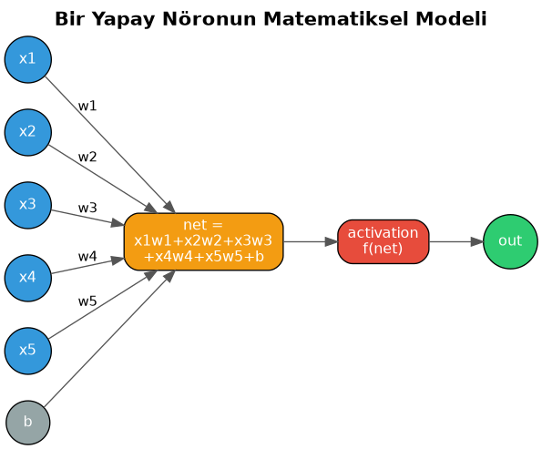
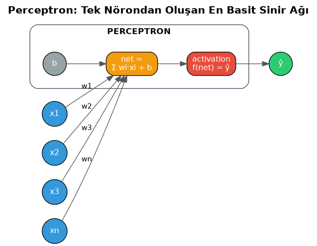
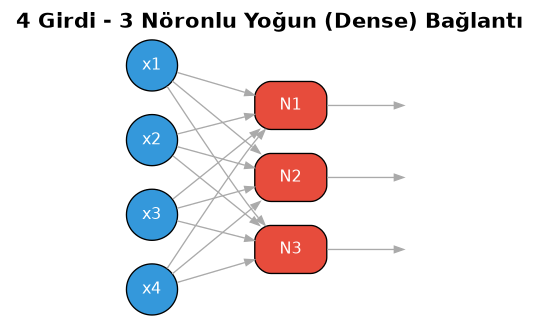
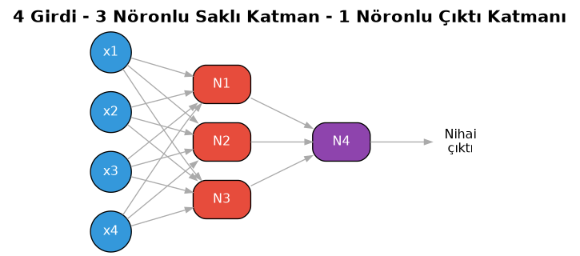
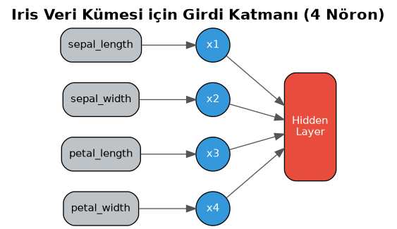

===========================
Sinir Ağları ve Derin Ağlar
===========================

Sinir Ağlarına Giriş
====================

Sinir Ağları ve Derin Ağlara Giriş
----------------------------------

Klasik doğal dil işleme etkinliklerinden sonra artık sinir ağları ve derin ağlar konusunu ele almaya
başlayacağız. Bu bölümde önce sinir ağlarının temellerini açıklayacağız. Sonra doğal dil işlemede ve üretici
yapay zekada kullanılan modern derin ağları ele alacağız.

Yapay Sinir Ağlarının Tarihçesi
-------------------------------

Yapay sinir ağlarının (artificial neural networks) teorisi ilk zamanlar sinir bilimle (neuroscience),
psikolojiyle ve matematikle uğraşan bilim insanları tarafından geliştirilmiştir. Yapay sinir ağları ilk kez
Warren McCulloch ve Walter Pitts isimli kişiler tarafından 1943 yılında ortaya atılmıştır. 1940'lı yılların
sonlarına doğru Donald Hebb isimli psikolog da *Hebbian Learning* kavramıyla, 1950'li yıllarda da Frank
Rosenblatt isimli araştırmacı da *perceptron* kavramıyla alana önemli katkılarda bulunmuştur. Bu yıllar henüz
elektronik bilgisayarların çok yeni olduğu yıllardı. Halbuki yapay sinir ağlarına yönelik algoritmalar için
önemli bir CPU gücü gerekmekteydi. Bu nedenle özellikle 1960'lı yıllarda bu konuda bir motivasyon eksikliği
oluşmuştur. Yapay sinir ağları sonraki dönemlerde yeniden popüler olmaya başlamıştır. Derin öğrenme konusunun
önem kazanmasıyla da popülaritesi hepten artmıştır.

Yapay Sinir Ağlarının Uygulama Alanları
---------------------------------------

Yapay sinir ağlarının pek çok farklı alanda uygulaması vardır. Örneğin:

- Metinlerin sınıflandırılması ve kategorize edilmesi (text classification and categorization)
- Üretici yapay zeka
- Metin üretimi (text generation) ve dil modelleri
- Ses tanıma (speech recognition)
- Karakter tanıma (character recognition)
- İsimlendirilmiş varlıkların tanınması (named entity recognition)
- Sözcük gruplarının aynı anlama gelip gelmediğinin belirlenmesi (paraphrase detection and identification)
- Makine çevirisi (machine translation)
- Örüntü tanıma (pattern recognition)
- Yüz tanıma (face recognition)
- Finansal uygulamalar (portföy yönetimi, kredi değerlendirmesi, sahtecilik, gayrimenkul değerlemesi, döviz
  fiyatlarının tahmini vs.)
- Endüstriyel problemlerin çözümü
- Biyomedikal mühendisliğine ilişkin bazı uygulamalar (örneğin medikal görüntü analizi, hastalığa tanı koyma ve
  tedavi planı oluşturma gibi)
- Optimizasyon problemlerinin çözümü
- Pazarlama süreçlerinde karşılaşılan problemlerin çözümü
- Ulaştırma problemlerinin çözümü

Biyolojik Sinir Sistemi ve Nöron Kavramı
----------------------------------------

Yapay sinir ağları (artificial neural networks) insanın sinir sisteminden esinlenerek geliştirilmiş olan
yöntemler grubudur. Her ne kadar artık yapay sinir ağlarının insanın sinir sistemiyle yakın bir ilgisi kalmamış
olsa da biz geleneksel biçimde önce bu yöntemler grubunun ilham kaynağı olan insanın sinir sistemi üzerinde
bazı açıklamalarla konuya başlayacağız.

Sinir sisteminin temel yapı taşı *nöron (neuron)* denilen hücrelerdir. Bir nöron bir çekirdeğe sahiptir.
Nöronun başka nörondan gelen iletileri alan *dendrit (dendrite)* denilen bir kısmı vardır. Pek çok nöronda bir
dal biçiminde uzanan aksonlar da bulunmaktadır. Aksonların uçlarında küçük *düğmecikler (terminal buttons)*
vardır. Bir nöron ateşlendiğinde bu düğmeciklerden *nörotransmiter (neurotransmitter)* denilen moleküller zerk
edilir. Bunlar diğer nöronun reseptörleri tarafından alınmaktadır. Ateşleme nörondaki *aksiyon potansiyeli
(action potential)* belli bir düzeye geldiğinde gerçekleşmektedir. Bir nöron duruma göre yüzlerce nörona bağlı
olabilmektedir. Bir nöronun akson ucu ile diğer nöronun dendrit reseptörleri arasındaki bölgeye *sinaps*
denilmektedir.

Çeşitli nörotransmiterler vardır. Her nörotransmiter anahtarın kilide uyması gibi farklı reseptörler tarafından
alınmaktadır. Bir nörotransmiteri sinapslarda artıran maddelere *agonist*, azaltan maddelere ise *antagonist*
denilmektedir. Agonist etki çeşitli biçimlerde sağlanabilmektedir. Örneğin bunun için presinaptik nöronda
(nörotransmiterleri zerk eden nöron) nörotransmiter miktarı ya da örneğin post sinaptik nörondaki
(nörotransmiterleri alan nöron) reseptör duyarlılığı artırılabilir. Bir nörotransmiter zerk edildikten sonra
akson uçları tarafından geri alınmaktadır. Buna *geri alım (reuptake)* süreci denir. Reuptake mekanizmasının
inhibe edilmesiyle de sinapstaki nörotransmiter etkinliği artırılabilmektedir. Örneğin SSRI (Selective
Serotonin Reuptake Inhibitors) denilen antidepresan ilaçlar bu mekanizmayla sinapslardaki serotonin miktarını
artırma iddiasındadır.

Nöronların bir kısmına *duyusal nöronlar (sensory neurons)* denilmektedir. Bunlar dış fiziksel uyaranları alıp
onu kimyasal düzeye dönüştürmekte işlev görürler. İletiler nihai olarak beyindeki bazı bölümlerde
işlenmektedir. Örneğin beynin arka kısmına *oksipital lob* denilmektedir. Görsel iletiler buradaki nöron ağı
tarafından işlenir. Bazı nöronlara ise *motor nöronlar (motor neurons)* denilmektedir. Motor nöronlar kaslara
bağlıdır ve kasların kasılmalarını sağlarlar. Örneğin elimizi hareket ettirmek istediğimizde bu süreç beynin
emir vermesiyle başlayan nöral iletinin ele ulaşıp oradaki kasları hareket ettirmesiyle sağlanmaktadır.
Dolayısıyla bu nöral ileti bozulursa felç durumu ortaya çıkmaktadır.

Nöronlarda *miyelin kılıfı (myelin sheath)* denilen özel bir kılıf bulunabilmektedir. Bu kılıf nöral iletiyi
hızlandırmaktadır. Beyinde bu kılıfın yoğun olduğu bölgeler beyaz renkte gözüktüğü için bu bölgelere *beyaz
madde (white matter)*, miyelinsiz nöronların yoğun bulunduğu bölgeler gri biçimde gözüktüğü için bu nöronların
bulunduğu bölgelere de *gri madde (gray matter)* denilmektedir.

Makine öğrenmesindeki yapay sinir ağları yukarıda da belirttiğimiz gibi insanın sinir sisteminden ilham alınarak
tasarlanmıştır. Ancak artık bu ilham noktası önemini kaybetmiş gibidir. Bu nedenle pek çok uzman artık bu konuyu
*yapay sinir ağları (artificial neural network)* yerine yalnızca *sinir ağları (neural network)* biçiminde
ifade etmektedir.

Yapay Nöronun Matematiksel Modeli
---------------------------------

Yapay sinir ağları yapay nöronların birbirlerine bağlanmasıyla oluşturulmaktadır. Bir nöronun çeşitli girdileri
olabilir fakat yalnızca bir tane çıktısı vardır. Nöronun girdileri aslında veri kümesindeki satırları temsil
etmektedir. Yani veri kümesindeki satırlar nöronun girdileri olarak kullanılmaktadır. Nöronun girdilerini xi
ile temsil edersek her girdi *ağırlık (weight) değeri* denilen bir değerle çarpılır ve bu çarpımların toplamları
elde edilir. Ağırlık değerlerini wi ile gösterirsek bu xi değerleri onlara karşı gelen wi değerleriyle
çarpılıp toplanmaktadır. Örneğin nöronun 5 tane girdisi olsun, bu 5 girdi aşağıdaki gibi 5 ayrı ağırlık
değerleriyle çarpılıp toplanacaktır:

::

    total = x1w1 + x2w2 + x3w3 + x4w4 + x5w5

İki vektörün karşılıklı elemanlarının çarpımlarının toplamına İngilizce *dot product* denilmektedir. (Dot
product işlemi ``np.dot`` fonksiyonuyla yapılabilmektedir.) Elde edilen dot product değeri *bias* denilen bir
değerle toplanır. Biz bias değerini b ile temsil edeceğiz. Bu durumda 5 girdisi olan nörondan elde edilen toplam
şöyle olacaktır:

::

    total = x1w1 + x2w2 + x3w3 + x4w4 + x5w5 + b

İşte elde edilen bu toplam da *aktivasyon fonksiyonu (activation function)* ya da *transfer fonksiyonu (transfer
function)* denilen bir fonksiyona sokulmaktadır. Böylece o nöronun nihai çıktısı elde edilmektedir. Bu işlemleri
aşağıdaki gibi ifade edebiliriz.

::

    out = activation(x1w1 + x2w2 + x3w3 + x4w4 + x5w5 + b)

Bu işlemi şekilsel olarak şöyle de gösterebiliriz:

   Girdilerin ağırlıklandırılıp toplanması, bias eklenmesi ve aktivasyon fonksiyonuna sokulması

Burada bir noktaya dikkat ediniz: w değerleri ve b değeri nöronun içindedir. x değerleri ise nörona giriş
olarak uygulanmaktadır. İzleyen paragraflarda da belirteceğimiz gibi yapay sinir ağının eğitilmesi aslında
nöronların içerisindeki w değerlerinin ve b değerlerinin uygun biçimde konumlandırılması anlamına gelmektedir.

Nöron İşleminin Matrisel Gösterimi
----------------------------------

Nöronun içerisindeki işlemleri XW + b biçiminde matrisel formda da ifade edebiliriz. Burada X bir satır vektörü
W da bir sütun vektörüdür:

::

                            ┌    ┐
                            │ w1 │
    ┌                     ┐ │ w2 │
    │ x1  x2  x3  ...  xn │ │ w3 │ +  b =   x1w1 + x2w2 + x3w3 + ... + xnwn + b
    └                     ┘ │....│
                            │ wn │
                            └    ┘

            (1 × n)        (n × 1)         (1 × 1)

O halde nörondaki girdinin çıktıya dönüştürülmesi işlemini matrisel biçimde şöyle de gösterebiliriz:

::

    out = activation(XW + b)

Bir nöronun çıktısı başka nöronlara girdi yapılabilmektedir. Böylece nöronlar birbirine bağlanarak tüm ağdan
nihai bir çıktı elde edilir.

Çok Nöronlu Katmanın Matrisel Gösterimi
---------------------------------------

Şimdi ağımızda tek bir nöron değil K tane farklı nöronun bulunduğunu düşünelim. N tane girdinin de (yani
Xi'lerin) bu nöronların hepsine bağlandığını varsayalım. Her nöronun ağırlık değerleri ve bias değeri
diğerlerinden farklıdır. Dolayısıyla K tane nöronun çıktısı aşağıdaki gibi bir matrisle gösterilebilir:

::

    outs = activation(XW + b)

Artık burada X 1XN boyutunda, W matrisi ise NxK boyutunda ve b matrisi de 1XK boyutundadır. Sonuç olarak
buradan K tane çıktı değeri elde edilecektir. Buradaki XW işleminin artık dot product belirtmediğine bir matris
çarpımı belirttiğine dikkat ediniz. Gösterimimizdeki X matrisi bir satır vektörü durumundadır:

::

    X = [x1, x2, x3, ..., xn]

Bu matris Nx1 boyutundadır. W matrisi ise aşağıdaki görünümdedir:

::

    w11  w21 w31 ... wk1
    w12  w22 w32 ... wk2
    w13  w23 w33 ... wk3
    ...  ... ... ... ...
    w1n  w2n w3n ... wkn

Bu matris de NxK boyutundadır. Buradaki X matrisi ile W matrisi matris çarpımına sokulduğunda 1XK boyutunda bir
matris elde edilecektir. Gösterimimizdeki b matrisi şöyle temsil edilebilir:

::

    b = [b1, b2, b2, ...., bk]

Bu matrisin de 1XK boyutunda olduğuna dikkat ediniz. Böylece XW + b işleminden 1XK boyutunda bir matris elde
edilecektir. Tabii biz bu matris çarpımını WX + b biçiminde ters de oluşturabilirdik. Bu durumda W matrisi
şöyle olacaktır:

::

    w11  w12 w13 ... w1n
    w21  w22 w23 ... w2n
    w31  w32 w33 ... w3n
    ...  ... ... ... ...
    wk1  wk2 wk3 ... wkn

Söz konusu X matrisi de şöyle olacaktır:

::

    x1
    x2
    x3
    ...
    xk

Tabii bu durumda b matrisi de şöyle olacaktır:

::

    b1 b2 b3 ... bk

Artık burada W matrisinin KxN boyutunda olduğuna, X ve b matrislerinin de Kx1 boyutunda olduğuna dikkat ediniz.
Genellikle XW + b gösterimi yerine WX + b gösterimi tercih edilmektedir.

Sinir Ağlarının Eğitimi
-----------------------

Bir sinir ağının amacı *kestirimde* bulunmaktır. Yani biz ağa girdi olarak xi değerlerini veririz. Ağdan
hedeflediğimiz çıktıyı elde etmeye çalışırız. Ancak bunu yapabilmemiz için nöronlardaki w değerlerinin ve b
değerlerinin biliniyor olması gerekir. Peki bu değerleri nasıl elde edilmektedir?

Sinir ağları *denetimli (supervised)* bir öğrenme modeli sunmaktadır. Daha önceden de belirttiğimiz gibi
denetimli öğrenmede önce sistemin mevcut verilerle eğitilmesi gerekmektedir. İşte bir sinir ağının eğitilmesi
aslında nöronlardaki w değerlerinin ve b değerlerinin uygun biçimde belirlenmesi anlamına gelmektedir. Başka
bir deyişle önce biz ağımızı mevcut verilerle eğitip bu w ve b değerlerinin uygun biçimde oluşturulmasını
sağlarız. Ondan sonra kestirim yaparız. Tabii ağ ne kadar iyi eğitilirse ağın yapacağı kestirim de o kadar
isabetli olacaktır.

Örneğin biz bir dairenin fiyatını tahmin etmeye çalışalım. Bunun için öncelikle veri toplamamız gerekir. Çeşitli
daireler için şu verilerin toplandığını varsayalım:

- Dairenin büyüklüğü
- Dairenin kaçıncı katta olduğu
- Dairenin içinde bulunduğu binanın yaşı
- Dairenin yaşam alanına uzaklığı
- Dairenin ne kadar yakında metro durağı olduğu
- Dairenin içinde bulunduğu binanın otopark miktarı
- Apartman aidatı

İşte elimizdeki veri kümesinin sütunlarını (özelliklerini) bu bilgiler oluşturmaktadır. Bizim çeşitli dairelerin
bu bilgilerini elde etmiş olmamız ve onların satış fiyatlarını da biliyor olmamız gerekir. Yani bizim işin
başında sinir ağına girdi yapacağımız bilgilerle ağın vermesi gereken gerçek çıktılardan oluşan bir veri
kümesine gereksinimimiz vardır. İşte ağın eğitimi için bu veri kümesini kullanırız. Ağımızı bu gerçek verilerle
eğittikten sonra artık nöronlardaki w ve b değerleri konumlandırılmış olacaktır. Biz de kestirim yapmak
istediğimizde ağımıza dairenin yukarıdaki bilgilerini veririz. Ağımız da bize çıktı olarak o dairenin olması
gereken fiyatını verir.

Eğitim sırasında tüm nöronların içerisindeki ağırlık değerlerinin ve bias değerlerinin nasıl konumlandırıldığını
merak edebilirsiniz. İşte eğitim sırasında olması gereken değerle ağın verdiği değer arasındaki fark minimize
edilmeye çalışılmaktadır. Buna sinir ağlarındaki optimizasyon işlemi denilmektedir. Optimizasyon algoritmaları
türevde zincir kuralı kullanılarak çıktıdan geriye doğru nöronların ağırlık değerlerini ve bias değerlerini
güncellemektedir. Böylece ağ eğitildikçe bu w ve bias değerleri daha iyi konumlandırılmaktadır. Bu kestirimin
iyileştirilmesi anlamına gelmektedir.

Sinir Ağı Bileşenleri Hakkında Sorular
--------------------------------------

Biz yukarıda bir sinir ağının temel çalışma mekanizmasını açıkladık. Ancak bir sinir ağını oluşturabilmek için
bu ağın bileşenleri hakkında daha fazla bilgi sahibi olmamız gerekir. Ağın bileşenleri hakkında aklımıza
gelebilecek tipik sorular şunlardır:

- Ağın nöron katmanlarının sayısı ne olmalıdır?
- Katmanlardaki nöronların sayıları ve katman bağlantıları nasıl olmalıdır?
- Nöronlarda kullanılan aktivasyon fonksiyonları nasıl olmalıdır?
- Ağdaki w ve b değerlerini oluşturmak için kullanılan optimizasyon algoritmaları nelerdir ve nasıl
  çalışmaktadır?

Biz de bir süreç içerisinde bu sorulara yanıtlar vereceğiz. Ancak bir noktaya dikkatinizi çekmek istiyoruz:
Sinir ağlarında önemli bir işlem yükü vardır. Buradaki işlemlerin programcılar tarafından manuel bir biçimde
her defasında yeniden (ad-hoc biçimde) yapılması çok zahmetlidir. İşte zamanla bu sinir ağı işlemlerini kendi
içlerinde yapan kütüphaneler geliştirilmiştir. Bugün artık uygulamacılar bu işlemleri programlar yazarak değil
zaten bu konuda çözüm üreten hazır kütüphaneleri ve framework'leri kullanarak yapmaktadır.

Regresyon ve Sınıflandırma Modelleri Arasındaki İlişki
------------------------------------------------------

İstatistikte girdi değerlerinden hareketle çıktı değerinin belirlenmesine (tahmin edilmesine) yönelik
süreçlere *regresyon (regression)* denilmektedir. İstatistikte regresyon modelleri çeşitli biçimlerde
sınıflandırılabilmektedir. İstatistikte çıktıya göre regresyon modelleri tipik olarak ikiye ayrılmaktadır:

1) Sınıflandırma Amacıyla Oluşturulan Regresyon Modelleri
2) Gerçek Bir Değer Elde Etmek Amacıyla Oluşturulan Regresyon Modelleri

Her ne kadar sınıflandırma işlemi de geniş anlamda bir regresyon işlemi gibi olsa da sınıflandırma istatistiksel
yöntemlerin dışında çeşitli başka yöntemlerle de yapılabilmektedir. İstatistiksel olarak sınıflandırma işlemi
*hedefi bir olasılık fonksiyonu olan, üzerine bir karar kuralı eklenmiş* bir regresyon problemidir.

Gerçek bir değer elde etmek amacıyla oluşturulan regresyon modellerinde bir olasılık değeri değil gerçek ve
sürekli bir değer elde edilmektedir. Örneğin bir dairenin yukarıda belirttiğimiz özellikleri girdiler olabilir,
dairenin fiyatı da çıktı olabilir. Burada çıktı sürekli sayısal bir değerdir. Çıktının bir sınıf biçiminde elde
edildiği regresyon modellerinde çıktı gerçek bir değer değil sınıf ya da kategori belirten ayrık bir değerdir.
Örneğin girdiler bir resmin pixel'leri olabilir. Çıktı da bu resmin elma mı, armut mu, kayısı mı olduğuna
yönelik kategorik bir bilgi olabilir. Anımsanacağı gibi istatistikte bu tür sınıflandırma yapan tipik regresyon
modeline *lojistik regresyon* ya da *logit regresyonu* denilmektedir. (Lojistik regresyondaki *lojistik*
sözcüğünün günlük hayatta çokça karşılaştığımız *lojistik hizmetlerdeki* *lojistik* sözcüğü ile bir ilgisi
yoktur. Buradaki *lojistik* sözcüğü matematikteki *logaritma* sözcüğünün kısaltmasından gelmektedir.)

Makine öğrenmesinde kestirim işlemleri kabaca iki gruba ayrılmaktadır:

1) Sınıflandırma işlemleri
2) Regresyon işlemleri

Makine öğrenmesinde regresyon terimi gerçek bir değer elde etmek amacıyla oluşturulan modeller için
kullanılmaktadır.

İkili ve Çok Sınıflı Sınıflandırma
----------------------------------

Sınıflandırma işlemlerinde çıktı olarak elde edilebilecek kategorik değerler sınıfları belirtmektedir.
Sınıflandırma işlemlerinde eğer çıktı yalnızca iki değerden biri olabiliyorsa bu tür sınıflandırma
problemlerine *iki sınıflı sınıflandırma (binary classification)* problemleri denilmektedir. Örneğin bir film
hakkında yazılan yorum yazısının *olumlu* ya da *olumsuz* biçiminde iki değerden oluştuğunu düşünelim. Buradaki
sınıflandırma işlemi ikili sınıflandırma işlemidir. Benzer biçimde bir biyomedikal görüntüdeki kitlenin *iyi
huylu (benign)* mu *kötü huylu (malign)* mu olduğuna yönelik sınıflandırma da ikili sınıflandırmaya bir
örnektir. Eğer sınıflandırmada çıktı sınıflarının sayısı ikiden fazla ise böyle sınıflandırma problemlerine
*çok sınıflı (multiclass)* sınıflandırma problemleri denilmektedir. Örneğin bir resmin hangi meyveye ilişkin
olduğunun tespit edilmesi için kullanılan sınıflandırma modeli *çok sınıflı* bir modeldir.

Anımsanacağı gibi istatistikte *lojistik regresyon* denildiğinde aslında varsayılan durumda *iki sınıflı
(binary)* lojistik regresyon anlaşılmaktadır. Çok sınıflı lojistik regresyonlara istatistikte genellikle
İngilizce *multiclass logistic regression* ya da *multinomial logistic regression* denilmektedir.

Perceptron ve Sinir Ağı Katmanları
==================================

Perceptron: En Basit Yapay Sinir Ağı
------------------------------------

En basit yapay sinir ağı tek bir nörondan oluşan mimaridir. Buna *perceptron* denilmektedir. Perceptron'u tek
hücrelilere benzetebiliriz. Perceptron kavramı 1957-1958 yıllarında Frank Rosenblatt tarafından ortaya
atılmıştır. Perceptron'da bir tane nöron vardır. N tane girdi bu nörondaki w değerleriyle dot product yapılıp
bias değeri ile toplanarak aktivasyon fonksiyonuna sokulur. Bu durumu şekilsel olarak şöyle gösterebiliriz:

   Tek nörondan oluşan perceptron mimarisi

Yalnızca tek nörondan oluşan perceptron *doğrusal olarak ayrıştırılabilen (linearly separable)* ikili
sınıflandırma problemlerine ya da yalın çoklu regresyon problemlerine uygulanabilmektedir. Her ne kadar tek bir
nöron bile bazı problemleri çözebiliyorsa da problemler karmaşıklaştıkça ağdaki nöron sayılarının ve
katmanların artırılması gerekmektedir.

Aslında aktivasyon fonksiyonunun *sigmoid* olduğu, optimizasyon için kullanılan kayıp (loss) fonksiyonunun
*binary-cross-entropy* olduğu perceptron tamamen istatistikteki lojistik regresyonla aynı anlama gelmektedir.
Benzer biçimde aktivasyon fonksiyonunun doğrusal (linear) olduğu, kayıp fonksiyonunun da *mean-squared-error*
olduğu perceptron da çoklu doğrusal regresyonla aynı anlama gelmektedir. Görüldüğü gibi perceptron lojistik
regresyon ve çoklu doğrusal regresyon işlemlerini yapabilmektedir.

Aşağıda bir nöronun bir sınıfla temsil edilmesine ilişkin bir örnek veriyoruz.

.. code-block:: python

    import numpy as np

    class Neuron:
        def __init__(self, ninputs):
            self.ninputs = ninputs
            self.activation = Neuron.sigmoid

        def set_weights(self, weights, b, activation=None):
            if self.ninputs != len(weights):
                raise ValueError('invalid weights!..')
            self.weights = weights
            self.b = b
            if activation:
                self.activation = activation

        def output(self, x):
            if self.ninputs != len(x):
                raise ValueError('invalid inputs')
            return self.activation(np.dot(self.weights, x) + self.b)

        @staticmethod
        def sigmoid(x):
            return 1 / (1 + np.e ** x)

    # test

    n = Neuron(5)
    n.set_weights(np.array([1, 2, 3, 4, 5]), 1)
    result = n.output(np.array([1, 2, 3, 4, 5]))
    print(result)

Çok Nöronlu Ağlarda Bağlantılar
-------------------------------

Peki bir sinir ağında birden fazla nöron olduğunda bunların arasındaki bağlantı nasıl olacaktır? Örneğin
ağımızda bir değil üç nöron olsun ve 4 tane de girdi olsun. Bu durumda bu dört girdi üç nörona da
bağlanacaktır. Bu üç nörondan üç ayrı çıkış elde edilecektir:

   Her girdinin her nörona bağlandığı yoğun (dense) bağlantı

Bir nöronun çıktısının sonraki katmandaki tüm nöronlara girdi yapılması ile oluşturulan bağlantıya *yoğun
bağlantı (dense connection)* denilmektedir. Sinir ağlarında genellikle yoğun bağlantı kullanılmaktadır.
Yukarıdaki sinir ağında üç ayrı çıkış vardır. Biz tek bir çıkış istiyorsak bu çıkışları da başka nörona girdi
yaparız:

   Saklı katmandaki üç nöronun çıktısının tek bir çıktı nöronuna (N4) bağlanması

Yoğun bağlantı yerine önceki nöronun çıktısı sonraki her nörona değil bazı nöronlara bağlanması da söz konusu
olabilmektedir. Bu tür bağlantılara *seyrek bağlantı (sparse connection)* da denilmektedir. Seyrek bağlantı
çeşitli amaçlarla kullanılabilmektedir. Sonraki nöronun çıktısının önceki nöronlara bağlanması da ilginç bir
durumdur. Buna sinir ağlarında *özyinelemeli sinir ağları (recurrent neural networks (RNN))* da denilmektedir.
Özyinelemeli terimi yerine *geri beslemeli (feed backward)* terimi de kullanılabilmektedir.

Ağdaki Parametre Sayısının Hesaplanması
---------------------------------------

Yukarıdaki 4 girişe ve 4 nörona sahip ağda eğitim sırasında konumlandırılması gereken toplam kaç ağırlık değeri
ve bias değeri vardır? N1, N2 ve N3 nöronlarının 4'er girdisi vardır. N4 nöronunun ise 3 girdisi vardır. Bu
nöronların hepsinin ayrıca bir bias değeri de bulunmaktadır. O halde konumlandırılması gereken toplam
ağırlıkların sayısı (burada ağırlık derken bias değerlerini de dahil ediyoruz) 4 * 3 + 3 + 3 + 1 = 19
biçimindedir. Bir sinir ağında eğitim sonucunda konumlandırılması gereken ağırlık değerlerinin sayısına (bias
değerleri de bu bağlamda ağırlık değeri olarak ele alıyoruz) modelin *parametre sayısı* denilmektedir. Bugün
kullandığımız LLM modellerindeki parametre sayısı modelden modele değişebilmektedir. Aşağıda bazı LLM
modellerinin parametre sayılarını veriyoruz:

.. list-table:: Bazı LLM Modellerinin Tahmini Parametre Sayıları
   :header-rows: 1
   :widths: 30 30

   * - Model (kapalı)
     - Toplam (tahmin)
   * - GPT-5.x (flagship)
     - ~1-3 trilyon
   * - GPT-5.x mini/nano
     - ~10-100 milyar
   * - Claude Opus 5
     - ~2-5 trilyon
   * - Claude Sonnet sınıfı
     - ~300 milyar-1 trilyon
   * - Claude Haiku sınıfı
     - ~20-70 milyar
   * - Gemini 3 Pro/Ultra
     - ~1-3 trilyon
   * - Gemini 3 Flash/Lite
     - ~20-100 milyar
   * - Grok 4 / 5
     - ~2-3 trilyon

Sinir Ağı Katmanları
--------------------

Gelişmiş sinir ağları çok sayıda nöronun bulunduğu katmanlardan (layers) oluşmaktadır. Katman aynı düzeydeki
nöron grubu için kullanılan bir kavramıdır. Yapay sinir ağlarında katmanlar tipik olarak üçe ayrılmaktadır:

1) Girdi Katmanı (Input Layer)
2) Saklı Katmanlar (Hidden Layers)
3) Çıktı Katmanı (Output Layer)

Girdi katmanı ağa uygulanacak verileri temsil eden katmandır. Aslında girdi katmanı gerçek anlamda nöronlardan
oluşmaz. Ancak anlatımları kolaylaştırmak için bu katmanın da nöronlardan oluştuğu varsayılmaktadır. Başka bir
deyişle girdi katmanındaki nöronların tek bir girdisi ve tek bir çıktısı vardır. Bunların w değerleri 1, bias
değerleri 0'dır. Aktivasyon fonksiyonları ise f(x) = x biçimindedir. Yani girdi katmanı bir şey yapmaz, girdiyi
değiştirmeden çıktıya verir. Yukarıda da belirttiğimiz gibi girdi katmanı gerçek bir katman değildir. Girdileri
temsil etmektedir. Girdi katmanındaki nöron sayısı tablo biçimindeki (tabular) veri kümesindeki sütunların
(yani özelliklerin) sayısı kadar olmalıdır. Örneğin 5 tane özelliğe (feature) sahip olan bir veri kümesine
ilişkin sinir ağının girdi katmanı şöyle ifade edilebilir:

::

    x1 ---> O --->
    x2 ---> O --->
    x3 ---> O --->
    x4 ---> O --->
    x5 ---> O --->

Buradaki O sembolleri girdi katmanındaki nöronları temsil etmektedir. Girdi katmanındaki nöronların 1 tane
girdisinin, 1 tane de çıktısının olduğuna dikkat ediniz. Buradaki nöronlar girdiyi değiştirmediğine göre
bunların w değerleri 1, b değerleri 0, aktivasyon fonksiyonu da f(x) = x gibi düşünülebilir.

Iris Veri Kümesi Örneği ile Girdi Katmanı
-----------------------------------------

Örneğin zambakların çeşitli özelliklerini ve bunların türlerini barındıran *iris* veri kümesindeki sütunlar
şöyledir:

.. list-table:: Iris Veri Kümesinin İlk Satırları
   :header-rows: 1
   :widths: 15 15 15 15 15

   * - sepal_length
     - sepal_width
     - petal_length
     - petal_width
     - species
   * - 5.1
     - 3.5
     - 1.4
     - 0.2
     - setosa
   * - 4.9
     - 3.0
     - 1.4
     - 0.2
     - setosa
   * - 4.7
     - 3.2
     - 1.3
     - 0.2
     - setosa
   * - 4.6
     - 3.1
     - 1.5
     - 0.2
     - setosa
   * - 5.0
     - 3.6
     - 1.4
     - 0.2
     - setosa
   * - ...
     - ...
     - ...
     - ...
     - ...

Burada species sütunu zambağın türünü belirtmektedir. Bu veri kümesinden amaç dört özelliği girilen bir
zambağın türünün tespit edilmesidir. İşte bu veri kümesi için oluşturulacak sinir ağının girdi katmanında 4
nöron bulunmaktadır:

   Dört özelliğin dört girdi nöronuna ve oradan saklı katmana bağlanması

Eğitim sırasında her satır girdi olarak uygulanmaktadır.

Girdiler (yani girdi katmanının çıktıları) saklı katman (hidden layer) denilen katmanlardaki nöronlara
bağlanırlar. Modelde sıfır tane, bir tane, iki tane ya da ikiden fazla saklı katman bulunabilir. Saklı
katmanların sayısı ve saklı katmanlardaki nöronların sayısı ve bağlantı biçimleri problemin niteliğine göre
değişebilmektedir. Yani saklı katmanlardaki nöronların girdi katmanıyla aynı sayıda olması gerekmez. Her saklı
katmandaki nöron sayıları aynı olmak zorunda da değildir. Genel olarak sinir ağı modelinde saklı katmanların
sayısı 2'den fazla ise bu tür modellere *derin sinir ağı (deep neural network)*, bu tür ağların bulunduğu
modellere ilişkin konuya da genel olarak *derin öğrenme (deep learning)* denilmektedir.

Çıktı katmanı bizim sonucu alacağımız katmandır. Çıktı katmanındaki nöron sayısı bizim kestirmeye çalıştığımız
olgularla ilgilidir. Örneğin biz bir evin fiyatını kestirmeye çalışıyorsak çıktı katmanında tek bir nöron
bulunur. Yine örneğin biz ikili sınıflandırma problemi üzerinde çalışıyorsak çıktı katmanı yine tek bir
nörondan oluşabilir. Ancak biz evin fiyatının yanı sıra evin sağlamlığını da kestirmek istiyorsak bu durumda
çıktı katmanında iki nöron olacaktır. Benzer biçimde çok sınıflı sınıflandırma problemlerinde genel olarak
çıktı katmanlarında sınıf sayısı kadar nöron bulunur.

Bir yapay sinir ağındaki katmanların sayısı belirtilirken bazıları girdi katmanını bu sayıya dahil ederken,
bazıları etmemektedir. Bu nedenle katman sayılarını konuşurken yalnızca saklı katmanları belirtmek bu bakımdan
iki anlamlılığı giderebilmektedir. Örneğin biz *modelimizde 5 katman var* dediğimizde birisi bu 5 katmanın
içerisinde girdi katmanı dahil mi diye tereddütte kalabilir. O halde iki anlamlılığı ortadan kaldırmak için
*modelimizde 3 saklı katman var* gibi bir ifade daha uygun olacaktır.

Derin Öğrenme ve Saklı Katman Sayısı
------------------------------------

Bir yapay sinir ağı modelinde katman sayısının artırılması daha iyi bir sonucun elde edileceği anlamına gelmez.
Benzer biçimde katmanlardaki nöron sayılarının artırılması da daha iyi bir sonucun elde edileceği anlamına
gelmemektedir. Katmanların sayısından ziyade onların işlevleri daha önemli olmaktadır. Ağa gereksiz katman
eklemek, katmanlardaki nöronları artırmak tam ters bir biçimde ağın kestirim başarısının düşmesine de yol
açabilir. Yani gerekmediği halde ağa saklı katman eklemek, katmanlardaki nöron sayılarını artırmak bir fayda
sağlamamakta tersine kestirim başarısını düşürebilmektedir. Ancak görüntü tanıma gibi, yazı anlamlandırma
gibi, üretici yapay zeka uygulamaları gibi özel ve zor problemlerde saklı katman sayılarının artırılması
gerekmektedir.

Peki bir sinir ağı modelinde kaç tane saklı katman olmalıdır? Bu sorunun matematiksel derinliği vardır. Ancak
pratik olarak şunları söyleyebiliriz:

- Sıfır tane saklı katmana sahip tek bir nörondan oluşan en basit modele *perceptron* dendiğini belirtmiştik.
  Bu perceptron *doğrusal olarak ayrıştırılabilen (linearly separable)* sınıflandırma problemlerini ve
  karmaşık olmayan çoklu doğrusal regresyon problemlerini çözebilmektedir.

- Tek saklı katmanlı modeller aslında pek çok sınıflandırma problemini ve regresyon problemini belli bir
  yeterlilikte çözebilmektedir. Ancak tek saklı katman yine de bu tarz bazı problemler için yetersiz
  kalabilmektedir.

- İki saklı katman pek çok sınıflandırma problemi için ve regresyon problemi için yeterli bir modeldir. Bu
  nedenle karmaşık olmayan problemler için ilk akla gelecek model iki saklı katmanlı modeldir.

- İkiden fazla saklı katmana sahip olan modeller karmaşık ve özel problemleri çözmek için kullanılmaktadır. İki
  saklı katmandan fazla katmana sahip olan sinir ağlarına genel olarak *derin öğrenme ağları (deep learning
  networks)* denildiğini anımsayınız.

Yukarıda da belirttiğimiz gibi *derin öğrenme (deep learning)* farklı bir yöntemi belirtmemektedir. Derin
öğrenme özel ve karmaşık problemleri çözebilmek için ikiden fazla saklı katman içeren sinir ağı modellerini
belirtmek için kullanılan bir terimdir.

Henüz anlamlandıramasak da tek saklı katmanlı ve iki saklı katmanlı sinir ağlarının hangi tür problemleri hangi
düzeyde çözebildiğine ilişkin aşağıda bir tablo veriyoruz:

.. list-table:: Tek ve İki Saklı Katmanlı Ağların Problem Türlerine Göre Yeterliliği
   :header-rows: 1
   :widths: 34 22 22

   * - Problem türü
     - Tek saklı katman
     - İki saklı katman
   * - Sürekli, düzgün regresyon
     - Yeterli
     - Yeterli (gereksiz)
   * - Köşeli ama sürekli fonksiyon (\|x\|)
     - Yeterli
     - Yeterli
   * - Süreksiz (sıçramalı) fonksiyon
     - Kaba taklit, verimsiz
     - Verimli yaklaşım
   * - Bağlantılı, dışbükey karar bölgesi
     - Yeterli
     - Yeterli
   * - Dışbükey olmayan tek bölge
     - Kabaca yapar
     - Verimli
   * - Kopuk karar bölgeleri
     - Verimsiz
     - Verimli
   * - XOR ve küçük mantık
     - Yeterli
     - Yeterli
   * - Az boyutlu tablo verisi
     - Genellikle yeterli
     - Bazen daha iyi
   * - Orta/büyük tablo verisi
     - Yetersiz kalabilir
     - Genellikle yeterli
   * - Ham görüntü / ses / metin
     - Yetersiz
     - Yetersiz, derin ağ
   * - Uzun sıralı bağımlılık
     - Yetersiz
     - Yetersiz, derin ağ

