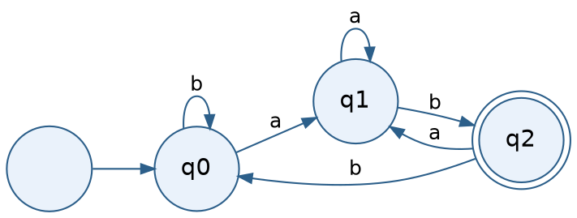
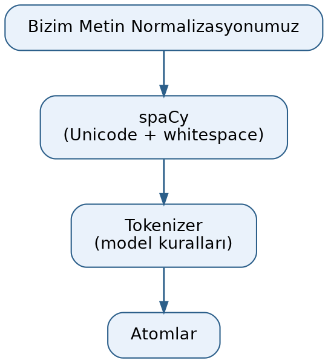
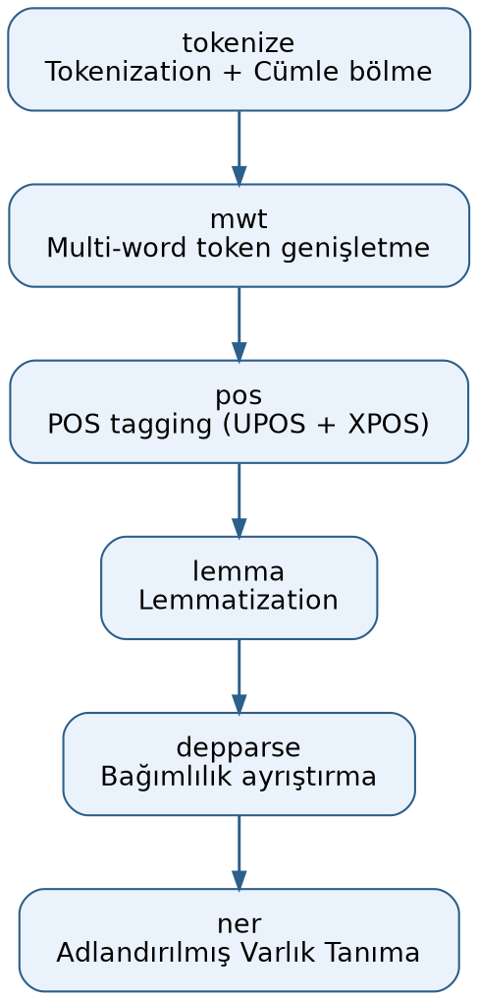
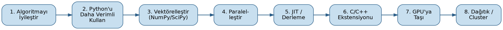

=================================
Atomlarına Ayırma (Tokenization)
=================================

Atomlarına Ayırma (Tokenization) Kavramına Giriş
=================================================

Metin normalizasyonu konusunu bitirdik. Şimdi metinlerin *atomlarına ayrılması (tokenization)* süreci
üzerinde duracağız. Atom (token) *bir dildeki kendi başına anlamlı en küçük birime* denilmektedir. Aslında
doğal dillerdeki yazılar, programlama dillerindeki programlar birbirini izleyen atomlar biçiminde ele
alınabilmektedir. Atom sözcüğü orijinal literatürde kullanılan bir sözcük değildir. Atom yerine
İngilizce'de *token* sözcüğü kullanılmaktadır. *Token* sözcüğünün İngilizce en bilinen anlamı *jeton* olsa
da bu sözcük dilbilimde *sembol*, *simge* gibi anlamlara da gelmektedir. *Atomlarına ayırma* için ise
İngilizce *tokenization* sözcüğü kullanılmaktadır. Bu sözcük Türkçe'de *tokınizasyon* biçiminde de ifade
edilebilmektedir.

Örneğin aşağıdaki gibi bir yazı olsun:

.. code-block:: python

   text = "bugün hava çok güzel! pikniğe gidelim."

Bu yazı sözcüklerine atomlarına ayrılabilir:

.. code-block:: text

   bugün
   hava
   çok
   güzel
   !
   pikniğe
   gidelim
   .

Noktalama işaretlerinin de ayrı birer anlamı olduğu için onların da birer atom olduğuna dikkat ediniz. Biz
bu örnekte sözcük tabanlı atomlarına ayırma işlemi uyguladık. Aslında doğal dil işlemede sözcük tabanlı
atomlarına ayırma yöntemi dışında zaman içerisinde başka biçimlerde atomlarına ayırma yöntemleri de
geliştirilmiştir. Ancak en bilinen yöntem yukarıdaki gibi sözcük tabanlı atomlarına ayırma yöntemidir.
Kullanım amacına bağlı olarak atomlara birer tür bilgisi de iliştirilebilmektedir. Örneğin atomlar *sözcük
(word)*, *noktalama işareti (punctuator)*, *kısaltma (abbreviation)*, *e-posta (email)* gibi atomsal
türlere ilişkin olabilmektedir.

Doğal dil işlemede kullanılan belli başlı atomlarına ayırma yöntemleri şunlardır:

1. Karakter Tabanlı (Character-Level) Yöntem
2. Sözcük Tabanlı (Word-Level) Yöntem

   - Boşluk ve noktalama işaretleri kullanılarak
   - Kural Tabanlı yöntemler kullanılarak (regex)

3. Cümle Tabanlı (Sentence-Level) Yöntem
4. N-gram (Unigram/Bigram/Trigram, ...) Yöntemleri
5. Alt Sözcük (Subword) Yöntemleri

   - BPE (Byte Pair Encoding)
   - WordPiece
   - Unigram LM

6. Byte Tabanlı (Byte-Level) Yöntem

Biz bu yöntemleri tek tek ele alarak inceleyeceğiz.

Sözcük Hazinesi (Vocabulary) Kavramı
-------------------------------------

Biz metni yukarıdaki yöntemlerin herhangi biri ile atomlarına ayırdığımızı düşünelim. Atomlarına ayırma
işlemi sonucunda elde edilen farklı atomların kümesine *sözcük hazinesi (vocabulary)* denilmektedir.
Örneğin derlemimiz (corpus) aşağıdaki metinlerden oluşuyor olsun:

.. code-block:: text

   "bugün hava çok güzel!"
   "hava durumuna baktım"
   "çok sıcak olması güzel değil"

Burada biz sözcük tabanlı atomlarına ayırma yöntemini kullanmış olalım. Bu derlemin sözcük hazinesi (yani
farklı atomların oluşturduğu küme) şöyle olacaktır:

.. code-block:: python

   {'bugün', 'hava', 'çok', 'güzel', '!', 'durumuna', 'baktım', 'sıcak', 'olması', 'değil'}

Derlemin sözcük hazinesinin uzunluğu (büyüklüğü) elde edilen bu kümenin eleman sayısıyla belirtilmektedir.
Örneğin yukarıdaki sözcük hazinesi 10 uzunluğundadır. Sözcük hazinesi oluşturulduktan sonra sözcük hazinesi
içerisindeki atomlara birer sayısal değer atanmaktadır. Çünkü algoritmalar sözcükler üzerinde değil onları
temsil eden sayısal değerler üzerinde işlemler yapabilmektedir. Sözcük hazinesi Python'da tipik olarak
*küme (set)* veri yapısıyla temsil edilmektedir. (Anımsanacağı gibi Python'da kümeler *tek (unique)
elemanları tutmak için* sıkça kullanılmaktadır.) Sözcük hazinesindeki atomlara birer sayı karşılık
düşürüldüğünde artık bu karşı düşürme işlemi için Python'da *sözlük (dictionary)* veri yapısı uygun hale
gelmektedir.

Derlemden sözcük hazinesi oluşturulduğunda sözcük hazinesine özel anlamlı bazı atomlar da eklenebilmektedir.
Bu tür atomlar genellikle ``[XXX]`` biçiminde ya da ``<XXX>`` biçiminde ifade edilmektedir. Örneğin en çok
kullanılan özel anlamlı atomlardan ikisi ``<UNK>`` ve ``<PAD>`` atomlarıdır. ``<UNK>`` (*unknown* sözcüğünden
geliyor) *bu atom sözcük hazinesinde yok* anlamına gelmektedir. ``<PAD>`` ise (*padding* sözcüğünden
geliyor) *doldurma atomları* anlamına gelmektedir. Bazen bir atom dizisini büyütmek isteyebiliriz. Bu
durumda büyütülen yerlere bu ``<PAD>`` atomunu yerleştiririz. Uygulamacılar genel olarak bu özel anlamlı
atomlara düşük numaralar atamaktadır. Örneğin:

.. code-block:: python

   vocab_dict = {
       '<UNK>': 0,
       '<PAD>': 1,
       'bugün': 2,
       'hava': 3,
       'çok': 4,
       'güzel': 5,
       '!': 6,
       'durumuna': 7,
       'baktım': 8,
       'sıcak': 9,
       'olması': 10,
       'değil': 11
   }

Buradaki sözlükte anahtar atomun kendisi, değer ise ona karşı düşürülen sayıyı belirtmektedir. Yani arama
*atom verildiğinde ona karşı gelen sayının bulunması* biçiminde yapılabilmektedir. Ancak bazen bunun tersi
de istenebilir. Bu durumda bu sözlüğün anahtarlarıyla değerleri ters çevrilmelidir:

.. code-block:: python

   vocab_dict_rev = {value: key for key, value in vocab_dict.items()}

Sayısallaştırma sonrasında artık yazıların birer sayı dizisi biçiminde ifade edilebileceğine dikkat ediniz.
Örneğin aşağıdaki gibi bir yazıyı sayısallaştırmak isteyelim:

.. code-block:: text

   "bugün hava soğuk değil sıcak"

Tek yapacağımız şey bu yazıyı atomlarına ayırıp her atoma karşı düşürülen sayıyı almaktır:

.. code-block:: python

   [2, 3, 0, 11, 9]

Dizinin (listenin) ikinci indeksli elemanının 0 olduğuna dikkat ediniz. Buradaki 0 değeri ``<UNK>`` atomuna
karşı gelmektedir. Bu ``<UNK>`` atomunun da yukarıda belirttiğimiz gibi *böyle bir atom sözcük hazinesinde
yok* anlamına geldiğini anımsayınız.

Atomlarına Ayırma Yöntemlerinin Gerçekleştirimi
------------------------------------------------

Şimdi atomlarına ayırma yöntemleri ve onların gerçekleştirimleri üzerinde duracağız.

Karakter Tabanlı (Character-Level) Atomlarına Ayırma
-----------------------------------------------------

Karakter tabanlı atomlarına ayırma yönteminde atomlar karakterlerden oluşmaktadır. Karakter tabanlı
atomlarına ayırmada sözcük hazinesi o dilde kullanılan karakter sayısı ile sınırlıdır. Ancak atomlar
karakterlerden oluştuğu için onların bağlam içerisinde değerlendirilmesi zorlaşmaktadır. Ayrıca her ne
kadar sözcük hazinesindeki atomların sayısı az olsa da yazılardaki toplam atomların sayısı yazıların
karakter sayısı kadar çok olacaktır. Bu da sayısallaştırılmış yazıların az yer kaplaması ve gereken işlem
yükünün artması anlamına gelmektedir.

Karakter tabanlı atomlarına ayırma oldukça basit bir biçimde Python Standart Kütüphanesi kullanılarak
aşağıdaki gibi gerçekleştirilebilir:

.. code-block:: python

   corpus = ['bugün hava çok güzel!', 'hava durumuna baktım', 'çok sıcak olması güzel değil']

   vocab = set()

   for corpora in corpus:
       vocab.update(corpora)

   vocab_dict = {}
   vocab_dict['<UNK>'] = 0
   vocab_dict['<PAD>'] = 1

   for token_id, token in enumerate(vocab, 2):
       vocab_dict[token] = token_id

   vocab_dict_rev = {token_id: token for token, token_id in vocab_dict.items()}

Her ne kadar biz burada sözcük hazinesini derlemden hareketle oluşturmuş olsak da aslında sözcük hazinesi
çok küçük olduğu için hiç ``<UNK>`` atomu kullanılmadan söz konusu dilin temel karakterlerinin hepsini
baştan sözcük hazinesine yerleştirebilirdik.

Karakter tabanlı atomlarına ayırma modern doğal dil işleme uygulamalarında neredeyse hiç
kullanılmamaktadır. Bu yöntemin avantaj ve dezavantajlarını şöyle ifade edebiliriz:

- ✅ Sözcük hazinesi çok küçük (örn. Türkçe için ~80-100 karakter yeterli).
- ✅ OOV (vocabulary'de olmayan atomlar) problemi ortadan kaldırılabilir.
- ✅ Yeni sözcükler kolayca işlenir.
- ✅ Yazım hatalarına toleranslıdır.
- ❌ Çok uzun diziler oluşur, dolayısıyla hesaplama maliyeti artar.
- ❌ Model daha fazla uzun bağlamı *hatırlamak* zorunda kalır.
- ❌ Anlam birimleri (morfem, kelime) parçalanır.

Karakter tabanlı atomlara ayırma günümüzde oldukça seyrek kullanılmaktadır. Ancak özel durumlarda bu
yöntemin kullanılması gerekebilmektedir. Örneğin sözcük sayısının çok fazla olduğu sondan eklemeli
dillerde, sözcük hazinesinin yetersiz olduğu durumlarda bazen tercih edilebilmektedir. Karakter tabanlı
atomlarına ayırmayla sözcük tabanlı atomlarına ayırma yöntemlerinin karşılaştırmasını şöyle yapabiliriz:

.. list-table:: Sözcük Tabanlı ve Karakter Tabanlı Yöntemlerin Karşılaştırması
   :header-rows: 1
   :widths: 25 25 25

   * - Özellik
     - Sözcük Tabanlı
     - Karakter Tabanlı
   * - OOV Problemi
     - Yüksek
     - Yok
   * - Morfoloji Desteği
     - Zayıf
     - Güçlü
   * - Hesaplama Maliyeti
     - Düşük
     - Yüksek
   * - Seyrek Sözcükler
     - Sorunlu
     - Esnek

Sözcük Tabanlı Atomlarına Ayırma ve Sonlu Durum Otomatları
===========================================================

Sözcük Tabanlı Atomlarına Ayırmaya Giriş
-----------------------------------------

Sözcük tabanlı atomlarına ayırma işleminde yazının en küçük birimi sözcük kabul edilir. Yazı da sözcüklere
ayrılır. Tabii noktalama işaretleri, emoji gibi karakterler yine ayrı atomlar olarak ele alınmaktadır.
Kendi başına anlamı olan ya da cümle içinde görev yüklenen, tek başına kullanılabilen ses veya ses
birlikteliklerine sözcük denilmektedir. Ağzımızdan bir çırpıda çıkan seslere ise hece denilmektedir.
Sözcükler hecelerden, heceler ise harflerden oluşmaktadır.

Regex Kalıplarıyla Sözcük Tabanlı Atomlarına Ayırma
----------------------------------------------------

Sözcük tabanlı atomlarına ayırma regex kalıplarıyla yapılabilir. Ancak ayrıntıya inildikçe bu işlem için
daha fazla sayıda kalıp oluşturmak gerekir. Bu durumda da kalıplar birbirleriyle çakışabilmektedir.

Örneğin aşağıdaki regex kalıbı yüzeysel bir sözcüklerine ayırmayı sağlar:

.. code-block:: python

   pattern = r"[a-zA-Z0-9_çÇğĞıİöÖşŞüÜ]+"

Burada peşi sıra gelen harflerden ve rakamlardan sözcükler oluşturulmuştur. Ancak bu kalıp örneğin
noktalama işaretlerini, yüzde ifadelerini, e-posta adreslerini ayrı sözcük olarak bulamayacaktır. O zaman
tek bir kalıp yerine birden fazla kalıbın kullanılması ve bunların ``|`` kalıbıyla birleştirilmesi gerekir.
Örneğin:

.. code-block:: python

   special_patterns = [
       r'\d{1,2}[./-]\d{1,2}[./-]\d{2,4}',                           # tarih ifadelerini yakalar
       r'\d{1,3}(?:\.\d{3})+(?:,\d+)?',                              # Noktalı sayıları yakalar
       r'\d+,\d+',                                                   # Ondalıklı sayıları yakalar
       r'\d{1,2}:\d{2}(?::\d{2})?',                                  # Saatleri yakalar
       r'\d+(?:[.,]\d+)?\s*(?:TL|USD|EUR|₺|\$|€)',                   # Para birimlerini yakalar
       r'(?:TL|USD|EUR|₺|\$|€)\s*\d+(?:[.,]\d+)?',                   # Sembollü para birimlerini yakalar
       r'\d+(?:[.,]\d+)?%',                                          # Yüzde ifadelerini yakalar
       r'(?:0|\(\d{3}\)|\+\d{2})\s*\d{3}[\s-]?\d{3}[\s-]?\d{2,4}',   # Telefon numaralarını yakalar
       r'[a-zA-Z0-9._%+-]+@[a-zA-Z0-9.-]+\.[a-zA-Z]{2,}',            # E-postaları yakalar
       r'https?://[^\s<>"]+',                                        # URL'leri yakalar
       r'www\.[^\s<>"]+',                                            # URL'leri yakalar
       r'\d+/\d+',                                                   # Kesirli sayıları yakalar
       r'\d+(?:[.,]\d+)?\s*(?:kg|g|mg|km|m|cm|mm|lt|ml|m²|m³)',      # Ölçü birimlerini yakalar
       r'\d+',                                                       # Tamsayıları yakalar
   ]

   turkish_suffix = r"(?:'[a-zA-ZçÇğĞıİöÖşŞüÜ]+)?"
   combined_pattern = '|'.join(f'{p}{turkish_suffix}' for p in special_patterns)

   word_pattern = r"[a-zA-ZçÇğĞıİöÖşŞüÜ]+(?:[-'][a-zA-ZçÇğĞıİöÖşŞüÜ]+)*"
   punctuation_pattern = r'[.,!?;:()\"\-]'

   final_pattern = f'{combined_pattern}|{word_pattern}|{punctuation_pattern}'

Tabii bunu bir fonksiyon olarak da yazabiliriz:

.. code-block:: python

   def tokenize_regex(text):
       special_patterns = [
           r'\d{1,2}[./-]\d{1,2}[./-]\d{2,4}',                           # tarih ifadelerini yakalar
           r'\d{1,3}(?:\.\d{3})+(?:,\d+)?',                              # Noktalı sayıları yakalar
           r'\d+,\d+',                                                   # Ondalıklı sayıları yakalar
           r'\d{1,2}:\d{2}(?::\d{2})?',                                  # Saatleri yakalar
           r'\d+(?:[.,]\d+)?\s*(?:TL|USD|EUR|₺|\$|€)',                   # Para birimlerini yakalar
           r'(?:TL|USD|EUR|₺|\$|€)\s*\d+(?:[.,]\d+)?',                   # Sembollü para birimlerini yakalar
           r'\d+(?:[.,]\d+)?%',                                          # Yüzde ifadelerini yakalar
           r'(?:0|\(\d{3}\)|\+\d{2})\s*\d{3}[\s-]?\d{3}[\s-]?\d{2,4}',   # Telefon numaralarını yakalar
           r'[a-zA-Z0-9._%+-]+@[a-zA-Z0-9.-]+\.[a-zA-Z]{2,}',            # E-postaları yakalar
           r'https?://[^\s<>"]+',                                        # URL'leri yakalar
           r'www\.[^\s<>"]+',                                            # URL'leri yakalar
           r'\d+/\d+',                                                   # Kesirli sayıları yakalar
           r'\d+(?:[.,]\d+)?\s*(?:kg|g|mg|km|m|cm|mm|lt|ml|m²|m³)',      # Ölçü birimlerini yakalar
           r'\d+',                                                       # Tamsayıları yakalar
       ]

       turkish_suffix = r"(?:'[a-zA-ZçÇğĞıİöÖşŞüÜ]+)?"
       combined_pattern = '|'.join(f'{p}{turkish_suffix}' for p in special_patterns)

       word_pattern = r"[a-zA-ZçÇğĞıİöÖşŞüÜ]+(?:[-'][a-zA-ZçÇğĞıİöÖşŞüÜ]+)*"
       punctuation_pattern = r'[.,!?;:()\"\-]'

       final_pattern = f'{combined_pattern}|{word_pattern}|{punctuation_pattern}'

       tokens = re.findall(final_pattern, text)
       return [t for t in tokens if t.strip()]

Burada önce pek çok kalıp listeye yerleştirilmiş, sonra da ``|`` kalıbıyla birleştirilmiştir. Görüldüğü
gibi pek çok regex kalıbı oluşturulmuştur.

Eğer atomlara tür bilgileri de iliştirilecekse artık kod daha karmaşık hale gelecektir. Aşağıda sözcüksel
atomları bulup bunun türünü de tespit eden bir örnek verilmiştir:

.. code-block:: python

   def tokenize_regex(text):
       special_patterns = [
           (r'\d{1,2}[./-]\d{1,2}[./-]\d{2,4}',                          'DATE'),
           (r'\d{1,3}(?:\.\d{3})+(?:,\d+)?',                             'REAL_NUMBER'),
           (r'\d+,\d+',                                                  'REAL_NUMBER'),
           (r'\d{1,2}:\d{2}(?::\d{2})?',                                 'TIME'),
           (r'\d+(?:[.,]\d+)?\s*(?:TL|USD|EUR|₺|\$|€)',                  'CURRENCY'),
           (r'(?:TL|USD|EUR|₺|\$|€)\s*\d+(?:[.,]\d+)?',                  'CURRENCY'),
           (r%'\d+(?:[.,]\d+)?',                                         'PERCENT'),
           (r'(?:0|\(\d{3}\)|\+\d{2})\s*\d{3}[\s-]?\d{3}[\s-]?\d{2,4}',  'TEL'),
           (r'[a-zA-Z0-9._%+-]+@[a-zA-Z0-9.-]+\.[a-zA-Z]{2,}',           'EMAIL'),
           (r'https?://[^\s<>"]+',                                       'URL'),
           (r'www\.[^\s<>"]+',                                           'URL'),
           (r'\d+/\d+',                                                  'RATIONAL'),
           (r'\d+(?:[.,]\d+)?\s*(?:kg|g|mg|km|m|cm|mm|lt|ml|m²|m³)',     'MEASURE'),
           (r'\d+',                                                      'INTEGER'),
       ]

       turkish_suffix = r"(?:'[a-zA-ZçÇğĞıİöÖşŞüÜ]+)?"

       labels = [label for _, label in special_patterns] + ['WORD', 'PUNCTUATOR']

       combined = '|'.join(f'({p}{turkish_suffix})' for p, _ in special_patterns)
       word_pat  = r'([a-zA-ZçÇğĞıİöÖşŞüÜ]+(?:[-\'][a-zA-ZçÇğĞıİöÖşŞüÜ]+)*)'
       punct_pat = r'([.,!?;:()\"\-])'

       final_pattern = f'{combined}|{word_pat}|{punct_pat}'

       tokens = []
       for m in re.finditer(final_pattern, text):
           token = m.group()
           if token.strip():
               tokens.append((token, labels[m.lastindex - 1]))

       return tokens

.. note::

   ``PERCENT`` etiketli satırda ``(r%'\d+(?:[.,]\d+)?', 'PERCENT'),`` ifadesi bulunmaktadır. Listedeki diğer
   tüm satırlarla karşılaştırıldığında (hepsi ``(r'...'`` ile başlamaktadır) buradaki ``r%'`` yazımı bir
   yazım hatası gibi görünmektedir; doğrusu ``r'\d+(?:[.,]\d+)?%'`` olmalıdır (yüzde işareti kalıbın sonunda
   olmalı, ``r`` ile tırnak arasında değil). Bu kod çalıştırılmamıştır (yalnızca okuma yoluyla tespit
   edilmiştir); böyle çalıştırılırsa ``r`` adlı bir değişken tanımlı olmadığından ``NameError`` ile
   sonuçlanması beklenir. Kod, orijinal haliyle korunmuştur.

Yukarıdaki en son örneğimiz üzerinde yine de iyileştirmeler yapılabilir.

Biz yukarıda regex kalıplarını kullanarak atomlarına ayırma işlemini yaptık. Ancak atomlarına ayırmada atom
grupları karmaşık hale geldikçe regex yönteminin uygulanması zorlaşabilmektedir. Bunun sonucunda da
kalıplara pek çok yamanın yapılması gerekebilmektedir. Yani regex yöntemi özel durumlar için sorunlu hale
gelebilmektedir. Ancak pek çok klasik uygulamada zaten karmaşık düzeyde atom grupları oluşturulmamaktadır.

Sonlu Durum Otomatları (FSA / FSM)
-----------------------------------

Peki hiç regex kullanmadan manuel bir biçimde bu işlemi nasıl yapabilirdik? Yani atomlara ayırma işleminin
algoritmik yapısı nasıldır? İşte bu biçimde atomlarına ayırma işlemlerinde FSA (Finite State Automata)
denilen algoritmik yöntem kullanılmaktadır. FSA ile FSM (Finite State Machine) terimleri çoğu kez
birbirleri yerine kullanılabilmektedir. Ancak FSA terimi daha çok diller için, FSM terimi ise durumlardan
oluşan genel uygulamalar için kullanılmaktadır. FSA terimi daha çok *kabul/ret* temelindeki uygulamalar
için kullanılırken FSM terimi daha çok içinde bulunulan durumun vurgulandığı uygulamalar için
kullanılmaktadır. FSA terimi İngilizce *Finite State Automata* sözcüklerinden kısaltılmıştır. Biz bu terimi
İngilizce FSA kısaltmasıyla ya da Türkçe *Sonlu Durum Otomatları* biçiminde ifade edeceğiz. FSM terimi ise
İngilizce *Finite State Machine* sözcüklerinin kısaltmasıdır. Bu terim de Türkçe'de genellikle *Sonlu Durum
Makineleri* biçiminde ifade edilmektedir. Bu iki terimin farkını *Claude AI* şöyle açıklamaktadır:

.. epigraph::

   FSA (Finite State Automata), saf bir matematiksel model/teorik kavramdır. Bir girdiyi kabul edip
   etmediğine karar veren, yani *evet/hayır* yanıtı üreten bir tanıyıcıdır. FSM (Finite State Machine) ise
   daha geniş bir mühendislik kavramıdır; durumlar arasında geçiş yaparken çıktı da üretebilir.

   -- Claude AI

Her iki kavramda da sonlu sayıda *durum (state)* vardır. Yeni bir girdi durumlar arasında geçiş
sağlamaktadır. Otomat belli bir durumdadır. Dışarıdan girdi gelince durum değiştirir. Programcı da
durumları belirler, hangi girdi oluştuğunda hangi duruma geçileceğini tespit eder. Otomatlar deterministik
olabilir (DFA) ya da deterministik olmayabilir (NFA). Deterministik otomatlarda belli bir durumda belli bir
girdi tek bir duruma geçiş sağlamaktadır. Ancak deterministik olmayan otomatlarda belli bir durumda belli
bir girdi birden fazla duruma geçiş sağlayabilmektedir.

FSA'nın biçimsel tanımlaması genellikle beşli bir demetle yapılmaktadır:

.. code-block:: text

   M = (Q, Σ, δ, q₀, F)

- Burada ``Q`` tüm durumların kümesini belirtmektedir. Örneğin:

  .. code-block:: text

     Q = {q₀, q₁, q₂}

- ``Σ`` sembolü girdi alfabesini belirtmektedir. Yani ``Σ`` belli bir durumdayken oluşabilecek girdilerin
  kümesini belirtmektedir. Örneğin ``Σ = {0, 1}`` ise belli bir durumda girdi olarak ya 0 gelir ya 1 gelir.

- ``δ`` sembolü geçiş (transition) fonksiyonunu belirtmektedir. Geçiş fonksiyonu şöyle ifade edilebilir:

  .. code-block:: text

     δ : Q × Σ → Q

  Bu ifade her ``Q`` ve ``Σ`` değerinin bir ``Q`` değeriyle eşleştirildiğini belirtmektedir. Yani geçiş
  fonksiyonu biçimsel olmayan (informal) anlatımla *belli bir durumdayken, girdi olarak ne gelirse hangi
  duruma geçileceğini belirten tablodan* oluşmaktadır.

- ``q₀`` başlangıçtaki durumu belirtmektedir.

- Otomat belli bir duruma geldiğinde artık işlem bitmiş sayılır. Başka bir deyişle *kabul durumu* oluşur.
  İşte bu durumlar ``F`` sembolüyle betimlenmektedir. Tabii ``F ⊆ Q`` olmak zorundadır.

Şimdi bu beşli için bir FSA örneği verelim. Durumların kümesi şöyle olsun:

.. code-block:: text

   Q = {q₀, q₁, q₂}

Giriş alfabesi şöyle olsun:

.. code-block:: text

   Σ = {a, b}

Yani biz durumlardan biri içerisindeysek girdi olarak bize a ya da b gelebilir. Başlangıç durumu ``q₀``
olsun:

.. code-block:: text

   q₀ = q₀

Otomat ``q₂`` durumuna geldiğinde kabul koşulu oluşuyor olsun:

.. code-block:: text

   F = {q₂}

Geçiş fonksiyonu ya da geçiş tablosu da şöyle olsun (``q₂`` kabul durumu olduğu için ``*`` ile
işaretlenmiştir):

.. list-table:: FSA Geçiş Tablosu
   :header-rows: 1
   :widths: 15 15 15

   * - Durum
     - a
     - b
   * - q₀
     - q₁
     - q₀
   * - q₁
     - q₁
     - q₂
   * - \*q₂
     - q₁
     - q₀

Örneğin biz ``q₀`` durumundaysak ve bu durumda ``a`` geliyorsa ``q₁`` durumuna geçeriz. Şimdi ``q₁``
durumundayız. Bu durumda ``b`` gelirse ``q₂`` durumuna geçeriz. ``q₂`` kabul koşulu olduğu için otomat bu
işlemi tamamlamış olacaktır. Bu otomatın durum geçiş diyagramı aşağıdaki gibidir (çift çerçeveli düğüm
kabul durumunu, düğüme giren ok ise başlangıç durumunu göstermektedir):

Buradaki geçiş fonksiyonunu şöyle de ifade edebiliriz:

.. list-table:: Geçiş Fonksiyonu δ(q, σ)
   :header-rows: 1
   :widths: 20 10

   * - δ(q, σ)
     - Sonuç
   * - δ(q₀, a)
     - q₁
   * - δ(q₀, b)
     - q₀
   * - δ(q₁, a)
     - q₁
   * - δ(q₁, b)
     - q₂
   * - δ(q₂, a)
     - q₁
   * - δ(q₂, b)
     - q₀

FSA Tabanlı Manuel Atomlarına Ayırma Gerçekleştirimi
-----------------------------------------------------

İşte manuel atomlarına ayırma işlemi FSA yöntemi kullanılarak yapılabilmektedir. Tokenizer belli bir anda
belli bir durumda olur. Sıradaki karakter metinden okunur ve tokenizer konum değiştirir. Belli bir konuma
ulaşıldığında atomun bulunduğu kabul edilir.

FSA gerçekleştirimleri iki biçimde yapılabilmektedir:

1) Durum kontrolü dışarıda girdi kontrolü içeride
2) Girdi kontrolü dışarıda durum kontrolü içeride

Durum kontrolü dışarıda girdi kontrolü içeride yöntemini şöyle temsil edebiliriz:

.. code-block:: python

   for ch in text:
       match state:
           case SPACE:
               <ch kontrol ediliyor>
           case PUNCT:
               <ch kontrol ediliyor>
           ...

Girdi kontrolü dışarıda durum kontrolü içeride yöntemini de şöyle temsil edebiliriz:

.. code-block:: python

   for ch in text:
       if ch.isspace:
           <durum kontrol ediliyor>
       elif ch.ispunct():
           <durum kontrol ediliyor>
       ...

.. note::

   Yukarıdaki iki kod parçası şematik/yalın kod (pseudocode) niteliğindedir; ``<...>`` biçimindeki
   ifadeler birer yer tutucudur ve geçerli Python sözdizimi değildir, dolayısıyla doğrudan
   çalıştırılamazlar.

Her iki yöntem de duruma göre diğerinden daha iyi olabilmektedir.

Durum kontrolü dışarıda girdi kontrolü içeride FSA oluşturmaya bir örnek verelim. Örneğimiz karmaşık
olmasın diye atom türlerini üç bölüme ayıralım:

.. code-block:: text

   WORD
   NUMBER
   PUNCT

Gerçekleştirimde dışarıda yazının karakterlerini elde eden bir döngü bulundurulur. Yazıdan karakter
alındıktan sonra *ben hangi durumdayım* sorusu sorulur, sonra okunan karakter kontrol edilir, gerekiyorsa
durum değişikliği yapılır. Durumsal geçişi şöyle belirleyebiliriz:

- **SPACE durumundan SPACE olmayan duruma geçiş:** Eğer otomat SPACE durumundaysa ve yeni gelen karakter
  SPACE değilse otomatın yeni durumu bu yeni gelen karakterin ne olduğuna göre ayarlanmalıdır. Örneğin
  SPACE durumunda yeni gelen karakter digit ise artık otomatın durumu NUMBER olacaktır. Ancak yeni gelen
  karakter alfabetik ise otomatın durumu WORD olacaktır.

- **SPACE olmayan durumdan SPACE durumuna geçiş:** Artık atom bitmiştir, atom saklanabilir. Yeni durum
  SPACE olacaktır.

- **SPACE olmayan bir durumdan PUNCT durumuna geçiş:** Artık atom bitmiştir, atom saklanabilir.

- **WORD olan bir durumdan NUMBER durumuna geçiş:** Örneğin ``ankara06`` gibi bir yazı için ``ankara`` ve
  ``06`` atomları da üretilebilir. ``ankara06`` atomu da üretilebilir. ``ankara06`` atomunun üretilmesi
  daha uygundur. Bunu sağlamak için bu geçişte bir durum değişikliği yapılmaz.

- **PUNCT durumundan diğer bir duruma geçiş:** Artık atom bitmiştir, atom saklanabilir. Yeni durumu okunan
  karaktere göre belirlemek gerekir.

FSA Tabanlı Atomlarına Ayırmanın Gerçekleştirimi
=================================================

"Durum Kontrolü Dışarıda" Yöntemiyle tokenize_fsa Fonksiyonu
-------------------------------------------------------------

Aşağıda *durum kontrolü dışarıda karakter kontrolü içeride* olacak biçimde atomlarına ayırma işlemini yapan
``tokenize_fsa`` isimli örnek bir fonksiyon yazılmıştır. Bu fonksiyonda önce ``for`` döngüsü ile yazıdaki
karakterler okunmuş, sonra ``state`` değişkeni kontrol edilmiş ve sonra da ``match`` içerisinde okunan
karakterler ele alınmıştır. Örneğimizdeki atomlarına ayırma işlemini yapan ``tokenize_fsa`` fonksiyonu
aşağıdaki gibi kullanılabilir:

.. code-block:: python

   import normalizer

   text = "bugün 06ankara plaka gördüm. Türkiye'nin başkenti Ankara'dır"

   turkish_normalizer = normalizer.build_turkish_normalizer()
   normalized_text = turkish_normalizer(text)
   tokens = tokenize_fsa(normalized_text)
   print(tokens)

Burada daha önce yazmış olduğumuz ``normalizer`` modülündeki ``build_turkish_normalizer`` fonksiyonunu
kullandığımıza dikkat ediniz. Kursumuzda bu modül ``Src`` dizininin altındaki ``01-TextNormalization``
dizinindedir. Bildiğiniz gibi bir modülü import etmek için o modülün içinde bulunduğu dizinin ``sys.path``
listesinin içerisinde bulunuyor olması gerekir. Python yorumlayıcısı çalıştığında yorumlayıcının
``PYTHONPATH`` çevre değişkenindeki dizinleri ``sys.path`` listesine eklediğini anımsayınız. Kendi
dizininizin ``sys.path`` listesi içerisinde bulundurulmasını birkaç biçimde sağlayabilirsiniz:

1) İşletim sistemi düzeyinde ``PYTHONPATH`` çevre değişkenini oluşturup ``01-TextNormalization`` dizininin
   yol ifadesini bu çevre değişkenine ekleyerek.

2) ``sys.path`` listesine ``append`` ile doğrudan bu dizinin yol ifadesini ekleyerek.

3) Spyder'da ``Tools/PYTHONPATH Manager`` menü elemanından ``01-TextNormalization`` dizinini seçerek.

Biz kursumuzda bu tür durumlarda üçüncü yöntemi tercih edeceğiz. Ancak duruma göre yukarıdaki diğer iki
yöntemi de tercih etmek isteyebilirsiniz.

Yukarıdaki test kodunu çalıştırdıktan sonra ekranda şunlar görülecektir:

.. code-block:: text

   [('bugün', 'WORD'), ('06ankara', 'WORD'), ('plaka', 'WORD'), ('gördüm', 'WORD'), ('.', 'PUNCT'),
    ("Türkiye'nin", 'WORD'), ('başkenti', 'WORD'), ("Ankara'dır", 'WORD')]

Görüldüğü gibi ``tokenize_fsa`` fonksiyonu tüm atomları türleriyle birlikte iki elemanlı demetlerden oluşan
bir liste biçiminde vermektedir.

.. code-block:: python

   from enum import Enum
   import string

   class State(Enum):
       START = 0,
       WORD = 1,
       SPACE = 2,
       NUMBER = 3,
       PUNCT = 4,

   def tokenize_fsa(text):
       def setstate(ch):
           nonlocal state
           if ch.isspace():
               state = State.SPACE
           elif ch.isdigit():
               state = State.NUMBER
           elif ch.isalpha():
               state = State.WORD
           elif ch in string.punctuation:
               state = State.PUNCT

       tokens = []
       current_token = ''

       state = State.START
       for next_ch in text:
           match state:
               case State.START:
                   if not next_ch.isspace():
                       current_token = next_ch
                       setstate(next_ch)
                   else:
                       state = State.SPACE
               case State.SPACE:
                   if not next_ch.isspace():
                      setstate(next_ch)
                      current_token = next_ch
               case State.WORD:
                   if next_ch.isspace() or next_ch in string.punctuation and next_ch != "'":
                       tokens.append((current_token, state.name))
                       current_token = next_ch
                       setstate(next_ch)
                   else:
                       current_token += next_ch
               case State.NUMBER:
                   if next_ch.isspace():
                       tokens.append((current_token, state.name))
                       current_token = ''
                       state = State.SPACE
                   elif next_ch == '.':
                         current_token += next_ch
                   elif next_ch in string.punctuation:
                       tokens.append((current_token, state.name))
                       current_token = next_ch
                       state = State.PUNCT
                   elif next_ch.isalpha():
                       state = State.WORD
                       current_token += next_ch
                   else:
                       current_token += next_ch
               case State.PUNCT:
                       tokens.append((current_token,state.name))
                       current_token = next_ch
                       setstate(next_ch)

       if state != State.SPACE:
           tokens.append((current_token, state.name))

       return tokens

   text = "bugün 06ankara plaka gördüm. Türkiye'nin başkenti Ankara'dır"

   tokens = tokenize_fsa(text)
   print(tokens)

   # Test

   import normalizer

   text = "bugün 06ankara plaka gördüm. Türkiye'nin başkenti Ankara'dır"
   turkish_normalizer = normalizer.build_turkish_normalizer()
   normalized_text = turkish_normalizer(text)
   tokens = tokenize_fsa(text)
   print(tokens)

.. note::

   ``State`` enum tanımındaki her satırın sonunda bulunan virgül (``START = 0,`` gibi) her bir üyenin
   değerini tek elemanlı bir demete (``(0,)``, ``(1,)`` gibi) dönüştürmektedir; muhtemelen kasıtsızdır
   (genellikle ``START = 0`` biçiminde virgülsüz yazılır). Bu durum ``Enum`` üyelerinin adlarıyla
   (``state.name``) çalışmayı etkilemediği için kodun bu derste gösterilen kullanımını bozmaz, ancak
   muhtemel bir yazım hatasıdır. Kod, orijinal haliyle korunmuştur; çalıştırılarak test edilmemiştir.

"Girdi Kontrolü Dışarıda" Yöntemiyle tokenize_fsa Fonksiyonu
-------------------------------------------------------------

Şimdi de aynı atomlarına ayırma fonksiyonunu *girdi kontrolü dışarıda durum kontrolü içeride* olacak
biçimde yazalım. Burada biz yine ``for`` döngüsü içerisinde karakterleri tek tek okuyacağız, ancak önce
karakterin türünü sonra o andaki tokenizer durumunu (``state`` değişkenini) kontrol edeceğiz. Yukarıdaki
kodun bu yaklaşıma göre değiştirilmiş biçimini aşağıda veriyoruz.

.. code-block:: python

   from enum import Enum
   import string
   import normalizer

   class State(Enum):
       START = 0,
       WORD = 1,
       SPACE = 2,
       NUMBER = 3,
       PUNCT = 4,

   def tokenize_fsa(text):
       def setstate(ch):
           nonlocal state
           if ch.isspace():
               state = State.SPACE
           elif ch.isdigit():
               state = State.DIGIT
           elif ch.isalpha():
               state = State.WORD
           elif ch in string.punctuation:
               state = State.PUNCT

       tokens = []
       current_token = ''

       state = State.START
       for next_ch in text:
           if next_ch.isspace():
               if state not in [State.START, State.SPACE]:
                   tokens.append((current_token, state.name))
                   setstate(next_ch)
                   current_token = ''
           elif next_ch.isalpha():
               if state in [State.SPACE, State.START]:
                   current_token = next_ch
                   setstate(next_ch)
               elif state == State.PUNCT:
                   tokens.append((current_token, state.name))
                   current_token = next_ch
                   setstate(next_ch)
               elif state == State.NUMBER:
                   state = State.WORD
               else:
                   current_token += next_ch
           elif next_ch in string.punctuation:
               if next_ch != "'":
                   tokens.append((current_token, state.name))
                   current_token = next_ch
                   setstate(next_ch)
               else:
                   current_token += next_ch
           elif next_ch.isdigit():
               if state == State.SPACE:
                   state = State.NUMBER
               current_token += next_ch

       if state != State.SPACE:
           tokens.append((current_token, state.name))

       return tokens

   # Test

   text = "bugün 06ankara plaka gördüm. Türkiye'nin başkenti Ankara'dır"

   turkish_normalizer = normalizer.build_turkish_normalizer()
   normalized_text = turkish_normalizer(text)
   tokens = tokenize_fsa(text)
   print(tokens)

.. note::

   ``setstate`` iç fonksiyonundaki ``elif ch.isdigit(): state = State.DIGIT`` satırı bir hata
   içermektedir: ``State`` enum'unda ``DIGIT`` adlı bir üye tanımlı değildir (üyeler ``START``, ``WORD``,
   ``SPACE``, ``NUMBER``, ``PUNCT``'tır). Bu satır çalıştırıldığında ``AttributeError: DIGIT`` hatası
   alınması beklenir; doğrusu ``state = State.NUMBER`` olmalıdır. Bu, kodu okuyarak (çalıştırmadan) tespit
   edilmiştir; kod orijinal haliyle korunmuştur.

Peki *durum kontrolü dışarıda, girdi kontrolü içeride* yöntemi mi yoksa *girdi kontrolü dışarıda, durum
kontrolü içeride* yöntemi mi daha iyidir? Aslında bu durum kişisel tercihe göre değişebilir. Ancak genel
olarak durum kontrolünün dışarıda yapılması daha anlaşılır ve sürdürülebilir bir algoritmik yapının
oluşturulmasını sağlamaktadır.

Daha Kapsamlı Bir FSA Tokenizer: TurkishFSATokenizer
-----------------------------------------------------

Biz sözcük tabanlı atomlarına ayırma işlemini önce regex yöntemini kullanarak daha sonra da FSA yöntemini
kullanarak manuel bir biçimde yaptık. FSA kullanarak manuel yaptığımız örnekte kolaylık sağlamak amacıyla
atom türlerini bilerek kısıtlı tuttuk. Şimdi de *Claude AI* kullanarak oluşturduğumuz daha fazla atom
grubuna sahip bir örnek üzerinde duralım. Oluşturduğumuz örnekteki durumlar şunlardır:

.. code-block:: python

   class State(Enum):
       IDLE              = auto()
       WORD              = auto()
       APOSTROPHE_SUFFIX = auto()
       NUMBER            = auto()
       NUMBER_DOT        = auto()
       FLOAT             = auto()
       DATE_PART         = auto()
       URL_BODY          = auto()
       EMAIL_LOCAL       = auto()
       EMAIL_DOMAIN      = auto()
       HASHTAG           = auto()
       MENTION           = auto()
       PUNCTUATION       = auto()

Buradaki ``IDLE`` durumu herhangi bir atomun içerisinde bulunulmayan SPACE durumunu belirtmektedir. Atomlar
da şu gruplardan oluşmaktadır:

.. code-block:: python

   class TokenType(Enum):
       WORD         = auto()
       NUMBER       = auto()
       PUNCTUATION  = auto()
       URL          = auto()
       EMAIL        = auto()
       HASHTAG      = auto()
       MENTION      = auto()
       DATE         = auto()
       ABBREVIATION = auto()
       UNKNOWN      = auto()

Bu örnekte atomlar da ``Token`` isimli bir sınıf ile temsil edilmektedir:

.. code-block:: python

   class Token:
       def __init__(self, text, token_type, start, end, sentence_id=0, metadata=None):
           self.text        = text
           self.token_type  = token_type
           self.start       = start
           self.end         = end
           self.sentence_id = sentence_id
           self.metadata    = metadata if metadata is not None else {}

       def __repr__(self):
           return f'Token({self.text!r}, {self.token_type.name}, ({self.start},{self.end}))'

       def __len__(self):
           return len(self.text)

       def __eq__(self, other):
           if not isinstance(other, Token):
               return NotImplemented
           return (
               self.text       == other.text
               and self.token_type == other.token_type
               and self.start      == other.start
               and self.end        == other.end
           )

Buradaki ``Token`` sınıfının örnek öznitelikleri şunlardır:

.. list-table:: Token Sınıfının Öznitelikleri
   :header-rows: 1
   :widths: 18 50

   * - Öznitelik Adı
     - Açıklama
   * - ``text``
     - Bulunan atomun yazısını belirtir.
   * - ``token_type``
     - Bulunan atomun türünü belirtir.
   * - ``start``
     - Bulunan atomun ana metindeki başlangıç offset'ini belirtir.
   * - ``end``
     - Bulunan atomun ana metindeki bitiş offset'ini belirtir.
   * - ``sentence_id``
     - Atomun içinde bulunduğu cümlenin numarasını belirtir.
   * - ``metadata``
     - Atom hakkındaki ilave bilgileri içermektedir.

Oluşturulan örnekte atomlara ayırma işlemi ``TurkishFSATokenizer`` isimli sınıfın ``tokenize`` metodu
tarafından yapılmaktadır. Ancak bu metot da aslında durum makinesi işlemini yapan ``_run_FSA`` metodunu
çağırmaktadır. ``_run_FSA`` üretici (generator) bir metot biçiminde yazılmıştır. Yani bu metodun çağrısı
``for`` döngüsüne sokulursa her yinelemede ``Token`` sınıfı türünden bir atom nesnesi elde edilecektir.

.. note::

   ``_run_FSA`` gerçekten üretici (generator) bir metottur (içinde ``yield`` kullanılmaktadır). Ancak
   ``tokenize`` metodu bunu ``list(self._run_FSA(text))`` biçiminde doğrudan bir listeye çevirmektedir;
   dolayısıyla ``tokenize`` metodunun kendisi çağrıldığında tüm atomlar anında üretilip bir liste olarak
   döndürülür, satır satır/parça parça üretim yapılmaz. Sınıfta ayrıca tanımlı olan ``iter_tokens`` metodu
   ise ``yield from`` kullandığı için gerçekten satır satır (lazy) çalışan bir üreticidir. Aşağıdaki test
   kodu ``tok.tokenize(...)`` çağırdığından, kullanılan metot aslında listeye çevrilmiş sürümdür.

Aşağıda Claude AI tarafından yazılan kodu bir bütün olarak veriyoruz. Biz buradaki kodla yazıyı atomlarına
ayırmadan önce normalize ettik. Aşağıdaki gibi bir kodla da testimizi yaptık:

.. code-block:: python

   tests = [
       "Türkiye'de hava sıcaklığı 37,5 derece oldu.",
       'Prof. Dr. Kaya, TÜBİTAK\'ın raporunu inceledi.',
       'Ziyaret: https://tubitak.gov.tr veya bilgi@tubitak.gov.tr',
       'Fiyat %12,5 arttı! Tarih: 12.03.2024 #ekonomi @hazine',
       'Ali\'nin Ayşe\'ye yazdığı mektup 2024\'te bulundu.',
       '<Ali>'
   ]

   tok = TurkishFSATokenizer(split_apostrophe=True)

   for text in tests:
       turkish_normalizer = normalizer.build_turkish_keep_normalizer()
       normalized_text = turkish_normalizer(text)
       print(f'\n── {normalized_text}')
       for token in tok.tokenize(normalized_text):
           print(f'   {token.text:<25} [{token.token_type.name}]')

Burada ``tests`` listesinin her elemanı ayrı bir yazı gibi atomlarına ayrılmaktadır. Yukarıda da 
belirttiğimiz gibi ``TurkishFSATokenizer`` sınıfının ``tokenize`` metodu bir üretici metottur. Yani 
her çağrıda metot kalınan yerden devam ederek bize sıradaki atomu vermektedir. 

Aşağıda ``TurkishFSATokenizer`` sınıfının ve ilgili tanımların tam kodunu veriyoruz:

.. code-block:: python

   from enum import Enum, auto
   import normalizer

   class TokenType(Enum):
       WORD         = auto()
       NUMBER       = auto()
       PUNCTUATION  = auto()
       URL          = auto()
       EMAIL        = auto()
       HASHTAG      = auto()
       MENTION      = auto()
       DATE         = auto()
       ABBREVIATION = auto()
       UNKNOWN      = auto()

   class State(Enum):
       IDLE              = auto()
       WORD              = auto()
       APOSTROPHE_SUFFIX = auto()
       NUMBER            = auto()
       NUMBER_DOT        = auto()
       FLOAT             = auto()
       DATE_PART         = auto()
       URL_BODY          = auto()
       EMAIL_LOCAL       = auto()
       EMAIL_DOMAIN      = auto()
       HASHTAG           = auto()
       MENTION           = auto()
       PUNCTUATION       = auto()

   class Token:
       def __init__(self, text, token_type, start, end, sentence_id=0, metadata=None):
           self.text        = text
           self.token_type  = token_type
           self.start       = start
           self.end         = end
           self.sentence_id = sentence_id
           self.metadata    = metadata if metadata is not None else {}

       def __repr__(self):
           return f'Token({self.text!r}, {self.token_type.name}, ({self.start},{self.end}))'

       def __len__(self):
           return len(self.text)

       def __eq__(self, other):
           if not isinstance(other, Token):
               return NotImplemented
           return (
               self.text       == other.text
               and self.token_type == other.token_type
               and self.start      == other.start
               and self.end        == other.end
           )

   TURKISH_ABBREVIATIONS = {
       'Dr', 'Prof', 'Doç', 'Yrd', 'Öğr', 'Arş', 'Gör',
       'Av', 'Müh', 'T.C', 'TDK', 'TÜBİTAK', 'TBMM',
       'vb', 'vd', 'vs', 'bkz', 'örn', 'yy', 'sf',
       'cm', 'mm', 'km', 'kg', 'gr', 'mg', 'lt', 'ml',
       'KB', 'MB', 'GB', 'TB', 'ms',
       'İst', 'Ank', 'İzm', 'no', 'No', 'sok', 'cad',
   }

   PUNCTUATION_CHARS = frozenset('.,!?;:()[]{}"\'-–—/\\«»…°')

   class TurkishFSATokenizer:
       def __init__(self, lowercase=False, keep_punctuation=True, split_apostrophe=True):
           self.lowercase        = lowercase
           self.keep_punctuation = keep_punctuation
           self.split_apostrophe = split_apostrophe
           self._abbreviations   = TURKISH_ABBREVIATIONS.copy()

       def tokenize(self, text):
           if not text or not text.strip():
               return []
           return list(self._run_FSA(text))

       def tokenize_to_strings(self, text):
           return [t.text for t in self.tokenize(text)]

       def iter_tokens(self, text):
           text = self._normalize(text)
           yield from self._run_FSA(text)

       def add_abbreviation(self, abbr):
           self._abbreviations.add(abbr)

       def _run_FSA(self, text):
           state     = State.IDLE
           buf       = []
           buf_start = 0

           i = 0
           n = len(text)

           while i < n:
               char = text[i]
               if state == State.IDLE:
                   if self._is_space(char):
                       i += 1
                   elif char == '#':
                       buf, buf_start = [char], i
                       state = State.HASHTAG
                       i += 1
                   elif char == '@':
                       buf, buf_start = [char], i
                       state = State.MENTION
                       i += 1
                   elif self._is_letter(char):
                       url_end = self._lookahead_url(text, i)
                       if url_end > i:
                           yield Token(text[i:url_end], TokenType.URL, i, url_end)
                           i = url_end
                       else:
                           buf, buf_start = [char], i
                           state = State.WORD
                           i += 1
                   elif self._is_digit(char):
                       buf, buf_start = [char], i
                       state = State.NUMBER
                       i += 1
                   elif char in PUNCTUATION_CHARS:
                       if self.keep_punctuation:
                           yield Token(char, TokenType.PUNCTUATION, i, i + 1)
                       i += 1

                   else:
                       i += 1  # Bilinmeyen karakter, atla
               elif state == State.WORD:
                   if self._is_letter(char) or char == '-':
                       buf.append(char)
                       i += 1
                   elif char in ("'", '\u2019') and self.split_apostrophe:
                       word_text = self._finalize_text(''.join(buf))
                       yield Token(
                           word_text,
                           self._classify_word(word_text),
                           buf_start, i
                       )
                       buf, buf_start = ["'"], i
                       state = State.APOSTROPHE_SUFFIX
                       i += 1

                   elif char == '@':
                       buf.append(char)
                       state = State.EMAIL_LOCAL
                       i += 1
                   else:
                       word_text = self._finalize_text(''.join(buf))
                       yield Token(
                           word_text,
                           self._classify_word(word_text),
                           buf_start, i
                       )
                       buf   = []
                       state = State.IDLE
               elif state == State.APOSTROPHE_SUFFIX:
                   if self._is_letter(char):
                       buf.append(char)
                       i += 1
                   else:
                       suffix_text = ''.join(buf)
                       yield Token(suffix_text, TokenType.WORD, buf_start, i)
                       buf   = []
                       state = State.IDLE
               elif state == State.NUMBER:
                   if self._is_digit(char):
                       buf.append(char)
                       i += 1
                   elif char in ('.', '/') and self._is_digit_at(text, i + 1):
                       buf.append(char)
                       state = State.NUMBER_DOT
                       i += 1
                   elif char == ',' and self._is_digit_at(text, i + 1):
                       buf.append(char)
                       state = State.FLOAT
                       i += 1
                   elif char in ('%', '°'):
                       buf.append(char)
                       num_text = ''.join(buf)
                       yield Token(num_text, TokenType.NUMBER, buf_start, i + 1)
                       buf   = []
                       state = State.IDLE
                       i += 1
                   else:
                       num_text = ''.join(buf)
                       yield Token(num_text, TokenType.NUMBER, buf_start, i)
                       buf   = []
                       state = State.IDLE
               elif state == State.NUMBER_DOT:
                   if self._is_digit(char):
                       buf.append(char)
                       # İkinci nokta/slash gelirse → tarih
                       if self._is_date_separator_ahead(text, i):
                           state = State.DATE_PART
                       else:
                           state = State.FLOAT
                       i += 1
                   else:
                       raw          = ''.join(buf)
                       number_part  = raw.rstrip('./\\')
                       sep_part     = raw[len(number_part):]

                       yield Token(number_part, TokenType.NUMBER, buf_start,
                                   buf_start + len(number_part))
                       if self.keep_punctuation and sep_part:
                           sep_start = buf_start + len(number_part)
                           yield Token(sep_part, TokenType.PUNCTUATION,
                                       sep_start, sep_start + len(sep_part))
                       buf   = []
                       state = State.IDLE
               elif state == State.FLOAT:
                   if self._is_digit(char):
                       buf.append(char)
                       i += 1
                   else:
                       float_text = ''.join(buf)
                       yield Token(float_text, TokenType.NUMBER, buf_start, i)
                       buf   = []
                       state = State.IDLE
               elif state == State.DATE_PART:
                   if self._is_digit(char) or char in ('.', '/'):
                       buf.append(char)
                       i += 1
                   else:
                       date_text = ''.join(buf).rstrip('./')
                       yield Token(date_text, TokenType.DATE, buf_start,
                                   buf_start + len(date_text))
                       buf   = []
                       state = State.IDLE
               elif state == State.EMAIL_LOCAL:
                   if self._is_letter(char) or self._is_digit(char) \
                           or char in ('.', '-', '_'):
                       buf.append(char)
                       state = State.EMAIL_DOMAIN
                       i += 1
                   else:
                       word_text = self._finalize_text(''.join(buf))
                       yield Token(word_text, TokenType.WORD, buf_start, i)
                       buf   = []
                       state = State.IDLE
               elif state == State.EMAIL_DOMAIN:
                   if self._is_letter(char) or self._is_digit(char) \
                           or char in ('.', '-'):
                       buf.append(char)
                       i += 1
                   else:
                       email_text = ''.join(buf).rstrip('.')
                       yield Token(email_text, TokenType.EMAIL, buf_start,
                                   buf_start + len(email_text))
                       buf   = []
                       state = State.IDLE
               elif state == State.HASHTAG:
                   if self._is_letter(char) or self._is_digit(char) or char == '_':
                       buf.append(char)
                       i += 1
                   else:
                       tag_text = ''.join(buf)
                       if len(tag_text) > 1:   # Tek "#" değilse token üret
                           yield Token(tag_text, TokenType.HASHTAG, buf_start, i)
                       buf   = []
                       state = State.IDLE
               elif state == State.MENTION:
                   if self._is_letter(char) or self._is_digit(char) or char == '_':
                       buf.append(char)
                       i += 1
                   else:
                       mention_text = ''.join(buf)
                       if len(mention_text) > 1:
                           yield Token(mention_text, TokenType.MENTION, buf_start, i)
                       buf   = []
                       state = State.IDLE
           if buf:
               remaining = ''.join(buf)
               yield from self._flush_buffer(remaining, buf_start, state)

       def _flush_buffer(self, text, start, state):
           if not text:
               return
           end = start + len(text)
           if state == State.WORD:
               word_text = self._finalize_text(text)
               yield Token(word_text, self._classify_word(word_text), start, end)
           elif state == State.APOSTROPHE_SUFFIX:
               yield Token(text, TokenType.WORD, start, end)
           elif state in (State.NUMBER, State.FLOAT):
               yield Token(text, TokenType.NUMBER, start, end)
           elif state == State.DATE_PART:
               clean = text.rstrip('./')
               yield Token(clean, TokenType.DATE, start, start + len(clean))
           elif state == State.EMAIL_DOMAIN:
               clean = text.rstrip('.')
               yield Token(clean, TokenType.EMAIL, start, start + len(clean))
           elif state == State.HASHTAG:
               if len(text) > 1:
                   yield Token(text, TokenType.HASHTAG, start, end)
           elif state == State.MENTION:
               if len(text) > 1:
                   yield Token(text, TokenType.MENTION, start, end)
           elif state == State.NUMBER_DOT:
               # Belirsiz bitti → sayıyı ve ayracı ayır
               clean = text.rstrip('./')
               sep   = text[len(clean):]
               yield Token(clean, TokenType.NUMBER, start, start + len(clean))
               if self.keep_punctuation and sep:
                   s = start + len(clean)
                   yield Token(sep, TokenType.PUNCTUATION, s, s + len(sep))
           else:
               yield Token(text, TokenType.UNKNOWN, start, end)

       def _lookahead_url(self, text, pos):
           prefixes = ('http://', 'https://', 'www.')
           for prefix in prefixes:
               end = pos + len(prefix)
               if text[pos:end].lower() == prefix:
                   j = end
                   while j < len(text) and not self._is_space(text[j]):
                       j += 1
                   return j
           return pos

       def _is_date_separator_ahead(self, text, pos):
           i = pos
           n = len(text)
           while i < n and self._is_digit(text[i]):
               i += 1
           return i < n and text[i] in ('.', '/')

       @staticmethod
       def _is_letter(char):
           return char.isalpha()

       @staticmethod
       def _is_digit(char):
           """Rakam kontrolü."""
           return char.isdigit()

       @staticmethod
       def _is_digit_at(text, pos):
           return pos < len(text) and text[pos].isdigit()

       @staticmethod
       def _is_space(char):
           return char in (' ', '\t', '\n', '\r')

       def _finalize_text(self, text):
           if self.lowercase:
               return self._turkish_lower(text)
           return text

       @staticmethod
       def _turkish_lower(text):
           return text.replace('İ', 'i').replace('I', 'ı').lower()

       def _classify_word(self, word):
           if word in self._abbreviations:
               return TokenType.ABBREVIATION
           return TokenType.WORD

   # Test

   if __name__ == '__main__':

       tests = [
           "Türkiye'de hava sıcaklığı 37,5 derece oldu.",
           'Prof. Dr. Kaya, TÜBİTAK\'ın raporunu inceledi.',
           'Ziyaret: https://tubitak.gov.tr veya bilgi@tubitak.gov.tr',
           'Fiyat %12,5 arttı! Tarih: 12.03.2024 #ekonomi @hazine',
           'Ali\'nin Ayşe\'ye yazdığı mektup 2024\'te bulundu.',
           '<Ali>'
       ]

       tok = TurkishFSATokenizer(split_apostrophe=True)

       for text in tests:
           turkish_normalizer = normalizer.build_turkish_keep_normalizer()
           normalized_text = turkish_normalizer(text)
           print(f'\n── {normalized_text}')
           for token in tok.tokenize(normalized_text):
               print(f'   {token.text:<25} [{token.token_type.name}]')

.. note::

   Orijinal ders notunda ``@staticmethod`` dekoratörü ile onu izleyen ``def _is_letter(char):`` satırı
   arasında girinti tutarsızlığı bulunmaktaydı (dekoratör 3 boşlukla, metot tanımı 4 boşlukla
   girintilenmişti). Python'da bu tür bir tutarsızlık ``IndentationError``'a yol açar. Bu sürümde girinti,
   sınıftaki diğer metotlarla aynı (4 boşluk) seviyeye getirilerek düzeltilmiştir; kodun mantığında başka
   bir değişiklik yapılmamıştır.

   Ayrıca ``iter_tokens`` metodu, sınıfta tanımlı olmayan bir ``self._normalize`` metodunu çağırmaktadır;
   bu metot ``TurkishFSATokenizer`` sınıfının hiçbir yerinde tanımlanmamıştır. Bu metot çağrıldığında
   ``AttributeError`` alınması beklenir. Bu kod parçaları çalıştırılarak test edilmemiştir; yalnızca okuma
   yoluyla tespit edilen gözlemlerdir ve kod orijinal haliyle korunmuştur.

Hazır Kütüphanelerle Atomlarına Ayırma: NLTK ve spaCy
==========================================================

Şimdi de sözcük tabanlı atomlarına ayırma işlemlerinin hazır kütüphaneler kullanılarak nasıl yapıldığı
üzerinde duracağız. Burada ilk kez tanıtacağımız kütüphaneleri başka bölümlerde de gerektiğinde
kullanacağız. Yani bu bölümde aynı zamanda klasik doğal dil işleme kütüphanelerinin giriş düzeyinde
tanıtımını da yapmış olacağız.

NLTK (Natural Language Toolkit) Kütüphanesi
------------------------------------------------

Klasik doğal dil işlemede en çok kullanılan kütüphanelerden biri *NLTK (Natural Language Toolkit)* isimli
kütüphaneydi. Bu kütüphane halen kullanılıyorsa da diğer alternatiflerine göre rekabette geri kalmış
durumdadır. NLTK klasik doğal dil işlemeye yönelik fonksiyonları ve sınıfları bünyesinde barındırmaktadır.
Kütüphane İngilizceyi temel almaktadır. Fakat başka dilleri de zaman içerisinde desteklemeye başlamıştır.
Son yıllarda ``language='turkish'`` parametresiyle zayıf da olsa Türkçe desteğine sahip olmuştur.

NLTK istatistiksel ve olasılıksal doğal dil işleme yöntemlerini kullanmaktadır. Günümüzde en çok kullanılan
ve artık baskın hale gelmiş olan yapay sinir ağları ve derin öğrenme yöntemlerini kullanmamaktadır. NLTK
kütüphanesinin hangi alanlarda fonksiyonlar ve sınıflar barındırdığını aşağıdaki tablolarda listeliyoruz:

**1. Tokenization** (modül: ``nltk.tokenize``)

.. list-table::
   :header-rows: 1
   :widths: 30 30

   * - Sınıf / Fonksiyon
     - Açıklama
   * - ``word_tokenize(text)``
     - Sözcük tabanlı tokenize
   * - ``sent_tokenize(text)``
     - Cümle bazlı tokenize
   * - ``TweetTokenizer()``
     - Sosyal medya metni için tokenize
   * - ``RegexpTokenizer(pattern)``
     - Regex tabanlı tokenize
   * - ``MWETokenizer()``
     - Çok sözcüklü ifadeler için
   * - ``PunktTokenizer()``
     - Eğitilebilir cümleler için
   * - ``BlanklineTokenizer()``
     - Boş satıra göre böler
   * - ``SpaceTokenizer()``
     - Boşluğa göre böler

**2. Stemming & Lemmatization** (modüller: ``nltk.stem``, ``nltk.stem.wordnet``)

.. list-table::
   :header-rows: 1
   :widths: 30 30

   * - Sınıf / Fonksiyon
     - Açıklama
   * - ``PorterStemmer().stem(word)``
     - Klasik Porter algoritması
   * - ``LancasterStemmer().stem(word)``
     - Agresif kök bulma
   * - ``SnowballStemmer(lang)``
     - Çok dilli stemmer
   * - ``RegexpStemmer(regexp)``
     - Regex tabanlı kök bulma
   * - ``WordNetLemmatizer().lemmatize(word)``
     - İsim (varsayılan) için
   * - ``WordNetLemmatizer().lemmatize(word, pos='v')``
     - Fiil için lemma

**3. Part-of-Speech Tagging** (modül: ``nltk.tag``)

.. list-table::
   :header-rows: 1
   :widths: 30 30

   * - Sınıf / Fonksiyon
     - Açıklama
   * - ``pos_tag(tokens)``
     - Varsayılan POS etiketleyici
   * - ``pos_tag_sents(sentences)``
     - Çoklu cümle etiketleme
   * - ``PerceptronTagger()``
     - Averaged Perceptron modeli
   * - ``UnigramTagger(train_data)``
     - Tek sözcük olasılık tabanlı
   * - ``BigramTagger(train_data)``
     - İkili bağlam tabanlı
   * - ``TrigramTagger(train_data)``
     - Üçlü bağlam tabanlı
   * - ``BrillTagger()``
     - Kural tabanlı dönüşüm
   * - ``HiddenMarkovModelTagger()``
     - HMM tabanlı etiketleme

**4. Parsing & Chunking** (modüller: ``nltk.parse``, ``nltk.chunk``, ``nltk.tree``)

.. list-table::
   :header-rows: 1
   :widths: 30 30

   * - Sınıf / Fonksiyon
     - Açıklama
   * - ``CFG.fromstring(grammar)``
     - Bağlamsız gramer tanımı
   * - ``ChartParser(grammar)``
     - Chart parsing algoritması
   * - ``RecursiveDescentParser()``
     - Özyinelemeli iniş parser
   * - ``EarleyChartParser(grammar)``
     - Earley algoritması
   * - ``RegexpParser(grammar).parse()``
     - Regex tabanlı chunking
   * - ``ne_chunk(tagged_tokens)``
     - Varlık grubu çıkarımı
   * - ``Tree.fromstring(s)``
     - String'den ağaç oluşturma
   * - ``Tree.draw()``
     - GUI'de ağaç gösterimi

**5. Named Entity Recognition** (modül: ``nltk.chunk``)

.. list-table::
   :header-rows: 1
   :widths: 30 30

   * - Sınıf / Fonksiyon
     - Açıklama
   * - ``ne_chunk(pos_tagged)``
     - PERSON, ORG, GPE, FACILITY ...
   * - ``ne_chunk(pos_tagged, binary=True)``
     - Yalnızca NE / NE-değil ayrımı
   * - ``ne_chunk_sents(tagged_sents)``
     - Toplu cümle işleme

**6. Frequency & Text Statistics** (modüller: ``nltk``, ``nltk.text``)

.. list-table::
   :header-rows: 1
   :widths: 30 30

   * - Sınıf / Fonksiyon
     - Açıklama
   * - ``FreqDist(tokens)``
     - Kelime frekans dağılımı
   * - ``FreqDist(tokens).most_common(n)``
     - En sık n kelime
   * - ``FreqDist(tokens).freq(word)``
     - Normalize frekans
   * - ``FreqDist(tokens).plot(n)``
     - Frekans grafiği
   * - ``ConditionalFreqDist(pairs)``
     - Koşullu frekans dağılımı
   * - ``ConditionalFreqDist(pairs).tabulate()``
     - Tablo olarak gösterim
   * - ``bigrams(tokens)``
     - İkili token çiftleri
   * - ``trigrams(tokens)``
     - Üçlü token grupları
   * - ``ngrams(tokens, n)``
     - n-gram üretimi
   * - ``Text(tokens).collocations()``
     - Sık birlikte geçen sözcükler

**7. Stopwords & Corpora** (modül: ``nltk.corpus``)

.. list-table::
   :header-rows: 1
   :widths: 30 30

   * - Sınıf / Fonksiyon
     - Açıklama
   * - ``stopwords.words('english')``
     - Durak sözcük listesi
   * - ``brown.words()``
     - Brown corpus kelimeleri
   * - ``brown.tagged_sents()``
     - Etiketli cümleler
   * - ``reuters.fileids()``
     - Reuters haber ID listesi
   * - ``gutenberg.sents(fileid)``
     - Gutenberg kitap cümleleri
   * - ``inaugural.words()``
     - Başkanlık konuşmaları
   * - ``treebank.tagged_sents()``
     - Penn Treebank etiketli cümleler

**8. WordNet** (modül: ``nltk.corpus.wordnet``)

.. list-table::
   :header-rows: 1
   :widths: 30 30

   * - Sınıf / Fonksiyon
     - Açıklama
   * - ``wordnet.synsets('dog')``
     - Tüm synset'leri getir
   * - ``wordnet.synset('dog.n.01')``
     - Belirli synset
   * - ``.definition()``
     - Tanım metni
   * - ``.examples()``
     - Örnek cümleler
   * - ``.lemmas()``
     - Lemma listesi
   * - ``.hypernyms()``
     - Üst kavramlar
   * - ``.hyponyms()``
     - Alt kavramlar
   * - ``.holonyms()``
     - Bütün-parça ilişkisi
   * - ``.path_similarity(other)``
     - Yol benzerliği skoru
   * - ``.wup_similarity(other)``
     - Wu-Palmer benzerliği
   * - ``.lch_similarity(other)``
     - Leacock-Chodorow benzerliği
   * - ``wordnet.morphy(word)``
     - Morfolojik analiz

**9. Sentiment Analysis** (modül: ``nltk.sentiment`` -- VADER)

.. list-table::
   :header-rows: 1
   :widths: 30 30

   * - Sınıf / Fonksiyon
     - Açıklama
   * - ``SentimentIntensityAnalyzer()``
     - VADER duygu analizi modeli
   * - ``.polarity_scores(text)``
     - neg / neu / pos / compound
   * - ``NaiveBayesClassifier.train()``
     - Etiketli veriyle eğitim
   * - ``.classify(featureset)``
     - Duygu sınıflandırma
   * - ``.show_most_informative_features()``
     - En belirleyici özellikler

**10. Classification** (modül: ``nltk.classify``)

.. list-table::
   :header-rows: 1
   :widths: 30 30

   * - Sınıf / Fonksiyon
     - Açıklama
   * - ``NaiveBayesClassifier``
     - Olasılıksal sınıflandırıcı
   * - ``DecisionTreeClassifier``
     - Karar ağacı sınıflandırıcı
   * - ``MaxentClassifier``
     - Maksimum entropi modeli
   * - ``.train(labeled_featuresets)``
     - Modeli eğitme
   * - ``.classify(featureset)``
     - Tek örnek sınıflandırma
   * - ``.accuracy(test_data)``
     - Doğruluk hesaplama
   * - ``apply_features(func, corpus)``
     - Toplu özellik çıkarımı
   * - ``ConfusionMatrix(ref, test)``
     - Hata matrisi

**11. N-gram Language Models** (modül: ``nltk.lm``)

.. list-table::
   :header-rows: 1
   :widths: 30 30

   * - Sınıf / Fonksiyon
     - Açıklama
   * - ``MLE(order)``
     - Maximum Likelihood tahmini
   * - ``Laplace(order)``
     - Laplace düzleştirme
   * - ``WittenBellInterpolated(order)``
     - Witten-Bell interpolasyon
   * - ``KneserNeyInterpolated(order)``
     - Kneser-Ney düzleştirme
   * - ``.fit(text, vocab)``
     - Modeli eğitme
   * - ``.score(word, context)``
     - Sözcük olasılığı
   * - ``.logscore(word, context)``
     - Log olasılığı
   * - ``.perplexity(test_data)``
     - Perplexity hesaplama

**12. Metrics & Evaluation** (modüller: ``nltk.metrics``, ``nltk.translate``)

.. list-table::
   :header-rows: 1
   :widths: 30 30

   * - Sınıf / Fonksiyon
     - Açıklama
   * - ``edit_distance(s1, s2)``
     - Levenshtein düzenleme mesafesi
   * - ``jaccard_distance(set1, set2)``
     - Jaccard benzemezlik skoru
   * - ``masi_distance(set1, set2)``
     - MASI uzaklık ölçütü
   * - ``precision(ref, test)``
     - Kesinlik hesaplama
   * - ``recall(ref, test)``
     - Duyarlılık hesaplama
   * - ``f_measure(ref, test)``
     - F1 skoru
   * - ``bleu_score.sentence_bleu()``
     - Cümle düzeyinde BLEU
   * - ``bleu_score.corpus_bleu()``
     - Korpus düzeyinde BLEU

**13. Downloader & Utilities** (modüller: ``nltk``, ``nltk.data``, ``nltk.text``)

.. list-table::
   :header-rows: 1
   :widths: 30 30

   * - Sınıf / Fonksiyon
     - Açıklama
   * - ``nltk.download('punkt_tab')``
     - Tokenizer modelini indir
   * - ``nltk.download('stopwords')``
     - Durak kelime listesini indir
   * - ``nltk.download('wordnet')``
     - WordNet veritabanını indir
   * - ``nltk.download('averaged_perceptron_tagger')``
     - POS tagger modelini indir
   * - ``nltk.data.path``
     - Veri arama yolları listesi
   * - ``nltk.data.find(name)``
     - Kaynak dosyasını bul
   * - ``nltk.data.load(path)``
     - Kaynağı belleğe yükle
   * - ``Text(tokens).concordance(word)``
     - Bağlam içinde sözcük arama
   * - ``Text(tokens).dispersion_plot()``
     - Kelime dağılım grafiği
   * - ``Text(tokens).similar(word)``
     - Bağlamca benzer sözcükler

Konu itibarıyla biz şu anda kütüphanenin ``Tokenization`` kısmı ile ilgileneceğiz. NLTK son yıllarda
kısıtlı düzeyde Türkçe desteğine sahip olsa da Türkçe metinlerde yetersiz kalmaktadır. Aşağıda tabloda NLTK
kütüphanesinin Türkçeyi temel alan uygulamalardaki sorunlarını özetliyoruz (tablo *Claude AI* ile
oluşturulmuştur):

.. list-table:: NLTK — Türkçe Üzerindeki Sorunları
   :header-rows: 1
   :widths: 20 12 35 20

   * - Modül / Fonksiyon
     - Başarı Düzeyi
     - Sorunun Kökü
     - Önerilen Alternatif
   * - ``word_tokenize()`` (``language='turkish'``)
     - Zayıf
     - Kesme işareti (İstanbul'da) yanlış ayrılıyor. ğ, ş, ı, ç, ö, ü içeren kelimelerde encoding hataları
       oluşuyor. Türkçeye özel kural seti yok.
     - spaCy tr modeli, TurkishNLP tokenizer
   * - ``sent_tokenize()`` (``language='turkish'``)
     - Kısmen
     - Punkt modeli Türkçe için eğitilmiş ama yetersiz. "vb.", "Dr.", "Prof." gibi kısaltmalarda cümle
       sınırını yanlış belirliyor.
     - spaCy tr modeli, Stanza (lang='tr')
   * - ``PorterStemmer()``, ``LancasterStemmer()``, ``SnowballStemmer()``
     - Başarısız
     - Türkçe sondan eklemeli (agglutinative) bir dil. Bu stemmer'lar yalnızca İngilizce ve birkaç Avrupa
       dili için tasarlanmış. Sondan birkaç harf keserek anlamsız kökler üretiyor. Örnek:
       ``"gidebileceklerinden"`` → Porter çıktısı: ``"gidebileceklerin"`` → Doğru kök: ``"git"``
     - Zemberek-Python, TurkishStemmer (zemberek kütüphanesi)
   * - ``WordNetLemmatizer().lemmatize(word)``
     - Başarısız
     - Türkçe morfoloji tamamen farklı. Çekim ve yapım eklerini (40.000+ farklı form üretilebilir)
       tanımıyor. Lemma yerine orijinal kelimeyi döndürüyor ya da hatalı kırpıyor.
     - Zemberek morfolojik analyzer, ITU Turkish NLP
   * - ``pos_tag(tokens)``
     - Başarısız
     - Yalnızca İngilizce Penn Treebank etiket setiyle çalışıyor. Türkçe metni İngilizce gibi
       etiketlemeye çalışıyor, çıktılar anlamsız. Örnek: ``"Ankara'ya gidiyorum"`` →
       ``('Ankara'ya', 'NNP')`` (yanlış), ``('gidiyorum', 'VBZ')`` (yanlış)
     - Stanza (lang='tr'), spaCy tr_core_news_trf, BERTurk (Hugging Face)
   * - ``ne_chunk()``
     - Başarısız
     - NER modeli yalnızca İngilizce üzerinde eğitilmiş. Türkçe kişi, yer ve kurum isimlerini tanımıyor.
       Tüm token'lar etiket almadan geçiyor.
     - Stanza (lang='tr'), BERTurk-NER, spaCy tr modeli
   * - ``CFG`` / ``ChartParser`` / ``RecursiveDescentParser``
     - Başarısız
     - Türkçe sözdizimi SOV (Özne-Nesne-Yüklem) düzeninde. İngilizce SVO varsayımıyla yazılmış gramerler
       Türkçeye doğrudan uygulanamıyor. Ayrıca serbest sözdizimi yapısı kural tabanlı yaklaşımı
       zorlaştırıyor.
     - El yazımı Türkçe CFG kuralları + NLTK parser (manuel emek gerekir)
   * - ``wordnet.synsets()`` / ``wordnet.synset()``
     - Yok
     - NLTK'nın yerleşik WordNet'i yalnızca İngilizce. Türkçe synset, tanım ve lemma verisi bulunmuyor.
     - Open Multilingual Wordnet (OMW) (NLTK dışı erişim)
   * - ``SentimentIntensityAnalyzer`` (VADER)
     - Başarısız
     - VADER tamamen İngilizce sözlük tabanlı. Türkçe kelimelerin duygu puanı yok; tüm metni nötr (0.0)
       olarak skorluyor.
     - BERTurk Sentiment, SentimentTR (Hugging Face) -- ``savasy/bert-base-turkish-sentiment-cased``
   * - ``stopwords.words('turkish')``
     - Kısmen
     - ~350 kelimelik liste mevcut ama eksik kelimeler var. Eklerle türemiş durak kelimeler listede yer
       almıyor ("değildi", "olduğu", "edilmiş" gibi).
     - Listeyi elle genişletmek ya da Zemberek ile morfoloji tabanlı filtre uygulamak
   * - ``FreqDist`` / ``ngrams`` / ``bigrams`` / ``trigrams``
     - Çalışır
     - Tokenization doğru yapılırsa frekans sayımı çalışır. Ancak ek almış formlar ("gitti", "gidecek",
       "gitmiş") ayrı kelime sayılıyor; kök birleştirmesi yok.
     - Zemberek ile önce morfolojik normalize et, sonra ``FreqDist`` uygula.

**Temel neden:** Türkçe sondan eklemeli (agglutinative) bir dildir. Tek bir kökten teorik olarak onbinlerce
kelime türetilebilir:

.. code-block:: text

   git  →  gidebileceklerindenmişsinizce
           git + ebil + ecek + ler + i + n + den + miş + siniz + ce

NLTK'nın algoritmik araçları (Porter, Lancaster, HMM tagger, VADER) Hint-Avrupa dil ailesi varsayımıyla
tasarlanmıştır. Türkçe bu varsayımın tamamen dışındadır. Bu nedenle ``language='turkish'`` parametresi
yalnızca çok sınırlı birkaç modülde etkili olmakta, dilin morfolojik zenginliğini hiçbir şekilde
çözememektedir.

NLTK metin üzerinde neredeyse hiç normalizasyon uygulamamaktadır. Bu nedenle NLTK kullanmadan önce metnin
normalize edilmesi tavsiye edilmektedir.

NLTK kütüphanesinin dokümantasyonuna aşağıdaki bağlantıdan erişebilirsiniz:

``https://www.nltk.org/``

Kütüphane şöyle yüklenebilir:

.. code-block:: bash

   pip install nltk

NLTK kütüphanesi artık Anaconda'nın ileri versiyonlarında yüklenmiş bir biçimde gelmektedir.

NLTK kütüphanesini kurduktan sonra kütüphane içerisindeki bazı paketlerin indirilmesi gerekmektedir. Yani
kütüphaneyi tasarlayanlar birtakım eğitimsel verileri gerektiğinde yüklenecek biçimde oluşturmuşlardır. Bu
paketlerin yüklenmesi ``download`` fonksiyonuyla yapılabilmektedir. Atomlarına ayırma için en azından
aşağıdaki iki paketin yüklenmesi gerekmektedir:

.. code-block:: python

   nltk.download('punkt')           # Tokenizer modeli (eski)
   nltk.download('punkt_tab')       # Tokenizer modeli (yeni, 3.9+)

Buradaki ``punkt_tab`` eski ``punkt`` paketinin yeni modelidir. Yalnızca bunu da yükleyebilirsiniz.
Aşağıdaki paketler de diğer çalışmalar için gerekebilmektedir:

.. code-block:: python

   nltk.download('stopwords')                      # Durak sözcükleri
   nltk.download('averaged_perceptron_tagger')     # POS tagger
   nltk.download('universal_tagset')

Aslında NLTK'deki tüm paketler tek hamlede aşağıdaki gibi de yüklenebilmektedir:

.. code-block:: python

   nltk.download('all')

Yüklenmiş olan paketlerin listesini yine programlama yoluyla aşağıdaki gibi elde edebilirsiniz:

.. code-block:: python

   print(nltk.data.path)

NLTK ile Sözcük Tabanlı Atomlarına Ayırma
----------------------------------------------

Türkçe bir metni NLTK ile sözcük tabanlı atomlarına ayırmak oldukça kolaydır. Tek yapılacak şey
``nltk.tokenize`` paketi içerisindeki ``word_tokenize`` fonksiyonunu çağırmaktır. Bu fonksiyon bize
metindeki atomları bir liste biçiminde vermektedir. Örneğin:

.. code-block:: python

   from nltk.tokenize import word_tokenize

   text = "Bugün hava çok güzeldi. Doç. Dr. Nuri Yılmaz ile okula gittik. Okulda 1.5 saat kaldık."

   tokens = word_tokenize(text, language='turkish')
   print(tokens)

Aslında NLTK'deki ``word_tokenize`` fonksiyonu kendi içerisinde önce metni cümlelere ayırıp sonra da
cümleleri atomlarına ayırmaktadır. Fonksiyon şöyle yazılmıştır:

.. code-block:: python

   def word_tokenize(text, language="english", preserve_line=False):
       sentences = [text] if preserve_line else sent_tokenize(text, language)
       return [
           token for sent in sentences for token in _treebank_word_tokenizer.tokenize(sent)
       ]

Buradaki ``sent_tokenize`` metni cümlelere ayırıp cümleleri bir liste biçiminde vermektedir. Daha sonra da
bu cümleler liste içlemiyle atomlarına ayrılmıştır. ``language`` parametresinin yalnızca metni cümlelere
ayırırken aldatıcı noktaları tespit etmek amacıyla kullanıldığına dikkat ediniz. Atomlarına ayırma kısmı
tamamen dilden bağımsız bir biçimde (yani Türkçe dikkate alınmadan) gerçekleştirilmiştir.

Aslında NLTK'de cümleleri atomlarına ayırmak için kullanılan asıl sınıf ``nltk.tokenize.treebank``
modülünde bulunan ``TreebankWordTokenizer`` sınıfıdır. Bu sınıfın ``NLTKWordTokenizer`` isminde daha
güncel bir versiyonu da vardır. Yani biz doğrudan bu sınıf türünden bir nesne yaratıp sınıfın ``tokenize``
metodunu da çağırabiliriz:

.. code-block:: python

   from nltk.tokenize.treebank import TreebankWordTokenizer

   tbwt = TreebankWordTokenizer()
   tokens = tbwt.tokenize(text)

   print(tokens)

Yukarıda da belirttiğimiz gibi bu ``TreebankWordTokenizer`` sınıfının daha gelişkin bir biçimi
``nltk.tokenize.destructive`` modülünde ``NLTKWordTokenizer`` ismi ile bulunmaktadır. Bu sınıfı kullanarak
atomlarına ayırma işlemi de benzer biçimde yapılmaktadır:

.. code-block:: python

   from nltk.tokenize.destructive import NLTKWordTokenizer

   wt = NLTKWordTokenizer()
   tokens = wt.tokenize(text)

   print(tokens)

Bu işlemlerin hepsinden aynı atomlar elde edilecektir:

.. code-block:: text

   ['Bugün', 'hava', 'çok', 'güzeldi.', 'Doç.', 'Dr.', 'Nuri', 'Yılmaz', 'ile', 'okula', 'gittik.',
       'Okulda', '1.5', 'saat', 'kaldık', '.']

NLTK'de biz atom gruplarını elde edememekteyiz. Yani örneğin ``kitap`` gibi ``1.23`` gibi
``aslank@csystem.org`` gibi atomlara NLTK birer sınıfsal bilgi iliştirmemektedir.

spaCy Kütüphanesi
----------------------

NLTK kütüphanesinin en önemli alternatifi spaCy kütüphanesidir. (spaCy ismi *Space* ve *Cython*
sözcüklerinden kısaltma yapılarak uydurulmuştur.) spaCy pek çok bakımdan NLTK kütüphanesinden daha yeterli
durumdadır. Bu nedenle özellikle klasik NLP uygulayıcıları tarafından en çok tercih edilen kütüphane
durumundadır. Kütüphanenin dokümantasyonuna aşağıdaki bağlantıdan erişebilirsiniz:

``https://spacy.io/api``

Kütüphanenin kurulumu şöyle yapılabilir:

.. code-block:: bash

   pip install spacy

spaCy kütüphanesi halen Anaconda dağıtımında default biçimde kurulu değildir. spaCy kütüphanesinin Türkçe
desteği mükemmel olmasa da NLTK ile kıyaslandığında oldukça iyidir. spaCy dönüştürücü (transformer) tabanlı
derin öğrenme modellerini de bünyesinde barındırmaktadır. NLTK ile spaCy kütüphanelerinin kıyaslamasını
aşağıda bir tablo biçiminde veriyoruz (tablo *Claude AI* tarafından oluşturulmuştur):

.. list-table:: NLTK ile spaCy Kütüphanelerinin Kıyaslaması
   :header-rows: 1
   :widths: 20 30 30

   * - Ölçüt
     - NLTK
     - spaCy
   * - İlk çıkış yılı
     - 2001, akademik amaçlı
     - 2015, endüstriyel odaklı
   * - Temel felsefe
     - Araştırma & eğitim, esneklik ön planda
     - Üretim & hız, hazır boru hattı
   * - Kurulum
     - ``pip install nltk`` + ``nltk.download()``
     - ``pip install spacy`` + model download
   * - Atomlarına Ayırma
     - Çoklu yöntem: ``word_tokenize``, regex vb.
     - Tek tokenizer, modele göre otomatik
   * - POS Tagging
     - Penn Treebank; ``pos_tag()`` ile kullanım
     - Sinir ağı tabanlı; ``token.pos_`` / ``tag_``
   * - NER
     - Sınırlı, MaxEnt tabanlı
     - Gelişmiş, transformer destekli
   * - Dependency Parsing
     - Built-in değil, harici araç gerekir
     - Yerleşik, displacy görselleştirmesi
   * - Stemming / Lemmatization
     - Porter, Snowball; ``WordNetLemmatizer``
     - Sadece lemmatization (``token.lemma_``)
   * - Word Vectors
     - Built-in değil, Gensim ile kullanılır
     - Yerleşik, büyük modelde GloVe dahil
   * - Pipeline yapısı
     - Manuel birleştirme, esnek ama verbose
     - Otomatik, ``nlp.add_pipe()`` ile yönetim
   * - Hız & performans
     - Yavaş, büyük metinde bellek sorunu
     - Hızlı, Cython optimize, büyük veri uygun
   * - Dil desteği
     - İngilizce ağırlıklı
     - 70+ dil, güçlü çok dilli destek
   * - Görselleştirme
     - Temel ağaç çizimi (``nltk.draw``)
     - displacy ile interaktif görselleştirme
   * - Transformer desteği
     - Doğrudan yok, Hugging Face ile ayrıca
     - spacy-transformers ile doğal entegrasyon
   * - Öğrenme eğrisi
     - Zengin akademik kaynak, başlangıç ideal
     - Modern döküman, hızlı başlangıç
   * - Lisans
     - Apache 2.0
     - MIT
   * - Tercih edilme durumu
     - Öğrenme, prototip, akademik araştırma
     - Üretim, büyük veri, yüksek doğruluk

spaCy Dil Modellerinin İndirilmesi
---------------------------------------

spaCy ile metinler üzerinde işlemler yapmak için öncelikle ilgili dile ilişkin metin modellerinin
indirilmesi gerekmektedir. Eğer bir model spaCy'nin resmi deposunda (repository) varsa onu şöyle
indirebilirsiniz:

.. code-block:: bash

   python -m spacy download <model_ismi>

Örneğin İngilizce modeller şöyle indirilmektedir:

.. code-block:: bash

   python -m spacy download en_core_web_sm
   python -m spacy download en_core_web_md
   python -m spacy download en_core_web_lg
   python -m spacy download en_core_web_trf

Buradaki İngilizce modellerin isimleri sırasıyla şöyledir:

- ``en_core_web_sm``
- ``en_core_web_md``
- ``en_core_web_lg``
- ``en_core_web_trf``

Buradaki birinci model *küçük*, ikinci model *orta*, üçüncü model *büyük*, dördüncü model ise *dönüştürücü
(transformer)* tabanlı modeldir. Dönüştürücü tabanlı modelleri kullanmak için ``spacy-transformers``
kütüphanesini de aşağıdaki gibi yüklemelisiniz:

.. code-block:: bash

   pip install spacy-transformers

Ancak Türkçe modeller maalesef spaCy'nin resmi depolarına yerleştirilmemiştir. Türkçe modelleri Hugging
Face topluluğundan aşağıdaki gibi yükleyebilirsiniz:

.. code-block:: bash

   pip install https://huggingface.co/turkish-nlp-suite/tr_core_news_md/resolve/main/tr_core_news_md-1.0-py3-none-any.whl
   pip install https://huggingface.co/turkish-nlp-suite/tr_core_news_lg/resolve/main/tr_core_news_lg-1.0-py3-none-any.whl
   pip install https://huggingface.co/turkish-nlp-suite/tr_core_news_trf/resolve/main/tr_core_news_trf-1.0-py3-none-any.whl

Buradaki birinci model *orta*, ikinci model *büyük*, üçüncü model ise *dönüştürücü (transformer)* tabanlı
modeldir. Türkçe modellerin isimleri de sırasıyla şöyledir:

- ``tr_core_news_md``
- ``tr_core_news_lg``
- ``tr_core_news_trf``

Bu modeller arasında en iyi performansı dönüştürücü tabanlı model göstermektedir. Ancak bu modeli makul bir
hızda çalıştırabilmek için bilgisayarınızın GPU'ya sahip olması gerekir. (Masaüstü bilgisayarlarımızda,
notebook bilgisayarlarımızda genellikle GPU bulunmaktadır. Ancak gömülü sistemlerde kullanılan SoC'lar
içerisinde ya GPU yoktur ya da varsa bile bunlar oldukça yavaştır.) Bu modellerin 1000 cümle için hız
karşılaştırması şöyledir (tablo *Claude AI* ile oluşturulmuştur):

.. list-table:: Türkçe spaCy Modellerinin Hız ve Doğruluk Karşılaştırması (1000 cümle)
   :header-rows: 1
   :widths: 20 12 18 18 20

   * - Model
     - Boyut
     - Yalnızca CPU
     - CPU + GPU
     - Doğruluk
   * - ``tr_core_news_md``
     - ~100 MB
     - ~5 saniye
     - ~3 saniye
     - İyi (%85-90)
   * - ``tr_core_news_lg``
     - ~500 MB
     - ~8 saniye
     - ~4 saniye
     - Çok İyi (%88-92)
   * - ``tr_core_news_trf``
     - ~500 MB
     - ~120 saniye
     - ~10 saniye
     - Mükemmel (%93-96)

Tablodaki ``Yalnızca CPU`` sütunu donanımda yalnızca CPU'nun bulunuyor olması durumundaki toplam zamanı,
``CPU + GPU`` ise hem CPU'nun hem de GPU'nun bulunuyor olması durumundaki toplam zamanı belirtiyor.

Burada terminoloji hakkında bir noktanın üzerinde durmak istiyoruz. spaCy terminolojisinde aslında *model*
terimi yerine *boru hattı (pipeline)* terimi kullanılmaktadır. Ancak yaygın alışkanlık *model* teriminin
kullanılmasıdır. Biz de izleyen paragraflarda her ne kadar spaCy terminolojisinde *boru hattı* terimi
tercih edilmiş olsa da daha çok *model* terimini kullanacağız.

spaCy ve Stanza Kütüphaneleriyle Atomlarına Ayırma
========================================================

spaCy'de Model Yükleme
---------------------------

spaCy'de ilk yapılacak şey modelin yüklenmesidir. Modelin yüklenmesi ``load`` fonksiyonuyla
yapılmaktadır. ``load`` fonksiyonuna modelin ismi argüman olarak verilir. Fonksiyon ``Language``
sınıfından türetilmiş bir sınıf türünden nesne geri döndürmektedir. Biz ``load`` fonksiyonunun geri
döndürdüğü nesneye *dil nesnesi* diyeceğiz. Örneğin:

.. code-block:: python

   import spacy

   nlp = spacy.load('tr_core_news_trf')

   print(type(nlp))                # <class 'spacy.lang.tr.Turkish'>
   print(type(nlp).__bases__)      # (<class 'spacy.language.Language'>,)

Görüldüğü gibi ``load`` fonksiyonu ``Turkish`` isimli bir sınıf türünden bir nesne geri döndürmüştür.
Örneğin:

.. code-block:: python

   nlp = spacy.load('en_core_web_sm')

   print(type(nlp))                #  <class 'spacy.lang.en.English'>
   print(type(nlp).__bases__)      # (<class 'spacy.language.Language'>,)

spaCy ile Metin Normalizasyonu
------------------------------------

spaCy kütüphanesinin çekirdek kısmı temel birkaç metin normalizasyonunu yapmaktadır. Bu çekirdek kısım
tarafından yapılan metin normalizasyonlarının model nesnesi ile ilgisi yoktur. Model nesnesi ileride ele
alacağımız *atom normalizasyonunu (token normalization)* yapabilmektedir. Bu nedenle spaCy kullanıyorsanız
ve Türkçe metinler üzerinde işlemler yapıyorsanız işin başında metin normalizasyonunu manuel bir biçimde
yapmanızı tavsiye ediyoruz. spaCy ile atomlarına ayırma akışı aşağıdaki süreçlerden geçerek
gerçekleştirilmektedir:

Aşağıdaki tabloda hangi metin normalizasyonlarının spaCy tarafından yapıldığına ilişkin bir tablo veriyoruz
(tablo *Claude AI* tarafından oluşturulmuştur):

.. list-table:: spaCy'nin Yaptığı ve Yapmadığı Normalizasyonlar
   :header-rows: 1
   :widths: 30 12 18

   * - Normalizasyon Türü
     - spaCy
     - Sen Yapmalısın
   * - Unicode NFC
     - Yapar
     - Gerek yok
   * - Çoklu boşluk / \\t \\n temizleme
     - Yapar
     - Gerek yok
   * - URL'yi bölmeme (keep)
     - Yapar
     - Gerek yok
   * - E-postayı bölmeme (keep)
     - Yapar
     - Gerek yok
   * - Türkçe İ/ı büyük-küçük harf
     - Yapmaz
     - Yapmalısın
   * - Kısaltma genişletme (tmm, mrb...)
     - Yapmaz
     - Yapmalısın
   * - Tekrarlayan harf temizleme
     - Yapmaz
     - Yapmalısın
   * - Emoji / sembol temizleme
     - Yapmaz
     - Yapmalısın
   * - ``<EMAIL>`` ``<URL>`` ``<TELEFON>`` etiketleme
     - Yapmaz
     - Yapmalısın
   * - Yazım hatası düzeltme
     - Yapmaz
     - Yapmalısın
   * - Fazla noktalama temizleme (!!!)
     - Yapmaz
     - Yapmalısın

Biz daha önce Türkçe için metin normalizasyonu yapan bir boru hattı oluşturmuştuk. O boru hattından çeşitli
nesneler de yaratmıştık. İşte spaCy için aşağıdaki gibi ayrı bir boru hattı nesnesi de oluşturabiliriz:

.. code-block:: python

   def build_spacy_turkish_normalizer():
       return PreprocessingPipeline([
           ('CN', case_normalize),
           ('DCN', diacritical_normalize),
           ('WSN', whitespace_normalize),
           ('PN', punctuation_normalize),
           ('AN', apostrophe_normalize),
           ('TNN', lambda text: turkish_number_normalize(text, strategy='keep')),
           ('EMON', lambda text: emoji_normalize(text, strategy='keep')),
           ('IFN', informal_normalize),
           ('SYN', synonym_normalize),
           ('RCN', repeated_chars_normalize),
           ])

.. note::

   Önceki derste de karşılaştığımız gibi bu fonksiyon ``PreprocessingPipeline`` adlı bir sınıfı
   kullanmaktadır; ancak kursumuzda tanımlanan boru hattı sınıfının gerçek adı ``NormalizerPipeline``'dır.
   ``PreprocessingPipeline`` hiçbir yerde tanımlanmamıştır; bu fonksiyon çağrıldığında ``NameError``
   alınması beklenir. Bu, okuma yoluyla tespit edilmiştir (çalıştırılmamıştır); kod orijinal haliyle
   korunmuştur.

Burada ``keep`` olan bazı boru hattı fonksiyonları ve Unicode NFC gibi normalizasyon fonksiyonları
çıkartılmıştır. Biz de metnimizi önce bu boru hattına sokup sonra spaCy'ye vermeliyiz. Örneğin:

.. code-block:: python

   import normalizer

   text = """
       Bugün hava çok güzel!!!     Herkes kıralara gitti..."
   """

   tpl = normalizer.build_spacy_turkish_normalizer()
   text = tpl(text)

Bu biçimde metin normalizasyonunu yapmış olduk. İzleyen paragrafta da atomlarına ayırma işleminin nasıl
yapıldığını açıklayacağız.

Doc, Token ve Span Sınıfları
---------------------------------

Atomlarına ayırma için model (pipeline) yüklendikten sonra atomlarına ayrılacak olan yazı model nesnesinin
``__call__`` metoduna argüman yapılarak ``Doc`` isimli sınıf türünden doküman nesnesi elde edilir. Doküman
nesneleri atomlardan oluşan bir dizilim (sequence container) gibidir. Yani biz doküman nesnesini sanki bir
liste gibi kullanabiliriz. spaCy'de atomlar ``Token`` sınıfıyla temsil edilmektedir. Örneğin:

.. code-block:: python

   import spacy

   nlp = spacy.load('tr_core_news_md')

   text = "Türkiye'nin başkenti Ankara, 1923 yılında ilan edilmiştir."
   doc = nlp(text)

   for i in range(len(doc)):
       print(doc[i])

Burada ``doc`` nesnesi ``Token`` nesnelerini tutmaktadır. ``doc[i]`` ifadesi de bir ``Token`` nesnesi
belirtmektedir. Bu programı çalıştırdığınızda ekrana (stdout dosyasına) şunlar basılacaktır:

.. code-block:: text

   Türkiye'nin
   başkenti
   Ankara
   ,
   1923
   yılında
   ilan
   edilmiştir
   .

``Token`` sınıfının ``__str__`` ve ``__repr__`` metotlarının atomun metinsel yazısını verdiğine dikkat
ediniz.

Bir sınıf türünden nesneyi ``[]`` operatörüyle değer alma işleminde kullandığımızda sınıfın
``__getitem__`` metodunun çağrıldığını anımsayınız. ``Doc`` sınıfının ``__getitem__`` metodu tıpkı
listelerde olduğu gibi negatif indekslemeye ve dilimlemeye izin vermektedir. Dilimleme sonucunda
dilimlenmiş kısımdaki atomları temsil eden ``Span`` sınıfı türünden bir nesne elde edilmektedir.

``Doc`` sınıfı dolaşılabilir (iterable) bir sınıftır. Biz ``Doc`` nesnesini ``for`` döngüsüyle
dolaştığımızda sırasıyla metindeki atomları elde ederiz. Örneğin:

.. code-block:: python

   for token in doc:
       print(token)

Dilimleme ile elde edilen ``Span`` nesnesi de dolaşılabilir bir nesnedir. Örneğin:

.. code-block:: python

   for token in doc[2:5]:
       print(token)

Token Sınıfının text ve idx Öznitelikleri
-----------------------------------------------

``Token`` sınıfı aslında elde edilen atoma ilişkin pek çok bilgiyi barındırmaktadır. Biz burada geldiğimiz
nokta itibarıyla sınıfın yalnızca birkaç örnek özniteliği üzerinde duracağız.

``Token`` sınıfının ``text`` örnek özniteliği atomun yazısını, ``idx`` özniteliği ise metin ilgili atomun
metindeki kaçıncı Unicode karakterden başladığı bilgisini vermektedir. Aşağıda Türkçe bir metnin spaCy ile
atomlarına ayrılması ile ilgili bir örnek veriyoruz.

.. code-block:: python

   import spacy
   import normalizer

   text = """
       Bugün hava çok güzel!!!     Herkes kıralara gitti...... Ama ben Ağrı Dağına çıktım."
       """

   tpl = normalizer.build_spacy_turkish_normalizer()
   text = tpl(text)

   print(f'Normalized text: {text}')
   print('-' * 30)

   nlp = spacy.load('tr_core_news_md')
   doc = nlp(text)

   for token in doc:
       print(f'{token.text} ---> {token.idx}')

   token = doc[2]
   result = text[token.idx:token.idx + len(token.text)]
   print(result)

Stanza Kütüphanesi
-----------------------

Stanza, Stanford NLP Group tarafından geliştirilmiş olan, 60'ın üzerinde dili destekleyen modern bir NLP
kütüphanesidir. Kütüphane sinir ağı tabanlıdır. PyTorch kütüphanesi kullanılarak yazılmıştır. Stanza da
önceden eğitilmiş Türkçe modellere sahiptir. Aşağıdaki tabloda Stanza ile spaCy kütüphaneleri
karşılaştırılmıştır:

.. list-table:: Stanza ile spaCy Kütüphanelerinin Karşılaştırması
   :header-rows: 1
   :widths: 20 25 20

   * - Özellik
     - Stanza
     - spaCy
   * - Hız
     - Daha yavaş
     - Daha hızlı
   * - Doğruluk
     - Genellikle daha yüksek
     - Yüksek
   * - Türkçe Desteği
     - Mükemmel (UD verisi)
     - İyi
   * - Production Kullanımı
     - Orta
     - Yüksek
   * - Özelleştirme
     - Sınırlı
     - Kapsamlı

Stanza aşağıdaki gibi yüklenebilir:

.. code-block:: bash

   pip install stanza

Stanza yüklendikten sonra ilgili dil için eğitilmiş modellerin ``download`` fonksiyonu ile indirilmesi
gerekir. İngilizce için indirme şöyle yapılabilir:

.. code-block:: python

   import stanza

   stanza.download('en')

Türkçe için eğitilmiş model de şöyle yüklenebilir:

.. code-block:: python

   import stanza

   stanza.download('tr')

Her ne kadar biz şimdi Stanza kütüphanesini atomlara ayırma amacıyla kullanacak olsak da aslında kütüphane
doğal dil işleme için pek çok yeteneği bünyesinde barındırmaktadır. Kütüphanedeki boru hattı işlemleri
şunlardır:

Stanza kütüphanesinin dokümantasyonuna aşağıdaki bağlantıdan erişebilirsiniz:

``https://stanfordnlp.github.io/stanza/``

Stanza ile Atomlarına Ayırma
----------------------------------

Stanza ile atomlarına ayırma işlemi için yapılacak ilk işlem bir boru hattı nesnesi oluşturmaktır. Boru
hattı nesnesi ``Pipeline`` isimli sınıfla temsil edilmiştir. ``Pipeline`` nesnesi yaratılırken en azından
iki parametre için argüman girilmesi gerekir. ``lang`` parametresi *hangi dildeki modelin kullanılacağını*,
``processors`` parametresi ise *boru hattının hangi amaçla kullanılacağını* belirtmektedir. Örneğin Türkçe
atomlarına ayırma işlemi için ``Pipeline`` nesnesi şöyle yaratılabilir:

.. code-block:: python

   nlp = stanza.Pipeline(lang='tr', processors='tokenize')

Burada ``processors`` parametresi ``'tokenize'`` biçiminde girilmiştir. Yani boru hattı nesnesi yalnızca
atomlarına ayırma amacıyla oluşturulmaktadır.

Tıpkı spaCy kütüphanesinde olduğu gibi oluşturulan boru hattı nesnesi ile sınıfın ``__call__`` metodu
çağrılarak bir doküman nesnesi elde edilmektedir. Doküman nesneleri ``Document`` isimli sınıfla temsil
edilmiştir.

Stanza kütüphanesinde metinden doğrudan sözcük tabanlı atomlar elde edilmemektedir. Metinlerden önce
cümleler elde edilmekte, sonra cümleler atomlarına ayrılmaktadır. Bunu bir zaman kaybı gibi düşünmeyiniz.
Doğal dil işleme uygulamalarında genellikle cümlesel atomlarına ayırma işlemi de gerekmektedir.

Stanza kütüphanesinde ``Document`` sınıfının ``sentences`` örnek özniteliği metindeki cümleleri bize
vermektedir. ``sentences`` örnek özniteliği ``Sentence`` isimli nesneleri tutan bir listedir. Örneğin:

.. code-block:: python

   import stanza

   nlp = stanza.Pipeline(lang='tr', processors='tokenize')

   text = """
       Bugün hava çok güzel!!!     Herkes kıralara gitti...... Ama ben Ağrı Dağına çıktım."
       """

   doc = nlp(text)

   for sentence in doc.sentences:
       print(sentence)

Biz burada metin içerisindeki cümleleri ``Sentence`` nesneleri olarak elde ettik. ``Sentence`` nesnesi
kendi içerisinde atomları tutmaktadır. ``Sentence`` sınıfının ``tokens`` isimli örnek özniteliği cümlenin
atomlarını vermektedir. Örneğin:

.. code-block:: python

   nlp = stanza.Pipeline(lang='tr', processors='tokenize')
   doc = nlp(text)

   for sentence in doc.sentences:
       for token in sentence.tokens:
           print(token)

Atomlar Stanza'da da yine ``Token`` isimli bir sınıfla temsil edilmiştir. ``Token`` sınıfının ``text``
örnek özniteliği atomun yazısını, ``start_char`` örnek özniteliği atomun yazı içerisindeki başlangıç
pozisyonunu, ``end_char`` örnek özniteliği ise bitiş pozisyonunu vermektedir. Örneğin:

.. code-block:: python

   nlp = stanza.Pipeline(lang='tr', processors='tokenize')
   doc = nlp(text)

   for sentence in doc.sentences:
       for token in sentence.tokens:
           print(f'token: {token.text}, start: {token.start_char}, end: {token.end_char}')

.. code-block:: python

   import stanza

   text = """
       Bugün hava çok güzel!!!     Herkes kıralara gitti...... Ama ben Ağrı Dağına çıktım."
       """

   nlp = stanza.Pipeline(lang='tr', processors='tokenize')
   doc = nlp(text)

   for sentence in doc.sentences:
       for token in sentence.tokens:
           print(f'token: {token.text}, start: {token.start_char}, end: {token.end_char}')

Stanza ile Metin Normalizasyonu
-------------------------------------

Stanza bizim için hiçbir metin normalizasyonunu yapmamaktadır. Dolayısıyla gerekli olan tüm metin
normalizasyonunu bizim yapmamız gerekir. Örneğin:

.. code-block:: python

   import stanza
   import normalizer

   text = """
       Bugün hava çok güzel!!!     Herkes kıralara gitti...... Ama ben Ağrı Dağına çıktım."
       """
   tpl = normalizer.build_turkish_keep_normalizer()
   text = tpl(text)

   nlp = stanza.Pipeline(lang='tr', processors='tokenize')
   doc = nlp(text)

   for sentence in doc.sentences:
       for token in sentence.tokens:
           print(f'token: {token.text}, start: {token.start_char}, end: {token.end_char}')

Görüldüğü gibi burada önce metin normalizasyonu uyguladık, sonra metni cümlelere, cümleleri de atomlarına
ayırdık.

.. note::

   Orijinal ders notunda bu kod parçası bir kez daha, ancak bozuk girintiyle tekrarlanmaktadır: ilk satır
   (``import stanza``) girintisiz, geri kalan tüm satırlar ise 4 boşluk girintili olarak verilmiştir. Bu,
   Python'da ``IndentationError``'a yol açar ve önceki örnekle birebir aynı içeriğe sahip olduğundan
   muhtemelen kopyala-yapıştır sırasında oluşmuş yanlışlıkla tekrarlanan ve bozulan bir kopyadır. Bu
   yinelenen ve hatalı kod parçası, içerik olarak yukarıdaki örnekle birebir aynı olduğu için burada
   ayrıca tekrar verilmemiştir.

Zemberek ve Zeyrek Kütüphaneleri; Cümle Tabanlı Atomlarına Ayırmaya Giriş
==========================================================================

Zemberek Kütüphanesi
-------------------------

Türkçe üzerinde klasik doğal dil işleme süreçlerinde kullanılmak üzere hazırlanmış diğer bir kütüphane de
*Zemberek* isimli kütüphanedir. Kütüphane *Ahmet Akın* tarafından geliştirilmiştir. Zemberek Java'da
yazılmıştır. Ancak Python'dan da kullanılabilmektedir. Kütüphanenin Python sarmalaması aşağıdaki gibi
indirilebilir:

.. code-block:: bash

   pip install zemberek-python

Ancak maalesef kütüphane Python'un ``<= 3.12`` versiyonuyla çalışmaktadır. Eğer daha ileri bir Python
sürümü kullanıyorsanız sanal ortam oluşturarak Python versiyonunu düşürmelisiniz.

Burada bir anımsatma yapmak istiyoruz. Python ile aşağıdaki gibi bir sanal ortam oluşturursanız sanal
ortamdaki Python versiyonu o anda kullanılan Python versiyonu ile aynı olur. Örneğin:

.. code-block:: bash

   python -m venv Zemberek-Env

Python versiyonunu da değiştirmek isterseniz Anaconda dağıtımındaki ``conda`` aracını kullanabilirsiniz.
Örneğin:

.. code-block:: bash

   conda create -n Zemberek-Env python=3.11.15

Ancak biz kursumuzda Zemberek için sanal ortamı *Anaconda Navigator* içerisinden GUI arayüzünü kullanarak
ve Python için 3.11.15 sürümünü seçerek oluşturacağız.

Zemberek'in Java için dokümantasyonuna aşağıdaki bağlantıdan erişebilirsiniz:

``https://github.com/ahmetaa/zemberek-nlp``

Kütüphanenin Python için dokümantasyonu bulunmuyor olabilir.

.. note::

   ``conda create -n Zemberek-Env python=3.11.15`` komutu orijinal ders notunda ``conda`` öneki olmadan,
   yalnızca ``create -n Zemberek-Env python=3.11.15`` biçiminde verilmişti. Komutun çalışması için
   başında ``conda`` bulunması gerektiğinden bu eksiklik düzeltilmiştir.

Zemberek'in Yaptığı ve Yapmadığı Normalizasyonlar
--------------------------------------------------------

Zemberek de aslında spaCy gibi Türkçe üzerinde doğal dil işleme ile ilgili pek çok faydalı işlem
yapabilen öğelere sahiptir. Biz yine burada yalnızca atomlarına ayırma işleminin bu kütüphane ile nasıl
yapıldığı üzerinde duracağız. Zemberek de az sayıda metinsel normalizasyonu kendisi yapmaktadır. Ancak
diğer metinsel normalizasyonlar uygulamacı tarafından yapılmalıdır. Aşağıda Zemberek tarafından yapılan
metin normalizasyonlarının listesi verilmiştir:

.. list-table:: Zemberek Tarafından Yapılan Normalizasyonlar
   :header-rows: 1
   :widths: 30 25

   * - Normalizasyon
     - Örnek
   * - Yazım yanlışı düzeltme
     - ``"gidiyom"`` → ``"gidiyorum"``
   * - Birleşik yazılması gereken sözcükler
     - ``"bir kaç"`` → ``"birkaç"``
   * - Apostrop normalizasyonu
     - ``"Turkey'de"`` → ``"Türkiye'de"``
   * - Büyük/küçük harf (morfoloji odak)
     - Analiz sırasında ignore eder
   * - Kısaltma genişletme
     - ``"dr."`` → ``"doktor"``
   * - Sayı → yazı
     - Kısmi destek

Zemberek tarafından yapılmayan metinsel normalizasyonlar da şunlardır:

.. list-table:: Zemberek Tarafından Yapılmayan Normalizasyonlar
   :header-rows: 1
   :widths: 30 30

   * - Normalizasyon
     - Not
   * - Unicode NFC/NFKC normalizasyonu
     - Tamamen eksik
   * - Türkçe i/İ ``lower()`` düzeltmesi
     - Java tarafında kısmen var, Python'da yok
   * - HTML/XML tag temizleme
     - Yok
   * - URL/email maskeleme
     - Yok (tokenize eder ama normalize etmez)
   * - Emoji/sembol temizleme
     - Yok
   * - Tekrarlayan karakter normalizasyonu
     - ``"çoookk"`` → ``"çok"`` yok
   * - Sosyal medya dili
     - ``"tmm"``, ``"naber"`` → yok
   * - Özel karakter temizleme
     - Yok
   * - Boşluk normalizasyonu
     - Yok

O halde biz Zemberek tarafından yapılmayan normalizasyonları kendi ``normalizer`` modülümüzü kullanarak
yapmalıyız. Örneğin:

.. code-block:: python

   def build_zemberek_turkish_normalizer():
       return PreprocessingPipeline([
           ('UN', unicode_normalize),
           ('DCN', diacritical_normalize),
           ('WSN', whitespace_normalize),
           ('PN', punctuation_normalize),
           ('AN', apostrophe_normalize),
           ('URLN', url_normalize),
           ('EMN', email_normalize),
           ('TNN', turkish_number_normalize),
           ('EMON', emoji_normalize),
           ('HMN', hashtag_mention_normalize),
           ('IFN', informal_normalize),
           ('SYN', synonym_normalize),
           ('RCN', repeated_chars_normalize),
           ])

.. note::

   Önceki derslerde de karşılaştığımız gibi bu fonksiyon da tanımlanmamış olan ``PreprocessingPipeline``
   sınıfını çağırmaktadır (kursumuzda tanımlanan gerçek sınıf adı ``NormalizerPipeline``'dır). Bu fonksiyon
   çağrıldığında ``NameError`` alınması beklenir. Kod, orijinal haliyle korunmuştur; çalıştırılmamıştır.

Metni önce bu fonksiyona sokup sonra Zemberek'e verebiliriz.

TurkishTokenizer Sınıfı ile Atomlarına Ayırma
----------------------------------------------------

Zemberek ile Türkçe metinlerin atomlarına ayrılması için öncelikle ``TurkishTokenizer`` sınıfı türünden
bir nesnenin oluşturulması gerekmektedir. Burada birden fazla boru hattı seçeneği söz konusu olduğu için
tüm seçenekleri kapsayan default bir nesne hazır bulundurulmuştur. O nesneye şöyle erişebilirsiniz:

.. code-block:: python

   from zemberek import TurkishTokenizer

   tt = TurkishTokenizer.DEFAULT

Eğer daha spesifik atomsal işlemler yapılacaksa ``TurkishTokenizer`` sınıfının ``builder`` metodu
kullanılmalıdır. ``builder`` metodu ile oluşturulan nesne üzerinde atomsal konfigürasyonlar
``ignore_xxx`` ya da ``accept_xxx`` metotları yoluyla yapılmaktadır. Örneğin noktalama işaretlerini
görmezden gelerek atomlarına ayırma işleminin yapılması isteniyorsa ``TurkishTokenizer`` nesnesi şöyle
oluşturulabilir:

.. code-block:: python

   tokenizer = TurkishTokenizer.builder().ignore_punctuation().build()

Hem noktalama işaretlerinin hem de sayıların görmezden gelinmesi için nesne şöyle yaratılabilir:

.. code-block:: python

   tokenizer = TurkishTokenizer.builder().ignore_punctuation().ignore_numbers().build()

Kütüphane API tasarımı NLTK'ye benzemektedir. ``TurkishTokenizer`` nesnesi yaratıldıktan sonra sınıfın
``tokenize`` metodu ile atomlar elde edilir. Örneğin:

.. code-block:: python

   tt = TurkishTokenizer.DEFAULT
   tokens = tt.tokenize(text)

``tokenize`` metodu ``Token`` sınıfı türünden nesneleri tutan bir demetle geri dönmektedir. Dolayısıyla
geri döndürülen bu demetin elemanlarına ``[]`` operatörüyle erişebiliriz ya da demeti ``for`` döngüsüyle
dolaşabiliriz. Örneğin:

.. code-block:: python

   for token in tokens:
       print(token)

``Token`` sınıfının ``__str__`` metodu yalnızca atomun yazısını değil türünü ve metindeki karakter
pozisyonunu da yazı olarak döndürmektedir. Yukarıdaki kod parçası çalıştırıldığında aşağıdakiler ekrana
(stdout dosyasına) basılacaktır:

.. code-block:: text

   [Ağrı Type.Word 0-3]
   [dağı Type.Word 5-8]
   [çok Type.Word 10-12]
   [yüksek Type.Word 14-19]
   [, Type.Punctuation 20-20]
   [ama Type.Word 22-24]
   [Uludağ Type.Word 26-31]
   [da Type.Word 33-34]
   [yüksek Type.Word 36-41]
   [! Type.Punctuation 42-42]
   [Prof. Type.Abbreviation 44-48]
   [Dr. Type.Abbreviation 50-52]
   [Ahmet Type.Word 54-58]
   [Enünlü Type.Word 60-65]
   [oradaki Type.Word 67-73]
   [bir Type.Word 75-77]
   [hastanede Type.Word 79-87]
   [çalışıyordu Type.Word 89-99]

``Token`` sınıfının ``content`` örnek özniteliği atomun yazısını, ``type_`` örnek özniteliği ise atomun
türünü belirtmektedir. Atom türleri şunlardan oluşmaktadır:

.. list-table:: Atom Türleri
   :header-rows: 1
   :widths: 25 25

   * - Token Türü
     - Örnek
   * - Word (Sözcük)
     - ``"kitap"``, ``"gidiyor"``
   * - Number (Sayı)
     - ``"42"``, ``"3.14"``, ``"1.000"``
   * - Punctuation (Noktalama)
     - ``"."``, ``","``, ``"!"``, ``"?"``
   * - Abbreviation (Kısaltma)
     - ``"Dr."``, ``"Prof."``, ``"vb."``
   * - URL
     - ``"https://example.com"``
   * - Email
     - ``"test@ornek.com"``
   * - Hashtag
     - ``"#yapayZeka"``
   * - Mention
     - ``"@kullanici"``
   * - Unknown (Bilinmeyen)
     - Tanımlanamayan karakterler

``Token`` sınıfının ``start`` örnek özniteliği atomun metindeki başlangıç karakter pozisyonunu, ``end``
özniteliği ise bitiş karakter pozisyonunu belirtmektedir. Her ne kadar Python'daki gelenek bitiş
pozisyonlarının dizilime dahil edilmemesi biçimindeyse de Zemberek'de bu bitiş pozisyonu atoma dahil
edilmiştir. Örneğin:

.. code-block:: python

   tt = TurkishTokenizer.DEFAULT
   tokens = tt.tokenize(text)
   for token in tokens:
       print(f'text: {token.content}, type: {token.type_}, start: {token.start}, end: {token.end}')

Aşağıda bu konudaki tam bir örneği veriyoruz:

.. code-block:: python

   import normalizer
   from zemberek import TurkishTokenizer

   text = """
       Ağrı dağı çok yüksek, ama Uludağ da yüksek! Prof. Dr. Ahmet Enünlü oradaki bir hastanede çalışıyordu
   """

   tpl = normalizer.build_zemberek_turkish_normalizer()
   text = tpl(text)

   tt = TurkishTokenizer.DEFAULT
   tokens = tt.tokenize(text)
   for token in tokens:
       print(f'text: {token.content}, type: {token.type_}, start: {token.start}, end: {token.end}')

Zeyrek Kütüphanesi
-----------------------

Zemberek kütüphanesinin dışında Türkçe morfolojik analiz yapan *Zeyrek* isimli bir kütüphane de vardır.
Zeyrek tamamen Python'da yazılmıştır. Ancak Zeyrek'te atomlarına ayırma (tokenization) işlemleri yoktur.
Zeyrek morfolojik analiz için kullanılmaktadır. Aşağıdaki Zeyrek kütüphanesinin Zemberek kütüphanesiyle
karşılaştırılması bir tablo halinde verilmiştir:

.. list-table:: Zeyrek ile Zemberek Kütüphanelerinin Karşılaştırması
   :header-rows: 1
   :widths: 20 20 25

   * - Ölçüt
     - Zeyrek
     - Zemberek
   * - Kurulum kolaylığı
     - Çok kolay
     - Java JDK gerekir
   * - Dil
     - Pure Python
     - Java (Python wrapper)
   * - Disambiguasyon
     - Yok
     - Var (istatistiksel)
   * - Hız
     - Orta
     - İlk yükleme yavaş
   * - Zenginlik
     - Temel
     - Çok kapsamlı
   * - Bakım durumu
     - Aktif değil
     - Aktif (TDK desteği)
   * - Üretime uygunluğu
     - Prototip/Eğitim
     - Üretim sistemleri
   * - Yazım denetimi
     - Yok
     - Var
   * - NER desteği
     - Yok
     - Var

Atomlarına Ayırma Yöntemlerinin Hatırlatması
--------------------------------------------------

Biz daha önceden atomlarına ayırma işlemlerini şu başlıklara ayırmıştık:

1. Karakter Tabanlı (Character-Level) Yöntem
2. Sözcük Tabanlı (Word-Level) Yöntem

   - Boşluk ve noktalama işaretleri kullanılarak
   - Kural Tabanlı yöntemler kullanılarak (regex)

3. Cümle Tabanlı (Sentence-Level) Yöntem
4. N-gram (Unigram/Bigram/Trigram, ...) Yöntemleri
5. Alt Sözcük (Subword) Yöntemleri

   - BPE (Byte Pair Encoding)
   - WordPiece
   - Unigram LM

6. Byte Tabanlı (Byte-Level) Yöntem

Buradaki 1 ve 2 numaralı alt başlıkları inceledik. Şimdi *cümle tabanlı atomlarına ayırma* yöntemiyle
yolumuza devam edeceğiz.

Cümle Tabanlı Atomlarına Ayırma
-------------------------------------

Cümle tabanlı atomlarına ayırma demekle metinlerin cümlelere ayrılması kastedilmektedir. Bir metnin
cümlelere ayrılması size ilk bakışta kolay bir işlem gibi gelebilir. Ancak aslında bu işlem sanıldığı kadar
kolay değildir. Cümlelere ayırmada temel sorun *cümlelerin bitiş yerlerinin* belirlenmesidir. Noktalama
işaretlerinin cümlelerin bitiş yerlerini belirttiğini sanabilirsiniz. Ancak durum tam böyle değildir.
Özellikle nokta karakteri bu konuda belirsizliklere yol açmaktadır. Evet nokta karakteri cümleyi
bitirmektedir ancak her nokta da cümleyi bitirmemektedir. Örneğin ``3.14`` gibi noktalı sayılardaki
noktalar, ``Prof. Dr.`` gibi kısaltma içeren yazılardaki noktalar cümleyi bitirmezler.

Metnin cümlelere ayrıştırılması yine kural tabanlı bir biçimde FSA yöntemiyle ya da regex işlemleriyle
yapılabilmektedir. Ancak metin bazı koşulları sağlamıyorsa metnin semantik bakımdan da incelenmesi
gerekebilmektedir. Bunun için yapay sinir ağı tabanlı ya da modern dönüştürücü (transformer) tabanlı
yöntemlerden de faydalanılabilmektedir.

Metnin cümlelerine ayrılması işlemi pek çok doğal dil uygulamasında gerekli olan bir süreçtir. Bu nedenle
doğal dil işleme kütüphaneleri cümle tabanlı atomlarına ayırma işlemlerini de genellikle yapmaktadır.

Burada gördüğümüz kütüphanelerin bir kısmı cümlelere ayırma ile atomlarına ayırma işlemlerini birlikte
yürütmektedir. Bir kısmı ise bunları bağımsız işlemler olarak ele almaktadır. Bir kısım kütüphane de önce
cümlelere ayırma işlemini yapıp sonra cümleleri atomlarına ayırmaktadır. Aşağıdaki tabloda yaygın doğal
dil işleme kütüphanelerinin bu konudaki davranışı özetlenmiştir:

.. list-table:: Kütüphanelerin Cümlelere ve Atomlarına Ayırma Davranışları
   :header-rows: 1
   :widths: 12 25 25 22 20

   * - Kütüphane
     - Cümlelere Ayırma
     - Atomlarına Ayırma
     - Birlikte Kullanım
     - Akış / Yapı
   * - NLTK
     - ``sent_tokenize()``; Punkt modeli tabanlı, dil modeliyle çalışır
     - ``word_tokenize()``; ``TreebankWordTokenizer`` veya regexp tabanlı
     - Bağımsız; önce cümle → sonra token zinciri
     - Sıralı (pipeline kullanıcı tarafından kurulur)
   * - spaCy
     - ``doc.sents`` özelliği; ``sentencizer`` component pipeline'da çalışır
     - ``Doc`` nesnesi içindeki ``Token`` nesneleri; ``nlp(text)`` ile üretilir
     - İç içe (birleşik); ``nlp(text)`` tek adımda ikisini de üretir
     - Pipeline tabanlı, iç içe ve otomatik
   * - Stanza
     - ``doc.sentences`` listesi; nöral segmentation modeli
     - ``sent.tokens`` veya ``sent.words`` nesneleri
     - İç içe (birleşik); ``nlp(text)`` ile cümle içinde token hiyerarşisi
     - Pipeline tabanlı, hiyerarşik ve iç içe
   * - Gensim
     - ``split_sentences()`` yardımcı fonk.; birincil amaç değil
     - ``simple_preprocess()`` veya ``tokenize()``; basit kural tabanlı
     - Bağımsız; cümle ayrımı isteğe bağlı ön adım
     - Bağımsız, token odaklı
   * - TextBlob
     - ``blob.sentences`` listesi; NLTK Punkt tabanlı
     - ``blob.words`` veya ``sent.words``; whitespace/punct tabanlı
     - Önce cümle → sonra atom zinciri
     - Sıralı (pipeline nesne içinde kapsüllenmiş)
   * - Stanford CoreNLP
     - ``ssplit`` annotator; rule + model tabanlı
     - ``tokenize`` annotator; PTB kuralları veya nöral model
     - Sıralı pipeline; ``tokenize`` → ``ssplit`` zorunlu sırası var
     - Sıralı (annotator zinciri, sıra önemli)
   * - Zemberek
     - ``TurkishSentenceExtractor`` sınıfı; kural tabanlı, Türkçe'ye özgü
     - ``TurkishTokenizer`` sınıfı; kural tabanlı, Türkçe morfolojisine duyarlı
     - Bağımsız; her ikisi de ayrı ayrı veya önce cümle → sonra token
     - Bağımsız (her bileşen ayrı API üzerinden çağrılır)

.. note::

   Tablodaki spaCy satırında orijinal ders notunda ``senticizer`` component yazılmıştı; spaCy'deki gerçek
   bileşen adı ``sentencizer`` olduğundan bu düzeltilmiştir.

Daha önce görmüş olduğumuz NLTK kütüphanesinde cümlelere ayırma işlemi ile sözcük tabanlı atomlarına
ayırma işlemi birbirinden bağımsız uygulanmaktadır. Ancak tavsiye edilen yöntem aslında önce cümlelere
ayırma sonra cümleleri sözcük tabanlı atomlarına ayırmadır. spaCy ve Stanza kütüphaneleri bu işlemleri iç
içe geçmiş biçimde aynı sürecin içerisinde yapmaktadır. Anımsayacağınız gibi Stanza'da zaten
uygulamacının önce metni cümlelere ayırması gerekiyordu. Aslında Stanza tarafından bu bilgiler aynı süreç
içerisinde toplanmaktadır. Gensim kütüphanesinde (biz bu kütüphaneyi incelemedik) bu iki işlem bağımsız
olarak yürütülmektedir. TextBlob kütüphanesinde önce cümleler ayrıştırılmakta sonra cümleler sözcük
tabanlı biçimde atomlarına ayrılmaktadır. CoreNLP kütüphanesinde önce atomlar elde edilmekte sonra
atomlara bakılarak cümleler oluşturulmaktadır. Zemberek kütüphanesi tasarım olarak NLTK'ye
benzemektedir. Zemberek'te cümlelere ayırma ile sözcük tabanlı atomlarına ayırma ayrı işlemler gibi ele
alınmaktadır.

Yukarıda da belirttiğimiz gibi cümle tabanlı atomlarına ayırma işlemleri iki biçimde yapılabilmektedir:

1) Kural tabanlı olarak
2) Yapay sinir ağı modelleriyle ve modern dönüştürücü (transformer) tabanlı sinir ağı modelleriyle

Tabii konu itibarıyla biz kural tabanlı cümlelere ayırma yöntemi üzerinde duracağız.

Kural tabanlı yöntemlerde yine metin karakter karakter okunarak FSA tekniğiyle kurallar uygulanabilir.
Ancak algoritmik tasarım oldukça karışık hale gelebilmektedir. Regex yöntemi metnin çok sayıda yeniden
baştan sona gözden geçirilmesini gerektirmektedir. Ancak mantıksal bakımdan daha basit bir yöntemdir. Biz
burada regex kullanarak kural tabanlı yöntem üzerinde bir örnek vereceğiz.

Cümle Tabanlı Atomlarına Ayırma: Regex, NLTK ve spaCy
============================================================

Regex ile Kural Tabanlı Cümlelere Ayırma Yöntemi
-----------------------------------------------------

Regex tabanlı yöntemde regex kalıpları oluşturulur ve bu kalıplar metne uygulanır. Zaten yukarıda da
belirttiğimiz gibi en önemli sorunlardan biri nokta karakteridir. Cümleyi bitirmeyen nokta karakterleri
metinden geçici süre kaldırılıp yerine yer tutucular yerleştirilirse ve yalnızca cümleyi bitiren nokta
karakterleri metinde bırakılırsa yöntem başarıyla uygulanabilir.

Aşağıda regex kullanılarak kural tabanlı bir biçimde cümlelere ayırma işlemi (yani cümle tabanlı
atomlarına ayırma işlemi) gerçekleştirilmiştir. Uygulanan yöntemin ana hatları şöyledir:

- Cümlenin sonunu belirtmeyen nokta içeren karakter öbekleri regex kalıplarıyla bulunmuş, onların yerine
  yer tutucular yerleştirilmiştir.

- Cümle sonu belirtmeyen noktaları barındıran karakter öbekleri aynı zamanda bir sözlüğe de
  yerleştirilmiştir. Sözlüğün anahtarları yer tutuculardan, değerleri ise yer tutucuyla yer değiştirilen
  karakter öbeklerinden oluşmaktadır.

- Yukarıdaki sözlükteki anahtarların tek (unique) olmasını sağlamak için yer tutucular şöyle
  oluşturulmuştur:

  .. code-block:: text

     _PLACEHOLDER_PREFIX sayaç _PLACEHOLDER_SUFFIX

  Tabii buradaki ``PLACEHOLDER_PREFIX`` ve ``PLACEHOLDER_SUFFIX`` karakterleri normal metinler
  içerisinde geçmesi neredeyse mümkün olmayan karakterlerden oluşturulmuştur. Bu önek ve sonekler şöyle
  seçilmiştir:

  .. code-block:: python

     _PLACEHOLDER_PREFIX = '\x00PH'
     _PLACEHOLDER_SUFFIX = '\x00'

  Görüldüğü gibi önek 3 karakterden, sonek ise tek karakterden oluşmaktadır. Buradaki ``'\x00'`` tek bir
  karakter belirtmektedir. ASCII ve Unicode tablolardaki bu ilk karaktere *null karakter* de
  denilmektedir. Null karakter metinlerde kullanılmamaktadır.

- Yukarıda da belirttiğimiz gibi cümle tabanlı atomlarına ayırma kodunda en önemli sorun cümle sonunu
  belirtmeyen noktalarda oluşmaktadır. Bu noktalar yerine yer tutucular yerleştirildikten sonra artık ?
  gibi ! gibi karakterler de dikkate alınarak tek bir regex kalıbı ile metin cümlelere
  ayrılabilmektedir. Burada dikkat edilmesi gereken noktalardan biri ? gibi ! gibi karakterlerin her
  zaman cümle sonunu belirtmeyebileceğidir. Bu durum da kalıpta dikkate alınmıştır.

.. note::

   Yukarıdaki açıklamada önek/sonek isimleri ``_PLACEHOLDER_PREFIX`` / ``_PLACEHOLDER_SUFFIX`` olarak
   geçmektedir. Aşağıdaki gerçek sınıf kodunda ise bu öznitelikler daha kısa adlarla, ``_PH_PREFIX`` /
   ``_PH_SUFFIX`` (ve cümle-sonu karma noktalama için ayrıca ``_EP_PREFIX`` / ``_EP_SUFFIX``) olarak
   tanımlanmıştır. Bu, anlatımdaki genel kavramla kodun gerçek değişken adları arasındaki bir isim
   farkıdır; kod orijinal haliyle korunmuştur.

Aşağıda bu yöntemi gerçekleştiren tam sınıf tanımını ve bir test örneğini veriyoruz. Kod, kendi içinde
zaten ayrıntılı Türkçe açıklama yorumları barındırmaktadır:

.. code-block:: python

   import re

   ABBREVIATIONS = {
       # Unvanlar
       'Dr', 'Doç', 'Prof', 'Yrd', 'Öğr', 'Arş', 'Gör', 'Op', 'Uzm',
       'Gen', 'Kur', 'Tüm', 'Alb', 'Yzb', 'Ütğm', 'Bnb', 'Asteğ', 'Tğm',
       # Genel kısaltmalar
       'vb', 'vs', 'vd', 'bk', 'bkz', 'krş', 'çev', 'der', 'ed', 'haz',
       'yay', 'yön', 'nşr', 'müt',
       # Yer / idari
       'Sok', 'Cad', 'Bul', 'Mah', 'Apt', 'Kat', 'No', 'Blk', 'İl', 'İlç',
       # Şirket / hukuk
       'Ltd', 'Şti', 'AŞ', 'BV',
       # Ölçü ve para
       'kg', 'gr', 'mg', 'km', 'cm', 'mm', 'lt', 'ml', 'TL', 'USD', 'EUR',
       # Zaman
       'Ocak', 'Şub', 'Mar', 'Nis', 'May', 'Haz', 'Tem', 'Ağu', 'Eyl', 'Eki', 'Kas', 'Ara',
       'Pzt', 'Sal', 'Çar', 'Per', 'Cum', 'Cmt', 'Paz',
       # Diğer
       'tel', 'Tel', 'faks', 'Faks',
   }

   class TurkishSentenceTokenizer:
       # Genel placeholder (URL, kısaltma, sıra sayısı, sayı)
       _PH_PREFIX  = '\x00PH'
       _PH_SUFFIX  = '\x00'
       # Cümle-sonu karma noktalama için ayrı prefix — boundary regex sadece bunu tanır
       _EP_PREFIX  = '\x00EP'
       _EP_SUFFIX  = '\x00'

       def __init__(self):
           self._counter = 0
           self._placeholders = {}
           self._build_patterns()

       def _build_patterns(self):
           abbr_pattern = '|'.join(re.escape(a) for a in sorted(ABBREVIATIONS, key=len, reverse=True))

           # URL ve e-posta
           self._re_url = re.compile(
               r'(?:https?://|www\.)\S+|[\w.+-]+@[\w-]+\.[\w.]+',
               re.IGNORECASE
           )

           # Karma noktalama dizileri: "..", "?.", "?...", "?......", "…", "?…" vb.
           # Tek başına "?" veya "!" cümle sonu olarak boundary regex'e bırakılır;
           # yalnızca çoklu veya karma diziler EP placeholder'ına alınır.
           self._re_ellipsis = re.compile(r'[.!?]{2,}|…')

           # Kısaltmalar — PH placeholder kullanır (boundary regex tarafından tanınmaz)
           self._re_abbr = re.compile(rf'\b(?:{abbr_pattern})\.(?=\s|$)|(?:[A-ZÇĞİÖŞÜ]\.)+')

           # Sıra sayıları — PH placeholder
           self._re_ordinal = re.compile(r'\b\d+\.(?=\s+(?:[a-zçğışöüA-ZÇĞİÖŞÜ])|(?:\'[a-z])|\s*$)')

           # Ondalık ve binlik ayırıcı — PH placeholder
           self._re_number = re.compile(r'\d+[.,]\d+')

           # Boundary regex: noktalama VEYA EP placeholder, ardından boşluk + büyük harf/rakam.
           # EP prefix/suffix değerleri \x00EP…\x00 — PH prefix'ten farklı olduğu için
           # kısaltma/sıra/sayı placeholder'ları bu gruba girmez.
           _ep = r'\x00EP\d+\x00'
           self._re_sentence_boundary = re.compile(
               rf'([.!?]+|{_ep})'        # grup 1: tek/çoklu noktalama ya da EP placeholder
               r'(["\'\)\]\}»]*)'        # grup 2: isteğe bağlı kapatan tırnak/parantez
               r'(\s+)'                  # grup 3: zorunlu boşluk
               r'(?=[A-ZÇĞİÖŞÜ\d"\x00])'  # ileriye bakış: büyük harf, rakam veya herhangi placeholder
           )

       def _make_ph(self, text):
           self._counter += 1
           key = f'{self._PH_PREFIX}{self._counter}{self._PH_SUFFIX}'
           self._placeholders[key] = text
           return key

       def _make_ep(self, text):
           self._counter += 1
           key = f'{self._EP_PREFIX}{self._counter}{self._EP_SUFFIX}'
           self._placeholders[key] = text
           return key

       def _mask_urls(self, text):
           return self._re_url.sub(lambda m: self._make_ph(m.group()), text)

       def _mask_ellipsis(self, text):
           # Karma noktalama → EP placeholder (boundary regex tarafından cümle sonu olarak tanınır)
           return self._re_ellipsis.sub(lambda m: self._make_ep(m.group()), text)

       def _mask_abbreviations(self, text):
           return self._re_abbr.sub(lambda m: self._make_ph(m.group()), text)

       def _mask_ordinals(self, text):
           return self._re_ordinal.sub(lambda m: self._make_ph(m.group()), text)

       def _mask_numbers(self, text):
           return self._re_number.sub(lambda m: self._make_ph(m.group()), text)

       def _restore_placeholders(self, text):
           pattern = re.compile(r'\x00(?:PH|EP)\d+\x00')
           return pattern.sub(lambda m: self._placeholders.get(m.group(), m.group()), text)

       def _split_on_boundaries(self, text):
           # re.split() ile 3 capture group'lu pattern kullanıyoruz.
           # Sonuç: [metin, punct, closing, ws, metin, punct, closing, ws, ..., son_metin]
           # Her döngüde 4 eleman tüketiriz (metin + 3 grup), son kalan metin tekdir.
           parts = self._re_sentence_boundary.split(text)
           sentences = []
           i = 0
           while i < len(parts):
               # Bir sonraki 3 grup mevcut mu?
               if i + 3 < len(parts):
                   chunk = parts[i]
                   punct = parts[i + 1]
                   closing = parts[i + 2]
                   # parts[i + 3] boşluk grubu — cümleye dahil etmiyoruz
                   sentence = (chunk + punct + closing).strip()
                   if sentence:
                       sentences.append(sentence)
                   i += 4          # ← Hata düzeltmesi: 3 grup + 1 boşluk = 4 adım
               else:
                   # Son parça: boundary eşleşmesi olmayan kalan metin
                   if parts[i].strip():
                       sentences.append(parts[i].strip())
                   i += 1
           return sentences

       def tokenize(self, text):
           if not text or not text.strip():
               return []

           self._counter = 0
           self._placeholders = {}

           text = self._mask_urls(text)
           text = self._mask_ellipsis(text)       # ← ellipsis maskesi önce gelir
           text = self._mask_abbreviations(text)
           text = self._mask_ordinals(text)
           text = self._mask_numbers(text)

           sentences = self._split_on_boundaries(text)

           result = []
           for sentence in sentences:
               restored = self._restore_placeholders(sentence)
               cleaned = restored.strip()
               if len(cleaned) >= 2:
                   result.append(cleaned)

           return result

   # Test

   text = """Bugün pazar gittim. Pazardan 12.5 kilo elma aldım. Sonra Prof. Dr. Ali Serçe'ya uğradım.
   Bugün 04.04.2026 Cumartesi! Okula gittin mi?.. Ben Ne5?? hamlesini oynadım. Hocam Ahmet'in durumu nasıl?????
   Ahmet çok başarılı (!) bir öğrenci! Anladım"""

   tst = TurkishSentenceTokenizer()
   result = tst.tokenize(text)

   for i, sentence in enumerate(result, 1):
       print(f"{i}. {sentence}")

NLTK ile Cümlelere Ayırma
------------------------------

Biz atomlarına ayırma işlemini de yapan bazı klasik doğal dil işleme kütüphanelerine giriş yapmıştık.
Aslında bu kütüphanelerin bir bölümü doğrudan ya da dolaylı bir biçimde cümle tabanlı atomlarına ayırma
işlemlerini de yapmaktadır.

NLTK kütüphanesindeki ``sent_tokenize`` fonksiyonu cümlelere ayırma işlemini yapmaktadır. Fonksiyonun
kullanımı oldukça kolaydır. Fonksiyon bize cümleleri bir string listesi biçiminde vermektedir. Örneğin:

.. code-block:: python

   sentences = nltk.sent_tokenize(text.strip(), language='turkish')

.. code-block:: python

   import nltk

   text = """Bugün pazar gittim. Pazardan 12.5 kilo elma aldım. Sonra Prof. Dr. Ali Serçe'ya uğradım.
   Bugün 04.04.2026 Cumartesi! Okula gittin mi?.. Ben Ne5?? hamlesini oynadım. Hocam Ahmet'in durumu nasıl?????
   Ahmet çok başarılı (!) bir öğrenci! Anladım. Öğr. üyesi Ali'yi, de gördün mü? Diyorsun ki vs. vs.
   Hayır, o okulu bırakmış Aselsan A.Ş'ye girmiş. Sn. Bakan da orada mıydı?"""

   sentences = nltk.sent_tokenize(text.strip(), language='turkish')

   for i, sentence in enumerate(sentences, start=1):
       print(f"{i}. {sentence}")

NLTK'de ``language='turkish'`` parametresi cümlelere ayırmada Türkçe için etkili olmaktadır. Ancak
yukarıda yaptığımız manuel örnekle kıyaslandığında bile yetersiz kalmaktadır.

``sent_tokenize`` fonksiyonu aslında ``PunktSentenceTokenizer`` isimli sınıfı kullanmaktadır. Fonksiyon bu
sınıf kullanılarak şöyle yazılmıştır:

.. code-block:: python

   def sent_tokenize(text, language="english"):
       tokenizer = load(f"tokenizers/punkt/{language}.pickle")
       return tokenizer.tokenize(text)

.. code-block:: python

   import nltk

   text = """Bugün pazar gittim. Pazardan 12.5 kilo elma aldım. Sonra Prof. Dr. Ali Serçe'ya uğradım.
   Bugün 04.04.2026 Cumartesi! Okula gittin mi?.. Ben Ne5?? hamlesini oynadım. Hocam Ahmet'in durumu nasıl?????
   Ahmet çok başarılı (!) bir öğrenci! Anladım. Öğr. üyesi Ali'yi, de gördün mü? Diyorsun ki vs. vs.
   Hayır, o okulu bırakmış Aselsan A.Ş'ye girmiş. Sn. Bakan da orada mıydı?"""

   sentences = nltk.sent_tokenize(text.strip(), language='turkish')

   for i, sentence in enumerate(sentences, start=1):
       print(f"{i}. {sentence}")

spaCy ile Cümlelere Ayırma ve Özel Kısaltma Ekleme
--------------------------------------------------------

spaCy kütüphanesinde yukarıda da belirttiğimiz gibi sözcük tabanlı atomlarına ayırmayla cümle tabanlı
atomlarına ayırma işlemleri birlikte yürütülmektedir. ``Doc`` nesnesi elde edildiğinde onun ``sents``
özniteliği zaten metin içerisindeki cümleleri vermektedir. Örneğin:

.. code-block:: python

   import spacy

   nlp = spacy.load('tr_core_news_md')
   doc = nlp(text)

   for i, sent in enumerate(doc.sents):
       print(f"{i}. \"{sent}\"")

Her ne kadar morfolojik analiz bakımından spaCy kütüphanesi iyiyse de cümlelere ayırma işleminde
kısaltmaların hepsini tanıyamamaktadır. Bunun sonucu olarak da bazı noktaları cümle sonu sanabilmektedir.
Örneğin ``Öğr. üyesi`` kısaltması spaCy tarafından bilinmemektedir. Tabii bu tür durumlarda ek kısaltma
eklemek de mümkündür. spaCy'de kısaltmalar şöyle eklenebilmektedir:

.. code-block:: python

   from spacy.symbols import ORTH

   abbreviations = [
       "Öğr", "Üyesi", "Dr", "Prof", "Doç", "Arş", "Gör",
       "Yrd", "Mts", "Sn", "vb", "vs", "vd", "bkz", "s",
       "No", "Vol", "Ed", "Çev"
   ]

   for abbr in abbreviations:
       special_case = [{ORTH: abbr + "."}]
       nlp.tokenizer.add_special_case(abbr + ".", special_case)

Belli bir kısaltmayı silmek için de aşağıdaki kod kullanılabilmektedir:

.. code-block:: python

   for abbr in abbreviations:
       nlp.tokenizer.rules.pop(abbr + ".", None)  # varsa eski kuralı sil

Bunları kalıcı hale getirmek için model farklı bir isimle tamamen yeniden ``save`` edilebilir. Örneğin:

.. code-block:: python

   nlp.to_disk("tr_core_news_lg_custom")

Tabii artık biz bu modeli yükleyeceğiz. Model bu biçimde save edildiğinde ilgili dizinde yeni bir dizin
yaratılıp modelin tüm bilgileri o dizine save edilmektedir.

Stanza ve Zemberek ile Cümlelere Ayırma; N-gram Yöntemi
===========================================================

Stanza ile Cümlelere Ayırma
---------------------------------

Stanza kütüphanesindeki cümlelere ayırma (cümle tabanlı atomlarına ayırma) işlemi de aslında spaCy
kütüphanesine çok benzerdir. Zaten anımsanacağı gibi Stanza'da uygulamacı önce cümleler elde ediliyor, bu
cümlelerden sözcük tabanlı atomlar elde ediliyordu. (Stanza'nın içsel olarak aslında cümle ve sözcük
tabanlı atomlarına ayırma işlemini birlikte yaptığını anımsayınız.) Dolayısıyla biz Stanza'da önce boru
hattı nesnesini, sonra bu boru hattı nesnesinden ``Document`` nesnesini elde edip ``Document`` nesnesinin
de ``sentences`` özniteliğinden cümleleri elde ederiz. ``sentences`` özniteliğinin bize ``Sentence``
türünden nesneler verdiğini anımsayınız. ``Sentence`` sınıfının ``text`` örnek özniteliği de bize cümlenin
yazısal halini vermektedir. O halde işlemleri şöyle yapabiliriz:

.. code-block:: python

   import stanza

   text = """Bugün pazar gittim. Pazardan 12.5 kilo elma aldım. Sonra Prof. Dr. Ali Serçe'ya uğradım.
   Bugün 04.04.2026 Cumartesi! Okula gittin mi?.. Ben Ne5?? hamlesini oynadım. Hocam Ahmet'in durumu nasıl?????
   Ahmet çok başarılı (!) bir öğrenci! Anladım. Öğr. üyesi Ali'yi, de gördün mü? Diyorsun ki vs. vs.
   Hayır, o okulu bırakmış Aselsan A.Ş.'ye girmiş. Sn. Bakan da oarada mıydı? O Yard. Doçent miydi?"""

   nlp = stanza.Pipeline(lang='tr', processors='tokenize')
   doc = nlp(text)

   for i, sentence in enumerate(doc.sentences):
       print(f"{i}. \"{sentence.text}\"")

Programın çalıştırılmasıyla elde edilen çıktı şöyledir:

.. code-block:: text

   0. "Bugün pazar gittim."
   1. "Pazardan 12.5 kilo elma aldım."
   2. "Sonra Prof."
   3. "Dr. Ali Serçe'ya uğradım."
   4. "Bugün 04.04.2026 Cumartesi!"
   5. "Okula gittin mi?.."
   6. "Ben Ne5?? hamlesini oynadım."
   7. "Hocam Ahmet'in durumu nasıl?????"
   8. "Ahmet çok başarılı (!) bir öğrenci!"
   9. "Anladım."
   10. "Öğr. üyesi Ali'yi, de gördün mü?"
   11. "Diyorsun ki vs."
   12. "vs."
   13. "Hayır, o okulu bırakmış Aselsan A.Ş.'ye girmiş."
   14. "Sn."
   15. "Bakan da oarada mıydı?"
   16. "O Yard."
   17. "Doçent miydi?"

Yukarıdaki programı çalıştırdığımızda bazı kısaltmaları (``Sn.``, ``Prof.`` gibi) Stanza'nın cümle sonu
sandığını görmekteyiz. Yani default durumda Stanza da aslında bizim manuel yaptığımız örnekten daha iyi
sonuç vermemektedir. Peki ne yapabiliriz? Aslında maalesef Stanza içerisinde yeni kısaltmalar eklemek için
pratik bir yol sunulmamıştır. İki alternatif düşünebiliriz:

1) Manuel cümle tabanlı atomlarına ayırma kodunda yaptığımız gibi kısaltmaları tek tek bulup oraya yer
   tutucular yerleştirip nokta karakterlerinden kurtulabiliriz. Cümlelere ayırma işleminden sonra yeniden
   yer tutucular için gerçek karakterleri yerleştirebiliriz. Tabii bunun bir kod maliyeti olacaktır.

2) Metni baştan kısaltma bakımından normalize edip sonra Stanza'ya verebiliriz. (Örneğin ``Prof. Dr.``
   yerine biz *Profesör Doktor* yerleştirerek noktalardan kurtulabiliriz.)

Zemberek ile Cümlelere Ayırma
------------------------------------

Zemberek kütüphanesinde biz daha önce ``TurkishTokenizer`` sınıfını kullanmıştık. Bu sınıf sözcük tabanlı
atomlarına ayırma işlemlerini yapıyordu. Zemberek'te cümle tabanlı atomlarına ayırma işlemi için
``TurkishSentenceExtractor`` sınıfı kullanılmaktadır. Önce bu sınıf türünden bir nesne yaratılır:

.. code-block:: python

   from zemberek import TurkishSentenceExtractor

   se = TurkishSentenceExtractor()

Sonra sınıfın ``from_paragraph`` metodu çağrılır. Bu metoda cümlelerine ayrılacak olan yazı verilmektedir.
Örneğin:

.. code-block:: python

   sentences = se.from_paragraph(text)

``from_paragraph`` metodu bize bir string listesi vermektedir. Artık biz de bu listeyi dolaşabiliriz:

.. code-block:: python

   for i, sentence in enumerate(sentences, 1):
       print(f"{i}. {sentence}")

Ancak Zemberek de default durumda bazı kısaltmaları anlayamamaktadır. Örneğin yukarıdaki paragraf Zemberek
tarafından aşağıdaki gibi cümlelere ayrılmıştır:

.. code-block:: text

   1. Bugün pazar gittim.
   2. Pazardan 12.5 kilo elma aldım.
   3. Sonra Prof. Dr. Ali Serçe'ya uğradım.
   4. Bugün 04.04.2026 Cumartesi!
   5. Okula gittin mi?..
   6. Ben Ne5??
   7. hamlesini oynadım.
   8. Hocam Ahmet'in durumu nasıl?????
   9. Ahmet çok başarılı (!) bir öğrenci!
   10. Anladım.
   11. Öğr. üyesi Ali'yi, de gördün mü? Diyorsun ki vs. vs.
       Hayır, o okulu bırakmış Aselsan A.Ş.'ye girmiş.
   12. Sn. Bakan da oarada mıydı?
   13. O Yard.
   14. Doçent miydi?

Burada da bazı kusurlar vardır. Yeni kısaltma eklemek için ``TurkishSentenceExtractor`` sınıfının ``set``
türünden ``abbr_set`` örnek özniteliğine ekleme yapılabilir. Örneğin:

.. code-block:: python

   se = TurkishSentenceExtractor()

   se.abbr_set.update(['Yard'])
   sentences = se.from_paragraph(text)

   for i, sentence in enumerate(sentences, 1):
       print(f"{i}. {sentence}")

Aşağıda bu kütüphanelere ilişkin örnekler bütünsel olarak verilmiştir:

.. code-block:: python

   import nltk

   text = """Bugün pazar gittim. Pazardan 12.5 kilo elma aldım. Sonra Prof. Dr. Ali Serçe'ya uğradım.
       Bugün 04.04.2026 Cumartesi! Okula gittin mi?.. Ben Ne5?? hamlesini oynadım. Hocam Ahmet'in durumu nasıl?????
       Ahmet çok başarılı (!) bir öğrenci! Anladım. Öğr. üyesi Ali'yi de gördün mü? Diyorsun ki vs. vs.
       Hayır, o okulu bırakmış Aselsan A.Ş.'ye girmiş. Sn. Bakan da oarada mıydı? O Yard. Doçent miydi?"""

   sentences = nltk.sent_tokenize(text.strip(), language='turkish')

   for i, sentence in enumerate(sentences, start=1):
       print(f"{i}. {sentence}")

   print('-' * 50)

   import spacy

   nlp = spacy.load('tr_core_news_lg')

   abbreviations = [
       "Öğr", "Üyesi", "Dr", "Prof", "Doç", "Arş", "Gör",
       "Yrd", "Mts", "Sn", "vb", "vs", "vd", "bkz", "s",
       "No", "Vol", "Ed", "Çev"
   ]

   for abbr in abbreviations:
       nlp.tokenizer.rules.pop(abbr + ".", None)  # varsa eski kuralı sil

   doc = nlp(text)

   for i, sent in enumerate(doc.sents):
       print(f"{i}. \"{sent}\"")

   print('-' * 50)

   import stanza

   nlp = stanza.Pipeline(lang='tr', processors='tokenize')
   doc = nlp(text)

   for i, sentence in enumerate(doc.sentences):
       print(f"{i}. \"{sentence.text}\"")

   print('-' * 50)

   from zemberek import TurkishTokenizer

   tt = TurkishTokenizer.DEFAULT
   tokens = tt.tokenize(text)
   for token in tokens:
       print(f'text: {token.content}, type: {token.type_}, start: {token.start}, end: {token.end}')

   from zemberek import TurkishSentenceExtractor

   se = TurkishSentenceExtractor()

   se.abbr_set.update(['Yard'])
   sentences = se.from_paragraph(text)

   for i, sentence in enumerate(sentences, 1):
       print(f"{i}. {sentence}")

.. note::

   Bütünsel kod örneğinde spaCy bölümünde ``add_special_case`` yerine yalnızca ``rules.pop`` (eski
   kuralı silme) çağrısı kullanılmış; kısaltmaları doğrudan ekleyen ``add_special_case`` çağrısı
   çıkarılmıştır. Bu, orijinal ders notundaki bir tutarsızlıktır; kısaltmaları silmek değil, onları
   tokenizer'a özel kural olarak eklemek amaçlanıyordu. Kod, orijinal haliyle korunmuştur.

N-gram Yöntemi
------------------

Şimdi de atomlarına ayırmada n-gram yöntemini ele alalım. N-gram yöntemi kabaca *yan yana n tane atomun
tek bir atom gibi ele alınması* anlamına gelmektedir. Örneğin aşağıdaki gibi bir metin olsun:

.. code-block:: text

   "Bugün hava çok güzeldi. Parka gittik."

Bu metni sözcük tabanlı atomlarına ayıralım. Noktalama işaretlerini de atalım. Normalizasyon sırasında
metni küçük harflere dönüştürdüğümüzü de varsayalım. Atomlar şunlar olacaktır:

.. code-block:: text

   bugün
   hava
   çok
   güzeldi
   parka
   gittik

Buradaki sözcük tabanlı atomlarına ayırma işlemi aynı zamanda N = 1 olan n-gram yöntemidir. N = 1 için
uygulanan n-gram yöntemine *unigram* da denilmektedir. Şimdi N = 2 olacak biçimde metni atomlarına
ayıralım. Burada yan yana iki sözcükten tek bir atom yapacağız:

.. code-block:: text

   bugün hava
   hava çok
   çok güzeldi
   güzeldi parka
   parka gittik

N = 2 için uygulanan n-gram yöntemine *bigram* da denilmektedir. Şimdi aynı işlemi N = 3 için yapalım:

.. code-block:: text

   bugün hava çok
   hava çok güzeldi
   çok güzeldi parka
   güzeldi parka gittik

N = 3 için uygulanan n-gram yöntemine *trigram* da denilmektedir. Uygulamada N > 3 için yöntem seyrek
uygulanmaktadır.

N-gram Türleri
------------------

N-gram yönteminde atomlar yine değişik biçimlerde elde edilebilmektedir:

- Sözcük tabanlı olarak
- Karakter tabanlı olarak
- Alt sözcük (subword) tabanlı olarak

Yani yöntemde birimler sözcük olabileceği gibi karakter ya da alt sözcük olabilmektedir. Ancak en çok
kullanılan birim sözcüktür. Bu durumda unigram yöntemiyle sözcük tabanlı atomlara ayırma yöntemi aynı
etkiye yol açmaktadır. Özellikle Türkçe söz konusu olduğunda birimlerin sözcüklerden oluşması pek çok
uygulama için daha uygun hale gelmektedir. Peki sözcük tabanlı n-gram uygulayacaksak noktalama işaretlerini
kaldırmak mı daha iyidir, korumak mı? İşte bu durum da uygulamadan uygulamaya değişebilmektedir. Bazı
uygulamalarda noktalama işaretlerinin kaldırılması daha uygun olurken bazılarında onların korunması daha
uygun olabilmektedir. Eğer noktalama işaretleri korunacaksa onlar da ayrı birer atom olarak ele
alınmalıdır. Yukarıdaki metni yeniden ele alalım:

.. code-block:: text

   "Bugün hava çok güzeldi. Parka gittik."

Noktalama işaretlerini koruyacaksak bu metin bigram olarak şöyle atomlarına ayrılmaktadır:

.. code-block:: text

   bugün hava
   hava çok
   çok güzeldi
   güzeldi .
   . parka
   parka gittik
   gittik .

N Değerinin Seçimi
---------------------

Peki pratikte N değeri kaç olmalıdır? Yukarıda da belirttiğimiz gibi N değerinin kaç olacağı uygulamaya
bağlıdır. En çok N = 2 ve N = 3 değerleri kullanılmaktadır. Ancak tek bir N değerinin kullanılması da
zorunlu değildir. Örneğin hem N = 1 hem de N = 2 aynı anda uygulanabilir. Metni yeniden anımsatalım:

.. code-block:: text

   "Bugün hava çok güzeldi. Parka gittik."

Noktalama işaretlerini kaldırarak hem N = 1 hem de N = 2 için elde edilen atomlar şunlar olacaktır:

.. code-block:: text

   bugün
   hava
   çok
   güzeldi
   parka
   gittik
   bugün hava
   hava çok
   çok güzeldi
   güzeldi parka
   parka gittik

Aşağıdaki tabloda hangi uygulamalarda N değerinin kaç alınabileceği özetlenmektedir:

.. list-table:: N-Gram Atomlarına Ayırmada N Değeri Seçim Kılavuzu
   :header-rows: 1
   :widths: 16 20 28 16

   * - N Değeri
     - Uygulama Alanı
     - Neden Bu N?
     - Örnek Araç
   * - Unigram (N=1) — BoW modelinin temeli
     - Konu sınıflandırma, Belge kümeleme, Anahtar sözcük çıkarma, Dil tanımlama
     - Bağlam gerekmez; yalnızca sözcük varlığı/frekansı önemlidir. Düşük bellek, yüksek hız.
       Seyreklik sorunu minimumdur.
     - TF-IDF, CountVectorizer, Naive Bayes
   * - Bigram (N=2) — İkili bağlam; duygu & spam analizinin temeli
     - Duygu analizi (sentiment), Spam filtreleme, Ürün yorum sınıflandırma, Yazarlık atıfı,
       Basit metin üretimi
     - "kötü değil"/"çok iyi" gibi nüanslı ifadeleri yakalar. Bağlam-frekans dengesi iyidir.
       Unigram'a kıyasla %5-15 sınıflandırma iyileşmesi tipik.
     - NLTK, scikit-learn, TextBlob, Logistic Reg.
   * - Trigram (N=3) — Dil modelleme, çeviri & ASR için temel
     - İstatistiksel dil modeli, Makine çevirisi (SMT), Konuşma tanıma (ASR), Metin tamamlama,
       Yazım denetimi
     - Üçlü örüntüler daha zengin dilbilgisel yapıları yakalar. Seyreklik artmaya başlar; büyük
       corpus gerektirir. Kneser-Ney smoothing önerilir.
     - NLTK MLE, KenLM, Moses SMT
   * - 4-5 gram (N=4,5) — Siber güvenlik & biyoinfo.
     - Zararlı yazılım tespiti, DNA/protein dizisi analizi, OCR hata düzeltme, Sahtekârlık
       tespiti, Müzik örüntü tanıma
     - Uzun örüntüler (opcode dizisi, gen sekansı) kritiktir. Seyreklik yüksektir; mutlaka büyük
       veri gerektirir. Boyut indirgeme şarttır.
     - scikit-learn, Biopython, Gensim
   * - Karakter N-gram (N=2-6) — Türkçe gibi eklemeli diller
     - Dil tanımlama, Yazım hata düzeltme, Ad varlık tanıma (NER), OOV kelime işleme, FastText
       gömmeleri
     - Sözlük gerektirmez; yazım hatalarına ve OOV kelimelere dayanıklıdır. Türkçe gibi eklemeli
       dillerde kelime n-gramından üstün sonuç verir.
     - FastText, scikit-learn (analyzer='char')
   * - Karma (1,2) veya (1,3) — En yaygın pratik seçim
     - Metin sınıflandırma, Duygu analizi, Bilgi erişimi / arama, Soru cevaplama (QA)
     - Hem kelime varlığını (1-gram) hem yerel bağlamı (2-3-gram) aynı anda yakalar. Pratikte en
       yüksek F1 bu aralıktan gelir. Mutlaka denenmelidir.
     - TfidfVectorizer (ngram_range=(1,2) ya da (1,3))

.. note::

   N büyüdükçe: bağlam artar, seyreklik artar, hesaplama maliyeti artar, eğitim verisi gereksinimi
   artar. Pratik kural: küçük corpus → N ≤ 2; büyük corpus → N ≤ 3; karakter modeli → N = 3-5;
   birden fazla N → ``ngram_range`` kullan.

N-gram Atomlarına Ayırmanın Python'da Gerçekleştirimi
---------------------------------------------------------

N-gram atomlarına ayırma aslında manuel bir biçimde kolaylıkla yapılabilir. Örneğin bunun için önce
sözcük tabanlı atomlarına ayırma işlemini yaparız, sonra döngü içerisinde yan yana atomlardan demetler
oluşturabiliriz. Aşağıda buna bir örnek veriyoruz. Örneğimizde fonksiyonun ``as_tuples`` parametresi
``True`` geçilirse (default durum) fonksiyon n-gram'ları demet olarak, ``False`` girilirse aralarına
boşluk karakterleri yerleştirerek string olarak vermektedir:

.. code-block:: python

   import re

   def word_ngrams(text, n, as_tuples=True):
       if n < 1:
           raise ValueError('n must be greater than 1')
       words = re.findall(r'[\w]+', text)
       if len(words) < n:
           return []

       ngram_list = []
       for i in range(len(words) - n + 1):
           gram = tuple(words[i : i + n])
           if as_tuples:
               ngram_list.append(gram)
           else:
               ngram_list.append(" ".join(gram))

       return ngram_list

   text = 'bugün hava çok güzel. kırlara gittik, ama çok kalabalıktı.'

   tokens = word_ngrams(text, 3)
   for token in tokens:
       print(token)

.. note::

   Orijinal ders notunda fonksiyon için ``n_tuples`` parametresinden söz edilmektedir; oysa kodun kendisinde
   bu parametre ``as_tuples`` olarak adlandırılmıştır. Belgeleme ile kod arasındaki bu ad tutarsızlığı
   orijinal nottan kaynaklanmaktadır; kodun kendisi değiştirilmemiştir. Ayrıca ``ValueError`` mesajı
   *"n must be greater than 1"* yazılmış olsa da kontrol koşulu ``n < 1`` şeklindedir; yani ``n = 1``
   için hata fırlatılmaz — bu da olası bir mantık hatasıdır (``n < 1`` yerine ``n < 2`` olması
   gerekebilir, ancak derste unigram da geçerli bir N değeri olarak ele alındığından kod orijinal haliyle
   korunmuştur).

scikit-learn ile N-gram; Alt Sözcüksel Atomlarına Ayırma ve BPE
==================================================================

scikit-learn ile N-gram Atomlarına Ayırma
---------------------------------------------

N-gram atomlarına ayırma için scikit-learn kütüphanesi çokça tercih edilmektedir. NLTK'de de n-gram için
bir fonksiyon bulundurulmuştur. Ancak spaCy, Stanza ve Zemberek kütüphanelerinde bu işlem manuel
yapılabilmektedir.

scikit-learn n-gram atomlarına ayırma işlemi ``sklearn.feature_extraction.text`` modülünde bulunan
``CountVectorizer`` sınıfı ile yapılmaktadır. Sınıfın kullanımı scikit-learn kütüphanesinin diğer
sınıflarında olduğu gibidir. Önce ``CountVectorizer`` sınıfı türünden bir nesne yaratılır. Sonra sınıfın
``fit`` metodu çağrılır. Sınıfın ``transform`` metodu verilen yazıyı n-gram ile ayrılan atomları kullanarak
sayısallaştırmaktadır. ``CountVectorizer`` sınıfının ``__init__`` metodunun parametrik yapısı şöyledir:

.. code-block:: python

   class sklearn.feature_extraction.text.CountVectorizer(*, input='content', encoding='utf-8',
           decode_error='strict', strip_accents=None, lowercase=True, preprocessor=None,
           tokenizer=None, stop_words=None, token_pattern='(?u)\\b\\w\\w+\\b',
           ngram_range=(1, 1), analyzer='word', max_df=1.0, min_df=1,
           max_features=None, vocabulary=None, binary=False, dtype=numpy.int64)

Buradaki ``encoding`` parametresi yazının hangi kodlama biçimine sahip olduğunu belirtmektedir.
``lowercase`` parametresi yazının önce küçük harfe dönüştürülüp dönüştürülmeyeceğini belirtmektedir.
``token_pattern`` sözcük tabanlı ayrıştırmada kullanılacak regex kalıbını belirtmektedir.
``'(?u)\\b\\w\\w+\\b'`` kalıbı atomların peşi sıra gelen en az iki alfabetik ve nümerik karakterlerden
oluşacağını belirtmektedir. Kalıbın başındaki ``(?u)`` karakterlerin oluşturulmasında Unicode tablonun
dikkate alınacağını belirtmektedir. Zaten default durum böyledir. ``analyzer`` parametresi n-gram öncesinde
yazıların sözcük tabanlı mı karakter tabanlı mı ayrıştırılacağını belirtmektedir. ``token_pattern``
parametresi ancak ``analyzer`` parametresinin ``"word"`` olduğu durumda dikkate alınmaktadır.
``ngram_range`` parametresi iki elemanlı bir demet almaktadır. Demetin birinci elemanı başlangıç n
değerini, ikinci elemanı bitiş n değerini belirtir (ikinci elemanın belirttiği değer işlemlere dahildir).
Örneğin bu parametre ``(1, 3)`` girilirse hem unigram, hem bigram hem de trigram atomlar elde edilir.
Default durumda bu parametrenin ``(1, 1)`` biçiminde olduğuna dikkat ediniz. Bu durumda yalnızca unigram
atomlar elde edilecektir. Örneğin bu parametre ``(2, 2)`` girilirse yalnızca bigram atomlar elde edilir.
Metodun diğer parametrelerinin ne anlama geldiğini scikit-learn dokümanlarından inceleyebilirsiniz:

``https://scikit-learn.org/stable/modules/generated/sklearn.feature_extraction.text.CountVectorizer.html``

Örneğin:

.. code-block:: python

   from sklearn.feature_extraction.text import CountVectorizer

   cv = CountVectorizer(ngram_range=(2, 2))

``CountVectorizer`` nesnesi oluşturulduktan sonra artık sıra ``fit`` işleminin yapılmasına gelmiştir.
``fit`` metodunun parametrik yapısı şöyledir:

.. code-block:: python

   fit(raw_documents, y=None)

Metodun birinci parametresine (``raw_documents``) yazılardan oluşan dolaşılabilir bir nesne (tipik olarak
bir Python listesi ya da Pandas ``Series`` nesnesi) girilmelidir. Yani bu parametre derlem (corpus) oluşturan
tüm yazıları tek hamlede almaktadır. İkinci parametre (``y`` parametresi) geleceğe uyum için
bulundurulmuştur, kullanılmamaktadır. Örneğin:

.. code-block:: python

   text = ["bugün hava çok güzeldi",
           "dün de hava çok güzeldi",
           "yarın hava nasıl olacak",
           "bilmiyorum nasıl olacak"
          ]

   cv = CountVectorizer(ngram_range=(2, 2))
   cv.fit(text)

``fit`` işleminden sonra artık nesne içerisinde ``vocabulary_`` isimli bir öznitelik oluşturulur. Bu
öznitelik bütün atomları barındırmaktadır (örneğimizde bigram atomları içermektedir). Örneğimizdeki
``vocabulary_`` özniteliğini yazdırdığımızda şunları göreceğiz:

.. code-block:: python

   {'bugün hava': 1, 'hava çok': 5, 'çok güzeldi': 8, 'dün de': 3, 'de hava': 2,
    'yarın hava': 7, 'hava nasıl': 4, 'nasıl olacak': 6, 'bilmiyorum nasıl': 0}

Görüldüğü gibi ``vocabulary_`` özniteliği bir sözlüktür. Sözlüğün anahtarları bigram atomlardan, değerleri
de bunlara karşı getirilen indeks numaralarından oluşmaktadır. İleride de ele alacağımız gibi *sözcük
hazinesi (vocabulary)* tek (unique) olan atomların oluşturduğu küme ya da sözlüktür. Yukarıdaki metinde
birden fazla yerde ``çok güzeldi``, ``hava çok`` gibi bigram atomlar bulunmaktadır. Ancak bunlardan
yalnızca bir tanesi sözcük hazinesi içerisinde yer almaktadır.

``transform`` işlemi yapıldığında artık ``transform`` metoduna girilen yazı vektörel hale getirilecektir.
Buna İngilizce *BoW (Bag of Words)* ya da Türkçe *sözcük çantası* yöntemi denilmektedir. Biz atomların
sayısallaştırılmasını ileride ayrı bölümde ele alacağız.

Aşağıda scikit-learn kütüphanesindeki ``CountVectorizer`` sınıfı kullanılarak bigram atomlarına ayırma
işlemi yapılmıştır:

.. code-block:: python

   from sklearn.feature_extraction.text import CountVectorizer

   text = ["bugün hava çok güzeldi",
           "dün de hava çok güzeldi",
           "yarın hava nasıl olacak",
           "bilmiyorum nasıl olacak"
          ]

   cv = CountVectorizer(ngram_range=(2, 2))
   cv.fit(text)

   print(cv.vocabulary_)
   print('-' * 50)

   print(list(cv.vocabulary_))

Yukarıda da belirttiğimiz gibi klasik doğal dil işleme uygulamalarında birden fazla n değeri için n-gram
atomlarına ayırma yöntemi kullanılabilmektedir. Örneğin biz hem unigram hem de bigram biçiminde yazıları
atomlarına ayırabiliriz. Bu durumda sözcük hazinesi hem unigram hem de bigram atomlardan oluşacaktır:

.. code-block:: python

   text = ["bugün hava çok güzeldi",
           "dün de hava çok güzeldi",
           "yarın hava nasıl olacak",
           "bilmiyorum nasıl olacak"
          ]

   cv = CountVectorizer(ngram_range=(1, 2))
   cv.fit(text)
   print(cv.vocabulary_)

Burada hem unigram hem de bigram atomlarına ayırma uygulanmıştır. ``vocabulary_`` sözlüğü şöyle olacaktır:

.. code-block:: python

   {'bugün': 2, 'hava': 9, 'çok': 17, 'güzeldi': 8, 'bugün hava': 3, 'hava çok': 11,
    'çok güzeldi': 18, 'dün': 6, 'de': 4, 'dün de': 7, 'de hava': 5, 'yarın': 15,
    'nasıl': 12, 'olacak': 14, 'yarın hava': 16, 'hava nasıl': 10, 'nasıl olacak': 13,
    'bilmiyorum': 0, 'bilmiyorum nasıl': 1}

Alt Sözcüksel (Subword) Atomlarına Ayırmaya Giriş
------------------------------------------------------

Biz atomlarına ayırma yöntemlerini şöyle gruplandırmıştık:

1. Karakter Tabanlı (Character-Level) Yöntem
2. Sözcük Tabanlı (Word-Level) Yöntem

   - Boşluk ve noktalama işaretleri kullanılarak
   - Kural Tabanlı yöntemler kullanılarak (regex)

3. Cümle Tabanlı (Sentence-Level) Yöntem
4. N-gram (Unigram/Bigram/Trigram, ...) Yöntemleri
5. Alt Sözcük (Subword) Yöntemleri

   - BPE (Byte Pair Encoding)
   - WordPiece
   - Unigram LM

6. Byte Tabanlı (Byte-Level) Yöntem

Şimdi de atomlarına ayırmada *alt sözcük (subword)* yöntemlerini ele alacağız. Bu biçimdeki atomlarına
ayırmaya İngilizce *subword tokenization* denilmektedir. Biz Türkçe *alt sözcüksel atomlarına ayırma*
diyeceğiz. Daha önceden de belirttiğimiz gibi *alt sözcüksel atomlarına ayırma* modern transformer tabanlı
dil modellerinin uyguladığı yöntemlerdir.

Alt sözcük (subword) sözcükleri oluşturan parçalara denilmektedir. Örneğin ``hastane`` sözcüğü ``hasta``
ve ``ne`` biçiminde alt sözcüklere ayrılabilir. Alt sözcükler hece olmak zorunda değildir. Herhangi bir
uzunlukta karakter topluluğundan oluşabilmektedir. Bir sözcük ikiden fazla alt sözcüğe de ayrılabilmektedir.
Alt sözcüksel atomlarına ayırma özellikle Türkçe gibi sondan eklemeli diller için oldukça etkin bir yöntem
grubu durumundadır. Alt sözcüksel atomlarına ayırmada OOV (out-of-vocabulary) oranı diğer yöntemlere göre
daha düşük kalma eğilimindedir. Çünkü çok az kullanılan sözcükler, hatta uydurulmuş sözcükler bile alt
sözcüklerin birleşimleriyle ifade edilebilmektedir. Bu yöntemlerde aynı zamanda toplam atom miktarı da
(yani sözcük hazinesinin boyutu da) azalmaktadır.

Alt sözcüksel atomlarına ayırmanın Türkçe gibi sondan eklemeli diller için faydaları ve önemi aşağıdaki
tabloda özetlenmektedir:

.. list-table:: Alt Sözcüksel Atomlarına Ayırmanın Türkçe İçin Avantajları
   :header-rows: 1
   :widths: 25 50

   * - Avantaj
     - Açıklama ve Örnek
   * - Eklemeli yapı desteği
     - Türkçe sözcükler ekler zincirlenerek oluşturulur. ``"evlerden"`` → ``[ev] [ler] [den]``
       biçiminde anlamlı atomlara bölünür.
   * - Sözlük hazinesi boyutunu azaltma
     - Milyonlarca çekimli form yerine sınırlı sayıda alt sözcük atomuyla tüm sözcük formları
       temsil edilebilir.
   * - Bilinmeyen sözcük (OOV) sorununu azaltma
     - Eğitimde görülmeyen ``"geliştirilememişlerdendir"`` gibi formlar, bilinen alt sözcüklere
       bölünerek temsil edilebilir hale gelir.
   * - Morfolojik bilginin korunması
     - Kök ve eklerin ayrı atomlar olarak temsil edilmesi, modelin morfolojik kalıpları öğrenmesini
       kolaylaştırır.
   * - Çok dilli modellerde verimlilik
     - Türkçe gibi morfolojik açıdan zengin diller, alt sözcük düzeyinde diğer dillerle ortak atom
       uzayını paylaşabilir.
   * - Veri verimliliği
     - Seyrek sözcüklerin alt bileşenlerine ayrılması, az örnekten öğrenmeyi (few-shot) kolaylaştırır
       ve eğitim verisinin daha etkin kullanılmasını sağlar.
   * - Ek sınırlarını yakalama potansiyeli
     - BPE ve Unigram gibi yöntemler, yeterli Türkçe veriyle eğitildiğinde doğal ek sınırlarını
       öğrenme eğilimi gösterir.

Aşağıdaki tabloda da alt sözcüksel atomlarına ayırma yöntemleri ile sözcük tabanlı ve karakter tabanlı
atomlarına ayırma yöntemleri Türkçe için niceliksel ve uyumsal bakımdan karşılaştırılmıştır:

.. list-table:: Farklı Atomlarına Ayırma Yöntemlerinin Türkçe İçin Karşılaştırması
   :header-rows: 1
   :widths: 22 22 15 15

   * - Yaklaşım
     - Vocabulary Boyutu
     - OOV Oranı
     - Türkçe Uyumu
   * - Kelime tabanlı
     - 500.000+
     - %15-25
     - Zayıf
   * - Karakter tabanlı
     - ~100
     - %0
     - Orta
   * - Subword (BPE)
     - 30.000-50.000
     - <%1
     - İyi
   * - Subword (WordPiece)
     - 30.000-50.000
     - <%1
     - İyi
   * - Subword (Unigram)
     - 8.000-32.000
     - <%1
     - İyi-Çok İyi

.. note::

   Orijinal ders notunda ``Subword (WordPiece)`` satırındaki Türkçe Uyumu değeri *İki* olarak yazılmıştı.
   Bu, bağlamdan açıkça anlaşıldığı üzere *İyi* sözcüğünün yazım hatasıdır; yukarıda düzeltilmiştir.

Alt sözcüksel atomlarına ayırma kendi aralarında birkaç yönteme ayrılmaktadır. Bunlardan en önemlileri BPE
(Byte Pair Encoding), WordPiece ve Unigram yöntemlerdir. Modern transformer tabanlı dil modellerinin hangi
alt sözcüksel atomlarına ayırma yöntemlerini kullandığı aşağıdaki tabloda özetlenmiştir:

.. list-table:: Modern Dil Modellerinde Kullanılan Alt Sözcüksel Atomlarına Ayırma Yöntemleri
   :header-rows: 1
   :widths: 20 18 15 32

   * - Model
     - Alt Yöntem
     - BPE Tabanı
     - Açıklama
   * - GPT-2, GPT-3, GPT-4 (OpenAI)
     - BPE (Byte-Pair Encoding)
     - Byte tabanlı (Byte-level BPE)
     - En sık geçen çift birleştirilir. Ham byte'lar üzerinde çalışır, OOV sorunu olmaz.
   * - BERT, DistilBERT (Google)
     - WordPiece
     - Karakter tabanlı (Char-level)
     - BPE'ye benzer ama birleştirme kriteri olasılık maksimizasyonuna dayanır; ``##`` öneki
       ile alt parçalar gösterilir.
   * - RoBERTa, BART, LLaMA (Meta)
     - BPE (Byte-Pair Encoding)
     - Byte tabanlı (Byte-level BPE)
     - GPT-2 ile aynı yöntem; sözcük sınırlarına duyarlı byte-level BPE uygulanır.
   * - T5, mT5, Gemma (Google)
     - SentencePiece (Unigram LM veya BPE)
     - Karakter tabanlı (Char-level)
     - Dil bağımsız; boşluk dahil tüm metni ham karakter olarak işler; özellikle çok dilli
       modeller için.
   * - XLNet (Google/CMU)
     - SentencePiece (Unigram LM)
     - Karakter tabanlı (Char-level)
     - Unigram dil modeli tabanlı; her atom için olasılık hesaplanır, en düşük olasılıklı
       atomlar elenir.
   * - ALBERT (Google)
     - SentencePiece (Unigram LM)
     - Karakter tabanlı (Char-level)
     - T5 ile aynı altyapı; sözcük dağarcığı paylaşımlı katmanlarla birlikte kullanılır.
   * - Mistral, Mixtral (Mistral AI)
     - BPE (SentencePiece üzerinde)
     - Byte tabanlı (Byte-level BPE)
     - LLaMA tokenizer mimarisinden türetilmiş; SentencePiece kütüphanesi ile BPE uygulanır.
   * - Claude (Anthropic)
     - BPE (Byte-Pair Encoding)
     - Byte tabanlı (Byte-level BPE)
     - GPT-2 benzeri byte-level BPE; tam detaylar kamuya açıklanmamıştır.

BPE (Byte Pair Encoding)
-----------------------------

Biz kursumuzda önce karakter tabanlı ve byte tabanlı BPE (Byte Pair Encoding) yöntemlerini göreceğiz.
Sonra WordPiece ve Unigram yöntemleri üzerinde açıklamalar yapacağız.

BPE, aslen 1994 yılında Philip Gage tarafından veri sıkıştırması için önerilmiştir. Temel fikir basittir:
Bir veri dizisinde en sık yan yana görülen iki sembolü bulup bunları yeni tek bir sembolle değiştir, bu
işlemi yinele. Yukarıdaki tabloda da belirttiğimiz gibi modern transformer modellerinin bir kısmı atomlarına
ayırmayı BPE yöntemini kullanarak yapmaktadır:

- GPT-2, GPT-3, GPT-4 (OpenAI) → Byte düzeyinde BPE
- RoBERTa (Meta AI) → Byte düzeyinde BPE
- LLaMA, Mistral → SentencePiece düzeyinde BPE
- BERTurk → WordPiece (WordPiece yönteminin ana fikri BPE ile aynıdır.)

Karakter Tabanlı BPE Algoritması
--------------------------------------

Karakter tabanlı BPE algoritmasının işleyişi şöyledir:

**1. Adım:** Derlem sözcük tabanlı atomlarına ayrılır. Bu işlemde noktalama işaretleri atılabilir ya da
genellikle yapıldığı gibi tutulur. Noktalama işaretleri atılmayacaksa bunlar sanki ayrı sözcükmüş gibi
ele alınır. Örneğin derlemden elde edilen sözcükler şunlar olsun:

.. code-block:: text

   al  alma  almak  alır  alınan  al  alma  almalı  almadan  alındı  al
   ver  vermek  verir  verilen  ver  ver  vermeli  vermeden  verildi
   git  gitmek  gider  gidilen  git  git  gitmeli  gitmeden  gidildi

**2. Adım:** Derlemdeki birden fazla aynı sözcüğün tekrar tekrar işleme sokulmaması için işin başında
sözcük temelinde bir frekans sözlüğü oluşturulabilir. Örneğin sözcüklerden oluşan frekans sözlüğü şöyle
elde edilebilir:

.. code-block:: python

   {
       'al'       : 3,
       'alma'     : 2,
       'almak'    : 1,
       'alır'     : 1,
       'alınan'   : 1,
       'almalı'   : 1,
       'almadan'  : 1,
       'alındı'   : 1,
       'ver'      : 3,
       'vermek'   : 1,
       'verir'    : 1,
       'verilen'  : 1,
       'vermeli'  : 1,
       'vermeden' : 1,
       'verildi'  : 1,
       'git'      : 3,
       'gitmek'   : 1,
       'gider'    : 1,
       'gidilen'  : 1,
       'gitmeli'  : 1,
       'gitmeden' : 1,
       'gidildi'  : 1
   }

**3. Adım:** Derlemdeki tüm tek (unique) sözcükler başlangıçta en yalın alt sözcük olan karakterlerine
ayrıştırılır. Sözcüklerin bittiğinin anlaşılması önemlidir. Bu nedenle sözcüklerin sonuna sözcük sonunu
belirten ayrı bir yazı da yerleştirilir. Bu sözcük sonu yazısının birden fazla karakterden oluşmasının
önemi yoktur. Bu ayrıştırma işleminde de sözlük kullanılabilir. Örneğin:

.. code-block:: python

   {
       'al'       : ['a', 'l', '</w>'],
       'alma'     : ['a', 'l', 'm', 'a', '</w>'],
       'almak'    : ['a', 'l', 'm', 'a', 'k', '</w>'],
       'alır'     : ['a', 'l', 'ı', 'r', '</w>'],
       'alınan'   : ['a', 'l', 'ı', 'n', 'a', 'n', '</w>'],
       'almalı'   : ['a', 'l', 'm', 'a', 'l', 'ı', '</w>'],
       'almadan'  : ['a', 'l', 'm', 'a', 'd', 'a', 'n', '</w>'],
       'alındı'   : ['a', 'l', 'ı', 'n', 'd', 'ı', '</w>'],
       'ver'      : ['v', 'e', 'r', '</w>'],
       'vermek'   : ['v', 'e', 'r', 'm', 'e', 'k', '</w>'],
       'verir'    : ['v', 'e', 'r', 'i', 'r', '</w>'],
       'verilen'  : ['v', 'e', 'r', 'i', 'l', 'e', 'n', '</w>'],
       'vermeli'  : ['v', 'e', 'r', 'm', 'e', 'l', 'i', '</w>'],
       'vermeden' : ['v', 'e', 'r', 'm', 'e', 'd', 'e', 'n', '</w>'],
       'verildi'  : ['v', 'e', 'r', 'i', 'l', 'd', 'i', '</w>'],
       'git'      : ['g', 'i', 't', '</w>'],
       'gitmek'   : ['g', 'i', 't', 'm', 'e', 'k', '</w>'],
       'gider'    : ['g', 'i', 'd', 'e', 'r', '</w>'],
       'gidilen'  : ['g', 'i', 'd', 'i', 'l', 'e', 'n', '</w>'],
       'gitmeli'  : ['g', 'i', 't', 'm', 'e', 'l', 'i', '</w>'],
       'gitmeden' : ['g', 'i', 't', 'm', 'e', 'd', 'e', 'n', '</w>'],
       'gidildi'  : ['g', 'i', 'd', 'i', 'l', 'd', 'i', '</w>']
   }

**4. Adım:** Tüm derlemdeki sözcüklerin oluşturduğu yan yana gelen alt sözcüklerin yinelenme sayıları
hesaplanır. En fazla yinelenen yan yana iki alt sözcük birleştirilir. İşin başında sözcükler karakterlerden
alt sözcük yapıldığı için yan yana karakterlerin frekansları hesaplanmaktadır. Yukarıdaki örnekte yan yana
en fazla gelen iki harf (yani alt sözcük) ``('a', 'l')`` harfleridir. Bunların toplam sayısı 12'dir:

.. code-block:: text

   ('a', 'l')  → al(1×3) + alma(1×2) + almak(1×1) + alır(1×1) + alınan(1×1)
                  + almalı(2×1) + almadan(1×1) + alındı(1×1) = 12

O halde ``'a'`` ve peşi sıra gelen ``'l'`` birleştirilir, tek bir alt sözcük haline getirilir. Bu durumda
sözlük şu hale dönüşecektir:

.. code-block:: python

   {
       'al'       : ['al', '</w>'],
       'alma'     : ['al', 'm', 'a', '</w>'],
       'almak'    : ['al', 'm', 'a', 'k', '</w>'],
       'alır'     : ['al', 'ı', 'r', '</w>'],
       'alınan'   : ['al', 'ı', 'n', 'a', 'n', '</w>'],
       'almalı'   : ['al', 'm', 'a', 'l', 'ı', '</w>'],
       'almadan'  : ['al', 'm', 'a', 'd', 'a', 'n', '</w>'],
       'alındı'   : ['al', 'ı', 'n', 'd', 'ı', '</w>'],
       'ver'      : ['v', 'e', 'r', '</w>'],
       'vermek'   : ['v', 'e', 'r', 'm', 'e', 'k', '</w>'],
       'verir'    : ['v', 'e', 'r', 'i', 'r', '</w>'],
       'verilen'  : ['v', 'e', 'r', 'i', 'l', 'e', 'n', '</w>'],
       'vermeli'  : ['v', 'e', 'r', 'm', 'e', 'l', 'i', '</w>'],
       'vermeden' : ['v', 'e', 'r', 'm', 'e', 'd', 'e', 'n', '</w>'],
       'verildi'  : ['v', 'e', 'r', 'i', 'l', 'd', 'i', '</w>'],
       'git'      : ['g', 'i', 't', '</w>'],
       'gitmek'   : ['g', 'i', 't', 'm', 'e', 'k', '</w>'],
       'gider'    : ['g', 'i', 'd', 'e', 'r', '</w>'],
       'gidilen'  : ['g', 'i', 'd', 'i', 'l', 'e', 'n', '</w>'],
       'gitmeli'  : ['g', 'i', 't', 'm', 'e', 'l', 'i', '</w>'],
       'gitmeden' : ['g', 'i', 't', 'm', 'e', 'd', 'e', 'n', '</w>'],
       'gidildi'  : ['g', 'i', 'd', 'i', 'l', 'd', 'i', '</w>']
   }

BPE algoritmasında her sözcük kendi içinde alt sözcüklere ayrılır. Yan yana iki sözcük arasında
birleştirme hiçbir zaman yapılmamaktadır.

**5. Adım:** Bir döngü içerisinde üst üste 4'üncü adım uygulanır. Burada kritik bir nokta bu döngünün
hangi koşul altında sonlandırılacağıdır. Tipik olarak algoritmada döngü iki biçimde sonlandırılmaktadır:

- Algoritmaya sözcük hazinesinin maksimum büyüklüğünü belirten bir ``vocab_size`` parametresi
  hiperparametre olarak verilebilir. Başlangıçta sözcük hazinesi karakterlerden oluşmaktadır. Sonra
  sözcük hazinesi birleştirmelerle yavaş yavaş büyür. İşte sözcük hazinesi önceden belirlenen bir üst
  değere geldiğinde döngü sonlandırılabilir.
- Artık yan yana atomlar birleştirilemez hale gelir. Yani yan yana gelen atomların frekanslarının hepsi
  1 olur. (Tabii burada sözcüklerden gelen frekansları kastetmiyoruz.) Bu durumda döngüden çıkılabilir.

**6. Adım:** Algoritmadan ürün olarak ne elde edilmektedir? Temelde iki ürün önemlidir:

- Yan yana hangi atomların birleştirildiğine ilişkin bir atom birleştirme listesi
- Sözcük hazinesi (vocabulary)

Elde edilen bu ürün sayesinde yeni bir metin elde edilen alt sözcükler kullanılarak atomlarına ayrılıp
sayısal hale getirilebilmektedir.

**7. Adım:** Bizim atomlarına ayrıştırmaya ek olarak yardımcı fonksiyonlar yoluyla yeni bir metni elde
edilen alt sözcüklerle atomlarına ayırabilmemiz ve atomlarına ayrılmış bir metni de yeniden
birleştirebilmemiz gerekir.

BPE İçin Sözcük Tabanlı Atomlarına Ayırma ve BPETokenizer Sınıfı
=====================================================================

BPE Öncesi Normalizasyon ve Sözcük Tabanlı Ayırma Kuralları
----------------------------------------------------------------

Karakter tabanlı BPE algoritmasını uygulamadan önce bizim metin üzerinde normalizasyon işlemlerini
yapmamız gerekir. Sözcük tabanlı atomlarına ayırma işleminde nelerin korunup nelerin ayrılması
gerektiğini aşağıdaki tabloda veriyoruz:

.. list-table:: BPE İçin Sözcük Tabanlı Atomlarına Ayırma Kuralları
   :header-rows: 1
   :widths: 20 15 18 10 32

   * - Kategori
     - Örnek
     - Ayrılmış Hâl
     - İşlem
     - Neden?
   * - Cümle sonu noktalama
     - ``gittim.``
     - ``gittim  .``
     - Ayır
     - Yapışık nokta ayrı corpus girişi yaratır.
   * - Virgül, noktalı virgül
     - ``aldım,  geldim;``
     - ``aldım  ,  geldim  ;``
     - Ayır
     - Liste ayracı sözcük morfolojisinden bağımsızdır.
   * - Soru ve ünlem işareti
     - ``geldi mi?  Dur!``
     - ``geldi mi ?  Dur !``
     - Ayır
     - Farklı bağlamlarda sözcük frekansları çarpıtılır.
   * - Parantez ve tırnak
     - ``(güzel)  "ev"``
     - ``( güzel )  " ev "``
     - Ayır
     - Kapama karakteri sahte sözcük tipi üretir.
   * - Kısaltma noktası
     - ``Doç. Dr. Prof.``
     - ``Doç. Dr. Prof.``
     - Koru
     - Nokta kısaltmanın parçasıdır; regex ile koruma listesine alınmalı.
   * - Ondalık sayı
     - ``3.14  /  2,5``
     - ``3.14  /  2,5``
     - Koru
     - Nokta/virgül rakamlar arası ondalık ayraçtır.
   * - Binlik ayracı
     - ``1.000  /  12.500``
     - ``1.000  /  12.500``
     - Koru
     - Sayı içindeki nokta bölünürse anlam bozulur.
   * - Yüzde ve para birimi
     - ``%45  $10  €9``
     - ``%45  $10  €9``
     - Koru
     - Sembol+rakam birlikte anlam birimi oluşturur.
   * - Kesme işareti (Türkçe)
     - ``Türkiye'de``
     - ``Türkiye'de``
     - Koru
     - Özel isim+ek ayrımıdır; BPE sınırı öğrenmeli.
   * - URL ve e-posta
     - ``ornek.com  a@b.com``
     - ``ornek.com  a@b.com``
     - Koru
     - İçindeki nokta ve @ sözcük sınırı değildir.
   * - Tire (kısa/uzun)
     - ``siyah-beyaz``
     - ``siyah - beyaz``
     - Ayır
     - Bileşik sözcük parçaları ayrı frekans taşımalı.
   * - Büyük/küçük harf
     - ``Ev  ev  EV``
     - ``ev  ev  ev``
     - Normalize
     - Türkçe I/İ dönüşümüne Python ``lower()`` yetmez.

Biz daha önce regex kullanarak sözcük tabanlı atomlarına ayırma işlemlerinde zaten tablodaki önerilenlerin
çoğunu uygulamıştık. Uygulamadıklarımız şunlardı:

- Kısaltma noktasının korunması. (Örneğin biz ``"Prof."`` gibi bir kısaltmada bunu tek bir atom değil
  ``"Prof"`` ve ``"."`` biçiminde iki atoma ayırdık.)
- Ondalık sayılardaki noktaların ve virgüllerin korunması. (Biz ``12.34`` gibi bir yazıyı üç atoma
  ayırdık.)
- Biz ``"siyah-beyaz"`` yazısını tek bir atom olarak ele aldık, onu üç parçaya bölmedik.

Eğer BPE için yukarıdaki tabloda belirtilen tüm koşulları belli bir kalitede karşılamak istersek o zaman
daha önce yazmış olduğumuz regex tabanlı sözcük tabanlı atomlarına ayırma örneğini aşağıdaki gibi
değiştirmemiz gerekir:

.. code-block:: python

   # bpe_word_tokenizer.py

   import re

   def bpe_word_tokenize(text):
       special_patterns = [
           (r'\d{1,2}[./-]\d{1,2}[./-]\d{2,4}',                          'DATE'),
           (r'\d{1,3}(?:\.\d{3})+(?:,\d+)?',                             'REAL_NUMBER'),
           (r'\d+[.,]\d+',                                               'REAL_NUMBER'),
           (r'\d{1,2}:\d{2}(?::\d{2})?',                                 'TIME'),
           (r'\d+(?:[.,]\d+)?\s*(?:TL|USD|EUR|₺|\$|€)',                  'CURRENCY'),
           (r'(?:TL|USD|EUR|₺|\$|€)\s*\d+(?:[.,]\d+)?',                  'CURRENCY'),
           (r'%\d+(?:[.,]\d+)?',                                         'PERCENT'),
           (r'(?:0|\(\d{3}\)|\+\d{2})\s*\d{3}[\s-]?\d{3}[\s-]?\d{2,4}',  'TEL'),
           (r'[a-zA-Z0-9._%+-]+@[a-zA-Z0-9.-]+\.[a-zA-Z]{2,}',           'EMAIL'),
           (r'https?://[^\s<>"]+',                                       'URL'),
           (r'www\.[^\s<>"]+',                                           'URL'),
           (r'\d+/\d+',                                                  'RATIONAL'),
           (r'\d+(?:[.,]\d+)?\s*(?:kg|g|mg|km|m|cm|mm|lt|ml|m²|m³)',     'MEASURE'),
           (r'\d+',                                                      'INTEGER'),
       ]

       turkish_suffix = r"(?:'[a-zA-ZçÇğĞıİöÖşŞüÜ]+)?"
       labels = [label for _, label in special_patterns] + ['ABBR', 'WORD', 'PUNCTUATOR']

       combined = '|'.join(f'({p}{turkish_suffix})' for p, _ in special_patterns)

       abbr_pat  = r'([A-ZÇĞİÖŞÜ][a-zA-ZçÇğĞıİöÖşŞüÜ]+\.)'

       # turkish_suffix geri eklendi, apostrop ile gelen ekler sözcükle birlikte kalıyor
       word_pat  = r'([a-zA-ZçÇğĞıİöÖşŞüÜ]+' + turkish_suffix + r')'

       # Tek tırnak/apostrop ÇIKARILDI
       punct_pat = r'([.,!?;:()\"\-])'

       final_pattern = f'{combined}|{abbr_pat}|{word_pat}|{punct_pat}'

       tokens = []
       for m in re.finditer(final_pattern, text):
           token = m.group()
           if token.strip():
               tokens.append((token, labels[m.lastindex - 1]))
       return tokens

   # Test

   text = """Prof. Dr. Ali Serçe'yi bugün 06ankara plaka gördüm. Türkiye'nin başkenti Ankara'dır. 3.14 nedir?
           aslank@csystem.org siyah-beyaz %50'si senin. $10
           """
   tokens = bpe_word_tokenize(text)
   for token, label in tokens:
       print(f'{token!r:30} → {label}')

.. note::

   Orijinal ders notunda bu ``bpe_word_tokenize`` fonksiyonu ve test bloğu birebir aynı içerikle iki kez
   yer almaktaydı (ikincisi hafif farklı bir girintilemeyle). İçerik tamamen özdeş olduğundan burada
   yalnızca bir kez verilmiştir.

Tabii aslında spaCy ve Zemberek kütüphaneleri zaten tam olarak yukarıdaki tabloda belirtilen kurallara
uygun bir biçimde atomlarına ayırma işlemini yapmaktadır. Yani bu aşamada biz doğrudan bu kütüphaneleri
kullanabiliriz.

spaCy ile Sözcük Tabanlı Atomlarına Ayırma
----------------------------------------------

Şimdi artık karakter tabanlı BPE algoritmasının gerçekleştirimini yapabiliriz. Gerçekleştirim için önce
metni daha önce oluşturduğumuz ``build_spacy_turkish_normalizer`` boru hattı nesnesi ile normalize edip
sonra spaCy kütüphanesi ile sözcük tabanlı atomlarına ayıracağız. Örneğin:

.. code-block:: python

   import normalizer
   import spacy

   def spacy_word_tokenizer(corpus):
       tn = normalizer.build_spacy_turkish_normalizer()
       normalized_corpus = [tn(text) for text in corpus]
       print(normalized_corpus)

       nlp = spacy.load('tr_core_news_md')
       for text in normalized_corpus:
           doc = nlp(text)
           for token in doc:
               yield token

   # Test

   corpus = [
       "Bugün hava çok güzel. Parka gidelim mi?",
       "Bugün lastiğin havası sönmüş, ben onu parkta şişirdim.",
       "Alsancak'ta al bir bayrak gördüm. Prof. Dr. Ali Serçe de gelecek.",
       ]

   all_tokens = spacy_word_tokenizer(corpus)
   print(all_tokens)

``spacy_word_tokenizer`` fonksiyonunun üretici bir fonksiyon biçiminde yazıldığına dikkat ediniz. Bu
sayede atomlar baştan bir listede toplanmak yerine *talep edildiğinde* verilecektir.

BPETokenizer Sınıfının Tasarımı
------------------------------------

Karakter tabanlı BPE atomlarına ayırmasını ``BPETokenizer`` isimli bir sınıfa yaptırabiliriz:

.. code-block:: python

   class BPETokenizer:
       pass

Sınıfın ``__init__`` metodunda nesne üzerinde daha sonra kullanacağımız öznitelikleri yaratabiliriz:

.. code-block:: python

   def __init__(self, vocab_size, end_of_word_symbol='</w>'):
       self.vocab_size = vocab_size
       self.end_of_word_symbol = end_of_word_symbol
       self.word_freqs = defaultdict(int)
       self.vocab = defaultdict(int)
       self.splits = {}
       self.merge_rules = []

.. note::

   ``defaultdict`` için gerekli olan ``from collections import defaultdict`` import ifadesi orijinal ders
   notunda bu metot içinde gösterilmemiştir. Tam kodda bu importun modülün üst kısmında bulunması
   gerektiği varsayılmaktadır.

Metodun ``vocab_size`` parametresi algoritmanın hangi sözcük hazinesi büyüklüğüne geldiğinde
sonlandırılacağını belirtmektedir. Bu değer her birleştirmede artırılmaktadır. ``end_of_word_symbol``
parametresi ise sözcük sonlarının hangi atomla ifade edileceğini belirtmektedir. Bu parametrenin default
değer aldığına dikkat ediniz. ``__init__`` metodunda parametre değerleri nesnenin aynı isimli
özniteliklerinde saklanmıştır. Nesnenin diğer özniteliklerini tek tek açıklayalım:

``self.word_freqs``: Bu öznitelik başlangıçta bir kez oluşturulur, sonra bir daha değiştirilmez.
Başlangıçtaki sözcük tabanlı atomların derlem içerisinde kaç kez yinelendiğini tutmaktadır. Örneğin
``"kitap"`` atomu tüm derlem içerisinde 150 kez yinelenmiş olsun. Bu durumda anahtar ``"kitap"``, onun
değeri ise 150 olacaktır. Yani bu sözlük ``atom: frekans`` biçiminde elemanlardan oluşmaktadır.

``self.vocab``: Bu öznitelik atomlara ayırma işlemi sonucunda atomların oluşturduğu sözcük hazinesini
belirtmektedir. ``vocab`` özniteliği bir sözlüktür. Bu sözlüğün anahtarları alt sözcüklerden oluşan
atomlardan, değerleri ise bunların derlem içerisindeki yinelenme sayısından (yani frekanslarından)
oluşmaktadır.

``self.splits``: Bu sözlük derlemdeki her sözcük atomunun alt sözcük atomlarını tutmaktadır. Bu
sözlüğün anahtarları derlemdeki sözcük atomlarından, değerleri ise onların parçalarını belirten
listelerden oluşmaktadır. Örneğin bu sözlüğün bir elemanı
``'muhasebecide': ['muhasebe', 'ci', 'de']`` biçiminde olabilir. Birleştirme buradaki listeler
üzerinde yapılmaktadır.

``self.merge_rules``: Bu öznitelik tüm birleştirme kurallarından oluşmaktadır. Bu listenin elemanları
iki elemanlı demetlerden oluşmaktadır. Her demet yan yana hangi atomların birleştirildiğini
belirtmektedir. Örneğin ``'a'`` atomu ile ``'l'`` atomu birleştiriliyorsa bu liste içerisinde
``('a', 'l')`` biçiminde bir eleman vardır. Bu liste algoritmanın çalışması bittikten sonra metinlerin
alt sözcüklerden oluşan atomlarına ayrılması ve alt sözcüklerden oluşan atomlardan metnin elde edilmesi
işlemlerinde kullanılmaktadır.

BPE İşleminin train Metoduyla Yapılması
--------------------------------------------

BPE işlemi ``BPETokenizer`` sınıfının ``train`` metodunun çağrılmasıyla gerçekleştirilmektedir.
``train`` metodunun parametrik yapısı şöyledir:

.. code-block:: python

   def train(self, tokens):
       pass

Metot derlemdeki tüm atomları parametre olarak almaktadır. Derlemin string'lerden oluşan dolaşılabilir
bir nesne (tipik olarak bir liste) olması gerekmektedir. Yani biz sınıfı nihayetinde şöyle kullanırız:

.. code-block:: python

   all_tokens = (token.text for token in spacy_word_tokenizer(corpus))

   bpe_tokenizer = BPETokenizer(300)
   bpe_tokenizer.train(all_tokens)

``spacy_word_tokenizer`` fonksiyonunun atomları dolaşıldıkça ``Token`` türünden nesneleri veren
dolaşılabilir bir nesne ile geri döndüğüne dikkat ediniz. Biz atom yazılarını ``Token`` nesnelerinin
``text`` özniteliği ile elde ediyorduk. Tüm atom yazılarının bir listeye doldurulması yerine talep
edildiğinde elde edilmesi daha iyi bir tekniktir. Bu nedenle yukarıda liste içlemi yerine *üretici
ifade (generator expression)* kullanılmıştır.

Şimdi ``train`` metodunun gerçekleştirimini yapalım. Metot sınıftaki diğer metotları çağırarak
işlemlerini yapmaktadır. Metotta ilk yapılan işlem nesnenin ``word_freqs`` özniteliğini oluşturmaktır.
Yani hangi atomdan kaç tane olduğunun tespit edilmesidir. Bu işlemi ``_build_word_freqs`` metodu
yapmaktadır. (Python'da isimleri alt çizgi ile başlatılan fonksiyon ve metotların mantıksal bakımdan
*private* etkisi oluşturduğunu anımsayınız.) Metot şöyle yazılmıştır:

.. code-block:: python

   def _build_word_freqs(self, tokens):
       for word in tokens:
           self.word_freqs[word] += 1

Görüldüğü gibi bu metot tüm atomların kaçar tane olduğunu nesnenin ``word_freqs`` özniteliğinde
saklamaktadır. ``train`` metodumuz şu hale gelmiştir:

.. code-block:: python

   def train(self, tokens):
       self._build_word_freqs(tokens)
       # ...

BPETokenizer Sınıfının Gerçekleştirimi — Devam
==================================================

self.splits Sözlüğünün Başlangıç Değerinin Oluşturulması
-----------------------------------------------------------

Başlangıçtaki sözcük (burada atom da diyebiliriz) frekanslarını hesapladıktan sonra başlangıçtaki
``self.splits`` sözlüğünü oluşturabiliriz. ``self.splits`` yukarıda da belirttiğimiz gibi sözcüklerin
anahtar olduğu, alt sözcük listelerinin de değerleri oluşturduğu bir sözlüktür. BPE algoritması
aşağıdan yukarıya (bottom-up) işletilmektedir. Önce sözcükler en yalın parça olan karakterlere
ayrıştırılır, sonra yan yana alt sözcükler birleştirilir. ``self.splits`` sözlüğü işin başında
aşağıdakine benzer bir görünümdedir:

.. code-block:: python

   {
       'bugün': ['b', 'u', 'g', 'ü', 'n</w>'],
       'hava': ['h', 'a', 'v', 'a</w>'],
       'çok': ['ç', 'o', 'k</w>'],
       'güzel': ['g', 'ü', 'z', 'e', 'l</w>'],
       ...
   }

Burada sözcüklerin son karakterleri ile sözcük sonu atomunun işin başında birleştirildiğine dikkat
ediniz. Bunları ayrı tutmakla işin başında birleştirmek benzer etkilere yol açmaktadır. Ancak bunların
işin başında birleştirilmesi toplamda fayda sağlamaktadır. Aslında derlem büyüdükçe zaten bu
birleştirme algoritma tarafından yapılacaktır. Bunun baştan yapılması daha uygun olabilmektedir. Ayrıca
bu birleştirme sayesinde sözcük sonu karakteri sözcüğün sonuyla hemen ilişkilendirilmiş olur.
``BPETokenizer`` sınıfında bu işlemi ``_init_splits`` metoduna yaptırabiliriz:

.. code-block:: python

   class BPETokenizer:
       #...
       def _word_to_split(self, word):
           chars = list(word)
           chars[-1] += self.end_of_word_symbol
           return chars

       def _init_splits(self):
           self.splits = {}
           for word in self.word_freqs:
               self.splits[word] = self._word_to_split(word)

.. note::

   Orijinal ders notunda ``_init_splits`` metodunun içinde ``self._word_to_splits(word)`` çağrısı
   yapılmaktadır (çoğul ``splits``). Ancak tanımlanan metodun adı ``_word_to_split``'tir (tekil). Bu
   tutarsızlık çalışma zamanında ``AttributeError`` ile sonuçlanır. Yukarıda kodda doğru olan tekil ad
   (``_word_to_split``) kullanılmıştır.

``train`` metodumuz da şu hale gelmiştir:

.. code-block:: python

   def train(self, tokens):
       self._build_word_freqs(tokens)
       self._init_splits()
       #...

Başlangıç Sözcük Hazinesinin Oluşturulması
----------------------------------------------

Şimdi de ``train`` metodunda başlangıçtaki sözcük hazinesini ve bu sözcük hazinesinin uzunluğunu elde
edelim. Başlangıçtaki sözcük hazinesi ``self.splits`` sözlüğünün değerleri olan listenin elemanlarından
oluşturulacaktır. Tabii sözcük hazinesi derlemdeki benzersiz atomların topluluğu kümesi anlamına
geldiğine göre bizim de bunu Python'un kümeleriyle oluşturmamız uygun olur:

.. code-block:: python

   def train(self, tokens):
       self._build_word_freqs(tokens)
       self._init_splits()

       initial_vocab = set()
       for word in self.splits:
           initial_vocab.update(word)
       current_vocab_size = len(initial_vocab)

Artık ``initial_vocab`` içerisinde başlangıçtaki sözcük hazinesi, ``current_vocab_size`` içerisinde de
sözcük hazinesinin uzunluğu yer almaktadır. ``current_vocab_size`` döngüden çıkmakta kullanılacaktır.

BPE Döngüsü
--------------

Şimdi artık bir döngü içerisinde BPE algoritmasını işletebiliriz. Döngümüz şöyle olabilir:

.. code-block:: python

   while current_vocab_size < self.vocab_size:
       #...

Başlangıçta ``current_vocab_size`` benzersiz harflerden oluşmaktadır, yani küçüktür. Ancak algoritma
işletildikçe, yani yan yana sözcük parçaları birleştirildikçe sözcük hazinesinin uzunluğu artacaktır.

Yan Yana Çift Frekanslarının Hesaplanması
---------------------------------------------

Döngüde ilk yapılacak şey yan yana çiftlerin derlem içerisindeki frekanslarını hesaplamaktır. Sonra
frekansı en büyük olan yan yana çift elde edilip birleştirme yapılabilir. Yan yana çiftlerin frekans
hesabını aşağıdaki gibi bir metotla yapabiliriz:

.. code-block:: python

   def _get_pair_freqs(self):
       freqs_dict = defaultdict(int)
       for word, subwords in self.splits.items():
           if len(subwords) < 2:
               continue
           for i in range(len(subwords) - 1):
               pair = subwords[i], subwords[i + 1]
               freqs_dict[pair] += self.word_freqs[word]
       return freqs_dict

Burada ``self.splits`` sözlüğündeki listeler tek tek dolaşılarak onların yan yana elemanlarının
frekansları elde edilmiştir. Fonksiyon anahtarları birleştirilecek yan yana alt sözcükleri belirten
demetlerden, değerleri ise onların frekanslarından oluşan bir sözlükle geri dönmektedir. Geri döndürülen
sözlüğün temsili görünümü şöyledir:

.. code-block:: python

   {
       ('a', 'l'): 38,
       ('a', 'k'): 29,
       ('n', 'e'): 18,
       ....
   }

Metot içerisinde tek elemana düşmüş alt sözcükler daha fazla birleştirilemeyeceği için boşuna sözlüğe
dahil edilmemiştir.

En İyi Çiftin Seçilmesi
----------------------------

Şimdi bizim bu geri döndürülen sözlükteki en yüksek frekans değerine ilişkin demeti elde etmemiz
gerekir. Bu işlemi sınıfın ``_get_best_pair`` isimli metoduna yaptırabiliriz:

.. code-block:: python

   def _get_best_pair(self, freqs_dict):
       if not freqs_dict:
           return None
       max_pair = max(freqs_dict, key=lambda pair: (freqs_dict[pair], pair))
       return max_pair

Burada en büyük frekansa sahip demetin built-in ``max`` fonksiyonuyla nasıl bulunduğuna dikkat ediniz.
Anımsayacağınız gibi ``max`` fonksiyonunun ``key`` parametresine bir fonksiyon girilirse ``max`` her
eleman için bu fonksiyonu çağırıp bu fonksiyonun verdiği maksimum değere ilişkin elemanı geri
döndürmektedir. Biz lambda fonksiyonunda yalnızca ``freqs_dict[pair]`` ifadesiyle geri dönebilirdik.
Bir demetle geri dönmemizin nedeni atom sıralarının değişmesi sonucunda aynı birleştirmenin
yapılabilmesine (reproducibility) olanak vermek içindir. Bu haliyle ``max`` fonksiyonu frekans ve ikili
demetten oluşan demetleri karşılaştıracaktır. Böylece aynı frekansa sahip olan demetlerden leksikografik
olarak sonda bulunan seçilecektir. Peki lambda ifadesi aşağıdaki gibi olsaydı ne olurdu:

.. code-block:: python

   max_pair = max(freqs_dict, key=lambda pair: freqs_dict[pair])

Burada Python'un ``max`` fonksiyonu ilk görülen en büyük frekanslı demeti geri döndürecektir. Onların
sırası değiştiğinde de geri döndürülen demet değişecektir. Algoritmanın tanıtıldığı orijinal
*Sennrich ve ark. (2016)* makalesinde yukarıdaki lambda ifadesi kullanılmıştır.

Peki aynı frekansa sahip çiftlerin bulunduğu durumda birleştirme sırası herhangi bir değişikliğe yol
açar mı? Yanıt evet'tir. Çünkü bir çifti birleştirdikten sonra yeniden çift frekansları
hesaplandığında bu frekanslar artık farklılaşacaktır. Tabii derlem çok büyükse zaman içerisinde bunun
etkisi de azalabilecektir.

Burada önemli bir nokta üzerinde de durmak istiyoruz. Eğer yan yana alt sözcüklerin en yüksek frekansı
1 ise bu durum artık yan yana alt sözcük birleştirmesinin sonuna gelindiği anlamına gelmektedir. Bu
durumda döngüden çıkılması gerekir. Çünkü yinelenmeyen yan yana alt sözcüklerin birleştirilmesinin bir
anlamı yoktur.

train Metodunun Güncel Hali
-------------------------------

Artık ``train`` metodumuz şu durumdadır:

.. code-block:: python

   def train(self, tokens):
       self._build_word_freqs(tokens)
       self._init_splits()

       initial_vocab = set()
       for word in self.splits:
           initial_vocab.update(word)
       current_vocab_size = len(initial_vocab)

       while current_vocab_size < self.vocab_size:
           freq_dict = self._get_pair_freqs()
           best_pair = self._get_best_pair(freq_dict)
           best_freq = freq_dict[best_pair]
           if best_freq < 2:
               break
           #...
       #...

BPETokenizer — Birleştirme, Tokenize ve Decode
==================================================

_merge_pair Metodu
---------------------

Şimdi kaldığımız yerden devam edelim. En çok karşılaşılan yan yana alt sözcüğü elde ettikten sonra bizim
tüm sözcükleri dolaşarak bunları birleştirmemiz gerekir. Tabii bu işlemi aşağıdaki gibi bir metoda
yaptırabiliriz:

.. code-block:: python

   def _merge_pair(self, pair):
       merged = pair[0] + pair[1]
       first, second = pair
       for word in self.splits:
           split = self.splits[word]
           merged_list = []
           i = 0
           while i < len(split) - 1:
               if split[i] == first and split[i + 1] == second:
                   merged_list.append(merged)
                   i += 2
               else:
                   merged_list.append(split[i])
                   i += 1
           if i == len(split) - 1:
               merged_list.append(split[-1])
           self.splits[word] = merged_list

Burada önce ``self.splits`` içerisindeki tüm anahtarlar (yani sözcükler) dolaşılmıştır. Sonra bu
sözcüklere karşı gelen alt sözcük listeleri elde edilmiştir. Birleştirmenin eski listeler üzerinde
yapılması iyi bir teknik değildir. Yeni boş bir liste yaratılıp birleştirmenin yeni liste üzerinde
yapılması uygun olur. ``while`` döngüsündeki koşula dikkat ediniz. Bu koşul listenin taşırılmaması için
böyle oluşturulmuştur. Yan yana elemanlar birleştirildiğinde indeksin 2 artırıldığını,
birleştirilmediğinde 1 artırıldığını görüyorsunuz. Döngüden çıkıldığında indeks son alt sözcükte
kalabilmektedir. Bu durumda o alt sözcük de listeye eklenmiştir.

Biz artık sözcükleri yan yana alt sözcükleri birleştirerek atomize ettik. Peki bir metni buradaki alt
sözcükler yoluyla nasıl atomlarına ayrıştırabiliriz? İşte bizim ``self.splits`` sözlüğüne bakarak bunu
yapmamız çok zor olur. Bunun için en makul yöntem her birleştirme yapıldığında birleştirme kurallarının
bir listede biriktirilmesidir. Böylece bir metin atomlarına ayrılacağı zaman tek tek bu kurallar
uygulanabilir. ``while`` döngüsü her yinelendikçe sözcük hazinesi birleştirmeden dolayı bir fazlalanmaktadır.
Dolayısıyla ``current_vocab_size`` her defasında 1 artırılmalıdır.

train Metodunun Ara Hali
----------------------------

Artık ``train`` metodumuz şu durumdadır:

.. code-block:: python

   def train(self, tokens):
       self._build_word_freqs(tokens)
       self._init_splits()

       initial_vocab = set()
       for word in self.splits:
           initial_vocab.update(word)
       current_vocab_size = len(initial_vocab)

       while current_vocab_size < self.vocab_size:
           freq_dict = self._get_pair_freqs()
           best_pair = self._get_best_pair(freq_dict)
           best_freq = freq_dict[best_pair]
           if best_freq < 2:
               break
           self._merge_pair(best_pair)
           self.merge_rules.append(best_pair)
           current_vocab_size += 1
       #...

Artık ``while`` döngüsünde yapmamız gereken her şeyi yapmış durumdayız. Döngüden çıktığımızda nihai
sözcük hazinesini oluşturabiliriz:

.. code-block:: python

   for word, freqs in self.word_freqs.items():
       for subword in self.splits[word]:
           self.vocab[subword] += freqs

train Metodunun Son Hali
-----------------------------

Artık ``train`` metodumuz son haline gelmiştir:

.. code-block:: python

   def train(self, tokens):
       self._build_word_freqs(tokens)
       self._init_splits()

       initial_vocab = set()
       for word in self.splits:
           initial_vocab.update(word)
       current_vocab_size = len(initial_vocab)

       while current_vocab_size < self.vocab_size:
           freq_dict = self._get_pair_freqs()
           best_pair = self._get_best_pair(freq_dict)
           best_freq = freq_dict[best_pair]
           if best_freq < 2:
               break
           self._merge_pair(best_pair)
           self.merge_rules.append(best_pair)
           current_vocab_size += 1

       for word, freqs in self.word_freqs.items():
           for subword in self.splits[word]:
               self.vocab[subword] += freqs

tokenize Metodu
------------------

Biz ``BPETokenizer`` sınıfında ``train`` işlemini yaptık. Ancak eğitim sonrasında yapmamız gereken
başka işlemler de var. Örneğin bizim ``self.merge_rules`` birleştirme kurallarını izleyerek bir metni
atomlarına ayırabilmemiz gerekir. Bizim zaten asıl amacımız metni atomlarına ayrıştırıp onlara bir
sayı karşılık düşürmek. Bunun için ``BPETokenizer`` sınıfına ``tokenize`` isimli bir metot
ekleyebiliriz:

.. code-block:: python

   def tokenize(self, tokens):
       result = []
       for token in tokens:
           split = self._word_to_split(token)
           subwords = self._apply_merge_rules(split)
           result.append((token, subwords))
       return result

Bu metot parametre olarak yazıyı değil, yazının sözcüklere ayrılmış atomlarını almaktadır. Çünkü BPE
yönteminde algoritmayı işletmeden önce metnin sözcük tabanlı atomlarına ayrılmış olması gerekir. Biz
bu işlemi spaCy kütüphanesi ile yapmıştık. Metotta sözcükler tek tek dolaşılmış, ``merge_rules``
kuralları ``_apply_merge_rules`` metoduna yaptırılmıştır. ``tokenize`` metodu ikili demetlerden oluşan
bir listeye geri dönmektedir. Demetin ilk elemanı alt sözcüklere ayrıştırılacak sözcüğü, ikinci elemanı
ise onun ayrıştırılması sonucunda elde edilen alt sözcük listesini belirtmektedir. ``_apply_merge_rules``
metodu aslında daha önce yazmış olduğumuz ``_merge_pair`` algoritmasına oldukça benzemektedir:

.. code-block:: python

   def _apply_merge_rules(self, split):
       for tok_left, tok_right in self.merge_rules:
           merged = tok_left + tok_right
           i = 0
           merge_list = []
           while i < len(split) - 1:
               if split[i] == tok_left and split[i + 1] == tok_right:
                   merge_list.append(merged)
                   i += 2
               else:
                   merge_list.append(split[i])
                   i += 1
           if i == len(split) - 1:
               merge_list.append(split[-1])
           split = merge_list
       return split

Burada birleştirme kuralları tek tek gözden geçirilmiş ve bu kurallar sırasıyla uygulanmaya
çalışılmıştır. Böylece giderek kurallar uygulandıkça birleştirme son noktasına erişecektir.

.. note::

   Orijinal ders notundaki ``tokenize`` metodunda ``self._word_to_splits(token)`` çağrısı yapılmaktaydı
   (çoğul ``splits``). Önceki derste de aynı tutarsızlıkla karşılaşmıştık; metodun tanımlı adı
   ``_word_to_split``'tir (tekil). Yukarıda doğru adla verilmiştir.

Şimdi testimizi aşağıdaki gibi bir programla yapabiliriz:

.. code-block:: python

   all_tokens = (token.text for token in spacy_word_tokenizer(corpus))
   bpe_tokenizer = BPETokenizer(300)
   bpe_tokenizer.train(all_tokens)

   text = ['Bugün puslu havada köpek havladı']
   tokens = (token.text for token in spacy_word_tokenizer(text))
   result_tokens = bpe_tokenizer.tokenize(tokens)
   for word, subwords in result_tokens:
       print(f'{word} --> {subwords}')

decode Metodu
----------------

Yukarıda ``tokenize`` işleminin tersi de yapılabilir. Yani bizim elimizde BPE yöntemiyle alt sözcüklere
ayrılmış bir atom listesi olabilir. Biz de onu birleştirerek yeniden yazıyı elde etmek isteyebiliriz.
Bunun için ``decode`` isimli metodu şöyle yazabiliriz:

.. code-block:: python

   def decode(self, tokens):
       raw = ''.join(tokens)
       text = raw.replace(self.end_of_word_symbol, ' ').strip()
       result = re.sub(r'\s+([,!.;:?])', r'\1', text)
       return result

Burada önce alt sözcükler birleştirilmiş sonra da ``</w>`` öbeği yerine ``' '`` karakteri
getirilmiştir. Ancak bu durumda noktalama işaretleri ayrı birer atom biçiminde ele alındığından dolayı
noktalama işaretlerinin solundaki boşluklar da atılmıştır. ``decode`` metodunu aşağıdaki gibi bir kodla
test edebilirsiniz:

.. code-block:: python

   corpus = [
       "Bugün hava çok güzel. Parka gidelim mi?",
       "Bugün lastiğin havası sönmüş, ben onu parkta şişirdim.",
       "Alsancak'ta al bir bayrak gördüm. Prof. Dr. Ali Serçe de gelecek.",
       ]

   all_tokens = (token.text for token in spacy_word_tokenizer(corpus))
   bpe_tokenizer = BPETokenizer(300)
   bpe_tokenizer.train(all_tokens)

   text = ['Bugün, puslu havada köpek havladı!']
   tokens = (token.text for token in spacy_word_tokenizer(text))
   result_tokens = bpe_tokenizer.tokenize(tokens)
   for word, subwords in result_tokens:
       print(f'{word} --> {subwords}')

   all_subwords = []
   for _, subwords in result_tokens:
       all_subwords.extend(subwords)

   decoded_text = bpe_tokenizer.decode(all_subwords)
   print(decoded_text)

BPETokenizer — Yardımcı Metotlar, İyileştirilmiş Sürüm ve Kalıcı Depolama
===========================================================================

Yardımcı Metotlar: get_vocab ve get_merge_rules
--------------------------------------------------

Şimdi son olarak ``BPETokenizer`` sınıfımıza birkaç yardımcı metot da ekleyelim. Biz sınıfımızda bir
sözcük hazinesini ``self.vocab`` sözlüğü biçiminde oluşturduk. Bu sözlük aşağıdaki gibi bir yapıdaydı:

.. code-block:: python

   defaultdict(int,
           {'bugün</w>': 2,
            'hav': 2,
            'a</w>': 2,
            'ç': 2,
            'o': 3,
            'k</w>': 3,
            'gü': 1,
            'z': 1,
            'e': 5,
            'l</w>': 2,
            '.</w>': 6,
            'park': 2,
            'g': 3,
            'i': 4,
            'd': 3,
            ...
           })

.. note::

   Orijinal ders notunda bu çıktının başında ``efaultdict`` yazılmaktaydı (baştaki ``d`` harfi eksikti).
   Bu, Python'un ``defaultdict`` nesnesinin ``repr`` çıktısının kopyalanırken ilk karakterinin düştüğünü
   göstermektedir; yukarıda ``defaultdict(int, ...)`` biçiminde düzeltilmiştir.

Sözlüğün anahtarları alt sözcüklerden, değerleri de onların frekanslarından oluşuyordu. Ancak sözcük
hazinelerinin yüksek frekanstan düşük frekansa doğru sıraya dizilmiş bir biçimde bulundurulması daha
kullanışlı bir temsil oluşturmaktadır. İşte bu işlemi biz ``get_vocab`` isimli bir metoda yaptırabiliriz:

.. code-block:: python

   def get_vocab(self, top_n=None):
       sorted_vocab = sorted(self.vocab.items(), key=lambda x: x[1], reverse=True)
       if top_n:
           return sorted_vocab[:top_n]
       return sorted_vocab

Burada metodun ``top_n`` parametresine bir değer girilirse metot tüm sözcük hazinesini değil en yüksek
frekanslı ilk n tane alt sözcükten oluşan bir sözcük hazinesini geri döndürmektedir.

Benzer biçimde ilk n tane birleştirme kuralını geri döndüren bir metot da yazılabilir:

.. code-block:: python

   def get_merge_rules(self, top_n=None):
       if top_n:
           return self.merge_rules[:top_n]
       return self.merge_rules

Aşağıda tüm BPE gerçekleştirimini bütünsel olarak veriyoruz.

BPETokenizer — Tam Kod (bpe_charbased_tokenizer.py)
-------------------------------------------------------

.. code-block:: python

   # bpe_charbased_tokenizer.py

   import normalizer
   import spacy
   import re

   def spacy_word_tokenizer(corpus):
       tn = normalizer.build_spacy_turkish_normalizer()
       normalized_corpus = [tn(text) for text in corpus]

       nlp = spacy.load('tr_core_news_md')
       for text in normalized_corpus:
           doc = nlp(text)
           for token in doc:
               yield token

   from collections import defaultdict

   class BPETokenizer:
       def __init__(self, vocab_size, end_of_word_symbol='</w>'):
           self.vocab_size = vocab_size
           self.end_of_word_symbol = end_of_word_symbol
           self.word_freqs = defaultdict(int)
           self.vocab = defaultdict(int)
           self.splits = {}
           self.merge_rules = []

       def _build_word_freqs(self, tokens):
           for word in tokens:
               self.word_freqs[word] += 1

       def _word_to_splits(self, word):
           chars = list(word)
           chars[-1] += self.end_of_word_symbol
           return chars

       def _init_splits(self):
           self.splits = {}
           for word in self.word_freqs:
               self.splits[word] = self._word_to_splits(word)

       def _get_pair_freqs(self):
           freqs_dict = defaultdict(int)
           for word, subwords in self.splits.items():
               if len(subwords) < 2:
                   continue
               for i in range(len(subwords) - 1):
                   pair = subwords[i], subwords[i + 1]
                   freqs_dict[pair] += self.word_freqs[word]
           return freqs_dict

       def _merge_pair(self, pair):
           merged = pair[0] + pair[1]
           first, second = pair
           for word in self.splits:
               split = self.splits[word]
               merged_list = []
               i = 0
               while i < len(split) - 1:
                   if split[i] == first and split[i + 1] == second:
                       merged_list.append(merged)
                       i += 2
                   else:
                       merged_list.append(split[i])
                       i += 1
               if i == len(split) - 1:
                   merged_list.append(split[-1])
               self.splits[word] = merged_list

       def _get_best_pair(self, freqs_dict):
           if not freqs_dict:
               return None
           max_pair = max(freqs_dict, key=lambda pair: (freqs_dict[pair], pair))
           return max_pair

       def _apply_merge_rules(self, split):
           for tok_left, tok_right in self.merge_rules:
               merged = tok_left + tok_right
               i = 0
               merge_list = []
               while i < len(split) - 1:
                   if split[i] == tok_left and split[i + 1] == tok_right:
                       merge_list.append(merged)
                       i += 2
                   else:
                       merge_list.append(split[i])
                       i += 1
               if i == len(split) - 1:
                   merge_list.append(split[-1])
               split = merge_list
           return split

       def train(self, tokens):
           self._build_word_freqs(tokens)
           self._init_splits()

           initial_vocab = set()
           for word in self.splits:
               initial_vocab.update(word)
           current_vocab_size = len(initial_vocab)

           while current_vocab_size < self.vocab_size:
               freq_dict = self._get_pair_freqs()
               best_pair = self._get_best_pair(freq_dict)
               best_freq = freq_dict[best_pair]
               if best_freq < 2:
                   break
               self._merge_pair(best_pair)
               self.merge_rules.append(best_pair)
               current_vocab_size += 1

           for word, freqs in self.word_freqs.items():
               for subword in self.splits[word]:
                   self.vocab[subword] += freqs

       def tokenize(self, tokens):
           result = []
           for token in tokens:
               split = self._word_to_splits(token)
               subwords = self._apply_merge_rules(split)
               result.append((token, subwords))
           return result

       def decode(self, tokens):
           raw = ''.join(tokens)
           text = raw.replace(self.end_of_word_symbol, ' ').strip()
           result = re.sub(r'\s+([,!.;:?])', r'\1', text)
           return result

       def get_vocab(self, top_n=None):
           sorted_vocab = sorted(self.vocab.items(), key=lambda x: x[1], reverse=True)
           if top_n:
               return sorted_vocab[:top_n]
           return sorted_vocab

       def get_merge_rules(self, top_n=None):
           if top_n:
               return self.merge_rules[:top_n]
           return self.merge_rules

   # Test

   corpus = [
       "Bugün hava çok güzel. Parka gidelim mi?",
       "Bugün lastiğin havası sönmüş, ben onu parkta şişirdim.",
       "Alsancak'ta al bir bayrak gördüm. Prof. Dr. Ali Serçe de gelecek.",
       ]

   all_tokens = (token.text for token in spacy_word_tokenizer(corpus))
   bpe_tokenizer = BPETokenizer(300)
   bpe_tokenizer.train(all_tokens)

   text = ['Bugün, puslu havada köpek havladı!']
   tokens = (token.text for token in spacy_word_tokenizer(text))
   result_tokens = bpe_tokenizer.tokenize(tokens)
   for word, subwords in result_tokens:
       print(f'{word} --> {subwords}')

   all_subwords = []
   for _, subwords in result_tokens:
       all_subwords.extend(subwords)

   decoded_text = bpe_tokenizer.decode(all_subwords)
   print(decoded_text)

Gerçek bir Türkçe metin dosyasıyla eğitim için aşağıdaki yapı kullanılabilir:

.. code-block:: python

   import itertools

   with open('../Data/turkish_news.txt', encoding='utf-8') as f:
       all_tokens = (token.text for token in spacy_word_tokenizer(itertools.islice(f, 100)))
       bpe_tokenizer = BPETokenizer(10000)
       bpe_tokenizer.train(all_tokens)

Burada ``itertools.islice`` tüm dosyanın değil yalnızca ilk n satırın eğitime sokulması için
kullanılmıştır. Bu çağrıyı kaldırabilirsiniz.

BPETokenizer Performans İyileştirmesi
-----------------------------------------

Yukarıdaki ``BPETokenizer`` sınıfının uyguladığı algoritma nasıl hızlandırılabilir? Bir algoritmayı
hızlandırmak istiyorsanız öncelikle yavaşlığın nereden kaynaklanabileceği hakkında hipotezler
oluşturmanız gerekir. Sınıfın işleyişinde en önemli zaman kaybı ``train`` metodundaki eğitimde
oluşmaktadır. Bu analiz sonucunda algoritmayı hızlandırmak için şu konuların üzerine odaklanılabilir:

- ``get_pair_freqs`` ile her defasında tüm alt sözcüklerin frekanslarının hesaplanmasına gerek yoktur.
  Yalnızca birleştirmeden etkilenen sözcüklerin frekansları yeniden hesaplanabilir.

- ``_get_best_pair`` metodu da her defasında tüm frekans listesi dolaşılarak değil bir heap ağacı
  oluşturularak hızlandırılabilir.

- ``_merge_pair`` metodunda birleştirme için sıfırdan tüm sözcüklerin gözden geçirilmesi yerine yalnızca
  ilgili çift bulunan sözcükler birleştirme işlemine sokulabilir.

``BPETokenizer`` sınıfının yukarıda bahsettiğimiz performans düşürücü unsurlarını bertaraf ederek onun
daha hızlı çalışmasını sağlayan düzeltmeler *Claude AI*'a yaptırılmıştır. Aşağıda kodun bu halini
veriyoruz.

BPETokenizer — İyileştirilmiş Sürüm (bpe_charbased_tokenizer_improved.py)
-----------------------------------------------------------------------------

.. code-block:: python

   # bpe_charbased_tokenizer_improved.py

   import re
   from collections import defaultdict
   import heapq

   import normalizer
   import spacy

   def spacy_word_tokenizer(corpus):
       tn = normalizer.build_spacy_turkish_normalizer()
       normalized_corpus = [tn(text) for text in corpus]

       nlp = spacy.load('tr_core_news_md')
       for text in normalized_corpus:
           doc = nlp(text)
           for token in doc:
               yield token

   class BPETokenizer:
       def __init__(self, vocab_size, end_of_word_symbol='</w>'):
           self.vocab_size = vocab_size
           self.end_of_word_symbol = end_of_word_symbol
           self.word_freqs = defaultdict(int)
           self.vocab = defaultdict(int)
           self.splits = {}
           self.merge_rules = []

       def _build_word_freqs(self, tokens):
           for word in tokens:
               self.word_freqs[word] += 1

       def _word_to_splits(self, word):
           chars = list(word)
           chars[-1] += self.end_of_word_symbol
           return chars

       def _init_splits(self):
           self.splits = {}
           for word in self.word_freqs:
               self.splits[word] = self._word_to_splits(word)

       # Ters indeks: her çift için hangi sözcüklerin o çifti içerdiğini tutar.
       # Birleştirme sonrası tüm korpus yerine yalnızca ilgili sözcükler işlenir.
       def _build_pair_index(self):
           pair_to_words = defaultdict(set)
           for word, split in self.splits.items():
               for i in range(len(split) - 1):
                   pair = (split[i], split[i + 1])
                   pair_to_words[pair].add(word)
           return pair_to_words

       # Başlangıçta bir kez hesaplanır; sonraki adımlarda delta ile güncellenir.
       def _compute_pair_freqs(self):
           pair_freqs = defaultdict(int)
           for word, split in self.splits.items():
               freq = self.word_freqs[word]
               for i in range(len(split) - 1):
                   pair = (split[i], split[i + 1])
                   pair_freqs[pair] += freq
           return pair_freqs

       # heapq + lazy deletion: en iyi çift O(log P) ile alınır.
       # Heap'teki stale girişler pair_freqs ile karşılaştırılarak atlanır.
       def _build_heap(self, pair_freqs):
           heap = []
           for pair, freq in pair_freqs.items():
               heapq.heappush(heap, (-freq, pair))
           return heap

       def _get_best_pair(self, heap, pair_freqs):
           while heap:
               neg_freq, pair = heapq.heappop(heap)
               current_freq = pair_freqs.get(pair, 0)
               # Lazy deletion: heap'teki frekans güncel değilse atla
               if current_freq == -neg_freq and current_freq >= 2:
                   return pair, current_freq
           return None, 0

       def _update_freq(self, p, delta, word, pair_freqs, pair_to_words, heap):
           pair_freqs[p] += delta
           if delta > 0:
               pair_to_words[p].add(word)
               heapq.heappush(heap, (-pair_freqs[p], p))
           else:
               pair_to_words[p].discard(word)

       # --- Delta güncellemesi ---
       # Birleştirme sonrası tüm korpusu yeniden taramak yerine yalnızca
       # bu çifti içeren sözcüklerin split'lerini günceller.
       # Her birleştirme noktasında:
       #   - Sol komşu çift (prev, first+second) ve sağ komşu çift
       #     (first+second, next) oluşturulduğu için frekansları artırılır (+freq).
       #   - Yerini alan eski (prev, first) ve (second, next) çiftlerinin
       #     frekansları düşürülür (-freq).
       #   - Birleştirilen (first, second) çifti zaten pair_to_words'ten
       #     pop edildiği için ayrıca işleme gerek yok.
       def _merge_pair(self, pair, pair_freqs, pair_to_words, heap):
           first, second = pair
           merged = first + second
           affected_words = pair_to_words.pop(pair, set())

           for word in affected_words:
               split = self.splits[word]
               freq = self.word_freqs[word]
               new_split = []
               i = 0
               while i < len(split) - 1:
                   if split[i] == first and split[i + 1] == second:
                       if i > 0:
                           prev = split[i - 1]
                           self._update_freq((prev, first),  -freq, word, pair_freqs, pair_to_words, heap)
                           self._update_freq((prev, merged), +freq, word, pair_freqs, pair_to_words, heap)
                       if i + 2 < len(split):
                           nxt = split[i + 2]
                           self._update_freq((second, nxt), -freq, word, pair_freqs, pair_to_words, heap)
                           self._update_freq((merged, nxt), +freq, word, pair_freqs, pair_to_words, heap)
                       new_split.append(merged)
                       i += 2
                   else:
                       new_split.append(split[i])
                       i += 1
               if i == len(split) - 1:
                   new_split.append(split[-1])
               self.splits[word] = new_split

       def _apply_merge_rules(self, split):
           for tok_left, tok_right in self.merge_rules:
               merged = tok_left + tok_right
               i = 0
               merge_list = []
               while i < len(split) - 1:
                   if split[i] == tok_left and split[i + 1] == tok_right:
                       merge_list.append(merged)
                       i += 2
                   else:
                       merge_list.append(split[i])
                       i += 1
               if i == len(split) - 1:
                   merge_list.append(split[-1])
               split = merge_list
           return split

       def train(self, tokens):
           self._build_word_freqs(tokens)
           self._init_splits()

           initial_vocab = set()
           for word in self.splits:
               initial_vocab.update(word)
           current_vocab_size = len(initial_vocab)

           # Başlangıçta bir kez hesapla; sonra delta ile güncelle
           pair_freqs = self._compute_pair_freqs()
           pair_to_words = self._build_pair_index()
           heap = self._build_heap(pair_freqs)

           while current_vocab_size < self.vocab_size:
               best_pair, best_freq = self._get_best_pair(heap, pair_freqs)
               if best_pair is None:
                   break
               self._merge_pair(best_pair, pair_freqs, pair_to_words, heap)
               self.merge_rules.append(best_pair)
               current_vocab_size += 1

           for word, freq in self.word_freqs.items():
               for subword in self.splits[word]:
                   self.vocab[subword] += freq

       def tokenize(self, tokens):
           result = []
           for token in tokens:
               split = self._word_to_splits(token)
               subwords = self._apply_merge_rules(split)
               result.append((token, subwords))
           return result

       def decode(self, tokens):
           raw = ''.join(tokens)
           text = raw.replace(self.end_of_word_symbol, ' ').strip()
           result = re.sub(r'\s+([,!.;:?])', r'\1', text)
           return result

       def get_vocab(self, top_n=None):
           sorted_vocab = sorted(self.vocab.items(), key=lambda x: x[1], reverse=True)
           if top_n:
               return sorted_vocab[:top_n]
           return sorted_vocab

       def get_merge_rules(self, top_n=None):
           if top_n:
               return self.merge_rules[:top_n]
           return self.merge_rules

   import time
   import itertools

   start = time.time()
   f = open('../Data/turkish_news.txt', encoding='utf-8')

   all_tokens = (token.text for token in spacy_word_tokenizer(itertools.islice(f, 1000)))
   bpe_tokenizer = BPETokenizer(10000)
   bpe_tokenizer.train(all_tokens)
   stop = time.time()

   print(stop - start)

   text = ['Bugün, puslu havada köpek havladı!']
   tokens = (token.text for token in spacy_word_tokenizer(text))
   result_tokens = bpe_tokenizer.tokenize(tokens)
   for word, subwords in result_tokens:
       print(f'{word} --> {subwords}')

   all_subwords = []
   for _, subwords in result_tokens:
       all_subwords.extend(subwords)

   decoded_text = bpe_tokenizer.decode(all_subwords)
   print(decoded_text)

   f.close()

Algoritma Hızlandırma Stratejileri
--------------------------------------

Peki bir algoritma üzerinde çalışırken algoritmanın çalışması çok zaman alıyorsa hızlandırma için ne
yapılmalı? İşte bu tür durumlarda önce algoritma analiz edilip tamamen algoritmik düzeyde hızlandırmaya
çalışılmalıdır. Daha fazla algoritmik hızlandırma yapılamıyorsa kullanılan kütüphaneler ve araçlar gözden
geçirilmelidir. Örneğin NumPy ve Pandas kütüphaneleri C'de yazıldığı için genel olarak daha hızlı çalışma
eğilimindedir. Eğer hâlâ hız yetmiyorsa bu durumda paralleştirme çalışması yapılabilir. Paralleştirme
*bir işin farklı kısımlarını makinedeki birden fazla işlemci ya da çekirdekte aynı anda çalıştırma*
etkinliğidir. Yukarıda ``BPETokenizer`` sınıfı makinemiz kaç işlemci ya da çekirdeğe sahip olursa olsun
onların yalnızca bir tanesini kullanmaktadır. Ancak her türlü algoritmanın paralleştirilmesi de mümkün
olmayabilir. (Tabii paralel algoritmalar için belirli bir kurulum zamanı da gerekmektedir. Dolayısıyla
yapılacak paralleştirmenin oluşan kayıptan daha fazla kazanç sağlaması gerekir.) Eğer hâlâ istenilen
sonuç elde edilmiyorsa makinenin olanakları artırılabilir. Yani program daha güçlü bir makinede
çalıştırılabilir. Eğer hâlâ tatmin edici bir sonuç elde edilmiyorsa son olarak *dağıtık (distributed)*
çalıştırma yöntemi denenebilir. Bu sürecin adımları şöyle sıralanabilir:

1. **Algoritmayı İyileştir** (aynı dil, sıfır maliyet)

   - Karmaşıklık analizi yap: O(n²) döngü var mı? Gereksiz tekrar var mı? Veri yapısını değiştir
     (dict, heap, set vb.)
   - Önbellekle (caching / memoization): Aynı hesabı tekrar yapıyor musun? ``@functools.lru_cache``
     veya manuel dict cache.
   - Erken çıkış & lazy evaluation: Gereksiz iterasyonları kes; generator kullan, her şeyi belleğe
     yükleme.

2. **Python'u Daha Verimli Kullan**

   - Built-in'leri tercih et: ``collections.Counter``, ``defaultdict``, ``heapq``; liste içlemi döngüden
     hızlıdır.
   - String & I/O optimizasyonu: ``join()`` kullan, ``+=`` ile string birleştirmeden kaçın; dosya
     okumada buffer boyutunu artır.

3. **Vektörelleştir** (NumPy / SciPy)

   - Python döngüsünü NumPy dizi operasyonuna çevir.
   - Frekans hesapları için ``np.unique``, ``np.bincount`` kullan.

4. **Paralleştir**

   - CPU-bound → ``multiprocessing``; ``ProcessPoolExecutor`` ile parçalara böl.
   - I/O-bound → ``asyncio`` veya ``ThreadPoolExecutor``.

5. **JIT / Derleme**

   - Numba → ``@njit`` (sayısal, döngü-ağır kod).
   - Cython → ``.pyx`` dosyası (genel Python kodu).

6. **C / C++ Ekstensiyonu Yaz**

   - ``ctypes`` / ``cffi`` ile mevcut C kütüphanesi sar.
   - ``Pybind11`` ile C++ → Python binding.

7. **GPU'ya Taşı**

   - CuPy → NumPy API'ı, GPU üzerinde.
   - RAPIDS / cuML.
   - PyTorch / JAX (tensor operasyonları varsa).

8. **Dağıtık / Cluster Hesaplama**

   - Ray → tek makinede çok çekirdek veya cluster.
   - Dask → büyük veri, lazy computation.

Eğitilmiş Modelin Kalıcı Olarak Saklanması
------------------------------------------------

Peki bu tür algoritmaların çalıştırılması sonucunda eğitilmiş veri ikincil belleğe nasıl saklanabilir?
Eğer hazır kütüphaneleri ya da framework'leri kullanıyorsanız saklama işlemini onların sağladığı
fonksiyonlarla ve metotlarla yapmalısınız. Ancak algoritmaları sıfırdan siz gerçekleştirmişseniz bu
durumda onların saklanması da sizin sorumluluk alanınıza girecektir. Bu tür durumlarda en basit çözüm
Python'un standart kütüphanesindeki *nesneleri seri hale getirme (object serialization)* mekanizmasını
kullanmaktır. Örneğin:

.. code-block:: python

   import itertools
   import pickle

   f = open('../Data/turkish_news.txt', encoding='utf-8')

   all_tokens = (token.text for token in spacy_word_tokenizer(itertools.islice(f, 100)))
   bpe_tokenizer = BPETokenizer(10000)
   bpe_tokenizer.train(all_tokens)

   f.close()

   with open('test.dat', 'wb') as f:
       pickle.dump(bpe_tokenizer, f)

   with open('test.dat', 'rb') as f:
       saved_object = pickle.load(f)

Python'un ``pickle`` modülündeki nesne serileştirme mekanizması geneldir. Bu nedenle her durumda en uygun
performansı sağlayamayabilmektedir. Uygulamacı verilerini kalıcı hale getirmek için verilerin formatına
daha uygun ve daha etkin dosya formatlarını tercih edebilir. Örneğin bilimsel veriler ve sinir ağı
parametreleri için Parquet formatı ve HDF (Hierarchical Data Format) formatı çokça tercih edilmektedir.
Aşağıdaki tablo size bu konuda bir fikir verebilir:

.. list-table:: Veri Türüne Göre Önerilen Kalıcı Depolama Formatları
   :header-rows: 1
   :widths: 22 28 30

   * - Veri Türü
     - Önerilen Format
     - Sebep
   * - Sözcük vektörleri (embeddings)
     - NumPy ``.npy`` / ``.npz``
     - Hızlı, kompakt, tip güvenli
   * - Vocab / token→id eşlemeleri
     - JSON veya SQLite
     - İnsan okunabilir, taşınabilir
   * - Büyük corpus / metin veri setleri
     - Apache Parquet (pyarrow) veya HDF5
     - Sütun bazlı, sıkıştırılmış, verimli sorgulama
   * - TF-IDF / sparse matrisler
     - scipy.sparse (``.npz``)
     - Seyrek matris desteği
   * - Eğitim istatistikleri, config
     - JSON / MessagePack
     - Hafif, hızlı ayrıştırma

subword-nmt Kütüphanesi
-----------------------------

Karakter tabanlı BPE algoritmasını uygulayan çeşitli hazır kütüphaneler vardır. Bunlardan biri yöntemi
ilk kez 2016 yılında ortaya atan Rico Sennrich, Barry Haddow ve Alexandra Birch tarafından geliştirilmiş
olan ``subword-nmt`` kütüphanesidir. Aslında bu araştırmacılar kütüphaneyi *Neural Machine Translation
of Rare Words with Subword Units* isimli makale eşliğinde kullanıma sunmuşlardır. Orijinal makaleye
aşağıdaki bağlantıdan erişebilirsiniz:

``https://arxiv.org/abs/1508.07909``

Kütüphaneyi şöyle yükleyebilirsiniz:

.. code-block:: bash

   pip install subword-nmt

Kütüphanenin kaynak kodlarına aşağıdaki GitHub deposundan erişebilirsiniz:

``https://github.com/rsennrich/subword-nmt``

subword-nmt Kütüphanesi — Komut Satırı ve Python API
=======================================================

subword-nmt Komut Satırı Arayüzü
--------------------------------------

``subword-nmt`` kütüphanesi kurulduğunda yalnızca kütüphane değil aynı zamanda komut satırından
çalıştırılabilecek temel BPE işlemlerini yapan küçük programlar da yüklenmiş olmaktadır. Bu programlar
aşağıdaki biçimde çalıştırılmaktadır:

.. code-block:: bash

   subword-nmt <komut> <seçenekler>

Seçenekler ``--`` ile başlatılarak belirtilmektedir. Buradaki komutlar şunlardan biri olabilir:

- ``learn-bpe``
- ``apply-bpe``
- ``get-vocab``

learn-bpe Komutu
-------------------

``learn-bpe`` belli bir metinden hareketle eğitim işlemini yapmaktadır. Komut satırı seçenekleri
şunlardır:

.. code-block:: bash

   subword-nmt learn-bpe --input corpus.txt --output codes.txt --symbols 10000 --min-frequency 2 --verbose

``--input`` seçeneği eğitimde kullanılacak dosyayı belirtmektedir. ``--output`` seçeneği de eğitim
sonucunda elde edilen atomların yazılacağı dosyayı belirtir. ``--symbols`` seçeneği en fazla kaç atom
elde edildiğinde işlemin sonlandırılacağını belirtmektedir. Tabii işlemler birleştirilecek alt sözcükler
kalmayınca da sonlandırılmaktadır. ``--min-frequency`` yan yana atomların en az kaç kere görüldüğünde
birleştirileceğini belirtmektedir. ``--verbose`` parametresi ise işlemler yapılırken geri bildirim
verilmesini sağlamaktadır. Örneğin:

.. code-block:: bash

   subword-nmt learn-bpe --input ..\data\turkish_news.txt --output codes.txt --symbols 10000 --min-frequency 2 --verbose

Elde edilen çıktı dosyası (örneğimizde ``codes.txt`` dosyası) birleştirme kurallarından oluşan bir
biçimdedir. Aşağıdaki gibi bir görünüme sahiptir:

.. code-block:: text

   #version: 0.2
   a r
   e r
   a n
   i l
   i n
   ı n
   a l
   d e
   l a
   y a
   e n
   d i
   m a
   i n</w>
   d a</w>
   o r
   ...

``subword-nmt`` programı Türkçeye özgü işlemler yapmamaktadır. Eğer metni Türkçeye göre sözcüklere
ayırmak istiyorsanız önce bu işlemi yapıp Türkçe sözcükleri bir dosyaya yazmanız ve ``--input`` seçeneği
ile bu dosyayı vermeniz uygun olur.

apply-bpe Komutu
------------------

``subword-nmt`` programına ``apply-bpe`` komutu verilirse daha önce öğrenilmiş olan atomlar yeni
metinlere uygulanarak yeni metnin atomlarına ayrıştırılması sağlanabilmektedir. Komut şöyle kullanılır:

.. code-block:: bash

   subword-nmt apply-bpe --codes codes.txt --input test.txt --output tokenized.txt \
       --vocabulary vocab.txt --vocabulary-threshold 50

Burada ``--codes`` seçeneği ``learn-bpe`` komutundan elde edilen dosyayı, ``--input`` seçeneği
atomlarına ayrıştırılacak olan yazının bulunduğu dosyayı, ``--output`` seçeneği ise atomların yazılacağı
dosyayı belirtmektedir. İsteğe bağlı olarak ``--vocabulary`` ile geçerli atomların listesinin bulunduğu
dosya girilebilir. Bu durumda program yalnızca buradaki atomları dikkate almaktadır. ``--vocabulary-threshold``
seçeneği ise sözcük hazinesindeki atom frekanslarının minimum değerini belirtmektedir. Bu parametre de
isteğe bağlıdır. Örneğin:

.. code-block:: bash

   subword-nmt apply-bpe --codes codes.txt --input test.txt --output tokenized.txt --vocabulary vocab.txt

Burada ``test.txt`` dosyasının içeriği şöyledir:

.. code-block:: text

   Bugün hava çok güzel! Kırlara gittik, ama sonra yağmur yağdı.

Atomlarına ayırma sonucunda elde edilen ``tokenized.txt`` dosyasının içeriği de şöyledir:

.. code-block:: text

   Bugün hava çok güzel@@ ! Kır@@ lara gitti@@ k, ama sonra yağ@@ mur yağ@@ dı.

Buradaki ``@@`` karakterleri *sözcük bitmiyor, sonra alt sözcükle birleştirilecek* anlamına gelmektedir.
Bu sayede yeniden birleştirme işlemi (decode işlemi) etkin bir biçimde yapılabilmektedir.

get-vocab Komutu
------------------

``get-vocab`` komutu sözcük hazinesini elde etmek amacıyla kullanılmaktadır. Kullanımı şöyledir:

.. code-block:: bash

   subword-nmt get-vocab --input tokenized.txt --output vocab.txt

``--input`` seçeneği girdi dosyasını belirtmektedir. Bu girdi dosyası yukarıdaki ``apply-bpe`` işleminden
elde edilen ``tokenized.txt`` dosyasıdır. Örneğin ``tokenized.txt`` dosyası aşağıdaki gibi olsun:

.. code-block:: text

   Bugün hava çok güzel@@ ! Kır@@ lara gitti@@ k, ama sonra yağ@@ mur yağ@@ dı.

Biz de yukarıdaki komutu çalıştırmış olalım. Oluşturulan ``vocab.txt`` dosyasının içeriği şöyle
olacaktır:

.. code-block:: text

   yağ@@ 2
   Bugün 1
   hava 1
   çok 1
   güzel@@ 1
   ! 1
   Kır@@ 1
   lara 1
   gitti@@ 1
   k, 1
   ama 1
   sonra 1
   mur 1
   dı. 1

Görüldüğü gibi birleştirme belirten ``@@`` karakterleri atılmamıştır. Yani bu karakterler de sözcük
hazinesine dahil edilmiştir. Atomların yanlarında onların frekanslarının bulunduğuna dikkat ediniz.

subword-nmt Python API'ı
---------------------------

Şimdi de ``subword-nmt`` kütüphanesinin kullanımını Python API'ı üzerinden gözden geçirelim. Kütüphane
kurulduktan sonra kütüphane içerisindeki modüller şöyle import edilebilir:

.. code-block:: python

   from subword_nmt.learn_bpe import learn_bpe
   from subword_nmt.apply_bpe import BPE
   from subword_nmt.get_vocab import get_vocab

Birinci satırda ``subword_nmt`` paketinin (yani dizininin) içerisindeki ``learn_bpe.py`` dosyasının
içerisinde bulunan ``learn_bpe`` fonksiyonu import edilmiştir. İkinci satırda da aynı dizindeki
``apply_bpe.py`` dosyası içerisindeki ``BPE`` sınıfı import edilmiştir. Üçüncü satırda da aynı dizindeki
``get_vocab.py`` dosyası içerisinde bulunan ``get_vocab`` fonksiyonunun import edildiğini görüyorsunuz.

Buradaki fonksiyonlar ve sınıflar girdileri ve çıktıları dosya nesnesi olarak istemektedir. Yani tipik
olarak bizim önce ``open`` ile var olan bir dosyayı açmamız ya da olmayan bir dosyayı yaratıp açmamız,
sonra bu API arayüzüne açılmış dosya nesnelerini vermemiz ya da yazıları ``io.StringIO`` nesnesi haline
getirip vermemiz gerekir.

learn_bpe Fonksiyonu
------------------------

``learn_bpe`` fonksiyonunun parametrik yapısı şöyledir:

.. code-block:: python

   learn_bpe(
       infile,           # Okunacak corpus (dosya nesnesi)
       outfile,          # Kuralların yazılacağı yer (dosya nesnesi)
       num_symbols,      # Öğrenilecek birleştirme kuralı sayısı
       min_frequency=2,  # Minimum çift frekansı
       verbose=False,    # Adımları yazdır
       is_dict=False,    # Input kelime frekans sözlüğü mü?
       total_symbols=False
   )

Biz zaten ``learn-bpe`` komut satırı arayüzünde bu parametrelerin ne anlam ifade ettiğini görmüştük.
Buradaki ``is_dict`` parametresi ``True`` yapılırsa girdi dosyasının sözcük ve frekanslardan oluşan bir
formatta olması gerekir. Örneğin:

.. code-block:: text

   Bugün 3
   hava 1
   çok 2
   güzel 1
   sıcak 1

Fonksiyonun ``total_symbols`` parametresi toplamda kaç tane birleştirme kuralının öğrenileceğini
belirtmektedir. Eğer bu parametre ``False`` geçilirse bu konuda bir sınırlama yapılmamaktadır.

Örneğin:

.. code-block:: python

   from subword_nmt.learn_bpe import learn_bpe

   with open('../Data/turkish_news.txt') as fin, open('codes.txt', 'w') as fout:
       bpe = learn_bpe(fin, fout, 10000)

Fonksiyon işlemini bitirdikten sonra ``codes.txt`` isimli birleştirme bilgilerinin bulunduğu dosya
oluşmuş olacaktır.

get_vocab Fonksiyonu
------------------------

``get_vocab`` fonksiyonu da komut satırındaki ``get-vocab`` işlemini yapmaktadır. Fonksiyonun parametrik
yapısı şöyledir:

.. code-block:: python

   def get_vocab(train_file, vocab_file):

Fonksiyonun birinci parametresi eğitilmiş bilgilerin bulunduğu dosyayı, ikinci parametresi ise sözcük
hazinesinin oluşturulacağı dosyayı belirtmektedir. Örneğin:

.. code-block:: python

   from subword_nmt.learn_bpe import learn_bpe
   from subword_nmt.apply_bpe import BPE
   from subword_nmt.get_vocab import get_vocab

   with open('../Data/turkish_news.txt') as fin, open('codes.txt', 'w') as fout:
       bpe = learn_bpe(fin, fout, 10000)

   with open('codes.txt') as tf, open('vocab.txt', 'w') as vf:
       get_vocab(tf, vf)

subword-nmt BPE Sınıfı ve Hugging Face Tokenizers'a Giriş
============================================================

BPE Sınıfı ile Atomlarına Ayırma
-------------------------------------

``subword-nmt`` kütüphanesinin diğer bir öğesi de eğitim bittikten sonra metni atomlarına ayrıştırmakta
kullanılan ``BPE`` sınıfıdır. ``BPE`` sınıfının ``__init__`` metodunun parametrik yapısı şöyledir:

.. code-block:: python

   BPE(
       codes,                     # Codes dosyası (dosya nesnesi)
       merges=-1,                 # Kaç kural uygulanacak (-1 = tümü)
       separator='@@',            # Alt-sözcük birleşim sembolü
       vocab=None,                # Geçerli token listesi (opsiyonel)
       glossaries=None,           # Hiç parçalanmaması gereken kelimeler
       dropout=0.0                # BPE dropout oranı (0.0 = kapalı)
   )

``codes`` parametresi eğitim sonucunda elde edilen alt sözcük ve frekanslardan oluşan dosyayı
belirtmektedir. ``merges`` parametresi toplamda kaç kuralın uygulanacağını belirtmektedir. Default
durumda tüm kurallar uygulanmaktadır. Alt sözcüklerin sonraki alt sözcükle birleştirileceğini anlatan
``@@`` meta karakterleri istenirse ``separator`` parametresiyle değiştirilebilmektedir. Uygulamacı bazı
sözcüklerin alt sözcüklere ayrılmasını istemeyebilir. ``glossaries`` parametresi alt sözcüklere
ayrıştırılmayacak sözcük listesini belirtmektedir. ``dropout`` birleştirme kurallarından belirli bir
oranda rastgele atılmasını sağlamaktadır. BPE işleminde dropout alt sözcük düzenlemesi (subword
regularization) için bazı uygulamalarda iyileştirme sağlayabilmektedir. Aynı sözcük eğitim sırasında her
seferinde farklı biçimlerde atomlarına ayrıldığı için model *tek bir atomlaştırmaya aşırı bağımlı hale
gelmemekte, atom sınırlarına karşı daha dayanıklı (robust) hale gelmekte* ve özellikle seyrek sözcükler
için modelin genelleme kapasitesi artabilmektedir. Tıpkı yapay sinir ağlarında olduğu gibi dropout işlemi
yalnızca eğitim sırasında uygulanması gereken bir işlemdir. Çıkarım ya da test işlemlerinde dropout
uygulanmamalıdır. BPE dropout işleminin her uygulama alanında faydalı olmayabileceğine, bilakis zararlı
etkilere yol açabileceğine dikkatinizi çekmek istiyoruz.

Atomlarına ayırma işlemi ``BPE`` sınıfının ``process_line`` metoduyla yapılmaktadır:

.. code-block:: python

   def process_line(self, line, dropout=0)

Metodun ``self`` dışındaki birinci parametresi (``line``) atomlarına ayrıştırılacak yazıyı
belirtmektedir. Her ne kadar bu metodun ismi ``process_line`` olsa da metot içerisinde bir satır
kontrolü uygulanmamıştır. Dolayısıyla metoda bir satırın verilmesi gibi zorunluluk yoktur. Metot daha
çok dosyadan satır satır okuma yapıldığında her satırın işleme sokulması gerektiği durumlar için
tasarlanmıştır. Örneğin:

.. code-block:: python

   with open('../Data/turkish_news.txt') as fin, open('codes.txt', 'w') as fout:
       bpe = learn_bpe(fin, fout, 10000)

   with open('codes.txt') as fcode:
       bpe = BPE(fcode)

   tokenized_text = bpe.process_line("Bugünlerde havalar güzelleşti")
   print(tokenized_text)

``subword-nmt`` kütüphanesinde atomlarına ayrıştırılmış metni birleştiren bir fonksiyon ya da metot
bulundurulmamıştır. Çünkü bu işlem zaten Python'da string üzerinde ``replace`` uygulanarak
yapılabilir. Örneğin:

.. code-block:: python

   decoded_text = tokenized_text.replace('@@ ', '')
   print(decoded_text)

Hugging Face Platformuna Giriş
------------------------------------

Şimdi de BPE yöntemiyle alt sözcük atomlarına ayırma işleminin Hugging Face kütüphanesi ile nasıl
yapıldığı üzerinde duralım. Biz şimdiye kadar Hugging Face kütüphanesi hakkında bir açıklamada
bulunmadık. Burada aynı zamanda bu kütüphaneye de bir giriş yapmış olacağız.

Hugging Face Tarihçesi ve Ekosistemi
-----------------------------------------

Hugging Face, 2016 yılında Clément Delangue, Julien Chaumond ve Thomas Wolf tarafından New York'ta
kuruldu. Başlangıçta kurucular eğlencili bir chatbot uygulaması üzerinde çalışıyordu. Daha sonra
kurucular Google'ın BERT modelini duyurmasıyla birlikte bu modeli PyTorch üzerinde gerçekleştiren bir
kütüphane oluşturdular ve böyle ilgiyi üzerlerine çektiler. Zaman içerisinde 2018 yılından itibaren
Hugging Face modern transformer tabanlı bir NLP ortamı haline gelmeye başladı. Daha sonra 2019 yılında
Hugging Face kişilerin modellerini paylaşabildiği bir *hub* oluşturdu. Hub oluşturmanın temel amaçları
şunlardı:

- Araştırmacılar eğittikleri modelleri paylaşabilsin.
- Geliştiriciler bu modelleri tek satırla indirip kullanabilsin.
- Topluluk, modeller üzerine tartışabilsin ve katkıda bulunabilsin.

2020 sonunda Hub'da birkaç yüz model bulunuyordu. Ancak bu sayı ilerleyen yıllarda astronomik biçimde
arttı. 2021 yılından itibaren Hugging Face kütüphaneleri çeşitlendi ve bir ekosistem haline geldi:

.. list-table:: Hugging Face Ekosistemi
   :header-rows: 1
   :widths: 18 18 18

   * - transformers (modeller)
     - datasets (veri setleri)
     - tokenizers (atomlaştırıcı)
   * - accelerate (dağıtık eğitim)
     - evaluate (değerlendirme)
     - peft (ince ayar)

Aşağıda Hugging Face'in kronolojik gelişimini özetliyoruz:

.. list-table:: Hugging Face Kronolojik Gelişim
   :header-rows: 1
   :widths: 12 50

   * - Yıl
     - Gelişme
   * - 2016
     - Chatbot uygulaması olarak kuruldu
   * - 2018
     - BERT'i PyTorch'a taşıma; ``transformers`` kütüphanesi yayımlandı
   * - 2019
     - Model paylaşım Hub'ı oluşturuldu
   * - 2021
     - Ekosistem genişlemesi başladı
   * - 2023
     - Açık LLM merkezi oldu
   * - 2025
     - Hub'da 1M+ model

Bugün Hugging Face yalnızca bir kütüphane ekosistemi değil aynı zamanda bir LLM merkezi ya da portalı
durumundadır.

Hugging Face'in adı ve markası, Unicode emoji standardındaki *smiling face with open hands* emojisinden
geliyor. Bu emoji, Unicode'da U+1F917 kod noktasına karşılık gelir ve resmi adı *Hugging Face*'dir —
yani şirket adını emojiden almıştır, emoji şirketten almamıştır. Bu karakteri Python'da şöyle ekrana
bastırabilirsiniz:

.. code-block:: python

   print('\U0001F917')

ya da şöyle yazdırabilirsiniz:

.. code-block:: python

   print(chr(0x1F917))

Hugging Face eskiden bir uygulama, sonra bir kütüphane, sonra bir paylaşım yeri haline geldi. Biz de
kursumuzda Hugging Face'in kullanım amacına göre ona bazen *kütüphane* bazen de *platform* diyeceğiz.

Hugging Face platformuna aşağıdaki bağlantıdan erişebilirsiniz:

``https://huggingface.co/``

Hugging Face kütüphanelerinin çeşitli bölümlerinde Python'un yanı sıra C/C++, Rust gibi diller de
kullanılmıştır. Kütüphanelerdeki sinir ağları işlemleri için ağırlıklı olarak PyTorch framework'ünden
faydalanılmıştır. Ancak bazı yerlerde TensorFlow ve Keras da kullanılmıştır. Aşağıdaki tabloda
kütüphanenin hangi bileşenlerinde hangi dil ve framework'lerin kullanıldığını özetliyoruz:

.. list-table:: Hugging Face Bileşenlerinde Kullanılan Dil ve Framework'ler
   :header-rows: 1
   :widths: 18 45

   * - Kütüphane
     - Kullanılan Dil / Framework
   * - ``transformers``
     - Python · PyTorch · TensorFlow · JAX/Flax
   * - ``tokenizers``
     - Rust · Python (PyO3 köprüsü)
   * - ``datasets``
     - Python · Rust · Apache Arrow
   * - ``accelerate``
     - Python · PyTorch · CUDA C
   * - ``diffusers``
     - Python · PyTorch · JAX/Flax
   * - ``peft``
     - Python · PyTorch
   * - ``trl``
     - Python · PyTorch
   * - ``transformers.js``
     - JavaScript · TypeScript · ONNX Runtime
   * - ``safetensors``
     - Rust · Python (PyO3) · JavaScript
   * - ``smolagents``
     - Python · PyTorch

Hugging Face kütüphaneleri yukarıda da belirttiğimiz gibi çeşitli bölümlere ayrılmaktadır. Bunların
kurulumları da ayrı ayrı yapılmaktadır. Biz en azından aşağıdaki üç paketi kurmanızı tavsiye ediyoruz:

.. code-block:: bash

   pip install tokenizers transformers datasets

Biz bu bölümde Hugging Face kütüphanesinin ``tokenizers`` bölümü üzerinde duracağız ve BPE atomlarına
ayırma işleminin Hugging Face ile nasıl yapıldığını göreceğiz.

Hugging Face BPE Atomlarına Ayırma Pipeline'ı
---------------------------------------------------

Hugging Face ile BPE gibi atomlarına ayırma işlemi tipik olarak aşağıdaki adımlardan geçilerek
gerçekleştirilmektedir:

.. code-block:: text

    ┌─────────────────────────────────────────────────────────────────────┐
    │          Hugging Face Tokenizers — BPE Atomlarına Ayırma            │
    └─────────────────────────────────────────────────────────────────────┘

                                 Ham Metin
                                    │
                                    ▼
                ┌───────────────────────────────────────────┐
                │      1. Tokenizer Nesnesi Oluşturma       │
                │                                           │
                │          tokenizer = Tokenizer(BPE())     │
                └───────────────────────────────────────────┘
                                    │
                    ┌───────────────┴───────────────┐
                    ▼                               ▼
        ┌────────────────────────┐   ┌─────────────────────────────┐
        │      Normalizer        │   │        PreTokenizer         │
        │                        │   │                             │
        │ tokenizer.normalizer   │   │  tokenizer.pre_tokenizer    │
        │ Unicode NFC, küçük     │   │  Whitespace, ByteLevel,     │
        │ harf, aksan silme      │   │  Punct vb.                  │
        └────────────────────────┘   └─────────────────────────────┘
                    │                               │
                    └───────────────┬───────────────┘
                                    │
                                    ▼
                ┌───────────────────────────────────────────┐
                │     2. Trainer Nesnesi & Model Eğitimi    │
                │                                           │
                │  trainer = BpeTrainer(                    │
                │      vocab_size      = 30000,             │
                │      min_frequency   = 2,                 │
                │      special_tokens  = ["[UNK]","[CLS]",  │
                │                         "[SEP]","[PAD]",  │
                │                         "[MASK]"]         │
                │  )                                        │
                │                                           │
                │  tokenizer.train(files, trainer)          │
                └───────────────────┬───────────────────────┘
                                    │
                          ┌─────────┴──────────┐
                          │  tokenizer.save()  │  ← isteğe bağlı
                          │  Tokenizer         │
                          │    .from_file()    │
                          └─────────┬──────────┘
                                    │
                ════════════════════════════════════════════
                    3. BPE Atomlarına Ayırma Pipeline'ı
                            (encode aşaması)
                ════════════════════════════════════════════
                                    │
                                    ▼
                ┌───────────────────────────────────────────┐
                │               Normalizer                  │
                │  Unicode NFC, küçük harf, aksan silme     │
                └───────────────────────────────────────────┘
                                    │
                                    ▼
                ┌───────────────────────────────────────────┐
                │               PreTokenizer                │
                │  Metni sözcük benzeri parçalara böler     │
                │  (boşluk, regex, ByteLevel vb.)           │
                └───────────────────────────────────────────┘
                                    │
                                    ▼
                ┌───────────────────────────────────────────┐
                │               Model (BPE)                 │
                │  Öğrenilen birleştirme kuralları uygulanır│
                │  → Alt-sözcük atomları üretilir           │
                └───────────────────────────────────────────┘
                                    │
                                    ▼
                ┌───────────────────────────────────────────┐
                │               PostProcessor               │
                │  [CLS], [SEP] gibi özel atomlar eklenir   │
                └───────────────────────────────────────────┘
                                    │
                                    ▼
                ┌───────────────────────────────────────────┐
                │                 Decoder                   │
                │  Atom listesini tekrar metne dönüştürür   │
                └───────────────────────────────────────────┘
                                    │
                                    ▼
                         ┌─────────────────────┐
                         │   Atom ID Listesi   │
                         │     (Encoding)      │
                         └─────────────────────┘

Hugging Face Tokenizers — Normalizer Sınıfları
--------------------------------------------------

Hugging Face'in ``tokenizers`` kütüphanesinde metin normalizasyonu yapan sınıflar da bulunmaktadır.
Uygulamacı metin normalizasyonunu bu sınıflara yaptırabilir. Ancak maalesef buradaki normalizasyon
sınıflarının çoğu Türkçe için uygun değildir. Bu nedenle Türkçe uygulamalarda metin normalizasyonunu
kursun başında oluşturduğumuz kütüphane ile yapmanızı salık veririz. Aşağıdaki tabloda normalizer
sınıflarının Türkçe için uygunluğu değerlendirilmiştir:

.. list-table:: Hugging Face Normalizer Sınıflarının Türkçe Uyumu
   :header-rows: 1
   :widths: 18 12 45

   * - Normalizer
     - Türkçe Uyumu
     - Açıklama
   * - ``NFD``
     - Kullanılır
     - Unicode ayrıştırma (ğ → g + combining)
   * - ``NFC``
     - Kullanılır
     - Unicode birleştirme (önerilen)
   * - ``NFKD``
     - Dikkatli
     - Uyumluluk ayrıştırma, bazı kayıplar
   * - ``NFKC``
     - Kullanılır
     - Uyumluluk birleştirme (genellikle güvenli)
   * - ``Lowercase``
     - Dikkatli
     - İ→i sorunu! (Türkçe i/İ ayrımı bozulur)
   * - ``Strip``
     - Kullanılır
     - Baştaki/sondaki boşlukları siler
   * - ``StripAccents``
     - Zararlı
     - ş, ğ, ü, ö, ç, ı gibi harfleri bozar!
   * - ``Replace``
     - Kullanılır
     - Regex ile özel değişim, esnek
   * - ``BertNormalizer``
     - Zararlı
     - ``strip_accents=True`` ise Türkçe'yi bozar
   * - ``Sequence``
     - Kullanılır
     - Birden fazla normalizer'ı zincirler
   * - ``Prepend``
     - Kullanılır
     - Başa karakter ekler
   * - ``ByteLevel``
     - Kullanılır
     - Byte seviyesi, dil-bağımsız

Hugging Face'in normalizer sınıfları ayrı dosyalara yazılmıştır. Bunlar ``tokenizers.normalizers``
paketi içerisindedir. Örneğin NFC normalizasyonu yapan sınıfı kullanacaksanız aşağıdaki gibi ``from
import`` işlemi yapabilirsiniz:

.. code-block:: python

   from tokenizers.normalizers import NFC

Bütün normalizasyon sınıfları ``Normalizer`` isimli sınıftan türetilmiştir. Bu ``Normalizer`` sınıfı
soyut sınıf görevindedir. Programcı kendi normalizasyon sınıfını yazmak istiyorsa sınıfını bu
``Normalizer`` sınıfından türetip sınıfında ``normalize`` metodunu yazması gerekir. ``Normalizer``
sınıfları aynı isimli metotlara sahip olduğu için bunlardan boru hattı oluşturulabilmektedir.

``tokenizers.normalizers.Normalizer`` sınıf hiyerarşisi şöyledir:

.. code-block:: text

   tokenizers.normalizers.Normalizer   (abstract base class)
   │
   ├── NFC
   ├── NFD
   ├── NFKC
   ├── NFKD
   ├── Lowercase
   ├── Strip
   ├── StripAccents
   ├── Replace
   ├── Prepend
   ├── ByteLevel
   ├── BertNormalizer
   ├── Nmt
   └── Sequence

Taban ``Normalizer`` sınıfında normalizasyon işlemini yapan ``normalize_str`` isimli bir metot
bulunmaktadır. Bu metot da aslında normalizasyon işlemi için ``normalize`` metodunu çağırmaktadır. İşte
türemiş sınıfların hepsi bu ``normalize`` metodunu tanımlamış durumdadır. (Yani dil işleyenler bu
``Normalizer`` sınıfını soyut sınıf olarak, ``normalize`` metodunu da *sanal* yani *çok biçimli* bir
metot olarak düşünebilirler.) ``normalize_str`` metodu bizden normalize edilecek yazıyı alır ve normalize
edilmiş yazıyla geri döner. Örneğin:

.. code-block:: python

   from tokenizers.normalizers import Lowercase

   lc = Lowercase()
   normalized_text = lc.normalize_str('AĞRI DAĞI ÇOK YÜKSEK')
   print(normalized_text)       # ağri daği çok yüksek

Normalizer sınıflarının dokümantasyonuna aşağıdaki bağlantıdan erişebilirsiniz:

``https://huggingface.co/docs/tokenizers/api/normalizers?code=python#tokenizers.normalizers``

Aşağıda hangi sınıfın hangi normalizasyonları yaptığı bir tablo halinde verilmiştir:

.. list-table:: Hugging Face Normalizer Sınıflarının Açıklamaları
   :header-rows: 1
   :widths: 14 55

   * - Normalizer
     - Açıklama
   * - ``NFC``
     - Unicode karakterleri *birleşik* forma getirir. Örneğin ayrı kod noktaları olarak saklanan
       "e + ̈" tek bir "ë" karakterine dönüştürülür. Türkçe için önerilen Unicode normalizasyon
       biçimidir.
   * - ``NFD``
     - Unicode karakterleri *ayrıştırılmış* forma getirir. Tek "ë" karakterini "e" tabanı ve
       birleştirici nokta işaretine ayırır. ``StripAccents`` ile birlikte kullanılarak aksanlı
       harfleri temizlemek için sıkça tercih edilir.
   * - ``NFKC``
     - NFKD'nin ardından NFC uygular; uyumluluk karakterlerini kanonik karşılıklarına dönüştürüp
       birleşik forma getirir. "①" → "1", "fi" → "fi" gibi tipografik varyantları standartlaştırır.
       Genellikle Türkçe için güvenlidir.
   * - ``NFKD``
     - Uyumluluk ayrıştırmasını uygular; hem kanonik hem de uyumluluk eşdeğerliklerini ayrıştırır.
       Ligature ve özel sembol varyantlarını bileşenlerine ayırır. Türkçe karakterleri de
       etkileyebileceğinden dikkat gerektirir.
   * - ``Lowercase``
     - Metindeki tüm büyük harfleri küçüğe çevirir. Rust/Python standart lowercase kullandığından
       Türkçe'de "İ → i̇" (yanlış) sonucu üretir; doğrusu "İ → i" ve "I → ı" olmalıdır. Türkçe
       için dikkatli kullanılmalıdır.
   * - ``Strip``
     - Metnin başındaki ve/veya sonundaki boşluk karakterlerini siler. ``left``, ``right`` veya
       ``both`` parametreleriyle hangi tarafın temizleneceği belirlenebilir. Dil bağımsız olarak
       güvenle kullanılabilir.
   * - ``StripAccents``
     - Birleştirici aksan işaretlerini (combining diacritics) metinden kaldırır. Genellikle NFD ile
       birlikte kullanılır. "é → e" dönüşümü yapar. Türkçe için kesinlikle kullanılmamalıdır; ş, ğ,
       ü, ö, ç, ı harflerini bozar.
   * - ``Replace``
     - Belirtilen bir karakter veya regex kalıbını başka bir değerle değiştirir. Türkçe büyük/küçük
       harf dönüşümü (İ→i, I→ı) gibi dil özelinde normalizasyon kurallarını uygulamak için en esnek
       seçenektir.
   * - ``Prepend``
     - Her metnin başına sabit bir karakter veya önek ekler. Bazı SentencePiece modellerinde
       sözcüklerin başına "▁" (alt çizgi) eklenmesi gibi atom sınırlarını işaretlemek amacıyla
       kullanılır.
   * - ``ByteLevel``
     - Metni doğrudan UTF-8 byte'larına karşılık gelen 256 karakterlik bir alfabe ile temsil eder.
       GPT-2 mimarisinde kullanılan bu yöntem dil bağımsızdır; bilinmeyen karakter (UNK) sorunu
       ortaya çıkmaz.
   * - ``BertNormalizer``
     - BERT modelinin orijinal ön işleme adımlarını uygular: Unicode temizliği, Çince karakter
       etrafına boşluk ekleme, aksanları kaldırma ve küçük harfe çevirme. ``strip_accents=True`` ve
       ``lowercase=True`` varsayılan ayarları Türkçe metinleri bozar; her iki parametre ``False``
       yapılmalıdır.
   * - ``Nmt``
     - Google'ın Sinir Ağı Makine Çevirisi (NMT) sisteminde kullanılan normalizasyon kurallarını
       uygular. Kontrol karakterlerini, tekrarlayan boşlukları ve bazı özel Unicode sembollerini
       temizler. Türkçe karakterlere dokunmadığından güvenle kullanılabilir.
   * - ``Sequence``
     - Birden fazla normalizer'ı sıralı biçimde zincirler; her normalizer bir öncekinin çıktısı
       üzerinde çalışır. Türkçe için ``Sequence([NFC(), Replace('İ','i'), Replace('I','ı')])``
       gibi özelleştirilmiş boru hattı oluşturmaya olanak tanır.

Burada ``BertNormalizer`` ve ``Nmt`` sınıfları hakkında özel bir açıklama yapmak istiyoruz.
``BertNormalizer`` sınıfı orijinal BERT modelinde kullanılan normalizasyon işlemlerini uygulamaktadır.
Benzer biçimde ``Nmt`` sınıfı da Google'ın NMT (Neural Machine Translation) modelinin uyguladığı
normalizasyonları uygulamaktadır.

``Sequence`` sınıfı boru hattı mekanizmasını oluşturmaktadır. Bu sınıfa bir liste biçiminde normalizer
nesneleri verilir. Sonra ``normalize_str`` metodu çağrılır. Bu metot da tüm normalizer'lara sırasıyla
boru hattı oluşturacak biçimde ``normalize_str`` metotlarını uygular. Örneğin:

.. code-block:: python

   from tokenizers.normalizers import Lowercase, NFC, Replace, Sequence
   from tokenizers import Regex

   nfc = NFC()
   normalized_text = nfc.normalize_str('e\u0301')
   print(normalized_text)       # é  (e + birleştirici aksan → tek karakter é)

   lc = Lowercase()
   normalized_text = lc.normalize_str('AĞRI DAĞI ÇOK YÜKSEK')
   print(normalized_text)       # ağri daği çok yüksek

   replace = Replace(Regex(r'\s+'), ' ')
   normalized_text = replace.normalize_str('bugün         hava     çok    güzel')
   print(normalized_text)

   sequence = Sequence([nfc, lc, replace])
   normalized_text = sequence.normalize_str('This    is a    TEST')
   print(normalized_text)

.. note::

   Orijinal ders notunda ``NFC`` örneğinin çıktı yorumu ``# ağri daği çok yüksek`` olarak
   verilmişti. Bu, ``Lowercase`` örneğinden kopyalanmış bir yazım hatasıdır. ``NFC`` normalizasyonu
   ``'e\u0301'`` (e + birleştirici aksan) yazısını tek bir ``'é'`` karakterine dönüştürür; çıktı
   yorum satırı yukarıda düzeltilmiştir.

Burada ``Lowercase`` ve ``Replace`` normalizasyon sınıflarının ve ``Sequence`` boru hattı mekanizmasının
tipik kullanımını görüyorsunuz.

Özel Normalizer Sınıfı Yazma
----------------------------------

Uygulamacı isterse kendi normalizer sınıfını da yazabilir. Bunun için bir sınıf tanımlar ve sınıfı için
``normalize`` metodunu yazar. ``normalize`` metodunun parametrik yapısı şöyledir:

.. code-block:: python

   def normalize(self, normalized: NormalizedString) -> None

Metot ``normalize_str`` tarafından ``NormalizedString`` türünden bir nesneyle çağrılmaktadır. Yani metot
aslında şöyle çağrılmaktadır:

.. code-block:: python

   def normalize_str(self, sequence):
       ns = NormalizedString(sequence)
       self.normalize(ns)
       return str(ns)

Programcının bu nesne üzerinde (yani in-place bir biçimde) normalizasyon yapması gerekmektedir. Ancak
bir noktaya dikkatinizi çekmek istiyoruz. Güncel ``tokenizers`` kütüphanesi Rust'ta yazılmıştır.
``Normalizer`` da Rust'ta bir trait biçiminde tanımlanmıştır. Rust'taki trait'ler Python'da taban sınıf
olarak kullanılamamaktadır. Bu nedenle maalesef özel normalizer sınıfı ``Normalizer`` sınıfından türetme
yapılmadan yazıldığında bu sınıf türünden nesne Hugging Face'in ``tokenizers`` modülü tarafından
kullanılamamaktadır. Fakat biz yine de izleyen paragrafta normalizer sınıflarının çalışma biçimlerinin
anlaşılması için — her ne kadar kullanamayacak olsak da — özel bir normalizer sınıfı örneği vereceğiz.

HuggingFace Tokenizers: Normalizasyon, Ön Atomlarına Ayırma ve Atomlarına Ayırma
==================================================================================

Özel Bir Türkçe Normalizasyon Sınıfı Yazma
--------------------------------------------

Örneğin biz HuggingFace için Türkçe büyük harfleri küçük harflere dönüştüren bir normalizasyon sınıfı yazmak
isteyelim. Bunun için tek yapacağımız bir sınıf tanımlayıp onun içerisine normalize metodunu yerleştirmektedir:

.. code-block:: python

    class TurkishLowercaseNormalizer:
        def normalize(self, normalized):
            d = {'I': 'ı', 'Ş': 'ş', 'İ': 'i', 'Ü': 'ü', 'Ğ': 'ğ', 'Ç': 'ç'}
            s = str(normalized)
            trans = s.translate(str.maketrans(d)).lower()
            normalized.replace(s, trans)

Burada görüldüğü gibi normalize metodu ikinci parametresindeki NormalizedString nesnesi üzerinde değişiklik
yapmıştır. Biz önce NormalizedString nesnesini str türüne dönüştürdük. NormalizedString sınıfının ``__str__``
metodu yazıldığı için bu dönüştürme yapılabilmektedir. NormalizedString sınıfının replace metodu birinci
parametresiyle belirtilen yazıyı (bu bir regex kalıbı da olabilir) ikinci parametresiyle belirtilen yazıyla yer
değiştirmektedir. Biz bu sınıfın testini nasıl yapabiliriz? Normalde HuggingFace'teki, normalize_str metodu
sınıfın normalize metodunu çağırmaktadır. Ancak normalize_str metodu taban sınıf olan Normalizer sınıfından
geldiği için ve biz bu Normalizer sınıfını Python'da kullanamadığımız için testi biraz yapay bir biçimde
aşağıdaki gibi yapacağız:

.. code-block:: python

    tlcn = TurkishLowercaseNormalizer()
    ns = NormalizedString('AĞRI DAĞI ÇOK YÜKSEK')
    tlcn.normalize(ns)
    print(ns)

Peki NormalizedString sınıfının zaten in-place işlem yapan metotları ile yukarıdaki işlemi yapamaz mıydık? İşte
bu sınıfın bazı işlemleri için metotları bulunmakla birlikte bunlar yetersiz kalmaktadır. Bu tür durumlarda
yukarıda yaptığımız gibi önce yazıyı str türüne dönüştürüp sonra yeniden replace ile nesneye yerleştirebiliriz.
Ancak biz yine de bu NormalizedString sınıfı hakkında bazı açıklamalar yapmak istiyoruz.

NormalizedString sınıfının tüm metotları in-place işlem yapmaktadır. Önemli metotların işlevleri şöyledir:

+----------------------------+---------------------------------------------------------------------------------+
| Metot                      | Açıklama                                                                        |
+============================+=================================================================================+
| append(s)                  | Verilen yazıyı string'in sonuna ekler                                           |
+----------------------------+---------------------------------------------------------------------------------+
| clear()                    | String'i tamamen temizler                                                       |
+----------------------------+---------------------------------------------------------------------------------+
| filter(func)               | Verilen fonksiyona göre karakterleri filtreler                                  |
+----------------------------+---------------------------------------------------------------------------------+
| lowercase()                | String'i küçük harfe çevirir                                                    |
+----------------------------+---------------------------------------------------------------------------------+
| uppercase()                | String'i büyük harfe çevirir                                                    |
+----------------------------+---------------------------------------------------------------------------------+
| prepend(s)                 | Verilen yazıyı string'in başına ekler                                           |
+----------------------------+---------------------------------------------------------------------------------+
| replace(pattern, content)  | Kalıba uyan tüm eşleşmeleri değiştirir                                          |
+----------------------------+---------------------------------------------------------------------------------+
| slice(range)               | Verilen aralığa göre string'i dilimler                                          |
+----------------------------+---------------------------------------------------------------------------------+
| split(pattern, behavior)   | Kalıba göre böler; NormalizedString listesi döner. behavior: *removed*,         |
|                            | *isolated*, *merged_with_previous*, *merged_with_next*, *contiguous*            |
+----------------------------+---------------------------------------------------------------------------------+
| strip()                    | String'in her iki ucundaki boşlukları siler                                     |
+----------------------------+---------------------------------------------------------------------------------+
| nfc()                      | NFC Unicode normalizasyonu uygular                                              |
+----------------------------+---------------------------------------------------------------------------------+
| nfd()                      | NFD Unicode normalizasyonu uygular                                              |
+----------------------------+---------------------------------------------------------------------------------+
| nfkc()                     | NFKC Unicode normalizasyonu uygular                                             |
+----------------------------+---------------------------------------------------------------------------------+
| nfkd()                     | NFKD Unicode normalizasyonu uygular                                             |
+----------------------------+---------------------------------------------------------------------------------+

Nesnenin original özniteliği nesneye verilen ilk yazıyı, normalized özniteliği ise yukarıdaki metotlar
uygulandıktan sonraki yazıyı vermektedir. str türüne dönüştürme yapılırken normalized özniteliği ile belirtilen
yazı elde edilmektedir.

HuggingFace İçin spaCy Tabanlı Özel Türkçe Normalizasyon Sınıfı
------------------------------------------------------------------

Şimdi de daha önce yapmış olduğumuz Türkçe normalizasyon işlemini yapan özel bir normalizer sınıfı yazalım.
Anımsanacağı gibi yaptığımız uygulama ``normalizer.py`` dosyası içerisindeydi. Biz bu dosyada boru hattı
nesneleri veren build_xxx fonksiyonları yazmıştık. O halde bu işlem oldukça kolay bir biçimde aşağıdaki gibi
yapılabilir:

.. code-block:: python

    from tokenizers import NormalizedString
    import normalizer

    tr_normalizer = normalizer.build_spacy_turkish_normalizer()

    class HuggingFaceTurkishNormalizer:
        def normalize(self, normalized):
            text = str(normalized)
            normalized_text = tr_normalizer(text)
            normalized.replace(text, normalized_text)

    htr_norm = HuggingFaceTurkishNormalizer()
    ns = NormalizedString('AĞRI DAĞI ÇOK YÜKSEK')
    htr_norm.normalize(ns)
    print(ns)

normalize metodunun ikinci parametresindeki NormalizedString nesnesi içerisindeki yazı alınıp daha önce
yazdığımız boru hattına sokulmuştur. Oradan elde edilen yazı yeniden NormalizedString nesnesine replace metodu
ile yerleştirilmiştir.

BertNormalizer ve Nmt Sınıflarının Türkçe İçin Sorunları
------------------------------------------------------------

Anımsanacağı gibi HuggingFace'in normalizers modülündeki BertNormalizer ve Nmt sınıfları orijinal BERT
modellerinin ve Google'ın NMT modellerinin uyguladığı normalizasyonları uyguluyordu. Bu normalizasyonlar Türkçe
için biraz sorunlu olabilmektedir. BertNormalizer sınıfı isteğe bağlı olarak dört temel normalizasyon işlemini
yapmaktadır:

+-------------------------+-----------------------------------------------------------------------------------+
| Parametre               | Açıklama                                                                          |
+=========================+===================================================================================+
| clean_text              | Kontrol karakterlerini ve boşlukları temizler                                     |
+-------------------------+-----------------------------------------------------------------------------------+
| handle_chinese_chars    | Çince karakterlerin etrafına boşluk ekler                                         |
+-------------------------+-----------------------------------------------------------------------------------+
| strip_accents           | Aksan işaretlerini kaldırır (ç→c, ş→s vb.)                                        |
+-------------------------+-----------------------------------------------------------------------------------+
| lowercase               | Küçük harfe çevirir                                                               |
+-------------------------+-----------------------------------------------------------------------------------+

Burada strip_accents ve lowercase dönüştürmeleri sorun oluşturmaktadır. Nesne yaratılırken bu parametreler
False geçilerek bu işlemlerin yapılması engellenebilir. Örneğin:

.. code-block:: python

    normalizer = BertNormalizer(
        clean_text=True,
        handle_chinese_chars=True,
        strip_accents=False,   # mBERT'e uygun
        lowercase=False        # mBERT büyük/küçük harf duyarlı
    )

Ayrıca bu sınıf NFC gibi Unicode normalizasyonlarını yapmamaktadır. Türkçe için bunların da yapılması uygun
olur. Yani Türkçe için bu sınıfın doğrudan kullanılması önerilmez.

Ön Atomlarına Ayırma (Pre-tokenization) İşlemi
--------------------------------------------------

HuggingFace'in *tokenizers* modülünde biz normalizasyon işlemlerinin nasıl yapıldığını ve bu işlemin nasıl
özelleştirildiğini gördük. Şimdi de HuggingFace'teki *ön atomlarına ayırma (pretokenization)* işlemi üzerinde
duracağız. Anımsanacağı gibi BPE yönteminde önce yazı sözcük tabanlı biçimde ayrıştırılıyordu. İşte
HuggingFace'teki *ön atomlarına ayırma* işlemi bu aşamayı temsil etmektedir. Biz bu işlemi HuggingFace'teki
hazır ön atomlarına ayırma sınıflarıyla yapabiliriz.

Ön atomlarına ayırma işlemleri tokenizers paketindeki pre_tokenizers modülünde bulunmaktadır. Ön atomlarına
ayırma işlemlerini yapan hazır sınıfların hepsi tokenizers.pre_tokenizers modülündeki PreTokenizer sınıfından
türetilmiştir. Bu sınıf yine Rust'ta bir trait biçiminde tanımlanmıştır ve Python'dan kullanılamamaktadır. Ön
atomlarına ayırma işlemleri PreTokenizer taban sınıfındaki pre_tokenize_str metodu tarafından yapılmaktadır. Bu
metodun parametrik yapısı şöyledir:

.. code-block:: python

    def pre_tokenize_str(self, sequence: str) -> list[tuple[str, tuple[int, int]]]

Görüldüğü gibi metot bir yazıyı parametre olarak alıp iki elemanlı demetlerden oluşan bir liste geri
döndürmektedir. Demetlerin ilk elemanları sözcüklerden, ikinci elemanları ise onların asıl yazıdaki başlangıç
ve bitiş indeks değerlerini belirten iki elemanlı demetlerden oluşmaktadır. Buradaki tasarım normalizers
modülündeki tasarıma oldukça benzemektedir. pre_tokenize_str metodunun Python karşılığı şöyledir:

.. code-block:: python

    class PreTokenizer:
        def pre_tokenize_str(self, sequence):
            # 1. Ham string'i izlenebilir bir yapıya sar
            pretokenized = PreTokenizedString(sequence)

            # 2. Asıl atomlara ayırma işlemini yap (in-place)
            self.pre_tokenize(pretokenized)

            # 3. Sonuçları (token, (start, end)) demetleri listesine dönüştür
            splits = pretokenized.get_splits(
                offset_referential='original',
                offset_type='char'
            )

            return [(s, offset) for s, offset, _ in splits]

        # ....

Bu işlemleri aşağıdaki şekille özetleyebiliriz:

.. code-block:: text

    pre_tokenize_str(text)
    │
    ├─→ PreTokenizedString(text) oluşturur
    ├─→ pre_tokenize(pts) çağırır
    └─→ splits'i demet listesine çevirir ve geri döndürür

Görüldüğü gibi eğer özel bir ön atomlarına ayırma işlemi gerekiyorsa bunun için bir sınıf tanımlanıp o sınıfta
pre_tokenize metodunun yazılması gerekir. pre_tokenize metodunun parametrik yapısı şöyledir:

.. code-block:: python

    def pre_tokenize(self, pretok: PreTokenizedString) -> None:

Metot PreTokenizedString türünden bir nesneyle çağrılmaktadır. Programcı yine kendi sınıfında in-place işlem
yapmalıdır. Ancak normalizasyon işlemindeki sorunun aynısı yine karşımıza çıkmaktadır. Biz kendimize özel ön
atomlarına ayırma işlemi yapsak bile maalesef Rust engeli nedeniyle yine bunu tokenizers modülünden
kullanamamaktayız.

Aslında uygulamacının özel ön atomlarına ayırma sınıfı yazmasına çoğu zaman gerek yoktur. Zaten hazır sınıflar
pek çok uygulama için yeterli düzeydedir. Aşağıdaki tokenizers.pre_tokenizers modülündeki hazır sınıfların
hangi biçimde sözcüklere ayırma işlemini uyguladığını bir tablo halinde veriyoruz:

Hazır Ön Atomlarına Ayırma Sınıfları
~~~~~~~~~~~~~~~~~~~~~~~~~~~~~~~~~~~~~~

+----------------------+-------------------------------------------------------------------------------------+
| Sınıf Adı            | İşlevi                                                                              |
+======================+=====================================================================================+
| BertPreTokenizer     | Boşluk ve noktalama işaretlerine göre böler. BERT'e özgüdür.                        |
+----------------------+-------------------------------------------------------------------------------------+
| ByteLevel            | Her karakteri byte karşılığına çevirerek böler. GPT-2'de kullanılır. Boşlukları     |
|                      | Ġ sembolüyle temsil eder.                                                           |
+----------------------+-------------------------------------------------------------------------------------+
| CharDelimiterSplit   | Belirtilen tek bir karaktere göre böler.                                            |
+----------------------+-------------------------------------------------------------------------------------+
| Digits               | Rakamları diğer karakterlerden ayırır. individual_digits=True seçeneğiyle her       |
|                      | rakamı ayrı atom olarak çıkarır.                                                    |
+----------------------+-------------------------------------------------------------------------------------+
| Metaspace            | Boşlukları ▁ (U+2581) meta sembolüyle değiştirerek böler. SentencePiece ile         |
|                      | uyumludur.                                                                          |
+----------------------+-------------------------------------------------------------------------------------+
| Punctuation          | Yalnızca noktalama işaretlerine göre böler.                                         |
+----------------------+-------------------------------------------------------------------------------------+
| Sequence             | Birden fazla pre-tokenizer'ı sırayla zincirler ve hepsini art arda uygular.         |
+----------------------+-------------------------------------------------------------------------------------+
| Split                | Verilen bir desen (string ya da regex) ve davranış kuralına göre böler. Davranış:   |
|                      | removed, isolated, merged_with_previous, merged_with_next, contiguous               |
|                      | seçeneklerinden biri olabilir.                                                      |
+----------------------+-------------------------------------------------------------------------------------+
| UnicodeScripts       | Farklı Unicode yazı sistemlerine (Latin, Kiril, CJK vb.) ait karakterleri           |
|                      | birbirinden ayırarak böler.                                                         |
+----------------------+-------------------------------------------------------------------------------------+
| Whitespace           | Boşluk ve noktalama işaretlerine göre böler. En yaygın kullanılan genel amaçlı      |
|                      | pre-tokenizer'dır.                                                                  |
+----------------------+-------------------------------------------------------------------------------------+
| WhitespaceSplit      | Yalnızca boşluk karakterlerine göre böler, noktalama işaretlerini ayırmaz.          |
+----------------------+-------------------------------------------------------------------------------------+

Biz kendi BPE gerçekleştirimimizde sözcüklere ayırma için spacy kütüphanesini kullanmıştık. Ancak yukarıdaki
sınıflar da benzer işlevselliği sağlamaktadır. Örneğin uygulamalarınızda Whitespace sınıfını kullanabilirsiniz.

Yukarıdaki ön atomlarına ayırma sınıflarının kullanımı oldukça kolaydır. Tek yapılacak şey ilgili sınıf
türünden nesne yaratıp sınıfın pre_tokenize_str metodunu çağırmaktır. Örneğin:

.. code-block:: python

    from tokenizers.pre_tokenizers import Whitespace

    ws = Whitespace()
    result = ws.pre_tokenize_str('bugün hava çok güzel')
    print(result)   # [('bugün', (0, 5)), ('hava', (6, 10)), ('çok', (11, 14)), ('güzel', (15, 20))]

Atomlarına Ayırma İşlemi ve Tokenizer Sınıfı
--------------------------------------------------

HuggingFace'teki normalizasyon ve ön atomlarına ayırma işlemlerini gördük. Şimdi atomlarına ayırma işleminin
nasıl yapılacağını görelim. HuggingFace'te atomlarına ayırma işlemi için tokenizers paketindeki Tokenizer
isimli sınıf kullanılmaktadır. Bu sınıfı aşağıdaki gibi import edebiliriz:

.. code-block:: python

    from tokenizers import Tokenizer

Tokenizer sınıfı türünden nesne yaratılırken bir model nesnesi sınıfın __init__ metoduna argüman olarak
geçirilir. Çünkü Tokenizer atomlarına ayırma işlemini yapan genel bir arayüz sınıf olarak tasarlanmıştır.
Atomlarına ayırma işlemlerinde bu model nesnesini kullanmaktadır. BPE yöntemi için tokenizers.models
modülündeki BPE sınıfı kullanılmaktadır. BPE sınıfının __init__ metodunun parametrik yapısı şöyledir:

.. code-block:: python

    BPE(
        vocab=None,
        merges=None,
        cache_capacity=None,
        dropout=None,
        unk_token=None,
        continuing_subword_prefix=None,
        end_of_word_suffix=None,
        fuse_unk=None,
        byte_fallback=False,
        ignore_merges=False
    )

vocab parametresi eğer daha önce atomlarına ayırma işlemi yapıldıysa oradaki alt sözcüklerin hangi id'lere
karşılık geldiğini belirten bir sözlük almaktadır. Bu parametreye genellikle argüman girilmez. merges
parametresi birleştirme bilgilerini belirten bir listeyi almaktadır. Bu parametre de genellikle
girilmemektedir. unk_token parametresi encode işlemi sırasında sözcük hazinesinde olmayan bir atomla
karşılaşılması durumunda onun hangi yazıyla temsil edileceğini belirtmektedir. Genellikle bu parametre için
argüman girilmektedir. Diğer parametreleri orijinal dokümantasyonlardan inceleyebilirsiniz. Örneğin BPE nesnesi
şöyle yaratılabilir:

.. code-block:: python

    from tokenizers import Tokenizer
    from tokenizers.models import BPE

    tokenizer = Tokenizer(BPE(unk_token='[UNK]'))

Tokenizer sınıfına verilen model nesnesi daha sonra Tokenizer nesnesinin model özniteliğinden elde
edilebilmektedir.

Tokenizer Nesnesinin Öznitelikleri, Eğitimi ve train_from_iterator Metodu
============================================================================

Tokenizer Nesnesinin Öznitelikleri: normalizer, pre_tokenizer, decoder
---------------------------------------------------------------------------

Tokenizer nesnesi yaratıldıktan sonra nesnenin bazı özniteliklerine çeşitli ön ve son işlemleri yapan nesneler
girilebilmektedir. Şimdi bunlar hakkında bilgiler verelim.

Tokenizer sınıfının normalizer örnek özniteliğine Normalizer nesnesi yerleştirilir. Yukarıda da belirttiğimiz
gibi maalesef Python'da oluşturulan özel normalizer sınıflarına ilişkin nesneler kullanılamamaktadır. Bu
nedenle daha önce yazmış olduğumuz normalizasyon boru hattını burada doğrudan kullanamamaktayız. Bu tür
durumlarda metnin eğitim öncesinde normalize edilip train metotlarına verilmesi daha uygundur. Ancak biz
şimdilik deneme amaçlı -Türkçe için pek uygun olmasa da- BertNormalizer türünden bir nesne kullanalım:

.. code-block:: python

    tokenizer = Tokenizer(BPE(unk_token='[UNK]'))
    tokenizer.normalizer = BertNormalizer(clean_text=True, handle_chinese_chars=True,
            strip_accents=False, lowercase=False)

Tabii biz normalizer özniteliğine atama yapmak zorunda değiliz. Bu durumda eğitim öncesinde herhangi bir
normalizasyon yapılmayacaktır. (Örneğin Türkçe metni özel olarak normalize edeceksek bu atamayı yapmamıza gerek
yoktur.)

Anımsanacağı gibi HuggingFace'te metinleri sözcüklere ayırmak için pre-tokenizer sınıfları kullanılıyordu. Biz
Türkçe için özel bir pre-tokenizer yazılmasına gerek olmadığını, Whitespace pre-tokenizer sınıfının
kullanılabileceğini belirtmiştik. İşte Tokenizer nesnesinin pre_tokenizer özniteliğine de sözcüklere ayırma
işlemini yapacak pre-tokenizer nesnesinin yerleştirilmesi gerekmektedir. Örneğin:

.. code-block:: python

    tokenizer.pre_tokenizer = Whitespace()

pre_tokenizer özniteliğine yerleştirme yapılmaması iyi bir fikir değildir.

Metin atomlarına ayrıldıktan sonra eğer decode işlemi yapılacaksa bu işlem için kullanılacak decoder nesnesinin
de Tokenizer nesnesinin decoder özniteliğine yerleştirilmesi gerekmektedir. BPE yöntemi için
tokenizers.decoders modülü içerisinde BPEDecoder isimli bir sınıf bulunmaktadır. Biz bu sınıf türünden nesne
yaratıp decoder özniteliğine atayabiliriz:

.. code-block:: python

    tokenizer.decoder = BPEDecoder()

Modelin Eğitilmesi: train Metodu ve BpeTrainer Sınıfı
---------------------------------------------------------

Artık Tokenizer nesnesinin önemli özniteliklerine atamaları yaptık. Şimdi sıra modeli (yani BPE modelini)
eğitmeye geldi. Metinlerden hareketle atomlara ayırma işlemlerini yapan asıl metot Tokenizer sınıfının train
metodudur. train metodunun parametrik yapısı şöyledir:

.. code-block:: python

    def train(
        self,
        files: list[str],
        trainer: trainers.BpeTrainer
            | trainers.WordPieceTrainer
            | trainers.WordLevelTrainer
            | trainers.UnigramTrainer
            | None = None,
    ) -> None:

Metodun files parametresi eğitimde kullanılacak dosyaların yol ifadelerinin (pathnames) yerleştirildiği
listeyi, trainer parametresi ise trainer nesnesini almaktadır. Trainer nesnelerinin neler olabileceği tür
açıklamalarında belirtilmiştir. Bu trainer sınıflarının hepsi tokenizers.trainers modülü içerisinde
bulunmaktadır. Biz BPE için BpeTrainer sınıfını kullanacağız. BpeTrainer sınıfının __init__ metodunun
parametrik yapısı şöyledir:

.. code-block:: python

    BpeTrainer(
        vocab_size: int = 30000,
        min_frequency: int = 0,
        show_progress: bool = True,
        progress_format: str = 'indicatif',
        special_tokens: list[str | AddedToken] = [],
        limit_alphabet: int | None = None,
        initial_alphabet: list[str] = [],
        continuing_subword_prefix: str | None = None,
        end_of_word_suffix: str | None = None,
        max_token_length: int | None = None,
        words: dict[str, int] = {}
    )

Bu parametrelerin anlamlarını aşağıdaki tabloda veriyoruz:

+----------------------------+-----------------------------------------------------------------------------------------+
| Parametre                  | Açıklama                                                                                |
+============================+=========================================================================================+
| vocab_size                 | Eğitim sonucunda oluşturulacak sözlüğün toplam büyüklüğüdür. Tüm atomlar ve alfabe      |
|                            | karakterleri dahil olmak üzere nihai sözcük hazinesindeki atom sayısını belirler.       |
|                            | Varsayılan: 30000                                                                       |
+----------------------------+-----------------------------------------------------------------------------------------+
| min_frequency              | Bir çift atomun birleştirilebilmesi (merge) için eğitim verisinde görülmesi gereken     |
|                            | minimum frekans eşiğidir. Bu değerin altında kalan çiftler birleştirilmez. Varsayılan:  |
|                            | 0                                                                                       |
+----------------------------+-----------------------------------------------------------------------------------------+
| show_progress              | Eğitim sırasında ilerleme çubuğunun (progress bar) gösterilip gösterilmeyeceğini        |
|                            | belirler. True ise terminalde görsel ilerleme gösterimi aktif olur. Varsayılan: True    |
+----------------------------+-----------------------------------------------------------------------------------------+
| progress_format            | İlerleme çubuğunun biçimini belirler. Varsayılan olarak *indicatif* kütüphanesi         |
|                            | formatını kullanır. Varsayılan: *indicatif*                                             |
+----------------------------+-----------------------------------------------------------------------------------------+
| special_tokens             | Modelin tanıması gereken özel atomların listesidir. Örneğin *[UNK]*, *[CLS]*, *[SEP]*,  |
|                            | *[PAD]*, *[MASK]* gibi atomlar bu listeye eklenir. Listede yer alan sıra, o atomun      |
|                            | ID'sini doğrudan belirler. Varsayılan: []                                               |
+----------------------------+-----------------------------------------------------------------------------------------+
| limit_alphabet             | Alfabede tutulacak maksimum farklı karakter sayısını sınırlar. Bu değeri aşan           |
|                            | karakterler sözlükten çıkarılır. None ise sınırsızdır. Varsayılan: None                 |
+----------------------------+-----------------------------------------------------------------------------------------+
| initial_alphabet           | Eğitim verisinde görülmese dahi başlangıç alfabesine dahil edilecek karakter            |
|                            | listesidir. Birden fazla karakterden oluşan string verilirse yalnızca ilk karakter      |
|                            | alınır. Varsayılan: []                                                                  |
+----------------------------+-----------------------------------------------------------------------------------------+
| continuing_subword_prefix  | Sözcüğün başı olmayan (devam niteliğindeki) her alt sözcüğün önüne eklenecek ön ektir.  |
|                            | Örneğin WordPiece'te bu değer *##* olarak kullanılır. None ise ön ek eklenmez.          |
|                            | Varsayılan: None                                                                        |
+----------------------------+-----------------------------------------------------------------------------------------+
| end_of_word_suffix         | Sözcüğün sonunu işaret eden her alt sözcüğün sonuna eklenecek son ektir. Örneğin GPT-2  |
|                            | tarzı atomlaştırmada ``</w>`` gibi bir değer kullanılabilir. None ise son ek eklenmez.  |
|                            | Varsayılan: None                                                                        |
+----------------------------+-----------------------------------------------------------------------------------------+
| max_token_length           | Oluşturulabilecek atomların maksimum uzunluğunu belirler. Bu sınırın üzerindeki atomlar |
|                            | oluşturulmaz. Wikipedia gibi kaynaklarda ``======`` gibi tekrarlayan atomların sözlüğü  |
|                            | kirletmesini engellemek için kullanışlıdır. Varsayılan: None                            |
+----------------------------+-----------------------------------------------------------------------------------------+
| words                      | Eğitim verisi yerine doğrudan sözcük frekans sözlüğü vermek için kullanılır. Anahtarlar |
|                            | sözcükler, değerler ise o sözcüğün frekansıdır. Bellek üzerinden eğitim senaryolarında  |
|                            | tercih edilir. Varsayılan: {}                                                           |
+----------------------------+-----------------------------------------------------------------------------------------+

Burada birkaç parametre üzerinde durmak istiyoruz. Metodun vocab_size parametresi sözcük hazinesinin hangi
değere ulaştığında eğitimin sonlandırılacağını belirtmektedir. Ancak buradaki değere başlangıçtaki karakterler
ve her birleştirmeden elde edilen atomlar da dahildir. Yani bu değer yalnızca nihai atomların sayısını
belirtmemektedir. min_frequency parametresi yan yana gelen alt sözcük frekansı en az ne kadarsa birleştirme
yapılacağını belirtmektedir. Bu parametrenin default değerinin 2 olduğuna dikkat ediniz. Biz de kendi
gerçekleştirimimizde bu değeri 2 almıştık. Metodun show_progress parametresi eğitim yapılırken işlemin ne
kadarının bittiğinin bir ilerleme çubuğu (progress bar) ile gösterilmesini sağlamaktadır. special_tokens
parametresi sözcük hazinesine ekstra atomlar eklemek için kullanılmaktadır. Yaygın modeller *[UNK]*, *[CLS]*,
*[SEP]*, *[PAD]* gibi atomları kullanmaktadır.

Tipik bir BpeTrainer nesnesi şöyle yaratılabilir:

.. code-block:: python

    trainer = BpeTrainer(vocab_size=30_000, min_frequency=2, show_progress=True,
            special_tokens=['[UNK]'])

Artık eğitimi Tokenizer sınıfının train metodu ile başlatabiliriz:

.. code-block:: python

    tokenizer.train(['../Data/turkish_news.txt'], trainer=trainer)

BpeTrainer nesnesi yaratılırken show_progress parametresi True geçildiği için train metodu bir ilerleme çubuğu
ile eğitim süreci hakkında geri bildirim de verecektir. Ancak maalesef eğer programı Spyder içerisinden
çalıştırıyorsanız tokenizer modülündeki metotların ekrana (yani stdout dosyasına) yazdıklarını
göremeyeceksiniz. Her ne kadar Spyder stdout ve stderr dosyalarına yazılanları sağ taraftaki IPython konsoluna
yönlendiriyor olsa da tokenizers modülü Rust'ta yazıldığı için bu yönlendirme yapılamamaktadır. Maalesef bunun
pratik bir çözümü de yoktur. Burada en uygun yol komut satırına geçip programı kabuk üzerinden çalıştırmaktır.
Örneğin:

.. code-block:: console

    python huggingface-tokenizer.py

Tabii komut satırından çalıştırdığınız Python programı başka bir dizinden import uyguluyorsa PYTHONPATH çevre
değişkenini de oluşturmanız gerekecektir. Windows sistemlerinde bu çevre değişkenini *Gelişmiş Sistem Ayarları*
ekranından oluşturabilirsiniz. Ya da o anki komut satırı oturumunda geçerli olacak biçimde bu çevre değişkenini
Windows'ta komut satırında aşağıdaki gibi de oluşturabilirsiniz:

.. code-block:: console

    SET PYTHONPATH=C:\Dropbox\Shared\Kurslar\NLP-LLM-GenerativeAI\Src\01-TextNormalization

Linux ve macOS sistemlerinde aynı işlem export komutuyla aşağıdaki gibi yapılabilir:

.. code-block:: console

    $ export PYTHONPATH=/home/kaan/Study/NLP/Src/01-TextNormalization

Tam Kod Örneği: BertNormalizer ile Eğitim
-----------------------------------------------

.. code-block:: python

    from tokenizers import Tokenizer
    from tokenizers.models import BPE
    from tokenizers.normalizers import BertNormalizer
    from tokenizers.pre_tokenizers import Whitespace
    from tokenizers.decoders import BPEDecoder
    from tokenizers.trainers import BpeTrainer

    tokenizer = Tokenizer(BPE(unk_token='[UNK]'))
    tokenizer.normalizer = BertNormalizer(clean_text=True, handle_chinese_chars=True,
            strip_accents=False, lowercase=False)
    tokenizer.pre_tokenizer = Whitespace()
    tokenizer.decoder = BPEDecoder()

    trainer = BpeTrainer(vocab_size=30_000, min_frequency=2, show_progress=True, special_tokens=['[UNK]'])

    # tokenizer.train(['../Data/turkish_news.txt'], trainer)

    corpus = [
        'Bugün hava çok güzel',
        'Kırlara gittik',
        'Ama yağmur yağdı',
        'Çok ıslandık']

    tokenizer.train_from_iterator(corpus, trainer)

train_from_iterator Metodu
-------------------------------

train metodu bizden yol ifadelerini bir liste biçiminde istemektedir. Peki elimizde string varsa biz eğitimi
bu string'le nasıl yaparız? Şüphesiz bu string'i bir dosyaya yazıp train metodunu yukarıdaki gibi kullanabiliriz.
Ancak bu işlem gereksiz biçimde dosya yaratılmasına yol açacaktır. İşte doğrudan string'lerden hareketle
eğitimin yapılabilmesi için Tokenizer sınıfında train_from_iterator isimli bir metot daha bulundurulmuştur.
Metodun parametrik yapısı şöyledir:

.. code-block:: python

    def train_from_iterator(
        self,
        iterator: Iterator[str | list[str]],
        trainer: Trainer | None = None,
        length: int | None = None
    ) -> None:

Parametrelerin anlamları şöyledir:

+--------------+------------------------------------------------------------------------------------------------------+
| Parametre    | Açıklama                                                                                             |
+==============+======================================================================================================+
| iterator     | Eğitim verisini sağlayan Python iterator nesnesidir. Her eleman ya tek bir string (tek cümle/satır)  |
|              | ya da string listesi (toplu/batch veri) olabilir. list, tuple, generator, gzip dosya nesnesi gibi    |
|              | string üreten her iterator kullanılabilir.                                                           |
+--------------+------------------------------------------------------------------------------------------------------+
| trainer      | Eğitim sürecini yönetecek Trainer nesnesidir. BpeTrainer, WordPieceTrainer gibi sınıflardan biri     |
|              | geçilebilir. None bırakılırsa modele bağlı varsayılan trainer kullanılır.                            |
+--------------+------------------------------------------------------------------------------------------------------+
| length       | Iterator içindeki toplam dizi (sequence) sayısıdır. Zorunlu değildir; yalnızca ilerleme çubuğunun    |
|              | (progress bar) anlamlı biçimde görüntülenebilmesi için kullanılır. Generator gibi uzunluğu           |
|              | bilinemeyen iterator'larda özellikle işe yarar.                                                      |
+--------------+------------------------------------------------------------------------------------------------------+

Metodun iterator parametresi string'lerden oluşan bir liste biçiminde ya da string listelerinden oluşan bir
liste biçiminde girilebilir. trainer parametresini yukarıda açıklamıştık. Son parametre ilerleme çubuğu
(progress bar) için bir ipucu oluşturmak amacıyla bulundurulmuştur. Bu parametreye birinci parametredeki
string'lerin ya da listelerin sayısı girilebilir. Örneğin:

.. code-block:: python

    corpus = [
        'Bugün hava çok güzel',
        'Kırlara gittik',
        'Ama yağmur yağdı',
        'Çok ıslandık']

    tokenizer.train_from_iterator(corpus, trainer)

Aşağıda şimdiye kadarki tüm kodları bir bütün olarak veriyoruz.

.. code-block:: python

    from tokenizers import Tokenizer
    from tokenizers.models import BPE
    from tokenizers.normalizers import BertNormalizer
    from tokenizers.pre_tokenizers import Whitespace
    from tokenizers.decoders import BPEDecoder
    from tokenizers.trainers import BpeTrainer

    tokenizer = Tokenizer(BPE(unk_token='[UNK]'))
    tokenizer.normalizer = BertNormalizer(clean_text=True, handle_chinese_chars=True, strip_accents=False,
            lowercase=False)
    tokenizer.pre_tokenizer = Whitespace()
    tokenizer.decoder = BPEDecoder()

    trainer = BpeTrainer(vocab_size=30_000, min_frequency=2, show_progress=True, special_tokens=['[UNK]'])

    # tokenizer.train(['../Data/turkish_news.txt'], trainer)

    corpus = [
        'Bugün hava çok güzel',
        'Kırlara gittik',
        'Ama yağmur yağdı',
        'Çok ıslandık']

    tokenizer.train_from_iterator(corpus, trainer)

Kendi Normalizasyon Boru Hattımızla Eğitim
------------------------------------------------

Biz yukarıdaki örnekte normalizasyon için BertNormalizer sınıfını kullandık. Peki kendi yazdığımız
normalizasyon boru hattını nasıl devreye sokabiliriz? İşte bunun iki yolu vardır: Kendi metnimizi normalize
edip onu bir dosyada sakladıktan sonra Tokenizer sınıfının train metodunu kullanmak ya da metnimizi normalize
edip elde ettiğimiz string ile train_from_iterator metodunu kullanmak. İkinci yöntemi deneyelim:

.. code-block:: python

    tr_normalizer = normalizer.build_turkish_normalizer()

    with open('../Data/turkish_news.txt') as f:
        text = f.read()
        normalized_text = tr_normalizer(text)

    tokenizer.train_from_iterator([normalized_text], trainer)

Burada gördüğünüz gibi önce tüm dosyayı okuduk ve metni bir bütün olarak kendi boru hattımıza soktuk. Normalize
edilmiş metni de train_from_iterator metoduna verdik. Örnekte tüm dosyanın tek hamlede belleğe okunduğuna
dikkat ediniz. Bu tür işlemler eğer söz konusu dosya büyükse önemli miktarda belleğin harcanmasına yol
açabilmektedir. Bu durumu üretici fonksiyonlarla bertaraf edebiliriz. Örneğin:

.. code-block:: python

    def text_from_file_generator(path):
        with open(path, encoding='utf-8') as f:
            for line in f:
                normalized_line = tr_normalizer(line)
                yield normalized_line

    tokenizer.train_from_iterator(text_from_file_generator('../Data/turkish_news.txt'), trainer, 174519)

Buradaki 174519 sayısı dosyadaki satır sayısını belirtmektedir. Bu satır sayısı girilmezse ilerleme çubuğu
(progress bar) uygun biçimde ilerletilemeyecektir. (Tabii bu sayıyı yaklaşık da girebilirsiniz.) train metodu
zaten dosyanın uzunluğundan hareketle ilerleme çubuğunu orantılı bir biçimde ilerletebilmektedir.

Aşağıda kendi normalizer modülümüzü de kullandığımız örneği bir bütün olarak veriyoruz.

.. code-block:: python

    from tokenizers import Tokenizer
    from tokenizers.models import BPE
    from tokenizers.normalizers import BertNormalizer
    from tokenizers.pre_tokenizers import Whitespace
    from tokenizers.decoders import BPEDecoder
    from tokenizers.trainers import BpeTrainer
    import normalizer

    tr_normalizer = normalizer.build_turkish_normalizer()

    tokenizer = Tokenizer(BPE(unk_token='[UNK]'))
    tokenizer.pre_tokenizer = Whitespace()
    tokenizer.decoder = BPEDecoder()

    trainer = BpeTrainer(vocab_size=30_000, min_frequency=2, show_progress=True, special_tokens=['[UNK]'])

    def text_from_file_generator(path):
        with open(path, encoding='utf-8') as f:
            for line in f:
                normalized_line = tr_normalizer(line)
                yield normalized_line

    tokenizer.train_from_iterator(text_from_file_generator('../Data/turkish_news.txt'), trainer, 174519

Eğitim Sonrası Bilgi Alma: get_vocab, token_to_id ve id_to_token
================================================================

Eğitim bittikten sonra biz Tokenizer nesnesi içerisinden faydalı birtakım bilgileri elde edebiliriz. Tokenizer
sınıfının get_vocab metodu bize sözcük hazinesini ara birleştirmeler de dahil olacak biçimde bir sözlük olarak
vermektedir. Bu sözlüğün anahtarları atomları belirten alt sözcüklerden, değerleri ise onlara karşı düşürülen id
numaralarından oluşmaktadır. Atomların sayısal biçimde temsil edilmesi sonraki bölümde ayrı bir başlıkta ele
alınacaktır. Örneğin:

.. code-block:: python

    vocab = tokenizer.get_vocab()

Buradaki vocab sözlüğünün içeriği aşağıdaki gibidir:

.. code-block:: python

    {'sıla': 13773,
        'jin': 9943,
        'arkadaşlarına': 11654,
        'tutarlı': 16550,
        'petrolleri': 24705,
        'golde': 29516,
        'verici': 4438,
        'tarifler': 28232,
        'çilingir': 20772,
        'spor': 559
        ...
    }

Tokenizer sınıfının get_vocab_size metodu sözcük hazinesindeki toplam atom sayısını vermektedir. (Tabii bu değeri
sözcük hazinesine ilişkin sözlüğün uzunluğu ile de elde edebiliriz.) Sınıfın token_to_id metodu atomu anahtar
parametre olarak alıp onun id değerini vermektedir. (Tabii bu işlemler de aslında get_vocab metodundan elde edilen
sözlük üzerinde yapılabilir.) Bu işlemin tersini yapan id_to_token metodu da vardır.

encode Metodu ve Encoding Sınıfı
--------------------------------

Eğitim sonrasında biz istediğimiz bir metni artık atomlarına ayırabiliriz. Bunun için Tokenizer sınıfının encode
metodu kullanılmaktadır. Bu metot parametre olarak bizden atomlarına ayrılacak yazıyı almaktadır ve bize geri dönüş
değeri olarak Encoding isimli bir sınıf türünden nesne vermektedir. Örneğin:

.. code-block:: python

    encoded = tokenizer.encode('Bugün hava çok güzel')

Encoding nesnesinin tokens özniteliği bize metnin atomlarını vermektedir:

.. code-block:: python

    print(encoded.tokens)          # ['bugün', 'hava', 'çok', 'güzel']

Encoding nesnesinin ids özniteliği metnin atomlarına karşı gelen id değerlerini vermektedir:

.. code-block:: python

    print(encoded.ids)          # [723, 1024, 270, 1076]

Encoding nesnesinin offsets özniteliği atomların tek tek hangi offset'lerden başlayıp hangi offset'lerde bittiği
bilgisini bize vermektedir:

.. code-block:: python

    print(encoded.offsets)      # [(0, 5), (6, 10), (11, 14), (15, 20)]

Modelin Kaydedilmesi: save ve from_file
---------------------------------------

Eğitilen modeli save edebiliriz. Bunun için Tokenizer sınıfında save metodu bulundurulmuştur. save metodunun
parametrik yapısı şöyledir:

.. code-block:: python

    def save(
        path: str,
        pretty: bool = True
    ) -> None: ...

Metodun path parametresi save edilecek dosyanın yol ifadesini almaktadır. pretty parametresi ise üretilecek JSON
dosyasının girintili olup olmayacağını belirlemekte kullanılmaktadır. Bu parametre default olarak True değerini
almaktadır. Örneğin:

.. code-block:: python

    tokenizer.save('tokenizer.json')

Burada ``tokenizer.json`` isimli dosya oluşturulacaktır. Bu JSON dosyası içerisinde eğitilmiş modelin bütün bilgileri
bulundurulmaktadır. Aşağıdaki tabloda save edilen bilgilerin neler olduğunu veriyoruz:

+----------------+----------------------------+----------------------------------------------------------------------+
| Alan           | Alt Alanlar                | Açıklama                                                             |
+================+============================+======================================================================+
| version        | —                          | Tokenizer JSON format sürümü (örn. *1.0*)                            |
+----------------+----------------------------+----------------------------------------------------------------------+
| truncation     | —                          | Kırpma ayarları (null ise devre dışı)                                |
+----------------+----------------------------+----------------------------------------------------------------------+
|                | max_length                 | Maksimum atom sayısı                                                 |
+----------------+----------------------------+----------------------------------------------------------------------+
|                | strategy                   | Kırpma stratejisi (LongestFirst vb.)                                 |
+----------------+----------------------------+----------------------------------------------------------------------+
|                | stride                     | Kayan pencere adım boyutu                                            |
+----------------+----------------------------+----------------------------------------------------------------------+
|                | direction                  | Kırpma yönü (Left / Right)                                           |
+----------------+----------------------------+----------------------------------------------------------------------+
| padding        | —                          | Dolgu ayarları (null ise devre dışı)                                 |
+----------------+----------------------------+----------------------------------------------------------------------+
|                | strategy                   | Dolgu stratejisi (BatchLongest / Fixed)                              |
+----------------+----------------------------+----------------------------------------------------------------------+
|                | direction                  | Dolgu yönü (Left / Right)                                            |
+----------------+----------------------------+----------------------------------------------------------------------+
|                | pad_id                     | Dolgu atomunun ID'si                                                 |
+----------------+----------------------------+----------------------------------------------------------------------+
|                | pad_token                  | Dolgu atomu (örn. *[PAD]*)                                           |
+----------------+----------------------------+----------------------------------------------------------------------+
|                | pad_type_id                | Dolgu token tipi ID'si                                               |
+----------------+----------------------------+----------------------------------------------------------------------+
| added_tokens   | —                          | Sonradan eklenen özel atomların listesi                              |
+----------------+----------------------------+----------------------------------------------------------------------+
|                | id                         | Atomun vocab ID'si                                                   |
+----------------+----------------------------+----------------------------------------------------------------------+
|                | content                    | Atomun string değeri (örn. *[CLS]*)                                  |
+----------------+----------------------------+----------------------------------------------------------------------+
|                | single_word                | Yalnızca tek sözcük olarak eşleşip eşleşmediği                       |
+----------------+----------------------------+----------------------------------------------------------------------+
|                | lstrip / rstrip            | Sol / sağ boşluk temizleme                                           |
+----------------+----------------------------+----------------------------------------------------------------------+
|                | normalized                 | Normalizasyona tabi tutulup tutulmadığı                              |
+----------------+----------------------------+----------------------------------------------------------------------+
|                | special                    | Özel atom olup olmadığı                                              |
+----------------+----------------------------+----------------------------------------------------------------------+
| normalizer     | —                          | Metin normalleştirme bileşeni (null olabilir)                        |
+----------------+----------------------------+----------------------------------------------------------------------+
|                | type                       | Normalizer türü (BertNormalizer, NFD vb.)                            |
+----------------+----------------------------+----------------------------------------------------------------------+
|                | lowercase                  | Küçük harfe dönüştürme (BertNormalizer'a özgü)                       |
+----------------+----------------------------+----------------------------------------------------------------------+
|                | strip_accents              | Aksan işaretlerini kaldırma                                          |
+----------------+----------------------------+----------------------------------------------------------------------+
| pre_tokenizer  | —                          | Ön atomlarına ayırma bileşeni (null olabilir)                        |
+----------------+----------------------------+----------------------------------------------------------------------+
|                | type                       | PreTokenizer türü (ByteLevel, Whitespace vb.)                        |
+----------------+----------------------------+----------------------------------------------------------------------+
|                | add_prefix_space           | Baştaki boşluk ekleme (ByteLevel'a özgü)                             |
+----------------+----------------------------+----------------------------------------------------------------------+
| post_processor | —                          | Çıktı işleme bileşeni (null olabilir)                                |
+----------------+----------------------------+----------------------------------------------------------------------+
|                | type                       | PostProcessor türü (TemplateProcessing, BertProcessing)              |
+----------------+----------------------------+----------------------------------------------------------------------+
|                | single / pair              | Tek / çift cümle şablonu                                             |
+----------------+----------------------------+----------------------------------------------------------------------+
|                | special_tokens             | Şablonda kullanılan özel atomlar                                     |
+----------------+----------------------------+----------------------------------------------------------------------+
| decoder        | —                          | ID → metin dönüşüm bileşeni (null olabilir)                          |
+----------------+----------------------------+----------------------------------------------------------------------+
|                | type                       | Decoder türü (ByteLevel, WordPiece vb.)                              |
+----------------+----------------------------+----------------------------------------------------------------------+
| model          | —                          | Atomlarına ayırma modelinin kendisi                                  |
+----------------+----------------------------+----------------------------------------------------------------------+
|                | type                       | Model türü (BPE, WordPiece, Unigram, WordLevel)                      |
+----------------+----------------------------+----------------------------------------------------------------------+
|                | vocab                      | Sözcük → ID eşleme sözlüğü                                           |
+----------------+----------------------------+----------------------------------------------------------------------+
|                | merges                     | BPE birleştirme kuralları listesi                                    |
+----------------+----------------------------+----------------------------------------------------------------------+
|                | unk_token                  | Bilinmeyen atom (örn. *[UNK]*)                                       |
+----------------+----------------------------+----------------------------------------------------------------------+
|                | continuing_subword_prefix  | Devam eden alt sözcük ön eki (WordPiece: *##*)                       |
+----------------+----------------------------+----------------------------------------------------------------------+
|                | end_of_word_suffix         | Sözcük sonu eki (BPE'de kullanılır)                                  |
+----------------+----------------------------+----------------------------------------------------------------------+

save metodu ile save edilmiş modeller from_file sınıf metodu ile geri yüklenebilir. Metodun parametrik yapısı
şöyledir:

.. code-block:: python

    @classmethod
    def from_file(
        path: str
    ) -> Tokenizer: ...

Fonksiyonun path parametresi yüklenecek JSON dosyasının yol ifadesini almaktadır. Fonksiyon bize yeni bir Tokenizer
nesnesi vermektedir. Örneğin:

.. code-block:: python

    tokenizer = Tokenizer.from_file('tokenizer.json')

Eskiden Tokenizer sınıfında save_model isimli başka bir metot vardı. Sonra sınıfa save metodu eklenince bu metot
Tokenizer sınıfından kaldırıldı, model sınıfına yerleştirildi. Eğer bu metodu kullanacaksanız,
tokenizer.model.save(...) biçiminde kullanmalısınız. Metodun parametrik yapısı şöyledir:

.. code-block:: python

    def save(
        directory: str,
        prefix: Optional[str] = None
    ) -> List[str]: ...

Bu metot birinci parametresiyle belirtilen dizin içerisinde ikinci parametresiyle belirtilen önek ile iki dosya
oluşturmaktadır:

.. code-block:: text

    <önek>-merges.txt
    <önek>-vocab.json

Örneğin:

.. code-block:: python

    paths = tokenizer.model.save('Output', prefix='my')

Burada Output dizini içerisinde aşağıdaki isimde iki dosya yaratılacaktır:

.. code-block:: text

    my-merges.txt
    my-vocab.json

Bulunulan dizine save işlemi yapacaksanız birinci parametreyi '.' biçiminde geçebilirsiniz. prefix belirtmeyecekseniz
ikinci parametre için hiç argüman girmeyebilirsiniz ya da bu parametreye None girebilirsiniz. ``merges.txt``
dosyasının içeriği aşağıdaki gibidir:

.. code-block:: text

    #version: 0.2
    a r
    a n
    e r
    i n
    ı n
    d e
    i l
    e n
    a l
    d a
    i r
    y a
    m a
    l ar
    ...

``vocab.json`` dosyasında sözcük hazinesi olarak tüm birleştirmeler yer almaktadır.

Model nesnesinin save metodu save edilen iki dosyanın yol ifadelerini belirten bir listeye geri dönmektedir. (Aslında
bu tür durumlarda metotların demetle geri dönmesi daha uygundur.)

decode Metodu ve Sözcük Sonu Eki (end_of_word_suffix)
-----------------------------------------------------

Tokenizer sınıfının decode isimli metodu atomlara karşı gelen id dizisini alarak onu yeniden metne dönüştürmektedir.
decode metodunun parametrik yapısı şöyledir:

.. code-block:: python

    def decode(
        ids: List[int],
        skip_special_tokens: bool = True
    ) -> str:

Metodun ids parametresi id'lerden oluşan listeyi almaktadır. skip_special_tokens parametresi özel atomların dikkate
alınıp alınmayacağını belirtmektedir. Default durumda özel atomlar dikkate alınmamaktadır. Metot decode edilmiş metne
geri dönmektedir. Örneğin:

.. code-block:: python

    encoded = tokenizer.encode('bugün hava çok güzel')
    text = tokenizer.decode(encoded.ids)
    print(text)     # bugünhavaçokgüzel

Burada sözcükler arasında boşluk karakterinin kaybolduğunu görüyorsunuz. Bu karakterlerin kaybolmaması için bizim
eğitim sırasında sözcük sonlarını ayrı bir atomla (örneğin *</w>* gibi) belirlememiz gerekir. (Kendi
gerçekleştirimimizde de böyle yapmıştık.) Bu belirleme işlemi BpeTrainer nesnesi yaratılırken end_of_word_suffix
parametresiyle sağlanmaktadır. Biz trainer nesnesini şöyle yaratmıştık:

.. code-block:: python

    trainer = BpeTrainer(vocab_size=30_000, min_frequency=2, show_progress=True, special_tokens=['[UNK]'])

İşte nesneyi yaratırken sözcük sonu atomunu şöyle belirleyebiliriz:

.. code-block:: python

    trainer = BpeTrainer(vocab_size=30_000, min_frequency=2, show_progress=True,
            end_of_word_suffix='</w>', special_tokens=['[UNK]'])

Artık sözcük sonları da bir atom gibi ele alınacaktır.

decode işleminin Tokenizer nesnesinin decode özniteliğine yerleştirilen Decoder nesnesi yoluyla yapıldığını
anımsayınız. Biz yukarıdaki örnekte decoder nesnesini şöyle oluşturmuştuk:

.. code-block:: python

    tokenizer.decoder = BPEDecoder()

İşte bu nesneyi oluştururken eğitimde kullandığımız sözcük sonu atomunu suffix parametresiyle de decoder nesnesine
vermemiz gerekir:

.. code-block:: python

    tokenizer.decoder = BPEDecoder(suffix='</w>')

Artık decode işlemini yaptığımızda sözcük sonları tespit edildiği için decode metodu onların yerine boşluk karakterini
kendisi yerleştirecektir.

Tam Kod Örneği
--------------

Yukarıda açıkladığımız HuggingFace'in BPE yöntemi ile atomlarına ayırma işlemlerine ilişkin örnek kod aşağıda bir
bütün olarak verilmiştir.

.. code-block:: python

    from tokenizers import Tokenizer
    from tokenizers.models import BPE
    from tokenizers.pre_tokenizers import Whitespace
    from tokenizers.decoders import BPEDecoder
    from tokenizers.trainers import BpeTrainer
    import normalizer

    tr_normalizer = normalizer.build_turkish_normalizer()

    tokenizer = Tokenizer(BPE(unk_token='[UNK]'))
    tokenizer.pre_tokenizer = Whitespace()
    tokenizer.decoder = BPEDecoder(suffix='</w>')

    trainer = BpeTrainer(vocab_size=30_000, min_frequency=2, show_progress=True, end_of_word_suffix='</w>',
             special_tokens=['[UNK]'])

    def text_from_file_generator(path):
        with open(path, encoding='utf-8') as f:
            for line in f:
                normalized_line = tr_normalizer(line)
                yield normalized_line

    tokenizer.train_from_iterator(text_from_file_generator('../Data/turkish_news.txt'), trainer, 174519)

    vocab = tokenizer.get_vocab()
    token_id = tokenizer.token_to_id('siyah')
    print(token_id)

    encoded = tokenizer.encode('bugün hava çok güzel')
    print(encoded.tokens)       # ['bugün', 'hava', 'çok', 'güzel']
    print(encoded.ids)          # [723, 1024, 270, 1076]
    print(encoded.offsets)      # [(0, 5), (6, 10), (11, 14), (15, 20)]

    text = tokenizer.decode(encoded.ids)
    print(text)

    tokenizer.save('tokenizer.json')
    loaded_tokenizer = Tokenizer.from_file('tokenizer.json')
    paths = tokenizer.model.save('Output', prefix='my')

Byte Tabanlı BPE
----------------

Şimdi de byte tabanlı BPE işlemlerini ele alalım. Daha önce de belirttiğimiz gibi modern transformer modellerinin bir
kısmı BPE yöntemini karakter düzeyinde değil byte düzeyinde uygulamaktadır. Biz karakter tabanlı BPE yönteminde yazıyı
karakterlerine ayrıştırıp başlangıç durumunu bu karakterlerden oluşturmuştuk. Karakterler Unicode tabloda birer sayı
belirttiği için onların skalası oldukça geniştir. Dolayısıyla eğitimde karşılaşılmayan bir karakter içeren sözcük
atomlarına ayrıştırılmaya çalışıldığında *<UNK>* atomları oluşur. İşte yazı önce UTF-8 kodlamasına sokulup oradan elde
edilen byte'lar sanki yazının karakterleriymiş gibi işleme sokulursa başlangıçtaki sözcük hazinesi yalnızca 256
karakteri içeren makul bir boyutta olur. Bu sayede encode işlemi sırasında eğitimde olmayan bir karakterlerle
karşılaşılsa bile bunlar sözcük hazinesinde temsil edilmiş olacaktır. Özetle byte tabanlı BPE yöntemi OOV (Out of
Vocabulary) sorununu ortadan kaldırmaktadır. Aşağıdaki tabloda karakter tabanlı ve byte tabanlı BPE yöntemleri
karşılaştırılmıştır.

+------------------------+------------------------------------------------+------------------------------------------+
| Özellik                | Karakter Tabanlı BPE                           | Byte Tabanlı BPE                         |
+========================+================================================+==========================================+
| Başlangıç Alfabesi     | Eğitim verisindeki benzersiz karakterler (dile | Sabit 256 UTF-8 byte değeri (dilden      |
|                        | göre yüzler - binler arası)                    | bağımsız, değişmez)                      |
+------------------------+------------------------------------------------+------------------------------------------+
| OOV Riski              | Var — eğitimde görülmemiş karakter <UNK> atomu | Yok — her metin en kötü ihtimalle tek    |
|                        | üretir                                         | tek byte'lara düşer                      |
+------------------------+------------------------------------------------+------------------------------------------+
| Dil Desteği            | Kısıtlı — her dilin karakterleri sözlüğe ayrı  | Tam — UTF-8 ile kodlanabilen her dil,    |
|                        | ayrı eklenmeli                                 | sembol ve emoji desteklenir              |
+------------------------+------------------------------------------------+------------------------------------------+
| Çok Dilli Sözlük       | Alfabe çok büyür — Türkçe + Japonca + Arapça   | Alfabe hiçbir zaman 256'yı geçmez,       |
| Verimliliği            | bir arada kullanılırsa patlama yaşanır         | yalnızca birleştirilmiş atom sayısı      |
|                        |                                                | büyür                                    |
+------------------------+------------------------------------------------+------------------------------------------+
| Emoji / Özel Sembol    | Sorunlu — eğitimde yoksa OOV olarak            | Sorunsuz — her sembol UTF-8 byte'larına  |
| Desteği                | işaretlenir                                    | dönüştürülür                             |
+------------------------+------------------------------------------------+------------------------------------------+
| Gürültülü Metne        | Zayıf — yazım hataları, karışık karakterler    | Güçlü — her girdi geçerli byte dizisine  |
| Dayanıklılık           | OOV'a yol açabilir                             | karşılık gelir                           |
+------------------------+------------------------------------------------+------------------------------------------+
| Örnek Kullanan         | Eski BPE uygulamaları                          | GPT-2 ve sonrası modeller (GPT-3, GPT-4, |
| Modeller               |                                                | vb.)                                     |
+------------------------+------------------------------------------------+------------------------------------------+

Karakter tabanlı ve byte tabanlı BPE yöntemlerini uygulayan önemli büyük dil modellerinin listesi aşağıdaki tabloda
verilmektedir:

BPE Yöntemlerine Göre LLM Modelleri
~~~~~~~~~~~~~~~~~~~~~~~~~~~~~~~~~~~

+--------------------+-------------------+----------------------------------------------------------------------------+
| Model              | BPE Türü          | Açıklama                                                                   |
+====================+===================+============================================================================+
| GPT-2              | Byte Tabanlı      | GPT-2 tokenizer kullanır; tüm Unicode karakterleri 256 byte'a eşleyerek    |
|                    |                   | bilinmeyen atom sorununu ortadan kaldırır. Sözcük hazinesi boyutu: 50,257  |
+--------------------+-------------------+----------------------------------------------------------------------------+
| GPT-3 / 3.5        | Byte Tabanlı      | GPT-2 ile aynı byte-level BPE yaklaşımını benimser; cl100k_base ile        |
|                    |                   | genişletilmiş sözlük yapısına geçilmiştir. Sözcük hazinesi boyutu: 50,257  |
|                    |                   | → 100,277                                                                  |
+--------------------+-------------------+----------------------------------------------------------------------------+
| GPT-4 / 4o         | Byte Tabanlı      | cl100k_base tokenizer kullanır; byte-level BPE ile çok dilli destek        |
|                    |                   | güçlendirilmiştir. Kod ve matematik atomları optimize edilmiştir. Sözcük   |
|                    |                   | hazinesi boyutu: 100,277                                                   |
+--------------------+-------------------+----------------------------------------------------------------------------+
| o1 / o1-mini       | Byte Tabanlı      | OpenAI'nin tiktoken kütüphanesi üzerinde byte-level BPE; GPT-4 tokenizer   |
|                    |                   | mirasını taşır. Sözcük hazinesi boyutu: 100,277                            |
+--------------------+-------------------+----------------------------------------------------------------------------+
| LLaMA 1            | Karakter Tabanlı  | SentencePiece üzerinde karakter tabanlı BPE; Latince dışı alfabeler ve     |
|                    |                   | boşluk yönetimi karakter düzeyinde ele alınır. Sözcük hazinesi boyutu:     |
|                    |                   | 32,000                                                                     |
+--------------------+-------------------+----------------------------------------------------------------------------+
| LLaMA 2            | Karakter Tabanlı  | SentencePiece tabanlı; LLaMA 1'e kıyasla çok dilli destek artırılmış,      |
|                    |                   | karakter tabanlı BPE korunmuştur. Sözcük hazinesi boyutu: 32,000           |
+--------------------+-------------------+----------------------------------------------------------------------------+
| LLaMA 3            | Byte Tabanlı      | Tiktoken'a geçiş yapılmış; byte-level BPE benimsenerek sözcük hazinesi     |
|                    |                   | büyük ölçüde genişletilmiştir. Sözcük hazinesi boyutu: 128,256             |
+--------------------+-------------------+----------------------------------------------------------------------------+
| BERT (Google)      | Karakter Tabanlı  | SentencePiece ile karakter tabanlı BPE; Japonca, Korece, Çince gibi diller |
|                    |                   | için WordPiece alt-sözcük bölümlemesi uygulanır. Sözcük hazinesi boyutu:   |
|                    |                   | 30,522                                                                     |
+--------------------+-------------------+----------------------------------------------------------------------------+
| T5 (Google)        | Karakter Tabanlı  | SentencePiece ile unigram + BPE karma yaklaşımı; karakter tabanlı          |
|                    |                   | segmentasyon ön planda tutulur. Sözcük hazinesi boyutu: 32,100             |
+--------------------+-------------------+----------------------------------------------------------------------------+
| Mistral / Mixtral  | Karakter Tabanlı  | SentencePiece ile karakter tabanlı BPE; Avrupa dilleri ve kod üretimi için |
|                    |                   | optimize edilmiş, LLaMA 1 sözlüğü temel alınmıştır. Sözcük hazinesi        |
|                    |                   | boyutu: 32,000                                                             |
+--------------------+-------------------+----------------------------------------------------------------------------+
| Gemma (Google)     | Karakter Tabanlı  | SentencePiece tabanlı karakter BPE; çok dilli görevler için tasarlanmış,   |
|                    |                   | T5 tokenizer mirasını taşır. Sözcük hazinesi boyutu: 256,000               |
+--------------------+-------------------+----------------------------------------------------------------------------+
| Claude (Anthr.)    | Byte Tabanlı      | Byte-level BPE tabanlı kendi tokenizer'ı; Claude serisi için optimize      |
|                    |                   | edilmiş, çok dilli ve kod içeriğine uygun genişletilmiş sözcük hazinesi.   |
|                    |                   | Boyutu: ~100,000+                                                          |
+--------------------+-------------------+----------------------------------------------------------------------------+

Tabloda vocabulary modelin eğitilmesinden sonra tüm birleştirmeleri içeren sözcük hazinesini belirtmektedir.

Byte Tabanlı BPE Gerçekleştirimi
================================

Şimdi de daha önce yapmış olduğumuz karakter tabanlı BPE gerçekleştirimini byte tabanlı hale getirelim. Byte tabanlı
BPE ile karakter tabanlı BPE yöntemleri arasında aslında önemli bir fark yoktur. Byte tabanlı BPE yönteminde yazının
Unicode karakterleri UTF-8 dönüştürmesi ile byte dizisi haline getirilir. Yazılar adeta karakterlerden değil de
byte'lardan oluşuyormuş gibi algoritma yürütülür.

Byte tabanlı BPE yönteminde karakterlerin byte'lara dönüştürülmesi sırasında bazı noktalara dikkat edilmesi gerekir.
UTF-8 karşılığı birden fazla byte'tan oluşan Unicode karakterlerde bu byte'lar SPACE, TAB, NewLine gibi özel
karakterlerle çakışırsa bunların görüntülenmesi bozulur ve algoritmanın bazı yerlerinde sorunlar ortaya çıkabilir. Bu
nedenle genel olarak byte düzeyinde BPE uygulanırken bu biçimde özel ASCII karakterlere gerçek sayısal değerleri değil
256'nın ötesinde başka değerler karşı düşürülmektedir. Bu işlemi yapan bir fonksiyonu şöyle yazabiliriz:

.. code-block:: python

    def bytes_to_unicode():
        bs = (
            list(range(ord('!'), ord('~') + 1)) +
            list(range(ord('¡'), ord('¬') + 1)) +
            list(range(ord('®'), ord('ÿ') + 1))
        )
        cs = bs[:]
        n = 0
        for b in range(256):
            if b not in bs:
                bs.append(b)
                cs.append(256 + n)
                n += 1
        return dict(zip(bs, [chr(c) for c in cs]))

Burada önce bs listesinin içerisine [0, 255] arasında soruna yol açmayan karakterlerin numaraları yerleştirilmiştir:

.. code-block:: python

    bs = (
        list(range(ord('!'), ord('~') + 1)) +
        list(range(ord('¡'), ord('¬') + 1)) +
        list(range(ord('®'), ord('ÿ') + 1))
    )

Daha sonra soruna yol açma potansiyelinde olan karakterler Unicode tablonun 256'dan sonraki karakterleriyle temsil
edilmiştir:

.. code-block:: python

    cs = bs[:]
    n = 0
    for b in range(256):
        if b not in bs:
            bs.append(b)
            cs.append(256 + n)
            n += 1

Burada bs listesinde [0, 255] arasındaki sayıların hepsi, cs listesinde ise bunlara karşı gelen karakterlerin sayısal
karşılıkları bulunmaktadır. Fonksiyon bir sözlükle geri döndürülmüştür:

.. code-block:: python

    return dict(zip(bs, [chr(c) for c in cs]))

Burada oluşturulan sözlüğün anahtaları [0, 255] arasındaki sayılardan değerleri de onlara karşı düşürülmüş olan
karakterlerden oluşmaktadır. Oluşturulan sözlük şöyledir:

.. code-block:: text

    {
        33: '!',
        34: '"',
        35: '#',
        36: '$',
        37: '%',
        38: '&',
        39: "'",
        40: '(',
        41: ')',
        42: '*',
        43: '+',
        44: ',',
        45: '-',
        46: '.',
        47: '/',
        48: '0',
        49: '1',
        50: '2',
        ...
    }

Burada yine başlangıçtaki sözcük hazinesi [0, 255] arasındaki değerlerden oluşmaktadır. Yalnızca onlara karşı gelen
karakterlerde bazı değişiklikler yapılmıştır. Bu sözlüğü aşağıdaki gibi global değişkene atayabiliriz:

.. code-block:: python

    BYTE_ENCODER = bytes_to_unicode()

Karakter verildiğinde ona ilişkin byte değerinin elde edilmesi için bu sözlüğün ters çevrilmesi gerekir:

.. code-block:: python

    BYTE_DECODER = {v: k for k, v in BYTE_ENCODER.items()}

spaCy Tabanlı Sözcüklere Ayırma Fonksiyonunun Byte Tabanlı Hale Getirilmesi
---------------------------------------------------------------------------

Byte tabanlı BPE gerçekleştiriminde sözcüklerin sonlarına değil de başlarına özel bir atom yerleştirmek daha
kullanışlı sonuçlar doğurmaktadır. Genellikle gerçekleştirimlerde sözcük başlarına 'Ġ' karakteri yerleştirilmektedir.
Bu karakter Unicode tablonun U+0120 karakteridir ve yukarıdaki dönüştürme sonrasında SPACE karakterine karşı
gelmektedir. Bu nedenle biz sözcüklerin başına bir SPACE karakteri eklersek zaten ilerleyen aşamada bu karakter 'Ġ'
karakteri haline gelecektir. Biz karakter tabanlı BPE gerçekleştiriminde spaCy kütüphanesiyle yazıyı sözcüklere
ayırmıştık. Yine aynı kütüphaneyi kullanacağız ancak orada yazmış olduğumuz spacy_word_tokenizer fonksiyonunu
aşağıdaki gibi değiştireceğiz:

.. code-block:: python

    def spacy_word_tokenizer(corpus):
        tn = normalizer.build_spacy_turkish_normalizer()
        normalized_corpus = [tn(text) for text in corpus]

        nlp = spacy.load('tr_core_news_md')
        for text in normalized_corpus:
            flag = False
            doc = nlp(text)
            for token in doc:
                yield ' ' + token.text if flag else token.text
                flag = True

Bu bir üretici fonksiyondur. Bu fonksiyonun geri döndürdüğü üretici nesne dolaşıldığında sözcükler elde edilecektir.
Ancak her sözcüğün başında (ilki hariç olmak üzere) bir SPACE karakteri bulunacaktır.

Artık yöntemin geri kalan kısmında önemli bir farklılık yoktur. Tabii yazı sözcüklere ayrıldıktan sonra onların UTF-8
kodlamasına göre byte dizisine dönüştürülmesi gerekir. Bu işlemi yapan _word_to_splits metodu şöyle yazılmıştır:

.. code-block:: python

    def _word_to_splits(self, word):
        return [BYTE_ENCODER[b] for b in word.encode('utf-8')]

Burada metot Unicode sözcüğü parametre olarak alıp önce onu byte'a dönüştürmüş sonra da o byte'ların her biri bir
karaktermiş gibi onları yazı biçimine dönüştürmüştür. Aşağıda daha önce oluşturmuş olduğumuz BPETokenizer sınıfının
byte tabanlı ByteBasedBPETokenizer isimli değiştirilmiş biçimini veriyoruz:

.. code-block:: python

    class ByteBasedBPETokenizer:
        def __init__(self, vocab_size):
            self.vocab_size = vocab_size
            self.word_freqs = defaultdict(int)
            self.vocab = defaultdict(int)
            self.splits = {}
            self.merge_rules = []

        def _build_word_freqs(self, tokens):
            for word in tokens:
                self.word_freqs[word] += 1

        def _word_to_splits(self, word):
            return [BYTE_ENCODER[b] for b in word.encode('utf-8')]

        def _init_splits(self):
            self.splits = {}
            for word in self.word_freqs:
                self.splits[word] = self._word_to_splits(word)

        def _get_pair_freqs(self):
            freqs_dict = defaultdict(int)
            for word, subwords in self.splits.items():
                if len(subwords) < 2:
                    continue
                for i in range(len(subwords) - 1):
                    pair = subwords[i], subwords[i + 1]
                    freqs_dict[pair] += self.word_freqs[word]
            return freqs_dict

        def _merge_pair(self, pair):
            merged = pair[0] + pair[1]
            first, second = pair
            for word in self.splits:
                split = self.splits[word]
                merged_list = []
                i = 0
                while i < len(split) - 1:
                    if split[i] == first and split[i + 1] == second:
                        merged_list.append(merged)
                        i += 2
                    else:
                        merged_list.append(split[i])
                        i += 1
                if i == len(split) - 1:
                    merged_list.append(split[-1])
                self.splits[word] = merged_list

        def _get_best_pair(self, freqs_dict):
            if not freqs_dict:
                return None
            return max(freqs_dict, key=lambda pair: (freqs_dict[pair], pair))

        def _apply_merge_rules(self, split):
            for tok_left, tok_right in self.merge_rules:
                merged = tok_left + tok_right
                i = 0
                merge_list = []
                while i < len(split) - 1:
                    if split[i] == tok_left and split[i + 1] == tok_right:
                        merge_list.append(merged)
                        i += 2
                    else:
                        merge_list.append(split[i])
                        i += 1
                if i == len(split) - 1:
                    merge_list.append(split[-1])
                split = merge_list
            return split

        def train(self, tokens):
            self._build_word_freqs(tokens)
            self._init_splits()

            initial_vocab = set()
            for word in self.splits:
                initial_vocab.update(self.splits[word])
            current_vocab_size = len(initial_vocab)

            while current_vocab_size < self.vocab_size:
                freq_dict = self._get_pair_freqs()
                best_pair = self._get_best_pair(freq_dict)
                if best_pair is None:
                    break
                if freq_dict[best_pair] < 2:
                    break
                self._merge_pair(best_pair)
                self.merge_rules.append(best_pair)
                current_vocab_size += 1

            for word, freq in self.word_freqs.items():
                for subword in self.splits[word]:
                    self.vocab[subword] += freq

        def tokenize(self, tokens):
            result = []
            for token in tokens:
                split = self._word_to_splits(token)
                subwords = self._apply_merge_rules(split)
                result.append((token, subwords))
            return result

        def decode(self, tokens):
            byte_seq = b''.join(bytes([BYTE_DECODER[c]]) for c in ''.join(tokens))
            return byte_seq.decode('utf-8')

Bu gerçekleştirimde tokenize ve decode metotlarına dikkat ediniz. tokenize metodu eğitim sonrasında yeni bir yazının
sözcüklerini alarak onu atomlarına ayırmaktadır:

.. code-block:: python

    def tokenize(self, tokens):
        result = []
        for token in tokens:
            split = self._word_to_splits(token)
            subwords = self._apply_merge_rules(split)
            result.append((token, subwords))
        return result

Metot karakter tabanlı atomlarına ayırmak için yazdığımız sınıftakinin aynısıdır. Ancak bize artık bu metot
byte'lardan oluşan alt sözcük listesi vermektedir. decode metodu bu metot ile atomlarına ayrılan yazıdan yeniden
orijinal yazıyı elde etmektedir:

.. code-block:: python

    def decode(self, tokens):
        byte_seq = b''.join(bytes([BYTE_DECODER[c]]) for c in ''.join(tokens))
        return byte_seq.decode('utf-8')

Burada önce byte'lardan oluşan alt sözcükler birleştirilmiş, sonra onlara karşı gelen byte değerleri elde edilmiş ve
en sonunda da bu byte değerleri yeniden Unicode karakterler haline getirilmiştir.

Burada byte tabanlı BPE işleminin nasıl yürütüldüğünü bir kez daha özetlemek istiyoruz: Bu yöntemde yazılar
byte'lardan oluşturulmuş yazılara dönüştürülüp aynı algoritma aynı biçimde işletilmektedir. Dolayısıyla atomlar da
sanki 256 farklı karakterden oluşan yazılarmış gibi elde edilmektedir. Bunlar en sonunda decode işleminde yeniden
orijinal Unicode karakterlere dönüştürülmektedir. Ayrıca byte tabanlı BPE işleminde sözcük sonlarına *</w>* biçiminde
atom yerleştirmek yerine sözcüklerin başlarına SPACE karakteri yerleştirilmektedir. Bu SPACE karakteri zaten özel
karakter olduğu için 'Ġ' karakterine dönüştürülmektedir.

Aşağıda tüm gerçekleştirimin kodları bir bütün olarak verilmiştir.

.. code-block:: python

    import normalizer
    import spacy
    from collections import defaultdict

    def bytes_to_unicode():
        bs = (
            list(range(ord('!'), ord('~') + 1)) +
            list(range(ord('¡'), ord('¬') + 1)) +
            list(range(ord('®'), ord('ÿ') + 1))
        )
        cs = bs[:]
        n = 0
        for b in range(256):
            if b not in bs:
                bs.append(b)
                cs.append(256 + n)
                n += 1
        return dict(zip(bs, [chr(c) for c in cs]))

    BYTE_ENCODER = bytes_to_unicode()
    BYTE_DECODER = {v: k for k, v in BYTE_ENCODER.items()}

    def spacy_word_tokenizer(corpus):
        tn = normalizer.build_spacy_turkish_normalizer()
        normalized_corpus = [tn(text) for text in corpus]

        nlp = spacy.load('tr_core_news_md')
        for text in normalized_corpus:
            flag = False
            doc = nlp(text)
            for token in doc:
                yield ' ' + token.text if flag else token.text
                flag = True

    class ByteBasedBPETokenizer:
        def __init__(self, vocab_size):
            self.vocab_size = vocab_size
            self.word_freqs = defaultdict(int)
            self.vocab = defaultdict(int)
            self.splits = {}
            self.merge_rules = []

        def _build_word_freqs(self, tokens):
            for word in tokens:
                self.word_freqs[word] += 1

        def _word_to_splits(self, word):
            return [BYTE_ENCODER[b] for b in word.encode('utf-8')]

        def _init_splits(self):
            self.splits = {}
            for word in self.word_freqs:
                self.splits[word] = self._word_to_splits(word)

        def _get_pair_freqs(self):
            freqs_dict = defaultdict(int)
            for word, subwords in self.splits.items():
                if len(subwords) < 2:
                    continue
                for i in range(len(subwords) - 1):
                    pair = subwords[i], subwords[i + 1]
                    freqs_dict[pair] += self.word_freqs[word]
            return freqs_dict

        def _merge_pair(self, pair):
            merged = pair[0] + pair[1]
            first, second = pair
            for word in self.splits:
                split = self.splits[word]
                merged_list = []
                i = 0
                while i < len(split) - 1:
                    if split[i] == first and split[i + 1] == second:
                        merged_list.append(merged)
                        i += 2
                    else:
                        merged_list.append(split[i])
                        i += 1
                if i == len(split) - 1:
                    merged_list.append(split[-1])
                self.splits[word] = merged_list

        def _get_best_pair(self, freqs_dict):
            if not freqs_dict:
                return None
            return max(freqs_dict, key=lambda pair: (freqs_dict[pair], pair))

        def _apply_merge_rules(self, split):
            for tok_left, tok_right in self.merge_rules:
                merged = tok_left + tok_right
                i = 0
                merge_list = []
                while i < len(split) - 1:
                    if split[i] == tok_left and split[i + 1] == tok_right:
                        merge_list.append(merged)
                        i += 2
                    else:
                        merge_list.append(split[i])
                        i += 1
                if i == len(split) - 1:
                    merge_list.append(split[-1])
                split = merge_list
            return split

        def train(self, tokens):
            self._build_word_freqs(tokens)
            self._init_splits()

            initial_vocab = set()
            for word in self.splits:
                initial_vocab.update(self.splits[word])
            current_vocab_size = len(initial_vocab)

            while current_vocab_size < self.vocab_size:
                freq_dict = self._get_pair_freqs()
                best_pair = self._get_best_pair(freq_dict)
                if best_pair is None:
                    break
                if freq_dict[best_pair] < 2:
                    break
                self._merge_pair(best_pair)
                self.merge_rules.append(best_pair)
                current_vocab_size += 1

            for word, freq in self.word_freqs.items():
                for subword in self.splits[word]:
                    self.vocab[subword] += freq

        def tokenize(self, tokens):
            result = []
            for token in tokens:
                split = self._word_to_splits(token)
                subwords = self._apply_merge_rules(split)
                result.append((token, subwords))
            return result

        def decode(self, tokens):
            byte_seq = b''.join(bytes([BYTE_DECODER[c]]) for c in ''.join(tokens))
            return byte_seq.decode('utf-8')

    f = open('../Data/turkish_news.txt', encoding='utf-8')

    all_tokens = spacy_word_tokenizer(f)

    bbbt = ByteBasedBPETokenizer(3000)
    bbbt.train(all_tokens)

    text = ['hava güzel']
    words = spacy_word_tokenizer(text)

    result_tokens = bbbt.tokenize(words)
    for word, subwords in result_tokens:
        print(f'{word} --> {subwords}')

    all_subwords = []
    for _, subwords in result_tokens:
        all_subwords.extend(subwords)

    decoded_text = bbbt.decode(all_subwords)
    print(decoded_text)

HuggingFace ile Byte Tabanlı BPE
================================

subword-nmt kütüphanesi byte tabanlı BPE işlemlerini yapmamaktadır. Ancak HuggingFace tokenizers kütüphanesi ile byte
düzeyinde BPE işlemleri yapılabilmektedir. HuggingFace kütüphanesiyle byte tabanlı BPE işlemleri karakter tabanlı BPE
işlemlerine benzer biçimde yapılmaktadır. Yalnızca iki değişiklik yeterli olmaktadır:

1) Tokenizer nesnesinin pre_tokenizer özniteliğine tokenizers.pre_tokenizers.ByteLevel türünden bir nesnenin
yerleştirilmesi gerekir. Bu nesne sözcüklere ayırma işlemi sırasında aynı zamanda sözcükleri yukarıda yaptığımız gibi
UTF-8 byte'larına dönüştürmektedir.

2) Tokenizer nesnesinin decode özniteliğine tokenizers.decoders.ByteLevel türünden bir nesnenin yerleştirilmesi
gerekmektedir. Bu da decode işlemi yapılırken byte'lardan oluşan alt sözcükleri yeniden Unicode metne
dönüştürmektedir.

Yukarıdaki her iki sınıfın da isminin aynı olduğuna dikkat ediniz. O nedenle bu iki sınıfı aynı isimle import
edemeyiz. Şimdi bir örnek yapalım:

.. code-block:: python

    from tokenizers import Tokenizer
    from tokenizers.models import BPE
    from tokenizers import pre_tokenizers, decoders
    from tokenizers.trainers import BpeTrainer
    import normalizer

    tr_normalizer = normalizer.build_turkish_normalizer()

    tokenizer = Tokenizer(BPE())
    tokenizer.pre_tokenizer = pre_tokenizers.ByteLevel()
    tokenizer.decoder = decoders.ByteLevel()

Burada yine kendi normalizasyon boru hattımızı kullanıyoruz. Tokenizer nesnesinin pre_tokenizer ve decoder
özniteliklerine uygun nesnelerin yerleştirildiğine dikkat ediniz. Trainer nesnesi yine aynı biçimde oluşturulmaktadır:

.. code-block:: python

    trainer = BpeTrainer(vocab_size=30_000, min_frequency=2, show_progress=True, special_tokens=['[UNK]'])

Dosyayı açıp satırları kendi normalizasyon boru hattımıza sokan fonksiyonda da bir değişiklik yapmıyoruz:

.. code-block:: python

    def text_from_file_generator(path):
        with open(path, encoding='utf-8') as f:
            for line in f:
                normalized_line = tr_normalizer(line)
                yield normalized_line

train işleminde de bir değişikliğin yapılmasına gerek yoktur:

.. code-block:: python

    tokenizer.train_from_iterator(text_from_file_generator('../Data/turkish_news.txt'), trainer, 174519)

Eğitim sonucunda elde edilen atomların karakterlerinin yalnızca 256 karakterden oluşacağına dikkatinizi çekmek
istiyoruz:

.. code-block:: python

    vocab = tokenizer.get_vocab()

Buradaki sözcük hazinesi aşağıdakine benzer bir görünümdedir:

.. code-block:: text

    {
        ...
        'Ġdeposunda': 26587,
        'Ġseçimini': 26360,
        'Ġikramiyesi': 28460,
        'Ġgeriden': 27915,
        'ĠkesiÅŁ': 15369,
        'Ġöyküsünü': 19087,
        'Ġhektar': 16990,
        'ĠbenimsediÄŁi': 24427,
        'en': 111,
        'ave': 5229,
        'Ġsenatörü': 21863,
        'Ġperformansı': 8567,
        ...
    }

Sözcük başlarındaki 'Ġ' karakterine dikkat ediniz. Default durumda ByteLevel atomlara ayırma öncesindeki nesne zaten
sözcüklerin başına boşluk karakterini bu karakteri yerleştirmektedir. HuggingFace'in uyguladığı özel karakterlerden
arındırma yöntemi bizim yukarıda uyguladığımızın hemen hemen aynısıdır. Atomlarına ayırma işlemi yine Tokenizer
sınıfının encode metoduyla yapılmaktadır:

.. code-block:: python

    encoded = tokenizer.encode('bugün hava çok güzel')
    print(encoded.tokens)       # ['Ġbugün', 'Ġhava', 'Ġçok', 'Ġgüzel']
    print(encoded.ids)          # [862, 1429, 315, 1262]
    print(encoded.offsets)      # [(0, 5), (5, 10), (10, 14), (14, 20)]

Oluşturulan alt sözcük atomlarına dikkat ediniz. Bu atomlar aslında 256 karakterli bir tablodaki yazılar gibidir.
Decode işlemi de benzer biçimde yapılmaktadır:

.. code-block:: python

    text = tokenizer.decode(encoded.ids)
    print(text)

Save ve load işlemlerinde yine bir farklılık yoktur:

.. code-block:: python

    tokenizer.save('byte-tokenizer.json')
    loaded_tokenizer = Tokenizer.from_file('byte-tokenizer.json')

Aşağıda örnek bir bütün olarak verilmiştir.

.. code-block:: python

    from tokenizers import Tokenizer
    from tokenizers.models import BPE
    from tokenizers.pre_tokenizers import Whitespace
    from tokenizers.decoders import BPEDecoder
    from tokenizers.trainers import BpeTrainer
    import normalizer

    tr_normalizer = normalizer.build_turkish_normalizer()

    tokenizer = Tokenizer(BPE())
    tokenizer.pre_tokenizer = Whitespace()
    tokenizer.decoder = BPEDecoder(suffix='</w>')

    trainer = BpeTrainer(vocab_size=30_000, min_frequency=2, show_progress=True, end_of_word_suffix='</w>',
             special_tokens=['[UNK]'])

    def text_from_file_generator(path):
        with open(path, encoding='utf-8') as f:
            for line in f:
                normalized_line = tr_normalizer(line)
                yield normalized_line

    tokenizer.train_from_iterator(text_from_file_generator('../Data/turkish_news.txt'), trainer, 174519)

    vocab = tokenizer.get_vocab()
    token_id = tokenizer.token_to_id('siyah')
    print(token_id)

    encoded = tokenizer.encode('bugün hava çok güzel')
    print(encoded.tokens)       # ['bugün', 'hava', 'çok', 'güzel']
    print(encoded.ids)          # [723, 1024, 270, 1076]
    print(encoded.offsets)      # [(0, 5), (6, 10), (11, 14), (15, 20)]

    text = tokenizer.decode(encoded.ids)
    print(text)

    tokenizer.save('tokenizer.json')
    loaded_tokenizer = Tokenizer.from_file('tokenizer.json')
    paths = tokenizer.model.save('Output', prefix='my')

ByteLevelBPETokenizer Sınıfı
============================

Aslında HuggingFace'ta her ne kadar açıkça dokümante edilmemiş olsa da byte düzeyinde BPE işlemlerini kolaylaştıran
ByteLevelBPETokenizer isimli bir sınıf da bulunmaktadır. Sınıfın kullanılması aslında Tokenizer sınıfına oldukça
benzemektedir. Sınıf tokenizers modülü içerisindedir:

.. code-block:: python

    from tokenizers import ByteLevelBPETokenizer

Önce ByteLevelBPETokenizer sınıfı türünden bir nesne yaratılır:

.. code-block:: python

    tokenizer = ByteLevelBPETokenizer()

Sonra train metodu ile eğitim yapılır:

.. code-block:: python

    tokenizer.train(
        files=['../Data/turkish_news.txt'],
        vocab_size=30000,
        min_frequency=2,
    )

train metodu yine eğitilecek dosyaların yol ifadelerini bir liste biçiminde bizden almaktadır. Tabii yine bu sınıfın
da train_from_iterator metodu bulunmaktadır:

.. code-block:: python

    def text_from_file_generator(path):
        with open(path, encoding='utf-8') as f:
            for line in f:
                normalized_line = tr_normalizer(line)
                yield normalized_line

    tokenizer.train_from_iterator(text_from_file_generator('../Data/turkish_news.txt'), length=174519)

tokenize ve decode metotları da Tokenizer sınıfında olduğu gibidir:

.. code-block:: python

    vocab = tokenizer.get_vocab()
    print(vocab)

    encoded = tokenizer.encode('bugün hava çok güzel')
    print(encoded.tokens)   # ['b', 'u', 'g', 'ün', 'Ġh', 'av', 'a', 'Ġçok', 'Ġg', 'üz', 'el']
    print(encoded.ids)      # [66, 85, 71, 312, 301, 455, 65, 496, 278, 352, 279]

Aşağıda örnek bir bütün olarak verilmiştir.

.. code-block:: python

    import normalizer
    from tokenizers import ByteLevelBPETokenizer

    tr_normalizer = normalizer.build_turkish_normalizer()

    tokenizer = ByteLevelBPETokenizer()

    def text_from_file_generator(path):
        with open(path, encoding='utf-8') as f:
            for line in f:
                normalized_line = tr_normalizer(line)
                yield normalized_line

    tokenizer.train_from_iterator(text_from_file_generator('../Data/turkish_news.txt'), length=174519)

    vocab = tokenizer.get_vocab()
    print(vocab)

    encoded = tokenizer.encode('bugün hava çok güzel')
    print(encoded.tokens)   # ['b', 'u', 'g', 'ün', 'Ġh', 'av', 'a', 'Ġçok', 'Ġg', 'üz', 'el']
    print(encoded.ids)      # [66, 85, 71, 312, 301, 455, 65, 496, 278, 352, 279]

    text = tokenizer.decode(encoded.ids)
    print(text)

Önceden Eğitilmiş Modellerle Çalışma: AutoTokenizer
===================================================

Aslında HuggingFace içerisinde önceden eğitilmiş byte tabanlı BPE atomlarına ayırma modelleri bulunmaktadır.
Uygulamanın niteliğine bağlı olarak bu önceden eğitilmiş modeller de kullanılabilir. Byte tabanlı önceden eğitilmiş
BPE atomlarına ayırma modelini kullanmak için önce AutoTokenizer sınıfının from_pretrained static metodu model ismi
belirtilerek çağrılır. Buradan tokenizer nesnesi elde edilir. Örneğin:

.. code-block:: python

    from transformers import AutoTokenizer

    tokenizer = AutoTokenizer.from_pretrained('redrussianarmy/gpt2-turkish-cased')

Burada ``redrussianarmy/gpt2-turkish-cased`` Türkçe metinlerle eğitilmiş bir atomlarına ayırma modelidir. Tokenizer
nesnesi elde edildikten sonra sınıfın tokenize metodu çağrılarak atomlarına ayırma işlemi yapılabilir:

.. code-block:: python

    tokens = tokenizer.tokenize(text)

Buradan atom listesi elde edilmiştir. Bu atom listesi dolaşılarak atomları yazdırabiliriz:

.. code-block:: python

    print(f'Atomlar     : {tokens}')
    print(f'Atom sayısı : {len(tokens)}')

Atomlardan yeniden metni elde etmek için tokenizer nesnesi ile convert_tokens_to_string metodu çağrılır:

.. code-block:: python

    print(f'Orijinal metin : {tokenizer.convert_tokens_to_string(tokens)}')

AutoTokenizer sınıfının dokümantasyonuna aşağıdaki bağlantıdan ulaşabilirsiniz:

``https://huggingface.co/docs/transformers/v5.12.0/en/model_doc/auto#transformers.AutoTokenizer``

.. code-block:: python

    from transformers import AutoTokenizer

    tokenizer = AutoTokenizer.from_pretrained('redrussianarmy/gpt2-turkish-cased')

    text = "Ankara\'nın güzel semtlerinden Çankaya'ya gidiyorum."
    tokens = tokenizer.tokenize(text)
    print(f'Atomlar        : {tokens}')
    print(f'Atom sayısı    : {len(tokens)}')
    print(f'Orijinal metin : {tokenizer.convert_tokens_to_string(tokens)}')

Önceden Eğitilmiş Byte Tabanlı BPE Modelleri
============================================

AutoTokenizer sınıfı ile önceden eğitilmiş byte tabanlı BPE atomlarına ayırma modellerinin önemli olanlarının listesi
aşağıdaki tabloda verilmiştir:

+--------------------------------------------+----------------------------+------------+------------+
| Model ID                                   | Model Ailesi               | Vocab Byt. | Dil        |
+============================================+============================+============+============+
| ``openai-community/gpt2``                  | GPT-2 (small, 117M)        | 50,257     | İngilizce  |
+--------------------------------------------+----------------------------+------------+------------+
| ``openai-community/gpt2-medium``           | GPT-2 (medium, 345M)       | 50,257     | İngilizce  |
+--------------------------------------------+----------------------------+------------+------------+
| ``openai-community/gpt2-large``            | GPT-2 (large, 774M)        | 50,257     | İngilizce  |
+--------------------------------------------+----------------------------+------------+------------+
| ``openai-community/gpt2-xl``               | GPT-2 (xl, 1.5B)           | 50,257     | İngilizce  |
+--------------------------------------------+----------------------------+------------+------------+
| ``FacebookAI/roberta-base``                | RoBERTa (GPT-2 tok.        | 50,265     | İngilizce  |
|                                            | türevi)                    |            |            |
+--------------------------------------------+----------------------------+------------+------------+
| ``FacebookAI/roberta-large``               | RoBERTa (GPT-2 tok.        | 50,265     | İngilizce  |
|                                            | türevi)                    |            |            |
+--------------------------------------------+----------------------------+------------+------------+
| ``facebook/bart-base``                     | BART (RoBERTa tok. ile     | 50,265     | İngilizce  |
|                                            | aynı)                      |            |            |
+--------------------------------------------+----------------------------+------------+------------+
| ``facebook/bart-large``                    | BART (RoBERTa tok. ile     | 50,265     | İngilizce  |
|                                            | aynı)                      |            |            |
+--------------------------------------------+----------------------------+------------+------------+
| ``tiiuae/falcon-7b``                       | Falcon                     | 65,024     | Çok dilli  |
+--------------------------------------------+----------------------------+------------+------------+
| ``tiiuae/falcon-40b``                      | Falcon                     | 65,024     | Çok dilli  |
+--------------------------------------------+----------------------------+------------+------------+
| ``bigscience/bloom``                       | BLOOM                      | 250,880    | Çok dilli  |
+--------------------------------------------+----------------------------+------------+------------+
| ``EleutherAI/gpt-neox-20b``                | GPT-NeoX                   | 50,257     | İngilizce  |
+--------------------------------------------+----------------------------+------------+------------+
| ``Qwen/Qwen2-7B``                          | Qwen2                      | 151,936    | Çok dilli  |
+--------------------------------------------+----------------------------+------------+------------+
| ``meta-llama/Llama-3-8B``                  | Llama 3 (tiktoken tabanlı) | 128,256    | Çok dilli  |
+--------------------------------------------+----------------------------+------------+------------+
| ``meta-llama/Llama-3-70B``                 | Llama 3 (tiktoken tabanlı) | 128,256    | Çok dilli  |
+--------------------------------------------+----------------------------+------------+------------+
| ``redrussianarmy/gpt2-turkish-cased``      | GPT-2 (Türkçe)             | 52,000     | Türkçe     |
+--------------------------------------------+----------------------------+------------+------------+
| ``TURKCELL/roberta-base-turkish-uncased``  | RoBERTa (GPT-2 tok.        |            |            |
|                                            | türevi)                    |            |            |
+--------------------------------------------+----------------------------+------------+------------+

Görüldüğü gibi tabloda Türkçe için eğitilmiş iki model vardır: ``redrussianarmy/gpt2-turkish-cased``. Çok dilli
modeller Türkçeyi de kapsamaktadır ancak bu çok dilli modellerde her dile eşit ölçüde önem verilmemiştir.

Atomlarına Ayırma Yöntemlerinin Sınıflandırılması, WordPiece Yöntemi
====================================================================

Biz kursumuzda ele alacağımız atomlarına ayırma yöntemlerini şöyle gruplandırmıştık:

.. code-block:: text

    ├── 1. Karakter Tabanlı (Character-Level) Yöntem
    ├── 2. Sözcük Tabanlı (Word-Level) Yöntem
    │   ├── Boşluk ve noktalama işaretleri kullanılarak
    │   └── Kural Tabanlı yöntemler kullanılarak (regex)
    ├── 3. Cümle Tabanlı (Sentence-Level) Yöntem
    ├── 4. N-gram (Unigram/Bigram/Trigram, ...) Yöntemleri
    └── 5. Alt Sözcük (Subword) Yöntemleri
        ├── BPE                (Byte Pair Encoding)
        ├── WordPiece
        └── Unigram Language Model (Unigram LM)

Biz buradaki yöntemlerden en son karakter tabanlı ve byte tabanlı BPE yöntemini gördük. Şimdi WordPiece ve Unigram
Language Model (ya da kısa Unigram LM) yöntemlerini göreceğiz.

WordPiece Yöntemi
-----------------

WordPiece yöntemi M. Schuster ve K. Nakajima tarafından ortaya atılmıştır. Yöntem *Japanese and Korean Voice Search*
başlıklı makalede tanıtılmıştır. Orijinal makaleye aşağıdaki bağlantıdan erişebilirsiniz:

``https://research.google.com/pubs/archive/37842.pdf``

WordPiece yöntemi BERT, DistilBERT ve Electra gibi büyük dil modellerinde kullanılmaktadır.

WordPiece yöntemi karakter tabanlı BPE yöntemine oldukça benzemektedir. Bu yöntem byte tabanlı uygulanamamaktadır. Bu
yöntemde de işin başında derlemdeki tüm sözcükler karakterlerine ayrıştırılır. Ancak ilk karakter dışındaki
karakterlerin başına ## getirilir. Örneğin *ankara* sözcüğü başlangıçta şöyle karakterlerine ayrıştırılmaktadır:

.. code-block:: python

    'ankara' ---> ['a', '##n', '##k', '##a', '##r', '##a']

Skor Formülü ve Koşullu Olasılık İlişkisi
~~~~~~~~~~~~~~~~~~~~~~~~~~~~~~~~~~~~~~~~~

Anımsanacağı gibi BPE yönteminde yan yana atomların frekansları hesaplanmakta ve en yüksek frekansa sahip yan yana
atomlar birleştirilmektedir. İşte WordPiece yöntemindeki temel farklılık yan yana en çok görülen çiftin
birleştirilmesi yerine aşağıdaki formülle hesaplanan en yüksek skor değerine sahip çiftin birleştirilmesidir. Skor
formülü şöyledir:

.. code-block:: text

    skor(A, B) = freq(A, B) / (freq(A) × freq(B))

Burada A'dan sonra B gelmesi durumunun skoru hesaplanmaktadır. freq(A, B) değeri tüm derlem içerisinde A'dan sonra kaç
kere B geldiğidir. Paydada bulunan freq(A) ve freq(B) değerleri A'nın ve B'nin derlemde toplam gözükme sayısını
belirtmektedir. İşte her yan yana çift için yukarıdaki skor hesaplanır. Bu skorun en büyük olduğu yan yana çift
birleştirilir. Yukarıdaki skor formülünün nasıl elde edildiğini merak edebilirsiniz. Aslında bu formül koşullu
olasılık formülüdür. A olayı olmuşken B'nin olma olasılığına olasılık teorisinde *koşullu olasılık* denir ve sembolik
olarak P(B|A) biçiminde gösterilir. Burada A olduğuna göre artık söz konusu durum için evrensel küme A haline
gelmektedir. P(B, A) B ile A'nın birlikte olma olasılığını belirtmektedir. Yani bu ifade P(B ∩ A) ile eşdeğerdir.
(Tabii bu durumda P(B, A) ile P(A, B) da eşdeğerdir.) Bu durumda A olmuşken B olasılığı şöyle ifade edilmektedir:

.. code-block:: text

    P(B|A) = P(B, A) / P(A)

İşte yukarıdaki skor formülü aslında aşağıdakine benzemektedir:

.. code-block:: text

    P(B|A) / P(B)

Peki neden A olmuşken B'nin olma olasılığı B'nin olasılığına bölünmektedir? İşte eğer B nadir gözüküyorsa bu olasılık
değeri yükselmekte, çok görülüyorsa düşmektedir. Aslında burada P(B|A) olasılığı normalize edilmeye çalışılmıştır.
Eğer B çok görülüyorsa P(B|A) olasılığının da yüksek olması beklenir. Halbuki bizim hesaplamaya çalıştığımız şey genel
yükseklik değil A ile B arasında ilişkidir. Bu nedenle buradaki koşullu olasılık B'nin görülme olasılığına
bölünmektedir.

WordPiece Algoritması
~~~~~~~~~~~~~~~~~~~~~

WordPiece algoritması şöyle işletilmektedir:

1) BPE olduğu gibi sözcüklerden frekans sözlüğü oluştur.

2) Her sözcük karakterlere bölünür ve ilk karakter hariç karakterlerin başına *##* karakterleri getirilir.

3) İkinci adımdan oluşturulan tüm karakterler bir sözcük hazinesi sözlüğüne eklenir.

4) Aşağıdaki gibi bir döngü oluşturulur:

.. code-block:: text

    DÖNGÜ: len(vocab) < hedef_vocab_boyutu iken:
        a. Tüm bitişik atom çiftlerinin frekansını say.
        b. Her atomun toplam frekansını say.
        c. Her çift için freq(A,B) / (freq(A) × freq(B)) formülüyle skor hesapla
        d. En yüksek skorlu çifti seç.
        e. Bu çifti tüm sözcük alt listelerinde birleştir.
        f. Birleştirmeyle oluşan yeni atomu da sözcük hazinesine ekle.

5) Algoritmadan ürün olarak sözcük hazinesine ilişkin sözlük elde edilir.

WordPiece algoritmasında BPE'deki gibi birleştirme bilgilerinin saklanmasına gerek kalmamaktadır. Algoritmadan ürün
olarak sözcük hazinesi elde edilir. Atomlarına ayırma işlemi İngilizce *Longest-Match-First* denilen yöntemle yapılır.
Örneğin nihai sözcük hazinesinin bazı elemanları şöyle olsun:

.. code-block:: text

    *##kara*, *##an*, *##ı*, *##l*, ...

Biz de *ankara* yazısını atomlarına ayırmak isteyelim. Burada önce *ankara* sözcük hazinesinde aranır, sonra *anka*
aranır, sonra *ank* aranır, sonra *an* aranır. *an* sözcük hazinesinde bulunduğu için atomlar ayrıştırılır. *ankara*
nın *an* kısmı atom olarak ayrıştırıldığı için geriye *kara* kalır. Aynı biçimde sırasıyla *kara*, *kar*, *ka*, *k*
aranacaktır. *kara* bulunduğu için sözcüğün atomlarına ayrıştırılması bitecektir. Burada atomlar *an* ve *kara* olarak
elde edilecektir.

WordPiece Yönteminin Kendi Gerçekleştirimimiz ile Uygulanması
=============================================================

WordPiece algoritmasının gerçekleştirimi oldukça kolaydır. Biz daha önce BPE gerçekleştirimini bir sınıf olarak
yazmıştık. Bu sınıfı biraz değiştirerek WordPiece yöntemine uygun hale getirebiliriz. Aşağıda daha önce yapmış
olduğumuz gerçekleştirimin benzeri WordPiece için yapılmıştır. İzleyen paragraflarda bu sınıfın gerçekleştirimi
üzerinde açıklamalar yapacağız.

.. code-block:: python

    import normalizer
    import spacy
    import re

    def spacy_word_tokenizer(corpus):
        tn = normalizer.build_spacy_turkish_normalizer()
        normalized_corpus = [tn(text) for text in corpus]

        nlp = spacy.load('tr_core_news_md')
        for text in normalized_corpus:
            doc = nlp(text)
            for token in doc:
                yield token

    from collections import defaultdict

    class WordPieceTokenizer:
        def __init__(self, vocab_size, continuation_prefix='##', unk_token='[UNK]', min_pair_freq=2):
            self.vocab_size = vocab_size
            self.continuation_prefix = continuation_prefix
            self.unk_token = unk_token
            self.min_pair_freq = min_pair_freq
            self.word_freqs = defaultdict(int)
            self.vocab = defaultdict(int)   # subword → frekans (BPE ile paralel)
            self.splits = {}

        def _build_word_freqs(self, tokens):
            for word in tokens:
                self.word_freqs[word] += 1

        def _word_to_splits(self, word):
            # BPE:       chars[-1] += '</w>'  → son karaktere sonek
            # WordPiece: ilk karakter düz, sonrakiler ## prefix alır
            return [word[0]] + [self.continuation_prefix + c for c in word[1:]]

        def _init_splits(self):
            self.splits = {}
            for word in self.word_freqs:
                self.splits[word] = self._word_to_splits(word)

        def _get_pair_scores(self):
            token_freqs = defaultdict(int)
            pair_freqs  = defaultdict(int)

            for word, subwords in self.splits.items():
                freq = self.word_freqs[word]
                for token in subwords:
                    token_freqs[token] += freq
                if len(subwords) < 2:
                    continue
                for i in range(len(subwords) - 1):
                    pair = subwords[i], subwords[i + 1]
                    pair_freqs[pair] += freq

            scores = {}
            for (a, b), freq in pair_freqs.items():
                if freq < self.min_pair_freq:
                    continue
                denom = token_freqs[a] * token_freqs[b]
                if denom > 0:
                    scores[(a, b)] = freq / denom
            return scores

        def _get_best_pair(self, scores):
            if not scores:
                return None
            return max(scores, key=lambda pair: (scores[pair], pair))

        def _merge_pair(self, pair):
            a, b = pair
            merged = a + b[len(self.continuation_prefix):] \
                     if b.startswith(self.continuation_prefix) else a + b

            for word in self.splits:
                split = self.splits[word]
                merged_list = []
                i = 0
                while i < len(split) - 1:
                    if split[i] == a and split[i + 1] == b:
                        merged_list.append(merged)
                        i += 2
                    else:
                        merged_list.append(split[i])
                        i += 1
                if i == len(split) - 1:
                    merged_list.append(split[-1])
                self.splits[word] = merged_list

        def _tokenize_word(self, word):
            tokens = []
            start  = 0
            while start < len(word):
                end   = len(word)
                found = False
                while start < end:
                    substr = word[start:end]
                    candidate = substr if start == 0 else self.continuation_prefix + substr
                    if candidate in self.vocab:
                        tokens.append(candidate)
                        start = end
                        found = True
                        break
                    end -= 1
                if not found:
                    return [self.unk_token]
            return tokens

        def train(self, tokens):
            self._build_word_freqs(tokens)
            self._init_splits()

            initial_vocab = set()
            for subwords in self.splits.values():
                initial_vocab.update(subwords)
            current_vocab_size = len(initial_vocab)

            while current_vocab_size < self.vocab_size:
                scores   = self._get_pair_scores()
                best_pair = self._get_best_pair(scores)
                if best_pair is None:
                    break
                self._merge_pair(best_pair)
                current_vocab_size += 1

            for word, freq in self.word_freqs.items():
                for subword in self.splits[word]:
                    self.vocab[subword] += freq

        def tokenize(self, tokens):
            result = []
            for token in tokens:
                subwords = self._tokenize_word(token)
                result.append((token, subwords))
            return result

        def decode(self, tokens):
            words   = []
            current = ''
            for token in tokens:
                if token == self.unk_token:
                    if current:
                        words.append(current)
                    words.append(token)
                    current = ''
                elif token.startswith(self.continuation_prefix):
                    current += token[len(self.continuation_prefix):]
                else:
                    if current:
                        words.append(current)
                    current = token
            if current:
                words.append(current)
            text   = ' '.join(words)
            result = re.sub(r'\s+([,!.;:?])', r'\1', text)
            return result

        def get_vocab(self, top_n=None):
            sorted_vocab = sorted(self.vocab.items(), key=lambda x: x[1], reverse=True)
            if top_n:
                return sorted_vocab[:top_n]
            return sorted_vocab

    # test

    from itertools import islice, chain

    f = open('../Data/turkish_news.txt', encoding='utf-8')
    iterator = islice(f, 200)
    all_tokens = (sentence.split() for sentence in iterator)

    wp_tokenizer = WordPieceTokenizer(50000)
    wp_tokenizer.train(chain.from_iterable(all_tokens))

    text   = ['Bugün, hava çok güzel!']
    tokens = (token.text for token in spacy_word_tokenizer(text))
    result_tokens = wp_tokenizer.tokenize(tokens)
    for word, subwords in result_tokens:
        print(f'{word} --> {subwords}')

    all_subwords = []
    for _, subwords in result_tokens:
        all_subwords.extend(subwords)

    decoded_text = wp_tokenizer.decode(all_subwords)
    print(decoded_text)
    f.close()

train Metodu
------------

Yukarıdaki örneğimizde eğitim işlemi yine sınıfın train metodu tarafından yapılmaktadır:

.. code-block:: python

    def train(self, tokens):
        self._build_word_freqs(tokens)
        self._init_splits()

        initial_vocab = set()
        for subwords in self.splits.values():
            initial_vocab.update(subwords)
        current_vocab_size = len(initial_vocab)

        while current_vocab_size < self.vocab_size:
            scores = self._get_pair_scores()
            best_pair = self._get_best_pair(scores)
            if best_pair is None:
                break
            self._merge_pair(best_pair)
            current_vocab_size += 1

        for word, freq in self.word_freqs.items():
            for subword in self.splits[word]:
                self.vocab[subword] += freq

Burada tıpkı BPE gerçekleştiriminde olduğu gibi tek tek atomlar başlangıç parçalara bölünmüş sonra bir döngü
içerisinde yukarıda sözünü ettiğimiz gibi en yüksek olasılığa sahip yan yana çift birleştirme çifti olarak seçilmiş ve
birleştirme yapılmıştır. Yan yana alt sözcüklerdeki olasılık hesabı _get_pair_scores metodu tarafından yapılmaktadır:

_get_pair_scores Metodu
-----------------------

.. code-block:: python

    def _get_pair_scores(self):
        token_freqs = defaultdict(int)
        pair_freqs  = defaultdict(int)

        for word, subwords in self.splits.items():
            freq = self.word_freqs[word]
            for token in subwords:
                token_freqs[token] += freq
            if len(subwords) < 2:
                continue
            for i in range(len(subwords) - 1):
                pair = subwords[i], subwords[i + 1]
                pair_freqs[pair] += freq

        scores = {}
        for (a, b), freq in pair_freqs.items():
            if freq < self.min_pair_freq:
                continue
            denom = token_freqs[a] * token_freqs[b]
            if denom > 0:
                scores[(a, b)] = freq / denom
        return scores

Burada görüldüğü gibi tüm sözcüklerin alt sözcük listesi dolaşılarak yukarıda belirttiğimiz olasılık formülüyle yan
yana çiftin bulunma olasılığı hesaplanmıştır. Bu metot yan yana iki alt sözcüğün olasılığına ilişkin bir sözlükle geri
dönmektedir. Yan yana alt sözcüklerin en yüksek olasılığa sahip olanı _get_best_pair metoduyla elde edilmiştir:

_get_best_pair Metodu
---------------------

.. code-block:: python

    def _get_best_pair(self, scores):
        if not scores:
            return None
        return max(scores, key=lambda pair: (scores[pair], pair))

WordPiece yönteminde birleştirme bilgilerinin saklanmadığını anımsayınız. Verilen bir yazının atomlarına
ayrıştırılması sınıfın tokenize metoduyla yapılmaktadır. Bu metot şöyle yazılmıştır:

.. code-block:: python

    def tokenize(self, tokens):
        result = []
        for token in tokens:
            subwords = self._tokenize_word(token)
            result.append((token, subwords))
        return result

_tokenize_word metodu da şöyle yazılmıştır:

.. code-block:: python

    def _tokenize_word(self, word):
        tokens = []
        start  = 0
        while start < len(word):
            end   = len(word)
            found = False
            while start < end:
                substr = word[start:end]
                candidate = substr if start == 0 else self.continuation_prefix + substr
                if candidate in self.vocab:
                    tokens.append(candidate)
                    start = end
                    found = True
                    break
                end -= 1
            if not found:
                return [self.unk_token]
        return tokens

Burada örneğin atomlarına ayrılacak sözcük *ankara* olsun. Aşağıdaki gibi tek tek parçalar atom listesinde
aranmaktadır:

.. code-block:: text

    ankara
    ankar
    anka
    ank
    an
    a

Bulunan en uzun alt sözcük atom olarak elde edilir. Örneğin *ank* sözcüğünün ilk bulunan atom olduğunu varsayalım.
Yukarıdaki algoritma dikkatle incelendiğinde *ank* tan sonra gelen *ara* alt sözcüğünde de aynı şeylerin yapıldığı
görülecektir. Atom olarak sözcük hazinesinde hem *ankara* hem de *kara* olsaydı yukarıdaki algoritma *ankara*'yı elde
edecekti.

HuggingFace ile WordPiece
=========================

Biz yukarıda WordPiece algoritmasını kendimiz gerçekleştirdik. Şimdi de HuggingFace kütüphanesindeki hazır
gerçekleştirim üzerinde bir örnek verelim. HuggingFace'teki çalışma sistemi aynıdır. Önce tokenizer nesnesi ve model
nesnesi oluşturulur. Model nesnesi tokenizer nesnesine verilir. Eğitim trainer nesnesine yaptırılır. Eğitim sonrasında
atomlarına ayırma işlemi tokenizer nesnesinin encode metodu ile geri alma işlemi de decode metodu ile yapılmaktadır.
WordPiece için kullanılacak sınıflar şunlardır:

.. code-block:: text

    tokenizers.Tokenizer                    ---> Tüm atomlarına ayırma işlemi bu Tokenizer sınıfı ile yapılmaktadır.
    tokenizers.models.WordPiece              ---> WordPiece için model sınıfıdır
    tokenizers.trainers.WordPieceTrainer     ---> Eğitim için kullanılan trainer sınıfıdır.
    tokenizers.decoders.WordPiece            ---> WordPiece için decoder sınıfıdır.

Örneğin:

.. code-block:: python

    from tokenizers import Tokenizer
    from tokenizers.models import WordPiece
    from tokenizers.decoders import WordPiece as WordPieceDecoder
    from tokenizers.trainers import WordPieceTrainer
    from tokenizers.pre_tokenizers import Whitespace

    tokenizer = Tokenizer(WordPiece(unk_token='[UNK]'))
    tokenizer.pre_tokenizer = Whitespace()
    tokenizer.decoder = WordPieceDecoder()

    trainer = WordPieceTrainer(vocab_size=30_000, special_tokens=['[UNK]', '[CLS]', '[SEP]', '[PAD]', '[MASK]'])
    f = open('../Data/turkish_news.txt')
    tokenizer.train_from_iterator(f, trainer)

Burada biz kendi normalizasyon mekanizmamızı kullanmadık. Onun yerine basit bir Whitespace normalizasyonu kullandık.

Kodu bir bütün olarak aşağıda veriyoruz.

.. code-block:: python

    from tokenizers import Tokenizer
    from tokenizers.models import WordPiece
    from tokenizers.decoders import WordPiece as WordPieceDecoder
    from tokenizers.trainers import WordPieceTrainer
    from tokenizers.pre_tokenizers import Whitespace

    tokenizer = Tokenizer(WordPiece(unk_token='[UNK]'))
    tokenizer.pre_tokenizer = Whitespace()
    tokenizer.decoder = WordPieceDecoder()

    trainer = WordPieceTrainer(vocab_size=50_000, special_tokens=['[UNK]', '[CLS]', '[SEP]', '[PAD]', '[MASK]'])

    f = open('../Data/turkish_news.txt')
    tokenizer.train_from_iterator(f, trainer)

    vocab = tokenizer.get_vocab()
    print(vocab)

    token_id = tokenizer.token_to_id('siyah')
    print(token_id)

    encoded = tokenizer.encode('bugün hava çok güzel')
    print(encoded.tokens)       # ['bugün ', '##hava ', '##çok güzel']
    print(encoded.ids)          # [10429, 2174, 6512]
    print(encoded.offsets)      # [(0, 6), (6, 11), (11, 20)]

    text = tokenizer.decode(encoded.ids)
    print(text)

    tokenizer.save('tokenizer.json')
    loaded_tokenizer = Tokenizer.from_file('tokenizer.json')
    paths = tokenizer.model.save('Output', prefix='my')

Kendi Normalizasyon Boru Hattımızla WordPiece Eğitimi
=====================================================

Yukarıdaki HuggingFace örneğinde kendi normalizasyon boru hattımızı da kullanabiliriz:

.. code-block:: python

    import normalizer

    tr_normalizer = normalizer.build_turkish_light_normalizer()

    tokenizer = Tokenizer(WordPiece(unk_token='[UNK]'))
    tokenizer.pre_tokenizer = Whitespace()
    tokenizer.decoder = WordPieceDecoder()

    trainer = WordPieceTrainer(vocab_size=30_000, special_tokens=['[UNK]', '[CLS]', '[SEP]', '[PAD]', '[MASK]'])

    def text_from_file_generator(path):
        with open(path, encoding='utf-8') as f:
            for line in f:
                normalized_line = tr_normalizer(line)
                yield normalized_line

    tokenizer.train_from_iterator(text_from_file_generator('../Data/turkish_news.txt'), trainer)

Bizim yazmış olduğumuz Türkçe normalizasyon boru hattı oldukça ayrıntılıdır ve çalışması da uzun zaman almaktadır. Biz
bu örnekte daha basit bir Türkçe normalizasyon uyguladık:

.. code-block:: python

    def build_turkish_light_normalizer():
        return PreprocessingPipeline([
            ('UN', unicode_normalize),
            ('CN', case_normalize),
            ('DCN', diacritical_normalize),
            ('WSN', whitespace_normalize),
            ])

Aşağıda örneğin tüm kodları verilmiştir.

.. code-block:: python

    from tokenizers import Tokenizer
    from tokenizers.models import WordPiece
    from tokenizers.decoders import WordPiece as WordPieceDecoder
    from tokenizers.trainers import WordPieceTrainer
    from tokenizers.pre_tokenizers import Whitespace
    import normalizer

    tr_normalizer = normalizer.build_turkish_light_normalizer()

    tokenizer = Tokenizer(WordPiece(unk_token='[UNK]'))
    tokenizer.pre_tokenizer = Whitespace()
    tokenizer.decoder = WordPieceDecoder()

    trainer = WordPieceTrainer(vocab_size=30_000, special_tokens=['[UNK]', '[CLS]', '[SEP]', '[PAD]', '[MASK]'])

    def text_from_file_generator(path):
        with open(path, encoding='utf-8') as f:
            for line in f:
                normalized_line = tr_normalizer(line)
                yield normalized_line

    tokenizer.train_from_iterator(text_from_file_generator('../Data/turkish_news.txt'), trainer, 1000)

    vocab = tokenizer.get_vocab()
    print(vocab)

    token_id = tokenizer.token_to_id('siyah')
    print(token_id)

    encoded = tokenizer.encode('bugün hava çok güzel')
    print(encoded.tokens)       # ['bugün ', '##hava ', '##çok güzel']
    print(encoded.ids)          # [10429, 2174, 6512]
    print(encoded.offsets)      # [(0, 6), (6, 11), (11, 20)]

    text = tokenizer.decode(encoded.ids)
    print(text)

    tokenizer.save('tokenizer.json')
    loaded_tokenizer = Tokenizer.from_file('tokenizer.json')
    paths = tokenizer.model.save('Output', prefix='my')

BERT İçin Hazır (Pretrained) WordPiece Modelleri
================================================

Anımsanacağı gibi BERT modeli atomlarına ayırma işlemi için WordPiece yöntemini kullanıyordu. BERT'in İngilizce modeli
büyük veri kümesi üzerinde eğitilmiştir ve o eğitimden atomlar elde edilmiştir. İşte HuggingFace içerisinde orijinal
BERT modeline ilişkin eğitilmiş veriler hazır bulunmaktadır. Siz kendi uygulamalarınızda da bu hazır eğitilmiş
atomları kullanabilirsiniz. Bunlara ilişkin atom numaraları orijinal BERT modelindeki numaralarla aynıdır. BERT için
HuggingFace içerisinde hazır bulunan önceden eğitilmiş atomlara ayırma verileri şunlardır:

+----------------------------------------------------------------+---------------+-------------+
| Model adı                                                      | Büyük/Küçük   | Sözcük dag. |
+================================================================+===============+=============+
| ``bert-base-uncased``                                          | uncased       | 30.522      |
+----------------------------------------------------------------+---------------+-------------+
| ``bert-base-cased``                                            | cased         | 30.522      |
+----------------------------------------------------------------+---------------+-------------+
| ``bert-large-uncased``                                         | uncased       | 30.522      |
+----------------------------------------------------------------+---------------+-------------+
| ``bert-large-cased``                                           | cased         | 30.522      |
+----------------------------------------------------------------+---------------+-------------+
| ``bert-large-uncased-whole-word-masking``                      | uncased       | 30.522      |
+----------------------------------------------------------------+---------------+-------------+
| ``bert-large-cased-whole-word-masking``                        | cased         | 30.522      |
+----------------------------------------------------------------+---------------+-------------+
| ``bert-large-uncased-whole-word-masking-finetuned-squad``      | uncased       | 30.522      |
+----------------------------------------------------------------+---------------+-------------+
| ``bert-large-cased-whole-word-masking-finetuned-squad``        | cased         | 30.522      |
+----------------------------------------------------------------+---------------+-------------+
| ``bert-base-multilingual-cased``                               | cased         | 119.547     |
+----------------------------------------------------------------+---------------+-------------+
| ``bert-base-multilingual-uncased``                             | uncased       | 119.547     |
+----------------------------------------------------------------+---------------+-------------+
| ``bert-base-chinese``                                          | —             | 21.128      |
+----------------------------------------------------------------+---------------+-------------+

Bu hazır atomlarına ayırma modelleri aşağıdaki gibi kullanılmaktadır:

.. code-block:: python

    from transformers import BertTokenizer

    tokenizer = BertTokenizer.from_pretrained('bert-base-uncased')
    tokens = tokenizer.tokenize('playing the guitar unhappily')
    print(tokens)

Yukarıdaki BERT modellerinin çoğu İngilizce metinlerle eğitilmiştir. Örneğin ``bert-base-uncased`` İngilizce için
atomlarına ayırma işlemini başarılı bir biçimde yapmaktadır. Bununla Türkçe metinleri atomlarına ayırmaya
çalışmayınız. ``bert-base-multilingual-uncased`` modeli çok dille eğitilmiştir. Bu model nispeten Türkçe için de
kullanılabilmektedir. Örneğin:

.. code-block:: python

    from transformers import BertTokenizer

    tokenizer = BertTokenizer.from_pretrained('bert-base-multilingual-cased')
    tokens = tokenizer.tokenize('bugün hava çok güzel')
    print(tokens)

Burada eğer ``bert-base-multilingual-uncased`` modelini kullanırsanız Türkçe karakterler kaybolmaktadır. Ancak son
yıllarda Türkçe için özel eğitimler de yapılmıştır. Bu modellere BERTurk denilmektedir. Aşağıdaki tabloda Türkçe için
kullanabileceğiniz tokenizer modelleri belirtilmiştir:

+----------------------------------------------+-----------+-----------+--------------------------------+
| Model adı                                    | Durum     | Sözcük    | Kaynak                         |
|                                              |           | dag.      |                                |
+==============================================+===========+===========+================================+
| ``dbmdz/bert-base-turkish-cased``            | cased     | 32.000    | BERTurk (dbmdz) · önerilen     |
+----------------------------------------------+-----------+-----------+--------------------------------+
| ``dbmdz/bert-base-turkish-uncased``          | uncased   | 32.000    | BERTurk (dbmdz)                |
+----------------------------------------------+-----------+-----------+--------------------------------+
| ``dbmdz/bert-base-turkish-128k-cased``       | cased     | 128.000   | BERTurk (dbmdz)                |
+----------------------------------------------+-----------+-----------+--------------------------------+
| ``dbmdz/bert-base-turkish-128k-uncased``     | uncased   | 128.000   | BERTurk (dbmdz)                |
+----------------------------------------------+-----------+-----------+--------------------------------+
| ``dbmdz/distilbert-base-turkish-cased``      | cased     | 32.000    | DistilBERTurk (dbmdz)          |
+----------------------------------------------+-----------+-----------+--------------------------------+
| ``loodos/bert-base-turkish-cased``           | cased     | —         | Loodos                         |
+----------------------------------------------+-----------+-----------+--------------------------------+
| ``loodos/bert-base-turkish-uncased``         | uncased   | —         | Loodos · dikkat (*)            |
+----------------------------------------------+-----------+-----------+--------------------------------+
| ``ytu-ce-cosmos/turkish-tiny-bert-uncased``  | uncased   | —         | YTÜ COSMOS · dikkat (*)        |
+----------------------------------------------+-----------+-----------+--------------------------------+

Örneğin:

.. code-block:: python

    tokenizer = BertTokenizer.from_pretrained('dbmdz/bert-base-turkish-uncased')
    tokens = tokenizer.tokenize('bugün hava çok güzel')
    print(tokens)

Unigram Language Model (Unigram LM) Yöntemi
===========================================

Şimdi de alt sözcük atomlarına ayırma yöntemlerinden son olarak *Unigram Language Model* denilen yöntem üzerinde
duralım.

Unigram Language Model (Unigram LM) yöntemi, 2018 yılında Google'dan araştırmacı Taku Kudo tarafından *Subword
Regularization: Improving Neural Network Translation Models with Multiple Subword Candidates* adlı makalesiyle
tanıtılmıştır. Unigram LM aşağıdaki dil modelleri tarafından kullanılmaktadır:

+-----------+--------------------+--------+
| Model     | Geliştirici        | Yıl    |
+===========+====================+========+
| T5        | Google             | 2019   |
+-----------+--------------------+--------+
| ALBERT    | Google             | 2019   |
+-----------+--------------------+--------+
| XLNet     | Google / CMU       | 2019   |
+-----------+--------------------+--------+
| mBART     | Meta AI            | 2020   |
+-----------+--------------------+--------+
| mT5       | Google             | 2021   |
+-----------+--------------------+--------+
| Llama     | Meta AI            | 2023   |
+-----------+--------------------+--------+
| Llama 2   | Meta AI            | 2023   |
+-----------+--------------------+--------+
| Gemma     | Google DeepMind    | 2024   |
+-----------+--------------------+--------+

Olası Ayrıştırmalar ve Unigram Varsayımı
----------------------------------------

Unigram LM budama esasıyla çalışan bir atomlarına ayırma yöntemidir. Bu yöntemde önce tüm sözcükler olası tüm
parçalara ayrılır. Örneğin *bolu* sözcüğünün tüm olası ayrıştırmaları şöyledir:

.. code-block:: python

    ['bolu']
    ['b', 'olu']
    ['bo', 'lu']
    ['bol', 'u']
    ['b', 'o', 'lu']
    ['b', 'ol', 'u']
    ['bo', 'l', 'u']
    ['b', 'o', 'l', 'u']

Buradaki olası tüm ayrıştırmalar toplamda 8 tanedir. Bu 8 değeri *bolu* sözcüğünün 4 karakterden oluşması ve 2⁽⁴⁻¹⁾ =
8 olmasından kaynaklanmaktadır. Eğer *izmir* sözcüğünü ayrıştırsaydık bunların sayısı 2⁽⁵⁻¹⁾ = 16 tane olacaktı:

.. code-block:: python

    ['izmir']
    ['i', 'zmir']
    ['iz', 'mir']
    ['izm', 'ir']
    ['izmi', 'r']
    ['i', 'z', 'mir']
    ['i', 'zm', 'ir']
    ['i', 'zmi', 'r']
    ['iz', 'm', 'ir']
    ['iz', 'mi', 'r']
    ['izm', 'i', 'r']
    ['i', 'z', 'm', 'ir']
    ['i', 'z', 'mi', 'r']
    ['i', 'zm', 'i', 'r']
    ['iz', 'm', 'i', 'r']
    ['i', 'z', 'm', 'i', 'r']

Unigram LM modeli her atom için bir olasılık karşı getirmektedir. Bir sözcüğün ayrıştırılmış halinin olasılığı, o
ayrıştırmadaki atomların olasılıklarının çarpımıdır (unigram varsayımı — atomlar birbirinden bağımsızdır). Örneğin:

.. code-block:: text

    P(['iz', 'mir']) = P('iz') × P('mir')

Burada *izmir* sözcüğünün *iz* ve *mir* biçiminde ayrıştırılmasının olasılığı *iz* atomunun olasılığı ile *mir*
atomunun olasılığının çarpımıyla elde edilmektedir.

Log Olabilirlik (Log Likelihood) ve Eğitim Amacı
------------------------------------------------

Yöntemdeki eğitimin amacı tüm derlemin *log olabilirliğini (log likelihood)* maksimize etmektir. Bunu şöyle ifade
edebiliriz:

.. code-block:: text

    L(V) = Σ log P(x_i)
           i

Burada olasılık çarpımlarının logaritmasının alınmasının amacı bu çarpımların çok küçülmesi nedeniyle oluşan sorunun
bertaraf edilmek istenmesindendir. Logaritma fonksiyonunun *çarpımları toplamlar biçimine dönüştürdüğüne* dikkat
ediniz. Yukarıdaki formülde x_i derlemdeki sözcükleri belirtmektedir. Derlemdeki sözcüklerin olasılıkları da aslında
yukarıda belirttiğimiz gibi onların olası ayrıştırmalarının hepsinin olasılıkları çarpımın logaritmasına eşittir:

.. code-block:: text

    P(x_i) = Σ Π p(t_j)
        s ∈ S(x_i) j

Burada j aslında x_i'nin tüm olası ayrıştırmalarının kümesini belirtmektedir. Yani P(x_i) aslında x_i sözcüğünün tüm
olası ayrıştırmalarının olasılıklarının çarpımının logaritmasıdır. Buradaki sembollerin anlamlarını topluca vermek
istiyoruz:

.. code-block:: text

    V       : mevcut sözlük
    x_i     : corpus'taki i. kelime
    S(x_i)  : x_i'nin tüm olası bölünme kümesi
    p(t_j)  : j. atomun olasılığı
    P(x_i)  : x_i'nin tüm bölünmeleri üzerinden marjinalleştirilmiş olasılığı

Dinamik Programlama ile Karmaşıklığın Azaltılması
-------------------------------------------------

Buradaki en önemli handikap sözcüğün olası tüm ayrıştırmalarının üstel (polinomsal olmayan) bir biçimde artmasıdır.
Ancak 2⁽ᴺ⁻¹⁾ kere hesap yapmak yerine *dinamik programlama (dynamic programming)* tekniği kullanılarak bu hesap yapma
sayısı n * n - 1'e yani karesel karmaşıklığa dönüştürülebilmektedir.

*Dinamik programlama* yöneylem araştırması ve matematik alanlarından elde edilmiş bir algoritmik çözüm modelidir.
*Daha önce hesaplanmış olan alt birimlerin saklanarak sonraki adımlarda kullanılması* anlamına gelmektedir. Genellikle
programlamada özyinelemeli fonksiyonlarla gerçekleştirilmektedir. Dinamik programlama uygulayabilmek için iki koşulun
sağlanıyor olması gerekir:

1) Örtüşen Alt Problemler: Aynı alt problem defalarca karşımıza çıkıyordur.

2) Optimal Alt Yapı: Problemin optimal çözümü, alt problemlerin optimal çözümlerinden elde edilebiliyordur.

Dinamik programlama özünde şu soruyu sormaktadır: *Ben bu hesabı daha önce yaptım mı?* Eğer yaptıysam saklanmış sonucu
kullanayım, yapmadıysam onu şimdi hesaplayıp saklayayım. Bu sayede üstel karmaşıklığa sahip olan problemler polinomsal
karmaşıklığa indirgeyebilmektedir.

Yukarıdaki sözcük log olabilirliğinin elde edilmesi dinamik programlama yaklaşımıyla şöyle çözülebilmektedir:

.. code-block:: text

    alpha[0] = 1.0   (boş önek için)
    alpha[i] = Σ  alpha[j] × p(x[j:i])
              j<i
            x[j:i] ∈ V

Yukarıdaki hesaplama iç içe iki döngü ile yani karesel karmaşıklıkla yapılabilmektedir.

Unigram LM Algoritmasının İşleyişi (Budama Yaklaşımı)
-----------------------------------------------------

Unigram LM yönteminde amaç baştan büyük bir sözcük hazinesi ile başlayıp onu budayarak daha küçük bir sözcük
hazinesinin elde edilmesini sağlamaktır. Budama işlemi *ben hangi atomları atarsam toplam derlem olasılığı çok düşmez*
mantığıyla yapılmaktadır. Halbuki BPE ve WordPiece yöntemlerinde tam tersine yalından birleştirme yapılarak sözcük
hazinesi oluşturulmaktadır. Yani Unigram LM yönteminde önce olası tüm atomlar elde edilmekte ve sonra *işe çok fazla
yaramayanlar* sözcük hazinesinden atılmaktadır. Yöntemin algoritmik işleyişi şöyledir:

1. Büyük bir başlangıç sözcük hazinesine ilişkin sözlük oluşturulur. Bu sözlüğün anahtarları alt
   sözcüklerden, değerleri de onların sözcük hazinesi içerisindeki olasılıklarından oluşmaktadır.
2. Aşağıdaki adımlar ``|V|`` hedef boyutuna ulaşana kadar tekrarlanır:

   - E adımı: Mevcut sözcük hazinesi sözlüğüyle tüm sözcüklerin P(x) olasılıkları atom sayıları
     hesaplanır.
   - M adımı: E adımından elde edilen bilgilerle atom olasılıkları güncellenir.
   - Budama: En az katkı sağlayan atomların %10-20'sini sözlükten çıkar

3. Sonuç: Hedef büyüklükte sözlük + her atomun olasılığı

Burada başlangıç sözcük hazinesine ilişkin sözlüğün oluşturulması zor bir işlemdir. Burada iki yönteme başvurulabilir.
Birincisi gerçekten de derlemdeki tüm sözcüklerin yan yana tüm alt sözcüklerinin oluşturularak bir sözlüğe
eklenmesidir. Örneğin derlemde *izmir* sözcüğü bulunuyor olsun. Sözcük hazinesine şu alt sözcükler tek tek
eklenmelidir:

.. code-block:: python

    'i'
    'iz'
    'izm'
    'izmi'
    'izmir'
    'z'
    'zm'
    'zmi'
    'zmir'
    'm'
    'mi'
    'mir'
    'i'
    'ir'
    'r'

Tabii bu yan yana harflerden oluşmuş olan alt sözcükler sözlüğe yerleştirildiğinde yinelenenler olacaktır. Zaten
algoritma olasılık hesabı için bu yinelenenlerin sayılarını da tutmaktadır. Örneğin burada *i* yinelenmiştir ve
sözlükte toplamda bir tane *i* olacaktır, ancak her *i* görüldüğünde onun sayacı artırılacaktır. Bu biçimde
sözcüklerin yan yana alt sözcüklere ayrıştırılması durumunda sözcükten elde edilen alt sözcük sayısının (N * N + 1) /
2 tane olduğuna dikkat ediniz. Ancak çok geniş bir derlemden tüm sözcüklerin olası tüm alt sözcükleri elde edildiğinde
bu sayı çok büyük olabilmektedir. Bunun için ikinci bir yöntem de kullanılmaktadır. Bu ikinci yöntemde başlangıçta BPE
yöntemiyle sözcükler makul sayıda alt sözcüğe ayrıştırılır ve ilk sözcük hazinesi bunlardan oluşturulur. Yukarıda
listelediğimiz Unigram LM kullanan LLM modellerinin hepsi bu ikinci yöntemi tercih etmektedir.

Yukarıdaki birinci adımdan geçildiğinde elimizde her alt sözcük atomunun toplamda kaç tane olduğuna ilişkin bir sözlük
bulunacaktır. Bu sözlük başlangıç olasılıklarının hesaplanmasında kullanılmaktadır. Artık algoritmanın ikinci adımına
geçilebilir. Bu adımda mevcut sözcük hazinesi sözlüğüyle tüm sözcüklerin P(x) olasılıkları ve beklenen atom sayılarını
hesaplanır. Sonra bu atomun olasılıkları beklenen sayılarla güncellenir. Bundan sonra da budama işlemi yapılmaktadır.

UnigramTokenizer Sınıfı
-----------------------

Yukarıdaki algoritmayı işleten UnigramTokenizer isimli bir sınıf oluşturulmuştur. Bu sınıfın __init__ metodu şöyledir:

.. code-block:: python

    class UnigramTokenizer:
        def __init__(self, vocab_size, word_start_marker='▁', unk_token='[UNK]', shrink_factor=0.75):
            self.vocab_size = vocab_size
            self.word_start_marker = word_start_marker
            self.unk_token = unk_token
            self.shrink_factor = shrink_factor
            self.word_freqs = defaultdict(int)
            self.vocab = {}

Metodun en önemli ve zorunlu parametresi vocab_size değeridir. Algoritma sözcük hazinesindeki atom sayısı bu değere
geldiğinde sonlandırılacaktır. Sınıfın vocab örnek özniteliği nihai sözcük hazinesini tutmaktadır. Sınıfta eğitim yine
train metoduyla yapılmaktadır. train metodu şöyle oluşturulmuştur:

train Metodu
~~~~~~~~~~~~

.. code-block:: python

    def train(self, tokens):
        self._build_word_freqs(tokens)
        self._init_vocab()

        while len(self.vocab) > self.vocab_size:
            piece_freqs = self._compute_piece_freqs()       # E-adımı
            self._update_vocab_probs(piece_freqs)           # M-adımı
            current_ll = self._compute_corpus_ll()
            loss_scores = self._compute_loss_scores(current_ll)
            self._prune_vocab(loss_scores)

        # Son E/M adımı: nihai dağarcıkla olasılıkları oturtur
        piece_freqs = self._compute_piece_freqs()
        self._update_vocab_probs(piece_freqs)

train metodu sözcüklerin bulunduğu dolaşılabilir bir nesneyi parametre olarak almaktadır. Burada önce
_build_word_freqs metodu ile başlangıçtaki sözcük frekansları hesaplanarak sınıfın word_freqs örnek özniteliğine
yerleştirilmiştir:

_build_word_freqs Metodu
~~~~~~~~~~~~~~~~~~~~~~~~

.. code-block:: python

    def _build_word_freqs(self, tokens):
        for word in tokens:
            self.word_freqs[word] += 1

train metodunda sonra _init_vocab metodu ile başlangıçtaki tüm sözcüklerin tüm olası alt sözcükleri frekanslarıyla
elde edilip sınıfın vocab isimli örnek özniteliğine bir sözlük biçiminde yerleştirilmiştir. vocab sözlüğü anahtar
olarak alt sözcük atomunu değer olarak da onların olasılıklarını tutmaktadır:

_init_vocab Metodu
~~~~~~~~~~~~~~~~~~

.. code-block:: python

    def _init_vocab(self):
        substring_count = defaultdict(int)
        for word, freq in self.word_freqs.items():
            n = len(word)
            for i in range(n):
                for j in range(i + 1, n + 1):
                    substring_count[word[i:j]] += freq
        total = sum(substring_count.values())
        self.vocab = {sub: cnt / total for sub, cnt in substring_count.items()}

Burada yukarıda belirttiğimiz gibi bir sözcüğün yan yana olası tüm alt sözcükleri elde edilip bunların toplam sözcük
hazinesindeki olasılıkları hesaplanıp sınıfın vocab isimli örnek özniteliğine yerleştirilmiştir. Yani bu metot
çağrıldığında artık vocab örnek özniteliğinde alt sözcükler ve onların tüm sözcük hazinesindeki olasılıkları elde
edilmiş durumdadır.

_compute_piece_freqs ve _viterbi_segment Metotları
~~~~~~~~~~~~~~~~~~~~~~~~~~~~~~~~~~~~~~~~~~~~~~~~~~

Bundan sonra train metodunda döngü içerisinde yukarıdaki algoritmadaki E ve M adımları gerçekleştirilmiştir. Döngüdeki
_compute_piece_freqs her sözcüğün en yüksek olasılığı verecek ayrıştırması neyse onun frekansıyla geri dönmektedir.
Örneğin *ankara* sözcüğü için yukarıda açıkladığımız tüm olası ayrıştırmaların olasılık çarpımlarının logaritması
tekniği kullanılarak en yüksek olasılığa ilişkin parçalamanın atom frekansları elde edilir. Metot bu biçimde tüm
sözcükleri yeniden alt sözcüklere ayrıştırmaktadır:

.. code-block:: python

    def _compute_piece_freqs(self):
        piece_freqs = defaultdict(float)
        for word, freq in self.word_freqs.items():
            pieces, score = self._viterbi_segment(word)
            if score > -math.inf:
                for piece in pieces:
                    piece_freqs[piece] += freq
        return dict(piece_freqs)

Buradaki _viterbi_segment metodu yukarıda açıkladığımız dinamik programlama tekniği ile en iyi ayrıştırmayı ve onun
log olabilirliğini hesaplamaktadır:

.. code-block:: python

    def _viterbi_segment(self, word):
        n = len(word)
        dp = [-math.inf] * (n + 1)
        back = [-1] * (n + 1)
        dp[0] = 0.0

        for i in range(1, n + 1):
            for j in range(i):
                piece = word[j:i]
                if piece in self.vocab and self.vocab[piece] > 0:
                    score = dp[j] + math.log(self.vocab[piece])
                    if score > dp[i]:
                        dp[i] = score
                        back[i] = j

        if dp[n] == -math.inf:
            return list(word), -math.inf    # tek-char fallback (olmamalı)

        # Geri izleme
        pieces = []
        i = n
        while i > 0:
            j = back[i]
            pieces.append(word[j:i])
            i = j
        pieces.reverse()
        return pieces, dp[n]

_update_vocab_probs Metodu
~~~~~~~~~~~~~~~~~~~~~~~~~~

Algoritmada _compute_piece_freqs çağrıldıktan sonra artık yeni sözcük hazinesi elde edilmiştir. train metodunda döngü
içerisinde bundan sonra _update_vocab_probs metodu çağrılmıştır. Bu metot artık alt sözcük atomlarının ve onların
olasılıklarının bulunduğu vocab sözlüğünü elde edilen yeni sözlüğe göre güncellemektedir:

.. code-block:: python

    def _update_vocab_probs(self, piece_freqs):
        total = sum(piece_freqs.values())
        if total == 0:
            return
        self.vocab = {
            p: piece_freqs.get(p, 0.0) / total
            for p in self.vocab
        }

Metottan da görüldüğü gibi vocab sözlüğündeki tüm atomlar yeni olasılıklarıyla güncellenmiştir. Döngüden bundan sonra
_compute_corpus_ll metodu çağrılmıştır. Bu metot tüm derlemdeki log olabilirliğini hesaplayıp bu değeri geri
dönmektedir:

_compute_corpus_ll Metodu
~~~~~~~~~~~~~~~~~~~~~~~~~

.. code-block:: python

    def _compute_corpus_ll(self):
        total_ll = 0.0
        for word, freq in self.word_freqs.items():
            _, score = self._viterbi_segment(word)
            if score > -math.inf:
                total_ll += freq * score
        return total_ll

Burada metodun derlemdeki tüm sözcüklerin log olabilirliğinin toplamını hesapladığına dikkat ediniz. (Fonksiyondaki
*ll* soneki *log loss* sözcüklerinden kısaltmadır.) Döngüde bundan sonra _compute_loss_scores metodu çağrılmıştır:

_compute_loss_scores Metodu
~~~~~~~~~~~~~~~~~~~~~~~~~~~

.. code-block:: python

    def _compute_loss_scores(self, current_ll):
        loss_scores = {}
        for piece in list(self.vocab):
            if len(piece) == 1:
                loss_scores[piece] = math.inf   # tek karakterler asla kaldırılmaz
                continue
            reduced = {p: v for p, v in self.vocab.items() if p != piece}
            total = sum(reduced.values())
            if total == 0:
                loss_scores[piece] = math.inf
                continue
            reduced_norm = {p: v / total for p, v in reduced.items()}
            saved_vocab = self.vocab
            self.vocab = reduced_norm
            reduced_ll = self._compute_corpus_ll()
            self.vocab = saved_vocab
            loss_scores[piece] = current_ll - reduced_ll    # ≥ 0
        return loss_scores

Metot düz mantıkla yazılmıştır. Burada önce tek bir karakterden oluşan atomlara yüksek bir değer verilerek onlar
geçilmiştir:

.. code-block:: python

    if len(piece) == 1:
        loss_scores[piece] = math.inf   # tek karakterler asla kaldırılmaz
        continue

Daha sonra döngü içerisinde sözcük hazinesindeki tüm alt sözcük atomlar dolaşılmış, onlar tek tek ve geçici süre
sözcük hazinesinden çıkarılarak yeniden derlemin log olasılık toplamı elde edilmiştir. Buradan amaç *bir alt sözcük
atom sözcük hazinesinden çıkartıldığında bunun toplam log olabilirliği ne kadar düşürdüğünün tespit edilmesidir*.
Aradaki farklar bir sözlükte toplanmış ve metot bu sözlükle geri döndürülmüştür. Örneğin sözcük hazinesinde aşağıdaki
5 atom bulunuyor olsun:

.. code-block:: text

    aaa bbb ccc ddd eee

Burada yapılan önce *aaa* atomunu çıkartıp toplam log olabilirliğini hesaplamak ve aradaki farkı kaydetmek, sonra aynı
şeyi *bbb* için, *ccc* için, *ddd* için ve *eee* için yapmaktır. Burada biz sözcük hazinesinde atom atacak olduğumuzda
onun olasılığını en az değiştirenleri atmak isteriz.

Döngüde son olarak yukarıda belirttiğimiz *çıkartıldığında farkı en düşük olan* atomlar sözcük hazinesinden
atılmıştır. Bu işlem _prune_vocab metodu tarafından yapılmaktadır:

_prune_vocab Metodu
~~~~~~~~~~~~~~~~~~~

.. code-block:: python

    def _prune_vocab(self, loss_scores):
        n_keep = max(self.vocab_size, int(len(self.vocab) * self.shrink_factor))
        single_chars = {p for p in self.vocab if len(p) == 1}
        multi = sorted(
            [(p, loss_scores.get(p, 0.0)) for p in self.vocab if len(p) > 1],
            key=lambda x: -x[1]     # azalan kayıp → önemli parçalar başta
        )
        kept_multi = {p for p, _ in multi[:max(0, n_keep - len(single_chars))]}
        kept = single_chars | kept_multi
        self.vocab = {p: v for p, v in self.vocab.items() if p in kept}
        total = sum(self.vocab.values())
        self.vocab = {p: v / total for p, v in self.vocab.items()}

Metotta önce tek karakterli atomlar single_chars kümesine alınmıştır. Sonra olasılık farklarına göre liste büyükten
küçüğe sıraya dizilmiş ve listenin başındakiler alınarak sonundakilerin atılması sağlanmıştır. Sonra da saklanan tek
karakterler yine kümeye eklenmiştir. En sonunda da budanmış olan sözcük hazinesindeki atomların yeniden olasılıkları
hesaplanmıştır. Tabii bu metot da oldukça yavaş çalışma eğilimindedir. Ancak biz burada daha çok algoritmaya
odaklanmaya çalışıyoruz.

Unigram LM ile Atomlarına Ayırma ve Decode İşlemleri
====================================================

Peki yukarıdaki Unigram LM algoritmasında yeni bir yazı nasıl atomlarına ayrılmaktadır? Bu işlem tokenize metodu
tarafından yapılmaktadır:

.. code-block:: python

    def tokenize(self, tokens):
        result = []
        for token in tokens:
            pieces = self._tokenize_word(token)
            marked = [self.word_start_marker + pieces[0]] + pieces[1:]
            result.append((token, marked))
        return result

Metot atomlarına ayrılacak yazının sözcükleriyle çağrılmaktadır. _tokenize_word metodu ilgili sözcüğü olası tüm
parçalara ayırıp log olabilirliği en yüksek olan ayrıştırmayı vermektedir. Böylece sözcükler tek tek alt sözcüklere
ayrıştırılarak bir araya getirilmiştir:

.. code-block:: python

    def _tokenize_word(self, word):
        pieces, score = self._viterbi_segment(word)
        if score == -math.inf:
            return [self.unk_token]
        return pieces

decode Metodu
-------------

Peki tokenize işleminin tersi olan decode işlemi nasıl yapılabilir? Aslında yukarıdaki işlemlerin tersinin yapılması
gerekir. Yani alt sözcükler birleştirilerek ilerlenmelidir. Bizim örneğimizde her sözcüğün başına *__* biçiminde bir
başlangıç işareti yerleştirdik. Bu işaretin de birleştirmeden önce atılması gerekir. Bunu yapan decode metodu şöyle
olabilir:

.. code-block:: python

    def decode(self, tokens):
        words = []
        current = ''
        for token in tokens:
            if token == self.unk_token:
                if current:
                    words.append(current)
                words.append(token)
                current = ''
            elif token.startswith(self.word_start_marker):
                if current:
                    words.append(current)
                current = token[len(self.word_start_marker):]
            else:
                current += token    # sözcük içi devam, doğrudan birleştir
        if current:
            words.append(current)
        text = ' '.join(words)
        result = re.sub(r'\s+([,!.;:?])', r'\1', text)
        return result

Performans ve Hızlandırma Yöntemleri
------------------------------------

Maalesef yukarıdaki algoritma oldukça yavaştır. Bu yavaşlığın bir kısmı algoritmanın doğasıyla ilgilidir. Ancak bir
kısmı da yeterince iyi tekniklerin kullanılmamış olmasındandır. Uygulamada bilindik LLM'ler algoritmanın özü aynı
kalmak üzere iki hızlandırma yöntemini kullanmaktadır:

1) Algoritma içerisindeki yinelenen sözlük oluşturma gibi yerleri iyileştirmek

2) Algoritmayı Python'la değil C/C++ gibi daha etkin programlama dilleriyle gerçekleştirmek.

Eğitimin en az hedef atom sayısından 20 kat yüksek bir derlem ile eğitilmesi tavsiye edilmektedir. 20000 sözcüklü
derlem için algoritmanın çalışması birkaç saat zaman alabilmektedir.

Aşağıda açıkladığımız algoritmanın tüm kodlarını veriyoruz.

.. code-block:: python

    # unigram_tokenizer.py

    import normalizer
    import spacy
    import re
    import math
    from collections import defaultdict

    def spacy_word_tokenizer(corpus):
        tn = normalizer.build_spacy_turkish_normalizer()
        normalized_corpus = [tn(text) for text in corpus]

        nlp = spacy.load('tr_core_news_md')
        for text in normalized_corpus:
            doc = nlp(text)
            for token in doc:
                yield token

    def turkish_lower(text):
        tr_map = {'İ': 'i', 'I': 'ı', 'Ğ': 'ğ', 'Ü': 'ü',
                  'Ş': 'ş', 'Ö': 'ö', 'Ç': 'ç'}
        for upper, lower in tr_map.items():
            text = text.replace(upper, lower)
        return text.lower()

    class UnigramTokenizer:
        def __init__(self, vocab_size, word_start_marker='▁', unk_token='[UNK]', shrink_factor=0.75):
            self.vocab_size = vocab_size
            self.word_start_marker = word_start_marker
            self.unk_token = unk_token
            self.shrink_factor = shrink_factor
            self.word_freqs = defaultdict(int)
            self.vocab = {}

        def _build_word_freqs(self, tokens):
            # WP ile özdeş.
            for word in tokens:
                self.word_freqs[word] += 1

        def _init_vocab(self):
            substring_count = defaultdict(int)
            for word, freq in self.word_freqs.items():
                n = len(word)
                for i in range(n):
                    for j in range(i + 1, n + 1):
                        substring_count[word[i:j]] += freq  # aynı alt dize birden fazla pozisyonda geçiyorsa toplanır
            total = sum(substring_count.values())
            self.vocab = {sub: cnt / total for sub, cnt in substring_count.items()}

        def _viterbi_segment(self, word):
            n = len(word)
            dp = [-math.inf] * (n + 1)
            back = [-1] * (n + 1)
            dp[0] = 0.0

            for i in range(1, n + 1):
                for j in range(i):
                    piece = word[j:i]
                    if piece in self.vocab and self.vocab[piece] > 0:
                        score = dp[j] + math.log(self.vocab[piece])
                        if score > dp[i]:
                            dp[i] = score
                            back[i] = j

            if dp[n] == -math.inf:
                return list(word), -math.inf    # tek-char fallback (olmamalı)

            # Geri izleme
            pieces = []
            i = n
            while i > 0:
                j = back[i]
                pieces.append(word[j:i])
                i = j
            pieces.reverse()
            return pieces, dp[n]

        def _compute_piece_freqs(self):
            # WP: _get_pair_scores → komşu çiftlerin ham frekansını ve PMI skorunu hesaplar.
            # Unigram E-adımı: her sözcüğü Viterbi ile segmente eder, parçaların
            #     ağırlıklı frekanslarını toplar. (Beklenti = hangi parçalar ne kadar kullanıldı?)
            piece_freqs = defaultdict(float)
            for word, freq in self.word_freqs.items():
                pieces, score = self._viterbi_segment(word)
                if score > -math.inf:
                    for piece in pieces:
                        piece_freqs[piece] += freq
            return dict(piece_freqs)

        def _update_vocab_probs(self, piece_freqs):
            total = sum(piece_freqs.values())
            if total == 0:
                return
            self.vocab = {
                p: piece_freqs.get(p, 0.0) / total
                for p in self.vocab
            }

        def _compute_corpus_ll(self):
            total_ll = 0.0
            for word, freq in self.word_freqs.items():
                _, score = self._viterbi_segment(word)
                if score > -math.inf:
                    total_ll += freq * score
            return total_ll

        def _compute_loss_scores(self, current_ll):
            loss_scores = {}
            for piece in list(self.vocab):
                if len(piece) == 1:
                    loss_scores[piece] = math.inf   # tek karakterler asla kaldırılmaz
                    continue
                reduced = {p: v for p, v in self.vocab.items() if p != piece}
                total = sum(reduced.values())
                if total == 0:
                    loss_scores[piece] = math.inf
                    continue
                reduced_norm = {p: v / total for p, v in reduced.items()}
                saved_vocab = self.vocab
                self.vocab = reduced_norm
                reduced_ll = self._compute_corpus_ll()
                self.vocab = saved_vocab
                loss_scores[piece] = current_ll - reduced_ll    # ≥ 0
            return loss_scores

        def _prune_vocab(self, loss_scores):
            n_keep = max(self.vocab_size, int(len(self.vocab) * self.shrink_factor))
            single_chars = {p for p in self.vocab if len(p) == 1}
            multi = sorted(
                [(p, loss_scores.get(p, 0.0)) for p in self.vocab if len(p) > 1],
                key=lambda x: -x[1]     # azalan kayıp → önemli parçalar başta
            )
            kept_multi = {p for p, _ in multi[:max(0, n_keep - len(single_chars))]}
            kept = single_chars | kept_multi
            self.vocab = {p: v for p, v in self.vocab.items() if p in kept}
            total = sum(self.vocab.values())
            self.vocab = {p: v / total for p, v in self.vocab.items()}

        def _tokenize_word(self, word):
            pieces, score = self._viterbi_segment(word)
            if score == -math.inf:
                return [self.unk_token]
            return pieces

        def train(self, tokens):
            self._build_word_freqs(tokens)
            self._init_vocab()

            while len(self.vocab) > self.vocab_size:
                piece_freqs = self._compute_piece_freqs()      # E-adımı
                self._update_vocab_probs(piece_freqs)           # M-adımı
                current_ll = self._compute_corpus_ll()
                loss_scores = self._compute_loss_scores(current_ll)
                self._prune_vocab(loss_scores)
                print(f'training continues: {len(self.vocab)}')

            # Son E/M adımı: nihai dağarcıkla olasılıkları oturtur
            piece_freqs = self._compute_piece_freqs()
            self._update_vocab_probs(piece_freqs)

        def tokenize(self, tokens):
            result = []
            for token in tokens:
                pieces = self._tokenize_word(token)
                marked = [self.word_start_marker + pieces[0]] + pieces[1:]
                result.append((token, marked))
            return result

        def decode(self, tokens):
            words = []
            current = ''
            for token in tokens:
                if token == self.unk_token:
                    if current:
                        words.append(current)
                    words.append(token)
                    current = ''
                elif token.startswith(self.word_start_marker):
                    if current:
                        words.append(current)
                    current = token[len(self.word_start_marker):]
                else:
                    current += token    # sözcük içi devam, doğrudan birleştir
            if current:
                words.append(current)
            text = ' '.join(words)
            result = re.sub(r'\s+([,!.;:?])', r'\1', text)
            return result

        def get_vocab(self, top_n=None):
            sorted_vocab = sorted(self.vocab.items(), key=lambda x: -x[1])
            if top_n:
                return sorted_vocab[:top_n]
            return sorted_vocab

    # test

    from itertools import islice, chain

    f = open('../Data/turkish_news.txt', encoding='utf-8')
    iterator = islice(f, 500)
    all_tokens = (sentence.split() for sentence in iterator)

    ut = UnigramTokenizer(500)
    ut.train(chain.from_iterable(all_tokens))

    tokens = ['son', 'beş', 'yılda', 'çok', 'kaza', 'oldu']
    result_tokens = ut.tokenize(tokens)
    for word, subwords in result_tokens:
        print(f'{word} --> {subwords}')

    all_subwords = []
    for _, subwords in result_tokens:
        all_subwords.extend(subwords)

    decoded_text = ut.decode(all_subwords)
    print(decoded_text)

HuggingFace ile Unigram LM
==========================

Unigram LM atomlarına ayırma yöntemi HuggingFace kütüphanesinde WordPiece atomlarına ayırma yöntemine benzer biçimde
gerçekleştirilebilmektedir. Bunun için yine önce Tokenizer nesnesi model belirtilerek yaratılır:

.. code-block:: python

    from tokenizers import Tokenizer
    from tokenizers.models import Unigram
    from tokenizers.trainers import UnigramTrainer
    from tokenizers.pre_tokenizers import Whitespace

    tokenizer = Tokenizer(Unigram())
    tokenizer.pre_tokenizer = Whitespace()

Bundan sonra yine bir trainer nesnesi oluşturulur. Unigram LM modeli için bu trainer nesnesi UnigramTrainer sınıfıyla
oluşturulmaktadır:

.. code-block:: python

    trainer = UnigramTrainer(
        vocab_size=20000,
        special_tokens=['[UNK]', '[CLS]', '[SEP]', '[PAD]', '[MASK]'],
        unk_token='[UNK]'
    )

Bundan sonra yine tokenizer nesnesi ile train metodu çağrılır:

.. code-block:: python

    tokenizer.train(['../data/turkish_news.txt'], trainer)

Metodun yol ifadelerinden oluşan bir listeyi parametre olarak aldığını anımsayınız.

Tabii dosya içerisindeki yazıları metin normalizasyon işleminden geçireceksek daha önce yaptığımız gibi
train_from_iterator metodunu kullanmalıyız:

.. code-block:: python

    f = open('../Data/turkish_news.txt')
    tokenizer.train_from_iterator(f, trainer)

Bundan sonra yine encode metodu ile istediğimiz metni atomlarına ayırabiliriz:

.. code-block:: python

    encoded_text = tokenizer.encode('bugün hava çok güzel')

Bize verilen nesneden de atomları ve onlara ilişkin diğer bilgileri elde edebiliriz:

.. code-block:: python

    print('Atomlar :', encoded_text.tokens)
    print('ID\'ler  :', encoded_text.ids)

Atomlardan yeniden orijinal yazıyı elde etmek için tokenizer nesnesi ile decode çağrılır:

.. code-block:: python

    print('Decoded Text  :', tokenizer.decode(encoded.ids))

Kodu bir bütün olarak aşağıda veriyoruz.

.. code-block:: python

    from tokenizers import Tokenizer
    from tokenizers.models import Unigram
    from tokenizers.trainers import UnigramTrainer
    from tokenizers.pre_tokenizers import Whitespace

    tokenizer = Tokenizer(Unigram())
    tokenizer.pre_tokenizer = Whitespace()
    trainer = UnigramTrainer(
        vocab_size=20000,
        special_tokens=['[UNK]', '[CLS]', '[SEP]', '[PAD]', '[MASK]'],
        unk_token='[UNK]',
    )

    f = open('../Data/turkish_news.txt')
    tokenizer.train_from_iterator(f, trainer)

    encoded = tokenizer.encode('bugün hava çok güzel')

    print('Atomlar :', encoded.tokens)
    print('Offsets:', encoded.offsets)
    print('ID\'ler  :', encoded.ids)
    print('Decoded Text  :', tokenizer.decode(encoded.ids))

SentencePiece Kütüphanesi
=========================

Unigram LM yöntemiyle alt sözcük atomlarına ayırma işlemleri için SentencePiece kütüphanesi de kullanılabilmektedir.
SentencePiece Google çalışanlarından *Taku Kudo* ve *John Richardson* tarafından geliştirilmiştir. Anımsanacağı gibi
zaten Unigram LM yöntemi *Taku Kudo* tarafından ortaya atılmıştı. Kütüphaneyi aşağıdaki gibi yükleyebilirsiniz:

.. code-block:: console

    pip install sentencepiece

Kütüphanenin orijinal kodlarına aşağıdaki bağlantıdan erişebilirsiniz:

``https://github.com/google/sentencepiece``

Kütüphane temelde Unigram LM yöntemi ile atomlarına ayırma işlemini yapmaktadır. Ancak klasik BPE de kütüphane
tarafından desteklenmektedir. Kütüphaneye sonraları sözcük tabanlı ve karakter tabanlı atomlarına ayırma özelliği de
eklenmiştir:

+----------------+----------------------------------------------------+
| model türü     | Açıklama                                           |
+================+====================================================+
| ``bpe``        | Byte Pair Encoding (ilk sürümden beri)             |
+----------------+----------------------------------------------------+
| ``unigram``    | Unigram LM (ilk sürümden beri)                     |
+----------------+----------------------------------------------------+
| ``word``       | Sözcük düzeyinde atomlama (sonradan eklendi)       |
+----------------+----------------------------------------------------+
| ``char``       | Karakter düzeyinde atomlama (sonradan eklendi)     |
+----------------+----------------------------------------------------+

Kütüphanenin kullanılması oldukça kolaydır. SentencePieceTrainer sınıfının train isimli static metodu ile eğitim
yapılır. Eğitimden elde edilen ürün bir dosyaya kaydedilir. Örneğin:

.. code-block:: python

    SentencePieceTrainer.train(
        input='../Data/turkish_news.txt',           # büyük metin dosyası
        model_prefix='tr_unigram_full',
        vocab_size=32000,                           # Türkçe genel model için
        model_type='unigram',
        character_coverage=1.0,
        input_sentence_size=5000000,
        shuffle_input_sentence=True,
        normalization_rule_name='nmt_nfkc',         # Türkçe özel karakterlerin korunması için
        add_dummy_prefix=True,                      # ▁ ön eki
        remove_extra_whitespaces=True,
        split_digits=True,
    )

Sonra SentencePieceProcessor isimli sınıf türünden bir nesne yaratılır ve o nesneyle load metodu çağrılır. load metodu
eğitim bilgilerinin yazıldığı dosyanın yol ifadesini parametre olarak almaktadır:

.. code-block:: python

    sp = SentencePieceProcessor()
    sp.load('tr_unigram_full.model')

Model dosyasını yüklerken dosya uzantısını ``.model`` biçiminde belirtmeyi unutmayınız. Artık işlemler
SentencePieceProcessor sınıfının metotlarıyla yapılmaktadır. Sınıfın encode metodu atomlarına ayırma işlemlerini
yapmaktadır. Default durumda encode metodu atomların numaraları (id'lerini) bir liste olarak vermektedir. Örneğin:

.. code-block:: python

    encoded_int = sp.encode(text)
    print(encoded_int)           # [902, 437, 42, 412, 3, 14470, 6, 48, 6469, 3]

encode metodunda out_type parametresi str biçiminde girilirse atomların numaraları değil yazıları elde edilmektedir.
Örneğin:

.. code-block:: python

    encoded_str = sp.encode(text, out_type=str)
    print(encoded_str)  # ['▁Bugün', '▁hava', '▁çok', '▁güzel', '.', '▁Amasya', "'", 'ya', '▁gittik', '.']

out_type parametresinin default değeri int biçimindedir. Bu int atomların numaralarının verileceğini belirtmektedir.

SentencePiece sınıfının decode isimli metodu atomlardan orijinal yazıyı oluşturmak için kullanılmaktadır. decode
metodu atom numaralarını da atom yazılarını da parametre olarak alabilmektedir. Örneğin:

.. code-block:: python

    original_text = decoded = sp.decode(encoded_int)
    print(original_text)

    original_text = decoded = sp.decode(encoded_str)
    print(original_text)

Aslında SentencePieceTrainer.train metodunun dosya yerine bir bellek bölgesine yazması da sağlanabilmektedir. (Bu tür
mekanizmalara *memory stream* denilmektedir.) Bunun için dosya görevi yapacak bir nesne oluşturulur:

.. code-block:: python

    import io

    model_buffer = io.BytesIO()

Sonra da SentencePieceTrainer.train metodunun model_writer=model_buffer parametresine bu nesne verilir. Daha sonra
eğitim bilgileri BytesIO nesnesinin getvalue metoduyla elde edilmektedir:

.. code-block:: python

    sp = SentencePieceProcessor(model_proto=model_buffer.getvalue())

SentencePieceTrainer.train metodunun parametreleri
--------------------------------------------------

Aşağıda SentencePieceTrainer.train metodunun parametreleri hakkında kısa açıklamalar yapıyoruz:

Giriş / Çıkış
~~~~~~~~~~~~~

+----------------------------+------------+--------------------------------------------------------------+
| Parametre                  | Tür        | Açıklama                                                     |
+============================+============+==============================================================+
| ``input``                  | str        | Virgülle ayrılmış giriş dosyası yolları                      |
+----------------------------+------------+--------------------------------------------------------------+
| ``input_format``           | str        | Giriş formatı: 'text' veya 'tsv'                             |
+----------------------------+------------+--------------------------------------------------------------+
| ``model_prefix``           | str        | Çıktı model dosyası öneki                                    |
+----------------------------+------------+--------------------------------------------------------------+
| ``sentence_iterator``      | iterable   | Dosya yerine bellek içi cümle kaynağı                        |
+----------------------------+------------+--------------------------------------------------------------+
| ``model_writer``           | file-like  | Modeli dosya yerine belleğe (BytesIO vb.) yazar              |
+----------------------------+------------+--------------------------------------------------------------+

Model Türü / Sözcük Dağarcığı
~~~~~~~~~~~~~~~~~~~~~~~~~~~~~

+----------------------------+------------+--------------------------------------------------------------+
| Parametre                  | Tür        | Açıklama                                                     |
+============================+============+==============================================================+
| ``model_type``             | str        | Algoritma: unigram, bpe, word, char                          |
+----------------------------+------------+--------------------------------------------------------------+
| ``vocab_size``             | int        | Sözcük dağarcığı büyüklüğü                                   |
+----------------------------+------------+--------------------------------------------------------------+
| ``hard_vocab_limit``       | bool       | False ise vocab_size yumuşak sınır olur                      |
+----------------------------+------------+--------------------------------------------------------------+
| ``use_all_vocab``          | bool       | word/char modda tüm atomları kullan                          |
+----------------------------+------------+--------------------------------------------------------------+
| ``character_coverage``     | float      | Karakterlerin kapsama oranı (Latin için 1.0 önerilir)        |
+----------------------------+------------+--------------------------------------------------------------+

Corpus Yönetimi
~~~~~~~~~~~~~~~

+----------------------------+------------+--------------------------------------------------------------+
| Parametre                  | Tür        | Açıklama                                                     |
+============================+============+==============================================================+
| ``input_sentence_size``    | int        | Eğitime alınacak maksimum cümle sayısı                       |
+----------------------------+------------+--------------------------------------------------------------+
| ``shuffle_input_sentence`` | bool       | Cümleleri karıştır (input_sentence_size > 0 gerektirir)      |
+----------------------------+------------+--------------------------------------------------------------+
| ``max_sentence_length``    | int        | Bayt cinsinden maksimum cümle uzunluğu                       |
+----------------------------+------------+--------------------------------------------------------------+
| ``self_test_sample_size``  | int        | Öz-test örneği büyüklüğü                                     |
+----------------------------+------------+--------------------------------------------------------------+

Eğitim Hiperparametreleri
~~~~~~~~~~~~~~~~~~~~~~~~~

+-----------------------------------+------------+--------------------------------------------------------------+
| Parametre                         | Tür        | Açıklama                                                     |
+===================================+============+==============================================================+
| ``seed_sentencepiece_size``       | int        | Başlangıç tohum sözcük dağarcığı büyüklüğü (Unigram)         |
+-----------------------------------+------------+--------------------------------------------------------------+
| ``shrinking_factor``              | float      | Her adımda tutulacak en iyi atomların oranı (Unigram)        |
+-----------------------------------+------------+--------------------------------------------------------------+
| ``num_threads``                   | int        | Eğitimde kullanılacak iş parçacığı sayısı                    |
+-----------------------------------+------------+--------------------------------------------------------------+
| ``num_sub_iterations``            | int        | EM alt-iterasyon sayısı (Unigram)                            |
+-----------------------------------+------------+--------------------------------------------------------------+
| ``max_sentencepiece_length``      | int        | Bir atomun maksimum karakter uzunluğu                        |
+-----------------------------------+------------+--------------------------------------------------------------+
| ``train_extremely_large_corpus``  | bool       | Çok büyük derlemler için bit derinliğini artırır (Unigram)   |
+-----------------------------------+------------+--------------------------------------------------------------+
| ``random_seed``                   | int        | Rastgele üretici başlangıç değeri                            |
+-----------------------------------+------------+--------------------------------------------------------------+

Bölme Davranışı
~~~~~~~~~~~~~~~

+-----------------------------------+------------+--------------------------------------------------------------+
| Parametre                         | Tür        | Açıklama                                                     |
+===================================+============+==============================================================+
| ``split_by_unicode_script``       | bool       | Unicode yazı sistemine göre atomları böl                     |
+-----------------------------------+------------+--------------------------------------------------------------+
| ``split_by_number``               | bool       | Rakamları (0-9) bölme noktası say                            |
+-----------------------------------+------------+--------------------------------------------------------------+
| ``split_by_whitespace``           | bool       | Boşlukta böl                                                 |
+-----------------------------------+------------+--------------------------------------------------------------+
| ``split_digits``                  | bool       | Her rakamı ayrı atom yap                                     |
+-----------------------------------+------------+--------------------------------------------------------------+
| ``treat_whitespace_as_suffix``    | bool       | ▁ işaretini önek yerine sonek olarak kullan                  |
+-----------------------------------+------------+--------------------------------------------------------------+
| ``allow_whitespace_only_pieces``  | bool       | Yalnızca boşluktan oluşan atomlara izin ver                  |
+-----------------------------------+------------+--------------------------------------------------------------+

Özel Atomlar / Semboller
~~~~~~~~~~~~~~~~~~~~~~~~

+--------------------------------+------------+--------------------------------------------------------------+
| Parametre                      | Tür        | Açıklama                                                     |
+================================+============+==============================================================+
| ``control_symbols``            | str        | Virgülle ayrılmış kontrol sembolleri listesi                 |
+--------------------------------+------------+--------------------------------------------------------------+
| ``control_symbols_file``       | str        | Kontrol sembollerini dosyadan yükle                          |
+--------------------------------+------------+--------------------------------------------------------------+
| ``user_defined_symbols``       | str/list   | Kullanıcı tanımlı semboller (her zaman tek atom kalır)       |
+--------------------------------+------------+--------------------------------------------------------------+
| ``user_defined_symbols_file``  | str        | Kullanıcı tanımlı sembolleri dosyadan yükle                  |
+--------------------------------+------------+--------------------------------------------------------------+
| ``required_chars``             | str        | Karakter kapsamından bağımsız olarak dahil edilecek UTF-8    |
|                                |            | karakterler                                                  |
+--------------------------------+------------+--------------------------------------------------------------+
| ``required_chars_file``        | str        | required_chars'ı dosyadan yükle                              |
+--------------------------------+------------+--------------------------------------------------------------+
| ``byte_fallback``              | bool       | Bilinmeyen karakterleri UTF-8 bayt atomlarına dönüştür       |
+--------------------------------+------------+--------------------------------------------------------------+

Özel Atom ID'leri ve Metinleri
~~~~~~~~~~~~~~~~~~~~~~~~~~~~~~

+----------------------+------------+--------------------------------------------------------------+
| Parametre            | Tür        | Açıklama                                                     |
+======================+============+==============================================================+
| ``unk_id``           | int        | <unk> atomunun ID'si                                         |
+----------------------+------------+--------------------------------------------------------------+
| ``bos_id``           | int        | <s> atomunun ID'si (-1 ile devre dışı bırakılır)             |
+----------------------+------------+--------------------------------------------------------------+
| ``eos_id``           | int        | </s> atomunun ID'si (-1 ile devre dışı bırakılır)            |
+----------------------+------------+--------------------------------------------------------------+
| ``pad_id``           | int        | <pad> atomunun ID'si                                         |
+----------------------+------------+--------------------------------------------------------------+
| ``unk_piece``        | str        | UNK atomunun metin gösterimi                                 |
+----------------------+------------+--------------------------------------------------------------+
| ``bos_piece``        | str        | BOS atomunun metin gösterimi                                 |
+----------------------+------------+--------------------------------------------------------------+
| ``eos_piece``        | str        | EOS atomunun metin gösterimi                                 |
+----------------------+------------+--------------------------------------------------------------+
| ``pad_piece``        | str        | PAD atomunun metin gösterimi                                 |
+----------------------+------------+--------------------------------------------------------------+
| ``unk_surface``      | str        | Kod çözme sırasında <unk> yerine gösterilecek metin          |
+----------------------+------------+--------------------------------------------------------------+

Normalizasyon
~~~~~~~~~~~~~

+------------------------------------+------------+--------------------------------------------------------------+
| Parametre                          | Tür        | Açıklama                                                     |
+====================================+============+==============================================================+
| ``normalization_rule_name``        | str        | Normalizasyon kuralı: nmt_nfkc, nfkc, identity               |
+------------------------------------+------------+--------------------------------------------------------------+
| ``normalization_rule_tsv``         | str        | Özel normalizasyon kuralları TSV dosyası                     |
+------------------------------------+------------+--------------------------------------------------------------+
| ``denormalization_rule_tsv``       | str        | Denormalizasyon kuralları TSV dosyası                        |
+------------------------------------+------------+--------------------------------------------------------------+
| ``add_dummy_prefix``               | bool       | Metnin başına yapay boşluk ekle                              |
+------------------------------------+------------+--------------------------------------------------------------+
| ``remove_extra_whitespaces``       | bool       | Baştaki, sondaki ve yinelenen boşlukları sil                 |
+------------------------------------+------------+--------------------------------------------------------------+
| ``vocabulary_output_piece_score``  | bool       | Vocab dosyasına skor değerlerini yaz                         |
+------------------------------------+------------+--------------------------------------------------------------+

Diferansiyel Gizlilik
~~~~~~~~~~~~~~~~~~~~~

+------------------------------------------------+------------+--------------------------------------------------------+
| Parametre                                      | Tür        | Açıklama                                               |
+================================================+============+========================================================+
| ``enable_differential_privacy``                | bool       | DP ekle (yalnızca Unigram destekler)                   |
+------------------------------------------------+------------+--------------------------------------------------------+
| ``differential_privacy_noise_level``           | float      | DP için eklenecek gürültü miktarı                      |
+------------------------------------------------+------------+--------------------------------------------------------+
| ``differential_privacy_clipping_threshold``    | int        | DP için kırpma eşiği                                   |
+------------------------------------------------+------------+--------------------------------------------------------+

Diğer
~~~~~

+----------------------+------------+--------------------------------------------------------------+
| Parametre            | Tür        | Açıklama                                                     |
+======================+============+==============================================================+
| ``accept_language``  | str        | Modelin kabul ettiği diller (virgülle ayrılmış)              |
+----------------------+------------+--------------------------------------------------------------+
| ``minloglevel``      | int        | Minimum log seviyesi                                         |
+----------------------+------------+--------------------------------------------------------------+

Kodu bir bütün olarak aşağıda veriyoruz.

.. code-block:: python

    from sentencepiece import SentencePieceTrainer, SentencePieceProcessor

    SentencePieceTrainer.train(
        input='../Data/turkish_news.txt',           # büyük metin dosyası
        model_prefix='tr_unigram_full',
        vocab_size=32000,                           # Türkçe genel model için
        model_type='unigram',
        character_coverage=1.0,
        input_sentence_size=5000000,
        shuffle_input_sentence=True,
        normalization_rule_name='nmt_nfkc',         # Türkçe özel karakterlerin korunması için
        add_dummy_prefix=True,                      # ▁ ön eki
        remove_extra_whitespaces=True,
        split_digits=True,
    )

    sp = SentencePieceProcessor()
    sp.load('tr_unigram_full.model')

    text = "Bugün hava çok güzel. Amasya\'ya gittik."
    encoded_int = sp.encode(text)
    print(encoded_int)           # [902, 437, 42, 412, 3, 14470, 6, 48, 6469, 3]

    encoded_str = sp.encode(text, out_type=str)
    print(encoded_str)  # ['▁Bugün', '▁hava', '▁çok', '▁güzel', '.', '▁Amasya', "\'", 'ya', '▁gittik', '.']

    original_text = decoded = sp.decode(encoded_int)
    print(original_text)

    original_text = decoded = sp.decode(encoded_str)
    print(original_text)

Sözcük ve Karakter Tabanlı SentencePiece Modelleri
--------------------------------------------------

SentencePiece kütüphanesine daha sonra sözcük tabanlı ve karakter tabanlı atomlarına ayırma özelliği de eklenmiştir.
Tabii bu durumda gerçek anlamda eğitim yapılamamaktadır. Atomlarına ayırma işlemi kural tabanlı biçimde
yürütülmektedir. Örneğin:

.. code-block:: python

    SentencePieceTrainer.train(
        input='../Data/turkish_news.txt',           # büyük metin dosyası
        model_prefix='tr_word_full',
        vocab_size=32000,                           # Türkçe genel model için
        model_type='word'
    )

    sp = SentencePieceProcessor()
    sp.load('tr_word_full.model')

    text = "Bugün hava çok güzel. Amasya\'ya gittik."
    encoded_int = sp.encode(text)
    print(encoded_int)           # [902, 437, 42, 412, 3, 14470, 6, 48, 6469, 3]

    encoded_str = sp.encode(text, out_type=str)
    print(encoded_str)  # ['▁Bugün', '▁hava', '▁çok', '▁güzel', '.', '▁Amasya', "\'", 'ya', '▁gittik', '.']

    original_text = decoded = sp.decode(encoded_int)
    print(original_text)

    original_text = decoded = sp.decode(encoded_str)
    print(original_text)

Her ne kadar gerçek anlamda bir eğitim yapılmıyorsa da yine sözcük hazinesi input parametresiyle girilen dosya temel
alınarak oluşturulmaktadır.

HuggingFace'te Önceden Eğitilmiş Unigram LM Modelleri
=====================================================

HuggingFace kütüphanesinde Unigram LM için de önceden eğitilmiş modeller bulunmaktadır. Bunların kullanımı yine
AutoTokenizer sınıfıyla yapılmaktadır. Aşağıda önceden eğitilmiş olan modellerin önemli olanlarının listesi
verilmektedir:

+----------------------------------+----------------------+------------+------------+
| Model ID                         | Model Ailesi         | Vocab Byt. | Dil        |
+==================================+======================+============+============+
| ``google/t5-small``              | T5                   | 32,100     | Çok dilli  |
+----------------------------------+----------------------+------------+------------+
| ``google/t5-base``               | T5                   | 32,100     | Çok dilli  |
+----------------------------------+----------------------+------------+------------+
| ``google/t5-large``              | T5                   | 32,100     | Çok dilli  |
+----------------------------------+----------------------+------------+------------+
| ``google/flan-t5-base``          | Flan-T5              | 32,100     | Çok dilli  |
+----------------------------------+----------------------+------------+------------+
| ``google/mt5-base``              | mT5 (çok dilli T5)   | 250,100    | Çok dilli  |
+----------------------------------+----------------------+------------+------------+
| ``google/mt5-large``             | mT5 (çok dilli T5)   | 250,100    | Çok dilli  |
+----------------------------------+----------------------+------------+------------+
| ``google/bigbird-roberta-base``  | BigBird              | 50,358     | İngilizce  |
+----------------------------------+----------------------+------------+------------+
| ``google/pegasus-large``         | Pegasus              | 96,103     | İngilizce  |
+----------------------------------+----------------------+------------+------------+
| ``albert/albert-base-v2``        | ALBERT               | 30,000     | İngilizce  |
+----------------------------------+----------------------+------------+------------+
| ``albert/albert-large-v2``       | ALBERT               | 30,000     | İngilizce  |
+----------------------------------+----------------------+------------+------------+
| ``xlm-roberta-base``             | XLM-RoBERTa          | 250,002    | Çok dilli  |
+----------------------------------+----------------------+------------+------------+
| ``xlm-roberta-large``            | XLM-RoBERTa          | 250,002    | Çok dilli  |
+----------------------------------+----------------------+------------+------------+
| ``vngrs-ai/VBART-Large-Base``    | VBART                | 32,000     | Türkçe     |
+----------------------------------+----------------------+------------+------------+

Görüldüğü gibi ``vngrs-ai/VBART-Large-Base`` isminde Türkçe metinlerle eğitilmiş bir model de bulunmaktadır. Örneğin:

.. code-block:: python

    from transformers import AutoTokenizer

    tokenizer = AutoTokenizer.from_pretrained('vngrs-ai/VBART-Large-Base')

    text = 'Türkçe doğal dil işleme oldukça zorlu bir alandır.'
    tokens = tokenizer.tokenize(text)
    ids = tokenizer.encode(text)

    print(tokens)
    print(ids)

Sıfırdan Eğitim mi, Önceden Eğitilmiş Model mi?
===============================================

Görüldüğü gibi alt sözcük atomlarına ayırma yöntemlerinde HuggingFace kütüphanesinde önceden eğitilmiş modeller
bulunmaktadır. Peki biz uygulamalarımızda alt sözcük tabanlı atomlarına ayırma işlemlerinde doğrudan bu modelleri
kullanıp işlerimizi kolaylaştırabilir miyiz? Evet önceden eğitilmiş modeller aslında oldukça pratik bir kullanım
sunmaktadır. Ancak her türlü uygulamada bu modelleri kullanmak uygun olmayabilir. Bazı alanlara özgü (domain specific)
uygulamalarda o alanlardaki metinlerle eğitimin manuel bir biçimde yapılması avantaj sağlamaktadır. Çünkü önceden
eğitilmiş modeller genel metinlerle eğitilmiştir. Aşağıda hazır eğitilmiş modellerle sıfırdan eğitim uygulamanın
avantajlarını ve dezavantajlarını karşılaştırıyoruz:

**Sıfırdan Eğitmenin Avantajları:** Alana özgü sözcük dağarcığı — tıp, hukuk, kod gibi alanlarda çok daha iyi eğitim
yapılabilir. Sözcük hazinesi özel atomları ([MASK], <pad> vb.) istenildiği gibi oluşturabilir.

**Sıfırdan Eğitmenin Dezavantajları:** Yeterince büyük ve uygun bir eğitim derlemi gerekir. Eğitim süresi zaman
alabilir. Uygulamacı metin normalizasyonunda ve kodlama aşamasında hatalar yapabilir. Önceden eğitilmiş bir model için
*ince ayar (fine tune)* yapılamaz.

**Önceden Eğitilmiş Hazır Modellerin Avantajları:** Yaygın kullanılan LLM'lere tam uygunluk sağlanabilir. Mevcut LLM
uygulamalarında ince ayarlar yapılabilir. Hızlı prototip oluşturulabilir.

**Önceden Eğitilmiş Hazır Modellerin Dezavantajları:** Sözcük hazinesi önceden belirlenmiştir, değiştirilemez.
Türkçeye özel bir model değilse Türkçe için verimsiz olur.

Aşağıda da hangi durumda hangi yöntemin seçilmesi gerektiğine yönelik bir tablo veriyoruz:

+--------------------------------------+--------------------------------+
| Senaryo                              | Öneri                          |
+======================================+================================+
| Mevcut modele ince ayar uygulamak    | Önceden eğitilmiş (zorunlu)    |
+--------------------------------------+--------------------------------+
| Türkçe alana uygun model             | Sıfırdan eğitim                |
+--------------------------------------+--------------------------------+
| Hızlı prototip / benchmark           | Önceden eğitilmiş              |
+--------------------------------------+--------------------------------+
| Algoritmaları öğrenmek / araştırma   | Sıfırdan eğitim                |
+--------------------------------------+--------------------------------+

